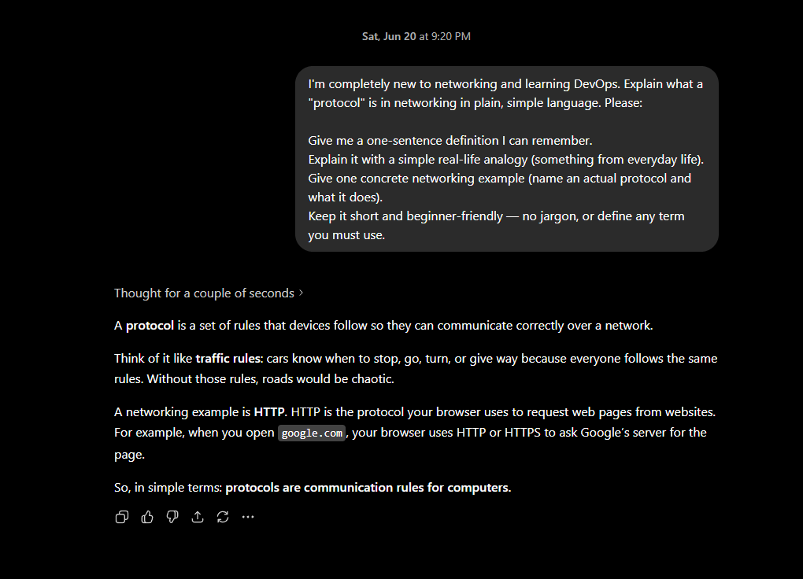
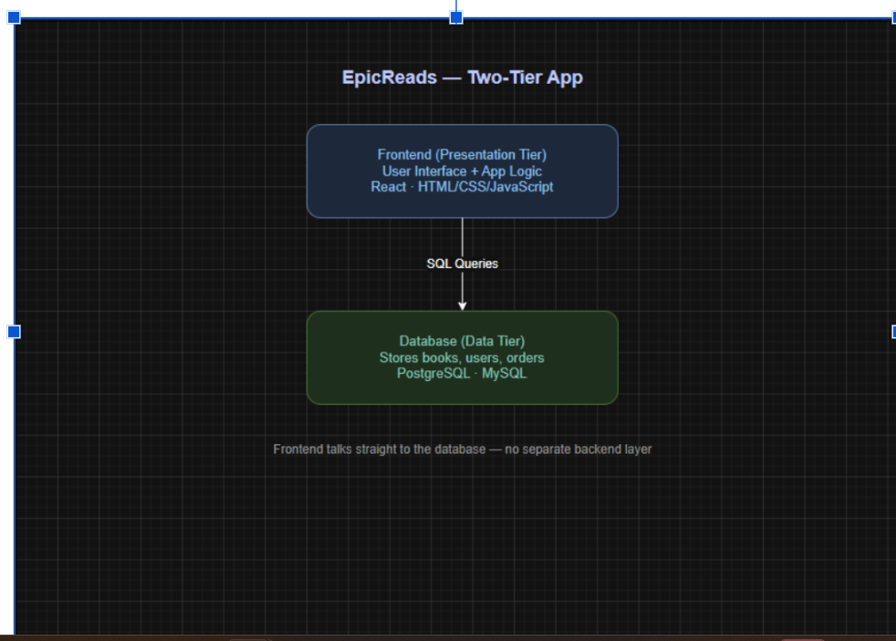
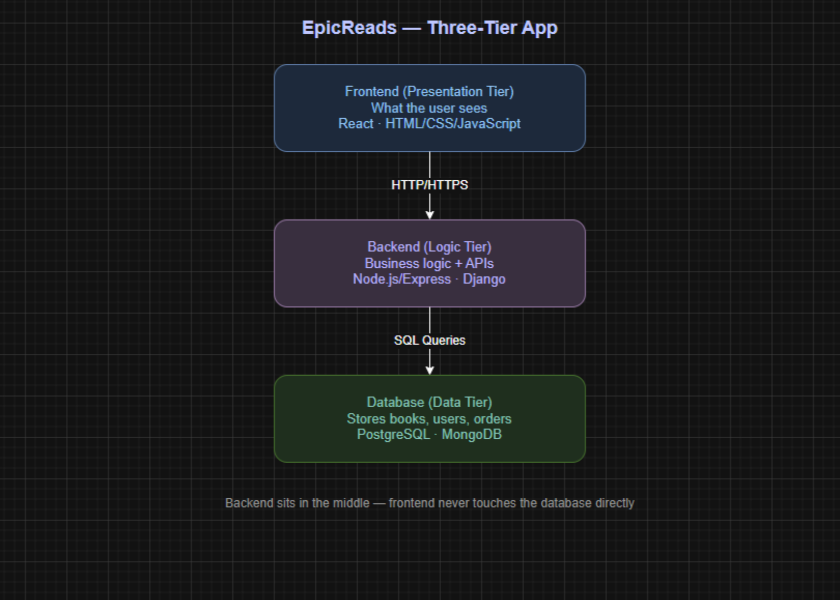
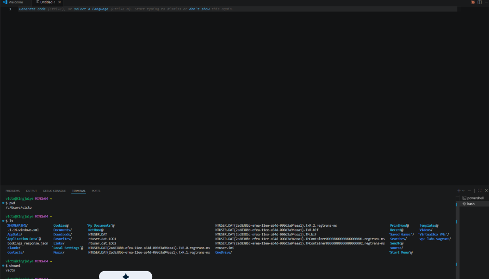

# Week 00 - Internet and Networking

Part of the DevOps Micro Internship (DMI) Cohort 3 with Agentic AI

---

# 🧑‍💻 Task 1: Using ChatGPT as Your Learning Assistant

## Scenario

You're new to DevOps and will frequently encounter technical questions. ChatGPT can be your learning companion.

## Your Task

Write a clear ChatGPT prompt to help you understand:

> "What is a protocol in networking? Explain with a simple real-life example."

Take a screenshot of your interaction showing:

* Your detailed prompt (with clear expectations)
* ChatGPT's simplified response with an example

## Screenshot



---

## What I Learned (2–3 lines)

I learned that a protocol is simply an agreed set of rules that lets devices communicate correctly over a network, just like traffic rules keep cars moving safely. I also learned how to write a clear, detailed prompt stating my skill level and asking for a definition, an analogy, and a real example, which made ChatGPT's answer much easier to understand. This showed me that the quality of an AI response depends a lot on how well I frame the question.

---

# 🌐 Task 2: Internet and Networking

## Scenario

Your friend is launching an online bookstore named **EpicReads**.

He asked you to explain how users globally can access his website hosted in Finland.

## Your Task

Write a short explanation (**100–150 words**) that includes:

* Packet Switching
* IP Address
* TCP/IP
* HTTP/HTTPS

💡 **Tip:** You may use ChatGPT (as demonstrated in Task 1) to refine your explanation.

## Answer

When someone opens EpicReads, hosted in Finland, their request travels across the internet using packet switching; the data is broken into small chunks called packets, sent through the best available network paths, and reassembled at the destination. This makes transmission fast and reliable, even across continents.
Every device has a unique IP address, like a postal address, so the user's computer and the Finland server can find each other. The TCP/IP suite manages this conversation: IP handles addressing and routing the packets, while TCP ensures they arrive complete and in the correct order, requesting any missing ones.
Finally, HTTP/HTTPS defines how the browser and server exchange the actual web pages. HTTPS adds encryption, keeping customers' details and payments secure. Together, these layers let users worldwide reach EpicReads instantly and safely.

---

# 🏗️ Task 3: Application Architecture & Stack

## Scenario

EpicReads bookstore has two application versions:

### Two-Tier Application

* Frontend
* Database

### Three-Tier Application

* Frontend
* Backend
* Database

## Your Task

* Draw simple diagrams (hand-drawn or tool-based such as draw.io)
* Label each layer clearly
* List at least two common technologies or tools used for each layer
* Submit a screenshot or photo clearly showing your own drawing

## Diagram Screenshot / Photo





---

## Technologies Used

### Frontend

* React
* HTML/CSS/JavaScript

### Backend

* Node.js / Express
* Django (Python)

### Database

* PostgreSQL
* MySQL (or MongoDB)

---

# 🌍 Task 4: Domain Name & DNS (Basic Concepts)

## Scenario

Your friend's bookstore **EpicReads** is currently accessible through:

```text
52.172.142.222:3000
```

He purchased the domain:

```text
epicreads.com
```

## Your Task

In **50–100 words**, explain in your own words:

1. What is DNS (Domain Name System)?
2. Which DNS record type should be used to connect the domain to the given IP, and why?

## Answer

DNS (Domain Name System) is like the internet's phonebook. It translates human-friendly domain names such as epicreads.com into the numerical IP addresses computers use to locate each other. So when a customer types epicreads.com, DNS finds the matching IP and connects them to the server automatically.
To connect epicreads.com to the IP 52.172.142.222, an A record should be used. An A record maps a domain name directly to an IPv4 address, which is exactly what's needed here since the server is reachable via an IPv4 address.

---

# 💻 Task 5: Visual Studio Code Setup (Hands-on)

## Your Task

Install Visual Studio Code (if not already installed).

Take a screenshot of your VS Code environment showing:

* Terminal open inside VS Code
* Running a basic command:

### Windows

```powershell
dir
```

### Linux / macOS

```bash
pwd
ls
```

* Your selected VS Code theme clearly visible

⚠️ **Important:** The screenshot must show your username or another identifiable detail to confirm it is your environment.

## Screenshot



---

# 🔗 Task 6: Publish Your Assignment as a LinkedIn Post

## Objective

Publishing on LinkedIn helps you:

* Build your professional online presence
* Reinforce your learning
* Document your DevOps journey publicly

## Your Task

Summarize your answers from Tasks 1–5 into a LinkedIn post.

Clearly structure your post into the following sections:

* ChatGPT
* Internet & Networking
* App Architecture
* DNS
* VS Code Setup

Add the following credit note at the end of your post:

> **P.S. This post is part of the DevOps Micro Internship (DMI) with Agentic AI — Cohort 3 — by Pravin Mishra. My graded progress is public: https://dmi.pravinmishra.com/s/YOUR-GITHUB-USERNAME.html · Start your DevOps journey: https://dmi.pravinmishra.com/?utm_source=student&utm_medium=ps-linkedin&utm_campaign=cohort3**

---

## LinkedIn Post URL

Paste your LinkedIn post URL here:

https://www.linkedin.com/posts/victor-jaiye_devops-micro-internship-dmi-by-pravin-activity-7474201239375929346-lR_h?utm_source=share&utm_medium=member_desktop&rcm=ACoAABkZOQEB3T6FCcu0A1jCAOaZB5ag2lTqKeE

---

## LinkedIn Post Backup Copy

Paste the full text of your LinkedIn post here:

Week 0 of my DevOps Micro Internship — here's what I learned!

I'm documenting my DevOps journey publicly, and this first set of tasks covered the foundations every engineer should know. Breaking it down:

🤖 ChatGPT as a Learning Assistant
I learned that the quality of an AI answer depends heavily on how you frame the question. By stating my skill level and asking for a definition, an analogy, and a real example, I got much clearer explanations. AI is a powerful learning companion when you prompt it well.

🌐 Internet & Networking
I explored how a website hosted in one country is accessible globally. Data travels via packet switching, every device has a unique IP address, TCP/IP handles addressing and reliable delivery, and HTTP/HTTPS defines how browsers and servers exchange web pages (with HTTPS adding encryption).

🏗️ Application Architecture
I compared two-tier (Frontend + Database) and three-tier (Frontend + Backend + Database) apps. Key tools per layer:
Frontend → React, JavaScript
Backend → Node.js, Django
Database → PostgreSQL, MySQL

🔗 Domain Name & DNS
DNS is the internet's phonebook — it translates domain names into the IP addresses computers understand. To point a domain to an IPv4 address, you use an A record.

💻 VS Code Setup
I installed Visual Studio Code, opened the integrated terminal, and ran basic commands (pwd / dir / ls) to confirm my environment. A simple but important step — VS Code is the editor I'll be living in throughout this journey.
Excited to keep building! 💪

---

# Reflection – Week 0

### What did you find easy?

This week, I found the conceptual tasks easy. Explaining networking, DNS, and application architecture made sense once I broke them into simple analogies.

---

### What was difficult?

The most difficult part was getting the architecture diagrams clear and deciding which DNS records and technologies fit each scenario. I also learned how much a well-framed prompt improves the answers I get from AI.

---

### What will you improve next week?

Next week, I want to improve by going more hands-on, practicing real commands, and building small projects rather than just understanding the theory.

---

## 📌 About DMI & CloudAdvisory

DevOps Micro Internship (DMI) is a project-based DevOps program run by Pravin Mishra (The CloudAdvisory) focused on real-world execution, systems thinking, and career readiness.

It helps learners build strong DevOps foundations with hands-on experience.


## 📌 Resources

- 🌐 **DMI Official Website:** https://pravinmishra.com/dmi  
- 🎓 **DevOps for Beginners (Udemy):** https://www.udemy.com/course/devops-for-beginners-docker-k8s-cloud-cicd-4-projects/  
- 🎓 **Ultimate Agentic AI DevOps with Clude Code** https://www.udemy.com/course/ultimate-agentic-ai-devops-with-claude-code/?referralCode=448389767BC96284087B
- 🎓 **DevOps with Claude Code: Terraform, EKS, ArgoCD & Helm** https://www.udemy.com/course/devops-with-claude-code-terraform-eks-argocd-helm/?referralCode=1C5B734505D65A010FA3
- ▶️ **YouTube Playlist (DMI Cohort 3):** https://www.youtube.com/playlist?list=PLFeSNDtI4Cho  
- 🔗 **Pravin Mishra (LinkedIn):** https://www.linkedin.com/in/pravin-mishra-aws-trainer/  
- 🏢 **CloudAdvisory (LinkedIn):** https://www.linkedin.com/company/thecloudadvisory/

---

*This submission is part of DevOps Micro Internship (DMI) Cohort 3 — Agentic AI Track*
