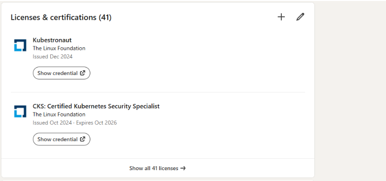
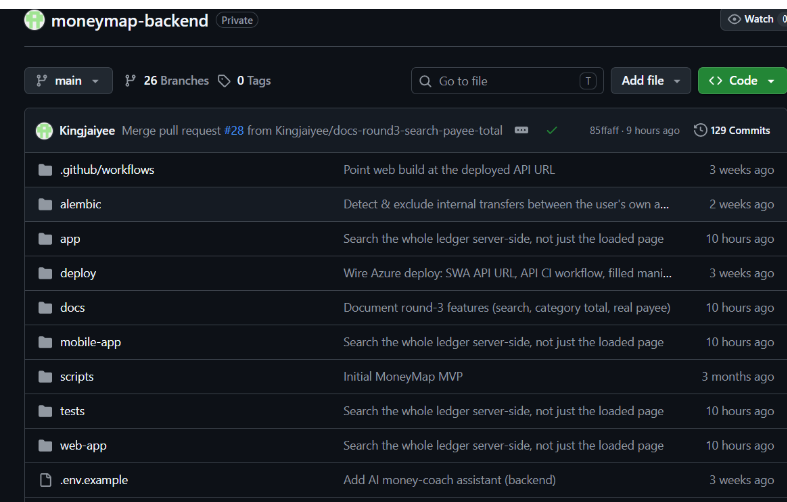
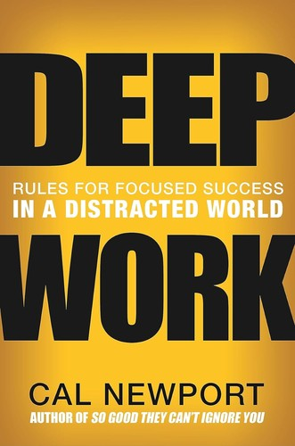
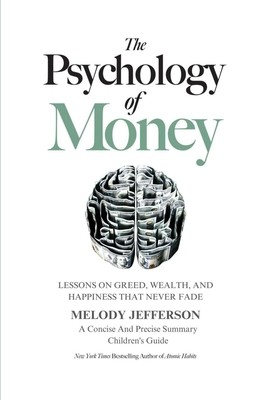
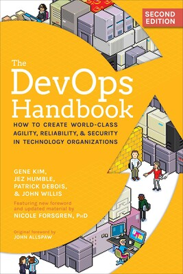
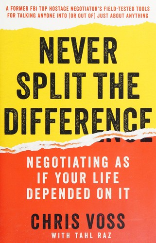
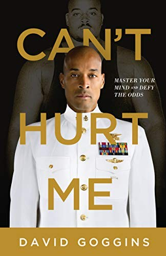
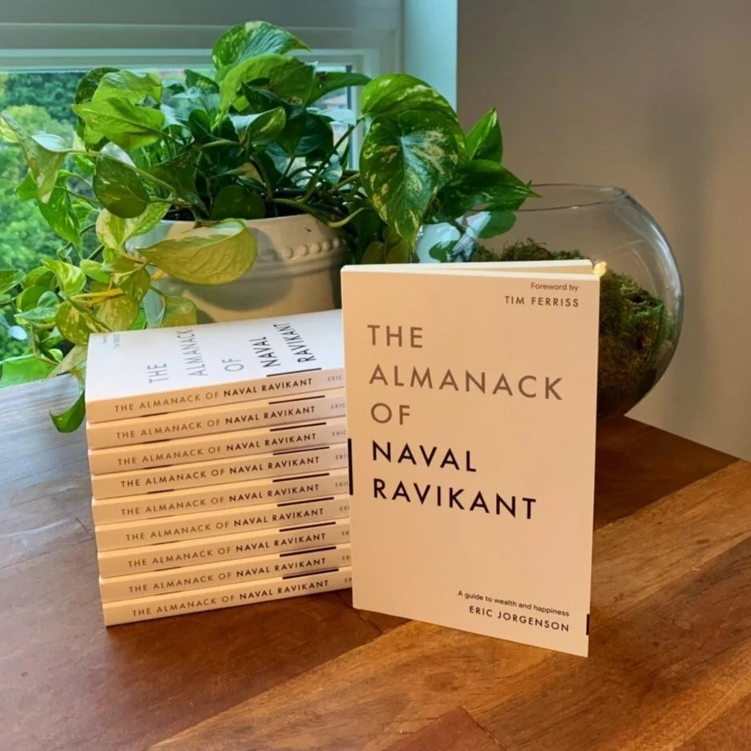

# Week 01 — Success Mindset (Mindset OS)

Part of the DevOps Micro Internship (DMI) Cohort 3 with Agentic AI

---

## Purpose (Read This First)

This week is not motivation homework.

This is you building your **Mindset OS** — the system you will use for the next 5 months (and honestly, for years).

### Expectations

* Be honest.
* Be specific.
* Be practical.
* Write like an adult professional: clear sentences, no one-liners.

You will reuse this in later weeks. So do it properly once.

---

# Assignment 1. What is something you believe to be true that most people around you would disagree with?

### Rules

* No "safe" answers.
* Must be your real belief (not copied from internet).
* Minimum 50 words.

**Hint:** What do you believe about career, money, learning, discipline, relationships, health, success, life, tech industry, etc. that most people don't agree with?

## Answer
Something I believe that many around me would disagree with is that the certificates and job titles people chase, including the version of me that collected them, are often a way to avoid the harder work, not proof of doing it. My LinkedIn shows how seriously I once took certifications; I treated each one as evidence I was growing.

I've come to see it differently. A certificate is low-risk. You study, you pass, no one watches you fail. Building in public is the opposite: you troubleshoot real production issues, you document mistakes where people can see them, you get things wrong publicly. That's uncomfortable, which is exactly why most people prefer another course over another project.

So my real belief is this: consistent, visible proof of work beats certificates because it's scarier, not just because it's more useful. Most people won't say that out loud, since it implies their cert grind is partly avoidance. But I'd back a disciplined person building and documenting daily over a brilliant one with a wall of badges every time. That's the bet I'm making with my own DevOps growth.

---

# Assignment 2. What are the top 3 objective truths you discovered through experimentation and results?

### Definition

Objective truths do not depend on opinions. They hold true regardless of how people feel.

Write each truth in this format:

**Truth:** (1 sentence)

**Evidence from my life:** (2–4 lines: what you tried + what happened)

---

## Truth #1

### Truth

When troubleshooting, the fastest path is almost never the first cause you assume it is; evidence beats guessing.

### Evidence from my life

In my work with Ventrata connectivity and API issues, guessing the cause of a problem usually wastes time. When I check request logs, compare payloads, review responses, and isolate the failing endpoint, the issue becomes clear. This has helped me handle availability, booking errors, reseller configuration, pricing issues, and partner escalations more calmly and accurately.

---

## Truth #2

### Truth

Certifications can open your mind, but real confidence only comes from applying the knowledge under pressure.

### Evidence from my life

I used to strongly believe certifications were the main proof of growth, and the number on my LinkedIn shows it. But a passed course only left me able to describe things. The actual confidence arrived the first time I had to troubleshoot a real, live issue and get it working, not knowing in advance that I could. That is a different feeling than holding a certificate, and it is the one that lasts.

---

## Truth #3

### Truth

When money is not written down and calculated properly, it is easy to feel like you have more available than you actually do.

### Evidence from my life

I have experienced this personally while reviewing my budget, debts, giving, family support, savings, and other expenses. Sometimes the money left in my account looked okay at first, but after writing everything down and calculating what had already been paid or committed, the real remaining amount became clearer. This taught me that financial clarity comes from tracking the numbers, not from guessing based on account balance.

---

# Assignment 3. What does your 2.0 version look like?

### Instructions

Write as if a journalist is writing about you **3 to 7 years from now** (not 20 years).

**Minimum 300 words.**

### Rules

* Write in past tense, like it already happened.
* Don't use "likes to / wants to / hopes to."
* Use specifics:

  * built
  * shipped
  * led
  * published
  * earned
  * relocated
  * contributed
* Include skills proof:

  * projects
  * portfolios
  * GitHub
  * blogs
  * certifications
  * job role
  * leadership
  * community contribution
* Add 1–3 images if you can (optional but powerful).

### Publish It Publicly On Any ONE

* LinkedIn
* Medium
* WordPress
* Blogspot
* Personal blog
* Portfolio page

Include this line:

> **P.S. This post is part of the DevOps Micro Internship (DMI) with Agentic AI — Cohort 3 — by [Pravin Mishra](https://www.linkedin.com/in/pravin-mishra-aws-trainer/). My graded progress is public: https://dmi.pravinmishra.com/s/YOUR-GITHUB-USERNAME.html · Start your DevOps journey: https://dmi.pravinmishra.com/?utm_source=student&utm_medium=ps-blog&utm_campaign=cohort3**

## Your Article

The Man Who Rebuilt His Hunger: Victor Durojaiye 2.0

By 2030, Victor Durojaiye had become a completely different kind of engineer.

Years earlier, when he was still single and desperate for a career change, he devoured books, studied aggressively, and stacked certifications. His LinkedIn profile became proof of that season of hunger. 

But after he got married and later secured a stable job, something shifted. The pressure reduced, comfort increased, and the fire quietly faded. For a stretch, the same man who once studied for hours struggled to pull himself away from anime and endless scrolling.

What makes his story worth telling is not that he was always driven. It is that he lost his drive, and he rebuilt it anyway.

That season became the foundation of his 2.0 version. The turning point was Victor's decision to stop relying on motivation and start building systems. Through his DevOps cohort, he created a personal "Mindset OS" that helped him show up even when he did not feel like it. He committed to focused daily sprints, tracked his hours, and treated his learning as public proof-of-work rather than just another certificate to collect.

Over the next few years, Victor built and shipped real, scalable products. He launched Authentic, a product-verification system fighting counterfeit goods across Nigeria, complete with cryptographically signed serials. He built a bank-statement analysis pipeline that parsed messy real-world PDFs into clean financial data. Behind the scenes, he led the technical infrastructure for these apps, shipping projects using Azure, Terraform, Docker, GitHub Actions, Prometheus, Grafana, Loki, and Kubernetes.

His portfolio transformed from a list of tools into a testament of problems he solved. He maintained clean, highly documented GitHub repositories that hiring managers could actually read. He published technical blogs explaining API issues, monitoring setups, and troubleshooting patterns from real engineering experience.

Professionally, Victor grew from a support engineer into a highly capable cloud-focused engineer who investigated complex technical bottlenecks and led improvements around operational reliability. More importantly, he contributed back to his community, mentoring newer engineers who were exactly where he had once been, stuck and unsure.

Victor 2.0 was not a perfect version of Victor; he was a disciplined version. He stopped saying "I used to be serious" and started proving "I can become serious again." His transformation proved one objective truth: comfort can reduce hunger, but systems can rebuild it.

P.S. This post is a part of DevOps Micro Internship with Agentic AI Cohort-3 by Pravin Mishra. You can start your DevOps journey by joining this Discord community ( https://discord.pravinmishra.com/ ).

### Public Link

[The Man Who Rebuilt His Hunger: Victor Durojaiye 2.0:](https://www.linkedin.com/pulse/man-who-rebuilt-his-hunger-victor-durojaiye-20-victor-durojaiye-osmje/)

`__________________________`

---

# Assignment 4. Have you ever cut corners (unethical / dishonest / shortcut behavior — not necessarily illegal)? If yes, how did it make you feel?

### Important

You don't need to write the full story.

Focus on the feeling:

* guilt
* fear
* shame
* stress
* regret
* numbness
* etc.

This is about self-awareness, not judgment.

### Answer Format

**Yes**

If Yes:

**What emotion did you feel?** (minimum 50–100 words)

## Answer

Because I was always praised as brilliant and good at cramming, I built a shortcut habit of wasting my days and forcing everything into one night. In my 200-level Industrial Physics, I did this with the Lagrangian and Hamiltonian principles. I played games all day, then crammed the formulas overnight. In the exam hall, my mind went completely blank. What I felt first was panic, then a deep, quiet shame. It was not the shame of cheating; it was the worse feeling of realizing I had cheated myself. That blankness taught me more about discipline than any pass ever could.
---

# Assignment 5. What are 10 non-fiction books you plan to read in the next 1 year?

### Rules

* Mention **Title + Author**
* Any language allowed
* No fiction novels

### Tip

Choose books that improve:

* mindset
* communication
* productivity
* health
* money
* career
* leadership

## Book List

1. **Atomic Habits** by James Clear

2. **The 5 AM Club** by Robin Sharma

3. **Deep Work** by Cal Newport

4. **The Psychology of Money** by Morgan Housel

5. **The DevOps Handbook** by Gene Kim, Jez Humble, Patrick Debois, and John Willis

6. **Never Split the Difference** by Chris Voss

7. **Can't Hurt Me** by David Goggins

8. **The Almanack of Naval Ravikant** by Eric Jorgenson

9. **Mere Christianity** by C.S. Lewis

10. **Man's Search for Meaning** by Viktor Frankl

---

# Assignment 6. What are the things you will measure regularly in your life and career?

### Rules

List topics only. No need to share numbers.

### Must Include

* Learning / skill
* Output / proof
* Health / energy
* Time / focus
* Money / finance (personal or business)

### Example

* Learning hours per week
* Deep work sessions per week
* Projects shipped / documented
* Steps / workouts
* Sleep hours
* Spending tracker

## My Metrics

* Learning hours per week
* DevOps lab and practice sessions
* Deep work sessions (phone away) per week
* GitHub commits or project updates
* Projects shipped or documented
* Technical blogs or LinkedIn posts published
* Troubleshooting notes and lessons documented
* Sleep quality and consistency
* Workouts, walks, or daily movement
* Spending tracker and budget review

---

# Assignment 7. Brain Dump + 5-Month System Plan

## Step 1: Brain Dump (Private)

Do a brain dump of everything in your mind into a notebook.

Examples:

* Bills
* Tasks
* Worries
* Goals
* Pending messages
* Ideas
* Responsibilities

### Did You Do It?

**Yes / No**

Answer: **Yes**

I have a lot on my mind right now, and I need to stop carrying everything mentally. One major issue is context-switching. I keep moving between researching remote AI task platforms, thinking about extra income, and trying to do deep technical labs. This makes me feel busy, but not always productive. I need to separate exploration from execution so that I can focus properly.

For my career and DevOps growth, I need to consolidate my GitHub repositories and make my work easier to understand. I also need to ensure that the live application on my custom domain is properly monitored. I want my projects to show real proof of skill, especially around monitoring, troubleshooting, automation, and cloud infrastructure.

Financially, I am always worried about where my money is going. I need better visibility over my spending, commitments, debts, savings, and family responsibilities. I do not want to keep guessing based on account balance. I need a system that helps me track money clearly and make better decisions.

Personally, I want to stretch myself again. I used to read more and take learning seriously, but I have struggled with consistency. I want to rebuild the habit of reading, learning, and showing up even when I do not feel motivated.

As a father of two children, I also have responsibilities that require more discipline, patience, planning, and presence. I do not want to grow only in my career and neglect my family role. Victor 2.0 must be better at balancing ambition with fatherhood.

At work in Ventrata, I want to improve my work ethic and become more consistent, reliable, and proactive. I want to handle issues with more ownership, communicate better, document better, and keep improving as a Connectivity Specialist / L3 Support Engineer.

Overall, my brain dump shows me that I need a system, not just motivation. I need fewer distractions, clearer priorities, better financial tracking, deeper technical focus, stronger family responsibility, and improved work discipline.
---

## Step 2: Your 5-Month Routine + Focus Blocks

Create a simple plan you can realistically follow for the next 5 months.

### Weekly Routine

Example:

* Mon–Thu: 60 min deep work
* Sat: DMI session
* Sun: Weekly review

#### My Weekly Routine

* Daily (Mon–Fri): Wake at 6am, exercise, school run. This is my existing anchor and I keep it.
* Mon–Fri: One 45–60 minute deep-work block during a work break (technical labs, GitHub, documentation), because that is when I am actually free and fresher than at night.
* Mon–Fri: 10 minutes of reading before bed to rebuild the reading habit.
* Saturday: DMI cohort call with Pravin from 5:30am (about 8 hours). This is my main learning day. Rest afterward.
* Sunday: Main independent project and build session, plus family time.
* Sunday evening: Weekly review, planning, and budget check.

---

### Focus Blocks

#### When Will You Do DMI Work? (Days + Time)

* Monday to Friday: One deep-work block during my most reliable work break (labs, repos, documentation).
* Saturday: DMI cohort call with Pravin, 5:30am for about 8 hours.
* Sunday: Main independent build and technical practice session, 90 minutes.
* Sunday evening: Short weekly review, about 20 minutes.

#### How Many Sessions Per Week?

* 3 to 4 weekday break sessions (45–60 min each)
* 1 Saturday cohort call (the main learning input)
* 1 Sunday build session (the main output)
* 1 Sunday weekly review
* 1 optional weekday catch-up session if I miss a day
---

### Distraction Rules

Examples:

* Phone rules
* Social media rules
* Environment setup

#### My Distraction Rules

* I will stop mixing remote AI task research with deep technical labs in the same focus block.
* DMI and technical lab time will be for deep work only, not browsing or random research.
* My phone will be away or on silent during deep work sessions.
* Anime and social media will only come after my planned work is completed.
* I will use separate blocks for different modes: learning, building, documentation, and money review.
* Because I work and study on the same laptop, I will separate work tabs from study tabs (different window or browser profile) so job work does not bleed into DMI focus time.
* I will keep only the tools I need open during focus time.
* I will write down distracting thoughts instead of immediately acting on them.
* I will review my week every Sunday so I can reset and plan clearly.

---

# Reflection – Week 1

### Biggest insight I got about myself this week

My biggest insight is that comfort quietly killed the hunger I used to have. When I was single and desperate, discipline came easily because pressure forced it. Once I got married, got a better job, and became comfortable, that same drive faded and I did not notice until I looked closely. The real lesson is that I cannot rely on desperation or motivation as fuel anymore. I have to build systems that make me show up even when I feel comfortable and unmotivated.

### My biggest weakness/loop I noticed

My biggest loop is context-switching that feels productive but is not. I keep jumping between researching remote AI platforms, chasing extra income ideas, and trying to do deep technical work, all in the same window of time. It keeps me busy without real output. The deeper pattern underneath it is avoidance. Exploration is comfortable and low-risk, while execution (building, shipping, documenting) is where I can actually be judged, so I unconsciously drift toward research instead of doing the harder work.

### One system I will implement from this week (exact habit + time)

Every weekday, I will do one 45 to 60 minute deep-work block during my most reliable work break, phone in another room and only my lab or repository open, no research or browsing allowed in that block. Research and exploration get their own separate, scheduled time. This one habit directly attacks my context-switching loop by forcing execution into a protected slot.

### LinkedIn Post

Paste your LinkedIn post link here:

`https://www.linkedin.com/posts/victor-jaiye_there-was-a-season-when-i-was-hungry-for-ugcPost-7478193277444329472-3WwV/?utm_source=share&utm_medium=member_desktop&rcm=ACoAABkZOQEB3T6FCcu0A1jCAOaZB5ag2lTqKeE`

---

## 10. Proof of Work

- LinkedIn Post URL: **[https://www.linkedin.com/posts/victor-jaiye_there-was-a-season-when-i-was-hungry-for-ugcPost-7478193277444329472-3WwV/?utm_source=share&utm_medium=member_desktop&rcm=ACoAABkZOQEB3T6FCcu0A1jCAOaZB5ag2lTqKeE](https://www.linkedin.com/posts/victor-jaiye_there-was-a-season-when-i-was-hungry-for-ugcPost-7478193277444329472-3WwV/?utm_source=share&utm_medium=member_desktop&rcm=ACoAABkZOQEB3T6FCcu0A1jCAOaZB5ag2lTqKeE)**  
- Blog / Medium : **[The Man Who Rebuilt His Hunger: Victor Durojaiye 2.0](https://www.linkedin.com/pulse/man-who-rebuilt-his-hunger-victor-durojaiye-20-victor-durojaiye-osmje/)**  

---

## 📌 About DMI & CloudAdvisory

DevOps Micro Internship (DMI) is a project-based DevOps program run by Pravin Mishra (The CloudAdvisory) focused on real-world execution, systems thinking, and career readiness.

It helps learners build strong DevOps foundations with hands-on experience.

## 📌 Resources

- 🌐 **DMI Official Website:** https://pravinmishra.com/dmi  
- 🎓 **DevOps for Beginners (Udemy):** https://www.udemy.com/course/devops-for-beginners-docker-k8s-cloud-cicd-4-projects/  
- 🎓 **Ultimate Agentic AI DevOps with Clude Code** https://www.udemy.com/course/ultimate-agentic-ai-devops-with-claude-code/?referralCode=448389767BC96284087B
- 🎓 **DevOps with Claude Code: Terraform, EKS, ArgoCD & Helm** https://www.udemy.com/course/devops-with-claude-code-terraform-eks-argocd-helm/?referralCode=1C5B734505D65A010FA3
- ▶️ **YouTube Playlist (DMI Cohort 3):** https://www.youtube.com/playlist?list=PLFeSNDtI4Cho  
- 🔗 **Pravin Mishra (LinkedIn):** https://www.linkedin.com/in/pravin-mishra-aws-trainer/  
- 🏢 **CloudAdvisory (LinkedIn):** https://www.linkedin.com/company/thecloudadvisory/

---

*This submission is part of DevOps Micro Internship (DMI) Cohort 3 — Agentic AI Track*