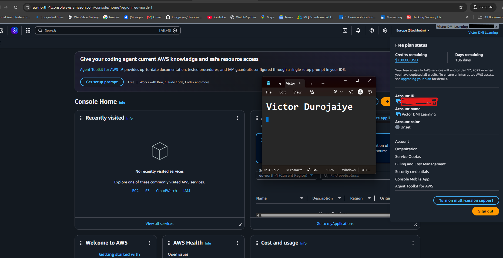

# Assignment 1 — AWS Free Tier Account Setup (EpicReads Cloud Onboarding)

Part of the DevOps Micro Internship (DMI) Cohort 3 with Agentic AI

---

## Purpose

In this assignment, you will create and verify an AWS Free Tier account as part of onboarding EpicReads — an online bookstore moving to the cloud. You will demonstrate an understanding of AWS fundamentals, Free Tier services, and account setup by answering conceptual questions and capturing proof of a working AWS Console login.

---

# Task 1 — Understanding AWS & Free Tier

## Goal

Demonstrate understanding of AWS basics and Free Tier usage by answering the following questions in your own words (3–4 lines each).

### Answers

#### Question 1 — What is an AWS account, and why do you need it at this stage?

An AWS account is my own isolated space inside AWS where every resource I create, every charge I run up, and every permission I grant lives. Nothing I build sits outside it. I need one at this stage because reading about cloud infrastructure and actually provisioning it are two different skills, and only one of them becomes proof of work. It also gives me IAM, so I can practise controlling access properly instead of only knowing the theory.

---

#### Question 2 — What is AWS Free Tier, and how long does it last?

The Free Tier is how AWS lets new users try services without paying upfront. Since July 2025 it runs on credits rather than the old 12-month model: $100 on signup, plus up to $100 more earned by completing activities. The free plan lasts six months or until those credits are used up, whichever comes first, though the credits themselves expire twelve months from the day the account is opened. Separately, more than 30 services stay free permanently within monthly limits.

---

#### Question 3 — Name three AWS Free Tier services and their free usage limits.

AWS Lambda gives 1 million requests and 400,000 GB-seconds of compute each month. Amazon DynamoDB gives 25 GB of storage. Amazon S3 gives 5 GB of standard storage with 20,000 GET and 2,000 PUT requests monthly. These are always-free limits, so they reset every month instead of expiring along with the signup credits.

---

# Task 2 — Create AWS Free Tier Account

## Goal

Create a valid AWS Free Tier account and sign in to the AWS Management Console.

> No screenshots required for this task. Completion is verified through Task 3.

---

# Task 3 — Verify AWS Account

## Goal

Confirm that your AWS account setup is complete by navigating to the Account section and capturing proof.

### Evidence

#### Screenshot 1 — AWS Account page showing account name (email may be blurred)

---

# Submission Instructions

- Add all required screenshots in your GitHub repository submission
- Full name must be visible in required screenshots
- Do not expose sensitive information (keys, passwords, account IDs)

---

# Completion Checklist

- [x] Task 1 answers written in own words
- [x] AWS Free Tier account created successfully
- [x] Signed in to AWS Management Console
- [x] Screenshot of AWS Account page captured (full name visible, no sensitive data)
- [x] All required screenshots added to repository

---

## 📌 About DMI & CloudAdvisory

DevOps Micro Internship (DMI) is a project-based DevOps program run by Pravin Mishra (The CloudAdvisory) focused on real-world execution, systems thinking, and career readiness.

It helps learners build strong DevOps foundations with hands-on experience.

---

## 📌 Resources

- 🌐 DMI Official Website: https://pravinmishra.com/dmi  
- 🎓 DevOps for Beginners (Udemy): https://www.udemy.com/course/devops-for-beginners-docker-k8s-cloud-cicd-4-projects/  
- 🎓 Agentic AI DevOps with Claude Code: https://www.udemy.com/course/ultimate-agentic-ai-devops-with-claude-code/  
- 🎓 DevOps with Claude Code: Terraform, EKS, ArgoCD & Helm: https://www.udemy.com/course/devops-with-claude-code-terraform-eks-argocd-helm/  
- ▶️ YouTube Playlist: https://www.youtube.com/playlist?list=PLFeSNDtI4Cho  
- 🔗 Pravin Mishra (LinkedIn): https://www.linkedin.com/in/pravin-mishra-aws-trainer/  
- 🏢 CloudAdvisory (LinkedIn): https://www.linkedin.com/company/thecloudadvisory/

---

*This submission is part of DevOps Micro Internship (DMI) Cohort 3 — Agentic AI Track.*
