# Assignment 3 — Production Maintenance Drill (OPS Checklist)

Part of the DevOps Micro Internship (DMI) Cohort 3 with Agentic AI

---

## Purpose

In this assignment, you will treat your already deployed React application (on Ubuntu VM with Nginx) as a live production system. You will perform structured operational checks covering network validation, service health, log analysis, resource monitoring, configuration verification, and incident simulation with recovery — mirroring real on-call DevOps responsibilities.

---

# Task 1 — Server Access & Networking Validation

## Goal

Verify that the deployed React application is reachable from the browser and confirm basic network connectivity of the Ubuntu VM.

### Evidence

#### Screenshot 1 — Browser showing the React app with your Full Name visible on the UI

---

#### Screenshot 2 — Output of `ip a`

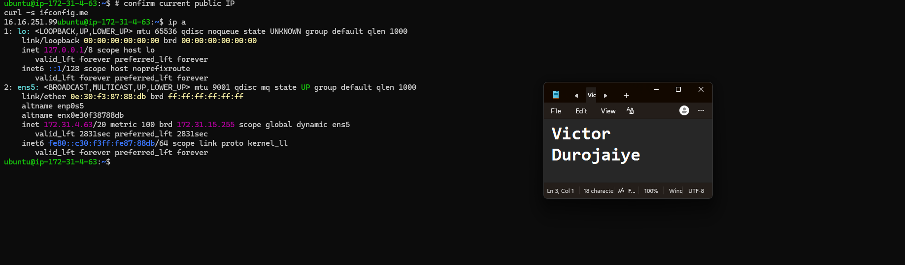

---

#### Screenshot 3 — Output of `sudo ss -tulpen`

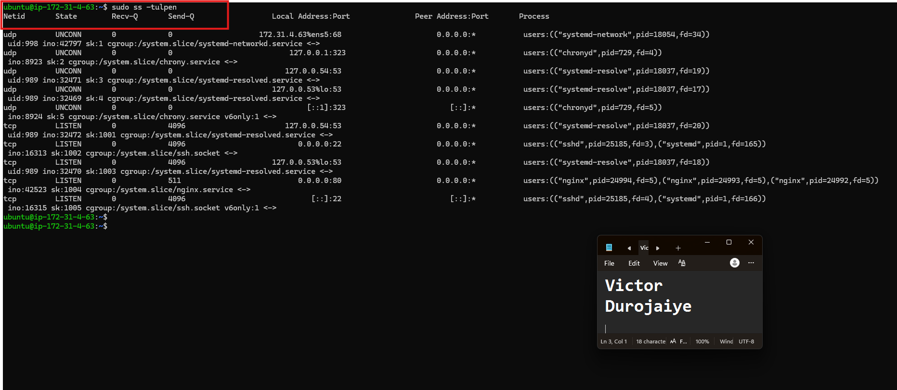

---

#### Screenshot 4 — Output of `sudo ufw status`

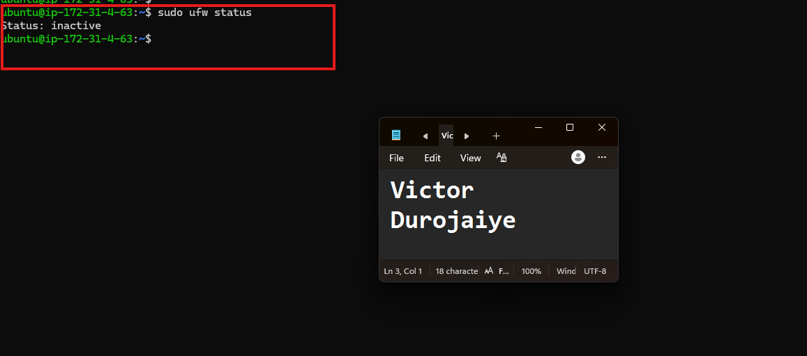

---

### Notes

Answer the following in your own words:

**1. What proves Nginx is listening on 0.0.0.0:80?**

In the `sudo ss -tulpen` output, the line `tcp LISTEN 0.0.0.0:80 ... users:(("nginx",pid=24994,...),("nginx",pid=24993,...),("nginx",pid=24992,...))` proves it. The `0.0.0.0:80` means Nginx is bound to all IPv4 interfaces on port 80, so it accepts HTTP connections from any address, not just localhost. The `LISTEN` state confirms the socket is actively waiting for connections, and the process name `nginx` confirms it is specifically Nginx holding that socket, not some other service.

---

**2. What proves SSH is active on port 22?**

The same output shows two SSH listeners: `tcp LISTEN 0.0.0.0:22 ... sshd` for IPv4 and `tcp LISTEN [::]:22 ... sshd` for IPv6. Both are owned by the `sshd` process and managed through `ssh.socket`, which is how systemd socket-activates SSH. This confirms the SSH service is active and reachable on the standard port 22, which is what allows remote login to the server.

---

**3. Did you find any unexpected open ports? Explain briefly.**

No unexpected ports were open. The only externally reachable services are HTTP (80) served by Nginx and SSH (22), both expected for a web server. Everything else is bound to loopback or the local interface and is not exposed to the internet:

- `53` (systemd-resolved) on `127.0.0.53` and `127.0.0.54` — local DNS resolution.
- `323` (chronyd) on `127.0.0.1` and `[::1]` — time synchronization.
- `68` (systemd-networkd) on `172.31.4.63%ens5` — the DHCP client for the interface, which is why the instance receives its private IP.

---

# Task 2 — Service Health & Systemd Validation (Nginx)

## Goal

Verify that Nginx is properly installed, running, enabled at boot, and safely configured.

### Evidence

#### Screenshot 1 — Output of `systemctl status nginx --no-pager`

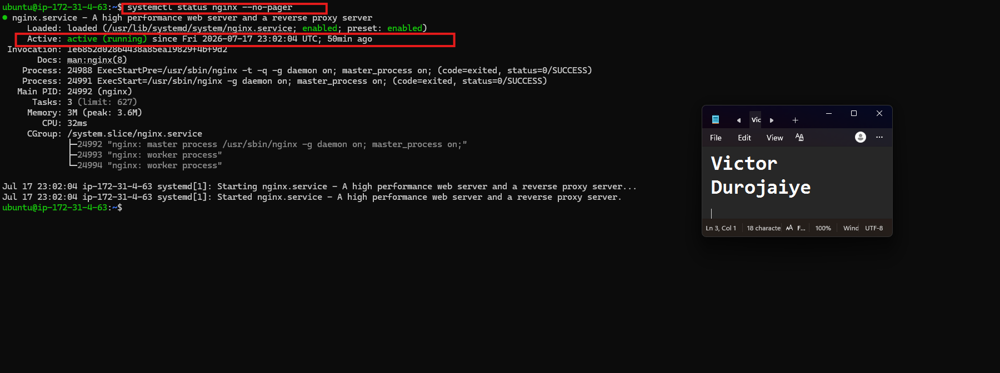

---

#### Screenshot 2 — Output of `sudo nginx -t`

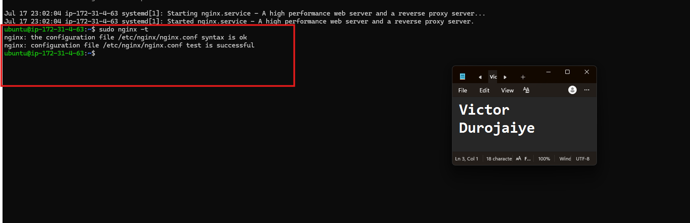

---

#### Screenshot 3 — Output of `sudo ss -lptn '( sport = :80 )'`

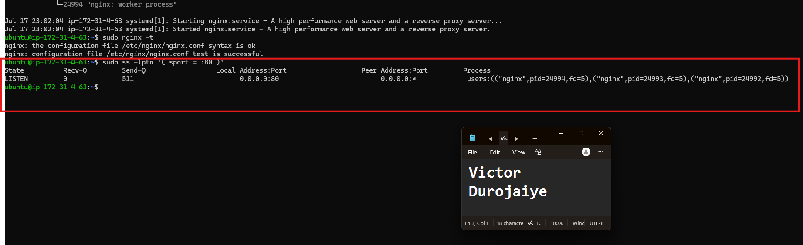

---

### Notes

Answer the following in your own words:

**1. What happens if Nginx fails to restart in production?**

If Nginx fails to restart, the website stops being served, since Nginx is the only process listening on port 80. Users trying to reach the site get a connection error or timeout because nothing is answering on that port. This is most dangerous during a deployment or config change, because the site can go down with no automatic recovery, requiring manual intervention to diagnose and fix while users are already affected.

---

**2. What's your basic rollback plan?**

Always run `sudo nginx -t` before restarting, so a bad config is caught before it ever reaches the live service. If a restart still fails, check `systemctl status nginx --no-pager` and `sudo journalctl -u nginx --no-pager -n 50` for the exact error. If the cause is a bad config change, restore the last known-good config from a backup or version control, re-run `sudo nginx -t` to confirm it is valid, then `sudo systemctl restart nginx`. Keeping a backup copy of the working config before editing is the simplest safeguard, since it allows an immediate rollback without debugging under pressure.

---

# Task 3 — Logs & Request Trace

## Goal

Verify real traffic flow and analyze logs to understand system behavior and errors.

### Evidence

#### Screenshot 1 — Output of `sudo tail -n 30 /var/log/nginx/access.log`

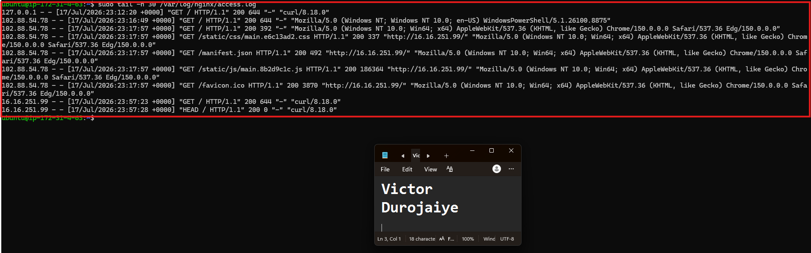

---

#### Screenshot 2 — Output of `sudo tail -n 30 /var/log/nginx/error.log`

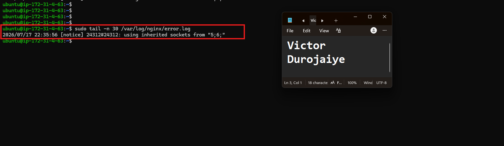

---

#### Screenshot 3 — Output of `sudo journalctl -u nginx --no-pager -n 50`

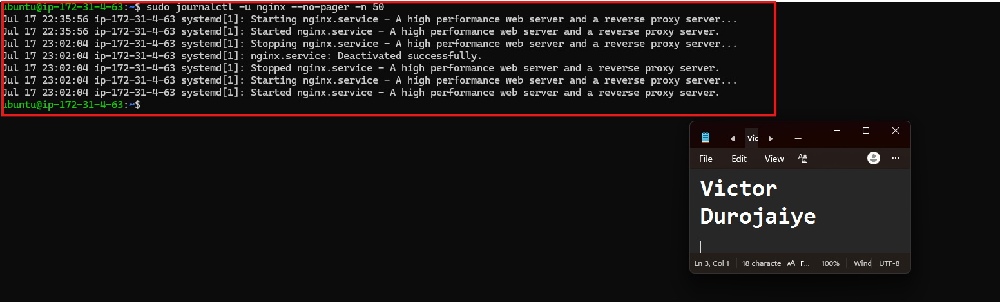

---

### Notes

Answer the following in your own words:

**1. Were there any errors in the logs?**

Yes, the error log contained a couple of real entries worth explaining:

- `[notice] ... using inherited sockets from "5;6;"` — this is a notice, not an error. It just means Nginx reused existing listening sockets during a restart or reload, which is normal behavior.
- `[error] ... rewrite or internal redirection cycle while internally redirecting to "/index.html" ... request: "HEAD / HTTP/1.1"` — this is a genuine error, and it lines up with the Task 7 failure simulation. It means Nginx's SPA fallback (`try_files $uri /index.html;`) tried to serve `/index.html`, but the file was missing at that moment, so Nginx kept redirecting to the same missing file in a loop and gave up with a 500. Once the real files were restored, the error stopped.

The access log also showed automated scanning traffic (requests for `/actuator/health`, TLS handshake bytes hitting the plain HTTP port and returning `400`, and identifiable scanner user agents). None of that exposed anything, since unknown paths just fall back to `index.html`.

---

**2. If there were no errors, what does that indicate about the system?**

An empty or notice-only error log would indicate Nginx has not hit any internal errors, misconfigurations, or failed requests during the window covered by the log. It is a positive signal about current health, but not a permanent guarantee — it only reflects the period actually checked. New issues can still appear as traffic, config changes, or system conditions change, so logs need to be checked periodically rather than once.

---

**3. Based on the access logs, were your curl requests visible in the log entries? What does that prove about traffic flow?**

Yes. The curl requests appear in `access.log`, for example `16.16.251.99 ... "GET / HTTP/1.1" 200 644 ... "curl/8.18.0"` and the matching `HEAD / HTTP/1.1 200`. This confirms the full request path works end to end: the request left the client, travelled through the network, reached Nginx, was processed and served correctly with a `200`, and was logged. Access logs are the simplest proof of real traffic flow because they record every incoming HTTP request as it is handled.

---

# Task 4 — System Resource Health Check (Capacity Red Flags)

## Goal

Assess server capacity and detect potential performance or failure risks.

### Evidence

#### Screenshot 1 — Output of `uptime`

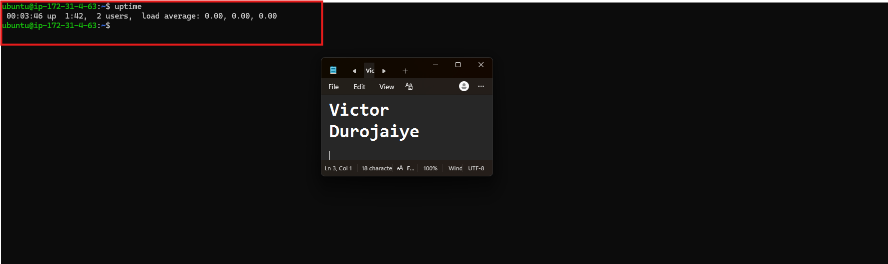

---

#### Screenshot 2 — Output of `free -h`

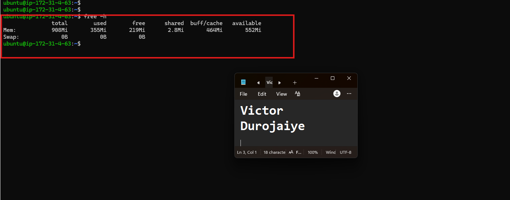

---

#### Screenshot 3 — Output of `df -h`

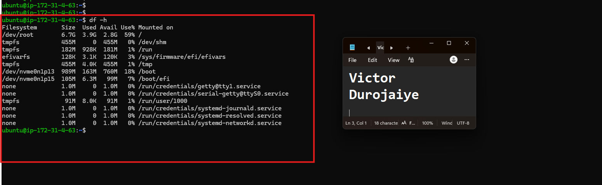

---

#### Screenshot 4 — Output of `sudo du -sh /var/* | sort -h`

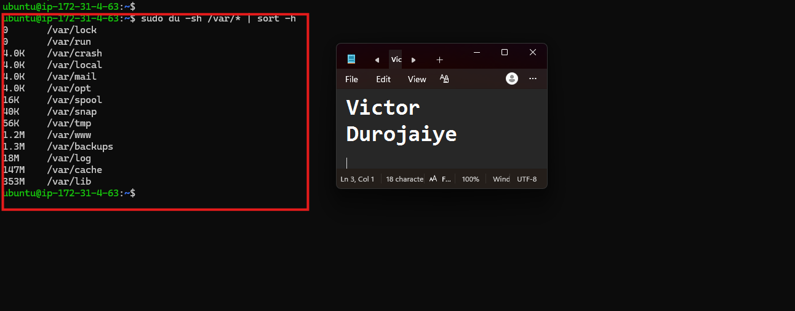

---

### Notes

Answer the following in your own words:

**1. Which resource looks most critical right now? (CPU/load, memory, or disk) Explain why.**

None of the three shows a critical signal at this moment:

- **CPU / load** — `uptime` shows a load average of `0.00, 0.00, 0.00`, so there is no CPU pressure. The server is idle.
- **Memory** — `free -h` shows 908 MiB total, 353 MiB used, and 554 MiB available, with 0B swap. Over half the RAM is still available and there is no swap pressure, so memory is healthy.
- **Disk** — `df -h` shows the root filesystem at 59% used (3.9 GiB of 6.7 GiB), with 2.8 GiB free. Comfortable, well below the 70–80% range where you would start paying closer attention.

If forced to rank which deserves the closest ongoing attention as the server scales, it would be disk. It is the highest-utilized of the three, and it is the one most likely to creep upward silently over time through log growth or package-cache accumulation, without any obvious symptom until it suddenly becomes critical. From `sudo du -sh /var/* | sort -h`, the largest consumers under `/var` are `/var/lib` (353M, package and service state), `/var/cache` (147M, mostly the apt cache), and `/var/log` (18M). The app itself in `/var/www` is only 1.2M, which shows the application is not what fills the disk — OS and package overhead is.

---

**2. What happens if disk becomes 100% full in a production server?**

Logs can no longer be written, which is especially dangerous because that is often exactly when logs are needed most, during an active incident. Applications, build tools, and package managers can fail or crash when they need scratch space for temporary files. A local database could refuse writes or become corrupted. In severe cases the OS itself becomes unstable, and even basic operations like logging in over SSH can fail because there is no space left for the system to work with. Disk exhaustion tends to break many things at once rather than degrading gracefully.

---

# Task 5 — Configuration & Deployment Verification

## Goal

Ensure the correct React build is deployed and Nginx is serving it properly.

### Evidence

#### Screenshot 1 — Output of `ls -lah /var/www/html | head -n 20`

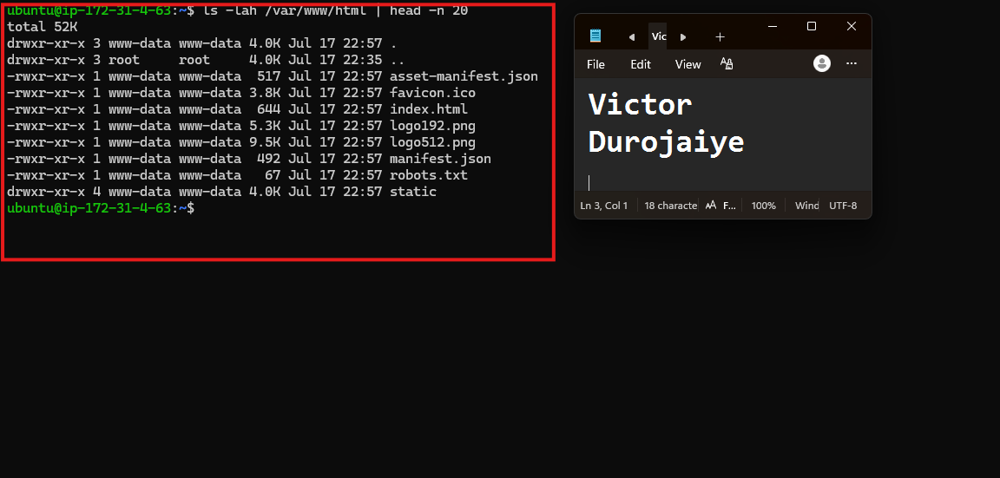

---

#### Screenshot 2 — Output of `grep -R "Deployed by" -n /var/www/html 2>/dev/null | head`

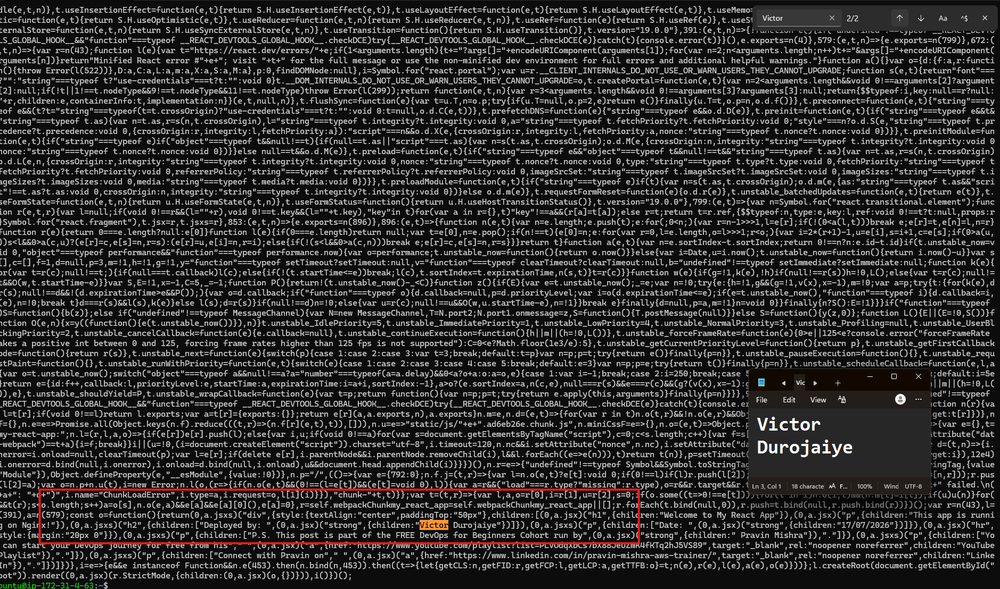

---

#### Screenshot 3 — Output of `grep -n "try_files" /etc/nginx/sites-available/default`

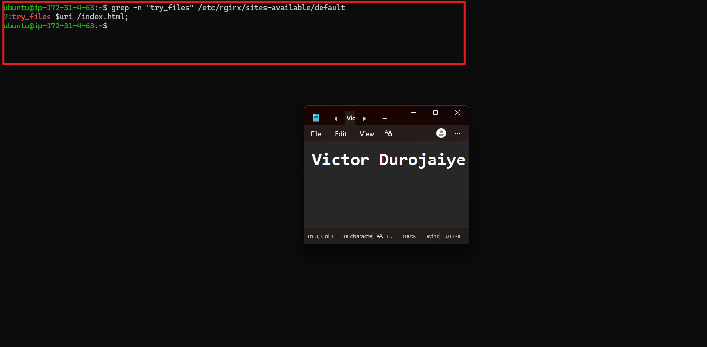

---

### Notes

Answer the following in your own words:

**1. How do you confirm that the correct version of the application is deployed?**

Deployment correctness was verified through a layered check, not a single command:

1. `ls -lah /var/www/html` confirmed a genuine Create React App production build is present — `index.html`, `asset-manifest.json`, `manifest.json`, `robots.txt`, `favicon.ico`, the `logo` assets, and the `static/` directory — all owned by `www-data`, the user Nginx's worker processes run as.
2. `grep -R "Deployed by"` confirmed the custom deployment marker (`Deployed by: Victor Durojaiye`) is compiled into the live JavaScript bundle, proving this exact build is what is deployed rather than a stale or generic one.
3. `grep -n "try_files"` confirmed the Nginx config contains `try_files $uri /index.html;`, so the SPA falls back to `index.html` for unmatched routes and client-side routing works for every route, not just the homepage.
4. This was cross-checked against the Task 3 curl test, which showed the live server actually returning this exact `index.html` (`Content-Length: 644`) over HTTP, tying the on-disk files to what is genuinely served to users.

---

# Task 6 — Nginx Configuration Failure Simulation

## Goal

Simulate a real-world Nginx misconfiguration and recover the service safely.

### Evidence

#### Screenshot 1 — Output of `sudo nginx -t` showing the syntax error (broken config)

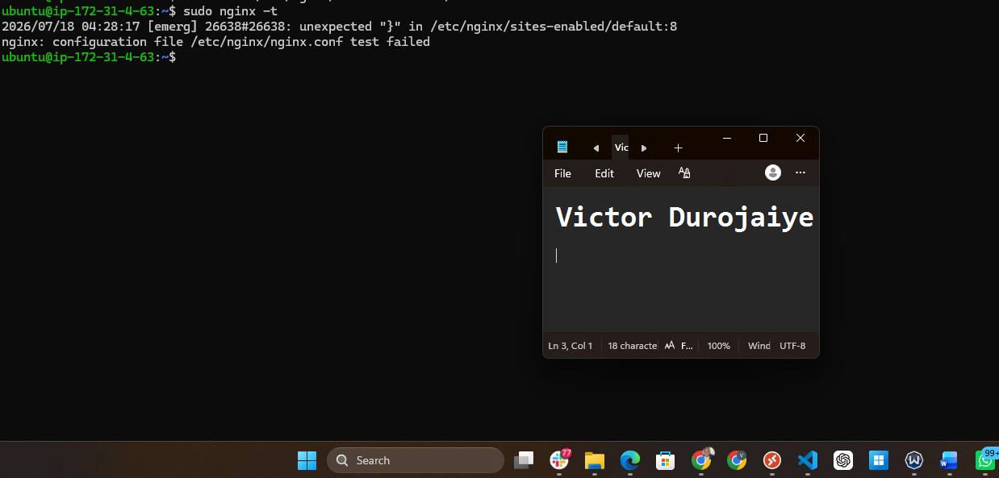

---

#### Screenshot 2 — Output of `sudo nginx -t` showing syntax ok (fixed config)

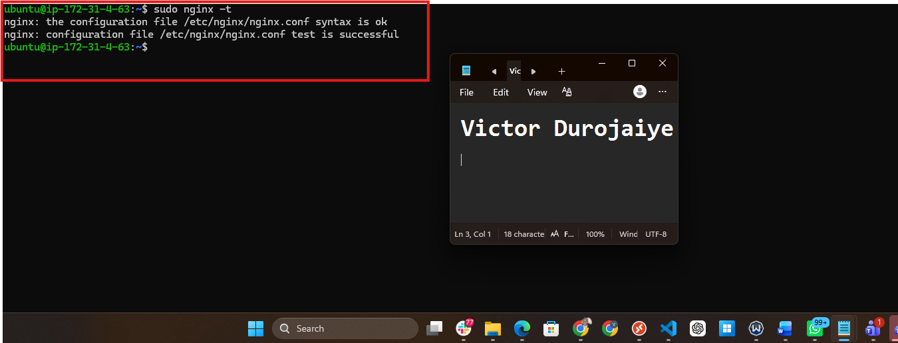

---

#### Screenshot 3 — Output of `curl -I http://<public-ip>` confirming recovery (200 OK)

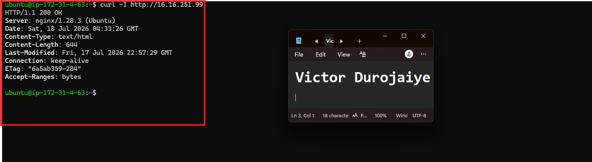

---

### Notes

Answer the following in your own words:

**1. What caused the configuration failure?**

A missing semicolon in `/etc/nginx/sites-available/default`. The `index index.html;` directive on line 6 had its terminating `;` removed, which broke the config. Running `sudo nginx -t` reported it clearly:

`[emerg] directive "index" is not terminated by ";" in /etc/nginx/sites-enabled/default:6` followed by `nginx: configuration file /etc/nginx/nginx.conf test failed`.

The semicolon is what tells Nginx's parser that a directive is complete, so without it the parser could not correctly interpret the server block and refused to load the config. Because this was caught by `nginx -t`, which only reads the files on disk, the running Nginx process kept serving on its previous valid config and the live site was never affected.

---

**2. How did you fix the issue?**

The config file was reopened with `sudo nano /etc/nginx/sites-available/default` and the missing `;` was restored to the `index index.html;` line. Then `sudo nginx -t` was run again and returned:

`nginx: the configuration file /etc/nginx/nginx.conf syntax is ok`
`nginx: configuration file /etc/nginx/nginx.conf test is successful`

Only after that clean result was `sudo systemctl restart nginx` run, followed by `curl -I http://16.16.251.99`, which returned `HTTP/1.1 200 OK`, confirming the service recovered and was serving the application normally again.

---

**3. How can you avoid this kind of issue in real production systems?**

- Always run `nginx -t` after any config edit, without exception, before restarting or reloading.
- Keep Nginx configs in version control (git), so a bad change can be reverted instantly to a known-good state instead of being retyped from memory.
- Test config changes in a staging environment before they touch production.
- Automate config validation in a deployment pipeline, so a broken config is caught in CI and never reaches the live server at all.

---

# Task 7 — Web Application Failure Simulation

## Goal

Simulate missing deployment content and recover the application safely.

### Evidence

#### Screenshot 1 — Output of `curl -I http://<public-ip>` showing failure (non-200 response)

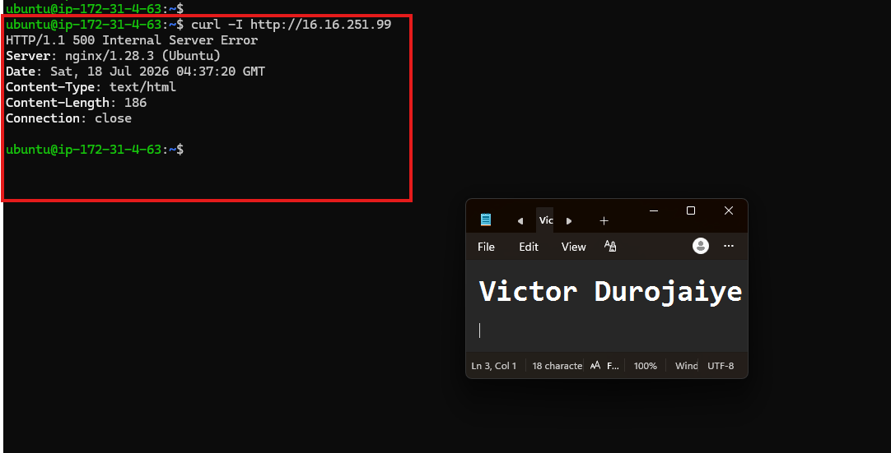

---

#### Screenshot 2 — Output of `curl -I http://<public-ip>` confirming recovery (200 OK)

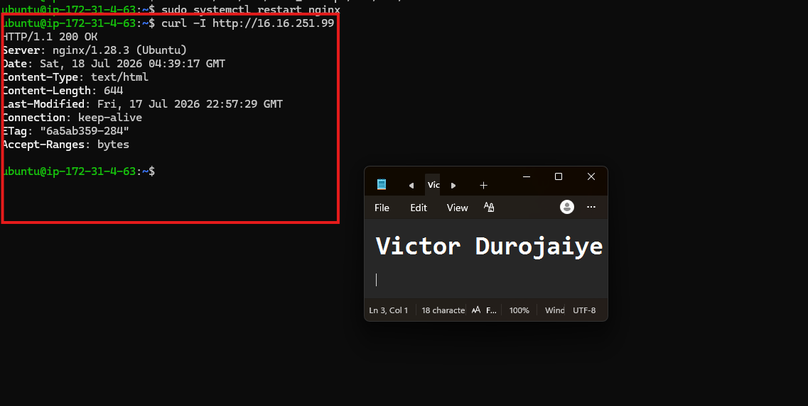

---

### Notes

Answer the following in your own words:

**1. What caused the application to break in this scenario?**

The web root (`/var/www/html`) was moved to a backup location and replaced with an empty directory, simulating a deploy that wiped the old build but failed to copy in the new one. Nginx itself stayed running and correctly configured, but there were no files to serve and, critically, no `index.html` for the SPA fallback to land on. Because `try_files $uri /index.html;` kept redirecting to a `/index.html` that did not exist, Nginx entered a `rewrite or internal redirection cycle` and returned `HTTP/1.1 500 Internal Server Error` instead of a clean 404. The error log entry `rewrite or internal redirection cycle while internally redirecting to "/index.html"` confirms the exact cause.

---

**2. How did you fix the issue and restore the application?**

The original deployment had been safely backed up beforehand (moved to `html_backup` rather than deleted), so recovery was: remove the empty broken directory, move the backup back to `/var/www/html`, and restart Nginx to serve cleanly from the restored files. Recovery was confirmed externally with `curl -I http://16.16.251.99`, which returned `HTTP/1.1 200 OK` with `Content-Length: 644`, `Last-Modified: Fri, 17 Jul 2026 22:57:29 GMT`, and `ETag: "6a5ab359-284"` — identical metadata to the pre-incident state, proving the exact same build was restored rather than a different or corrupted one.

---

**3. What steps would you take to prevent this kind of issue in real production systems?**

- Take automated pre-deployment backups, so every release can be rolled back instantly without manual work.
- Deploy to a versioned, separate directory and atomically switch a symlink (e.g. `/var/www/current`) to point at it, rather than overwriting the live directory in place — a failed deploy then never leaves the live path empty or half-written.
- Add CI/CD checks that verify a deployment actually succeeded (for example, confirming `index.html` exists and is non-empty) before marking the release complete.
- Run post-deployment health checks that automatically verify the live site returns a healthy `200` immediately after every deploy, catching this kind of failure in seconds rather than relying on someone noticing manually.

---

# Task 8 — Security & Reliability Review

## Goal

Review and reflect on the security and reliability practices applied during this assignment.

### Security & Reliability Notes

Answer the following in your own words:

**1. Why is SSH key-based authentication more secure than sharing passwords?**

Key-based auth relies on cryptographic proof of identity instead of a secret string that can be guessed, brute-forced, reused across services, or phished. The private key never leaves the client, so nothing reusable travels over the network during login. Keys are also far longer and higher-entropy than any practical password, and they support safer automation without hardcoding a password. Passwords, by contrast, are a single weak point that anyone who learns them can reuse from anywhere.

---

**2. Why should only required ports be open on a production server?**

Every open port is another way in, so it expands the attack surface. A service listening on a port is something an attacker can probe, fingerprint, and try to exploit. Keeping only the ports the server genuinely needs open (here, 80 for HTTP and 22 for SSH) minimizes that exposure and reduces the number of things that must be patched and monitored. Anything not required should not be reachable from the outside at all.

---

**3. Why is it important for Nginx to be enabled on boot?**

Being enabled on boot means that if the server reboots — planned maintenance, a crash, or a cloud-provider event — Nginx starts automatically and the site comes back without anyone logging in to start it manually. This improves availability and avoids unnecessary downtime. Running (right now) and enabled (on boot) are two separate states in systemd, which is why `systemctl is-enabled nginx` returning `enabled` matters alongside the service being active.

---

**4. What are the risks of sharing secrets, keys, or credentials publicly?**

Exposed secrets can be abused immediately. Automated bots continuously scan public sources like GitHub repos, logs, and paste sites for keys, and a leaked credential can be used within minutes to access cloud accounts, servers, databases, or user data. That can lead to data theft, resource hijacking (for example running up huge bills mining crypto on your account), or full account takeover. Once a secret is public it must be treated as compromised and rotated right away, since there is no way to know who already copied it.

---

**5. Why should cloud resources be stopped or terminated when they are no longer needed?**

Unused resources keep costing money for as long as they run, and they also stay exposed as attack surface even when nobody is using them. An idle, unpatched instance is a liability on both fronts. Stopping or terminating resources you no longer need is a basic cost-control and reliability practice, and it shrinks the set of things you have to secure and maintain.

---

# LinkedIn Post (Required)

## Evidence

#### LinkedIn Post URL

Paste your LinkedIn post URL here:

`https://www.linkedin.com/posts/victor-jaiye_this-week-i-intentionally-broke-my-own-production-share-7484111094911889409-4u2U/?utm_source=share&utm_medium=member_desktop&rcm=ACoAABkZOQEB3T6FCcu0A1jCAOaZB5ag2lTqKeE`

---

#### Screenshot — Published LinkedIn post

---

# Submission Instructions

- Add all required screenshots in your submission
- Full name must be visible in required screenshots
- Do not expose sensitive information (keys, passwords, account IDs)

---

# Completion Checklist

- [x] Task 1: Screenshots (browser, ip a, ss -tulpen, ufw status) + Notes answered
- [x] Task 2: Screenshots (nginx status, nginx -t, ss port 80) + Notes answered
- [x] Task 3: Screenshots (access log, error log, journalctl) + Notes answered
- [x] Task 4: Screenshots (uptime, free -h, df -h, du -sh) + Notes answered
- [x] Task 5: Screenshots (ls html, grep deployed by, grep try_files) + Notes answered
- [x] Task 6: Screenshots (nginx -t fail, nginx -t pass, curl recovery) + Notes answered
- [x] Task 7: Screenshots (curl failure, curl recovery) + Notes answered
- [x] Task 8: Security & Reliability Notes answered
- [x] LinkedIn post published and URL submitted
- [x] Full Name visible in all required screenshots
- [x] No sensitive data exposed

---

## 📌 About DMI & CloudAdvisory

DevOps Micro Internship (DMI) is a project-based DevOps program run by Pravin Mishra (The CloudAdvisory) focused on real-world execution, systems thinking, and career readiness.

It helps learners build strong DevOps foundations with hands-on experience.

---

## 📌 Resources

- 🌐 DMI Official Website: https://pravinmishra.com/dmi  
- 🎓 DevOps for Beginners (Udemy): https://www.udemy.com/course/devops-for-beginners-docker-k8s-cloud-cicd-4-projects/  
- 🎓 Agentic AI DevOps with Claude Code: https://www.udemy.com/course/ultimate-agentic-ai-devops-with-claude-code/  
- 🎓 DevOps with Claude Code: Terraform, EKS, ArgoCD & Helm: https://www.udemy.com/course/devops-with-claude-code-terraform-eks-argocd-helm/  
- ▶️ YouTube Playlist: https://www.youtube.com/playlist?list=PLFeSNDtI4Cho  
- 🔗 Pravin Mishra (LinkedIn): https://www.linkedin.com/in/pravin-mishra-aws-trainer/  
- 🏢 CloudAdvisory (LinkedIn): https://www.linkedin.com/company/thecloudadvisory/

---

*This submission is part of DevOps Micro Internship (DMI) Cohort 3 — Agentic AI Track.*
