# Assignment 5 — Bash Script Automation Drill (OPS Checklist)

Part of the DevOps Micro Internship (DMI) Cohort 3 with Agentic AI

---

## Purpose

In this assignment, you will practice Bash scripting by building a series of small automation scripts covering environment setup, variables, arrays, loops, file conditionals, if-else logic, and functions. These scripts form the foundation of real-world Linux automation used in DevOps, cloud, and production support environments.

---

# Task 1 — Bash Environment & Workspace Setup

## Goal

Verify that Bash is available on your system and create a clean workspace for this assignment.

### Evidence

#### Screenshot 1 — Output of `echo $SHELL` and `bash --version`

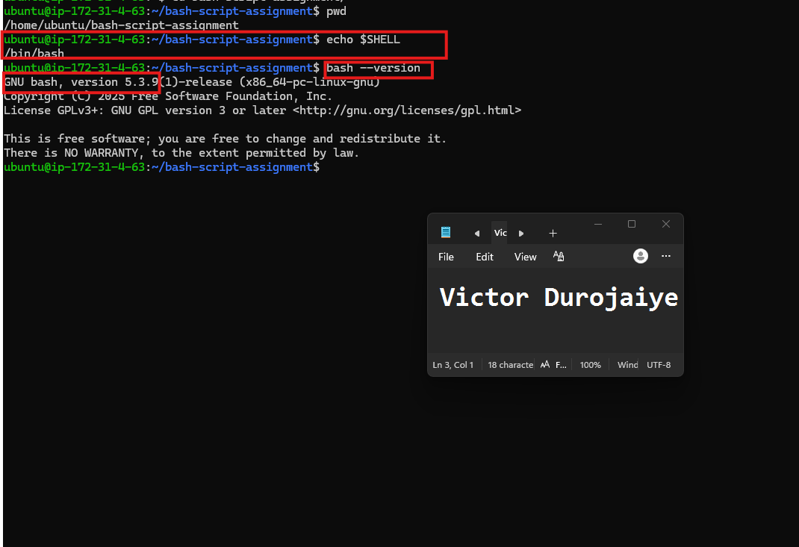

---

#### Screenshot 2 — Output of `pwd` and `ls -lah` showing the scripts directory

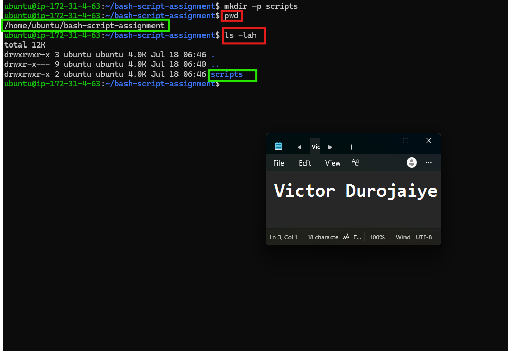

---

### Notes

Answer the following in your own words:

**1. What is Bash?**

Bash stands for Bourne Again Shell. It is a command-line shell and scripting language that reads commands, whether typed by a user or stored in a script, and asks the operating system to carry them out. It is one of the most widely used shells on Linux systems.

---

**2. What is the difference between shell and Bash?**

A shell is a program that gives you an interface to interact with the operating system. Bash is one specific type of shell. Others include sh, zsh, ksh, and fish. They all do similar core work, but they differ in syntax, features, configuration files, and scripting capabilities.

---

**3. Why is it important to confirm the Bash version before writing scripts?**

Confirming the version verifies that Bash is actually installed and tells you which version you are working with. This makes sure the syntax and features I use in my scripts are supported by the system, so the scripts behave the same way when they run.

---

# Task 2 — Your First Bash Script

## Goal

Create your first Bash script, make it executable, and run it from the terminal.

### Evidence

#### Screenshot 1 — Content of `first-script.sh`

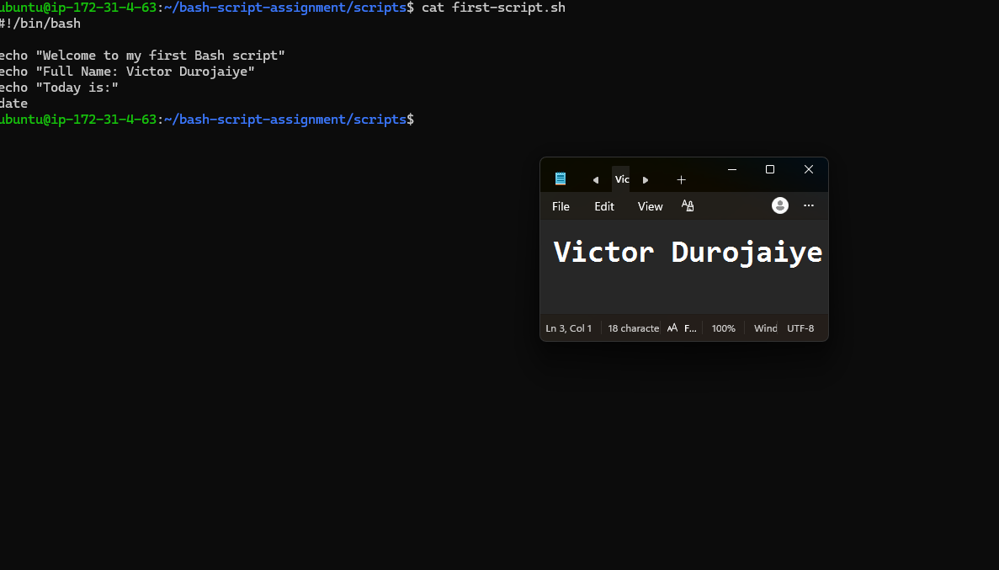

---

#### Screenshot 2 — Output of `./first-script.sh`

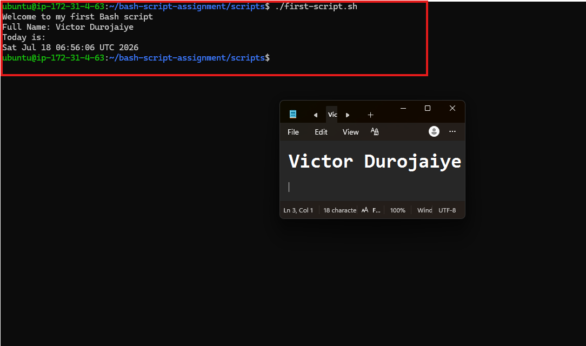

---

#### Screenshot 3 — Output of `ls -l first-script.sh` showing executable permission

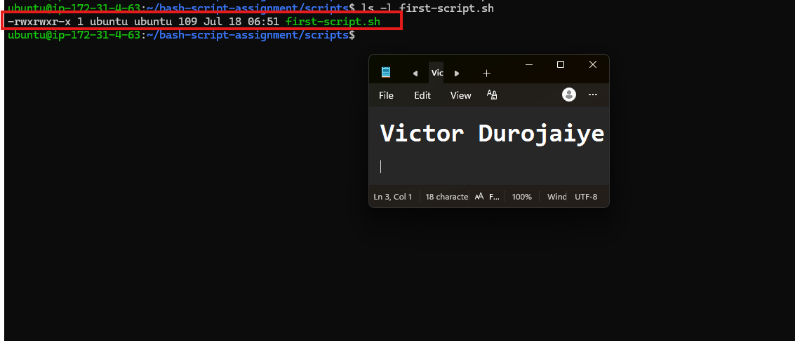

---

### Notes

Answer the following in your own words:

**1. What is the purpose of `#!/bin/bash`?**

`#!/bin/bash` is the shebang line. It tells the operating system to use the Bash interpreter to run the commands inside the script.

---

**2. Why do we use `chmod +x` before running a script?**

A newly created script usually does not have execute permission. `chmod +x` adds that permission, which lets me run the script directly with `./first-script.sh`.

---

**3. What is the difference between running a script using `./script.sh` and `bash script.sh`?**

With `./script.sh` the system runs the file directly, so the file must have execute permission and the shebang line decides which interpreter runs it. With `bash script.sh` I am handing the file straight to Bash to read and run. It does not need execute permission for this, and Bash is used even if the script has a different shebang.

---

# Task 3 — Variables: User Information Script

## Goal

Use variables to store and display user-related information.

### Evidence

#### Screenshot 1 — Content of `user-info.sh`

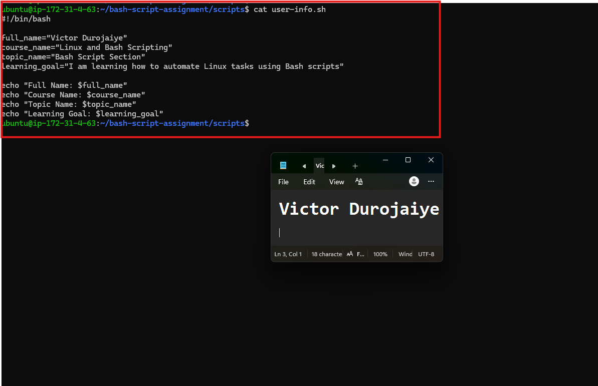

---

#### Screenshot 2 — Output of `./user-info.sh`

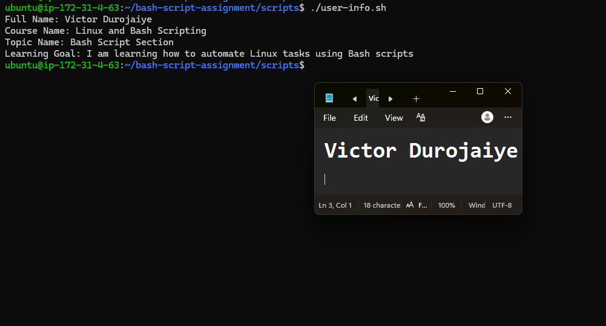

---

### Notes

Answer the following in your own words:

**1. What is a variable in Bash?**

A variable is a name used to store a value that I can reuse later in the script. For example, I can store a person's name in a variable and print it whenever it is needed.

---

**2. Why should we avoid spaces around the `=` sign when creating variables?**

Bash does not allow spaces around the `=` when assigning a value. If I add spaces, Bash reads the variable name as a command and the rest as arguments instead of treating it as an assignment.

Correct: `course_name="Linux and Bash Scripting"`

Incorrect: `course_name = "Linux and Bash Scripting"`

---

**3. How do you access the value stored inside a Bash variable?**

I put a `$` before the variable name to get its stored value. For example, `echo "$course_name"` prints the value held in `course_name`.

---

# Task 4 — Arrays & Loops: Tools Checklist Script

## Goal

Use arrays and loops to print a checklist of tools used in Bash scripting.

### Evidence

#### Screenshot 1 — Content of `tools-checklist.sh`

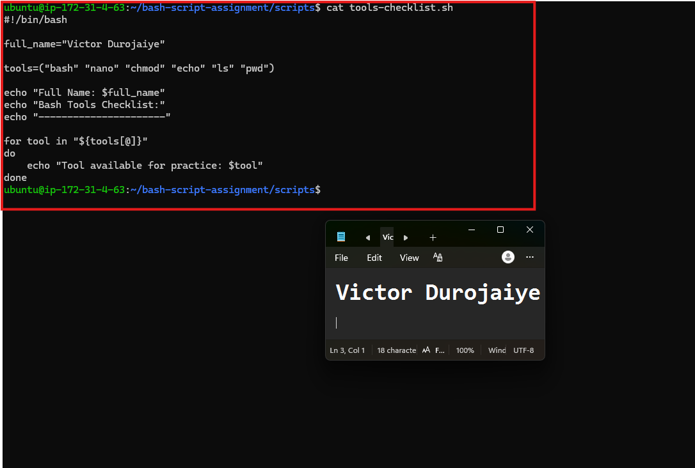

---

#### Screenshot 2 — Output of `./tools-checklist.sh`

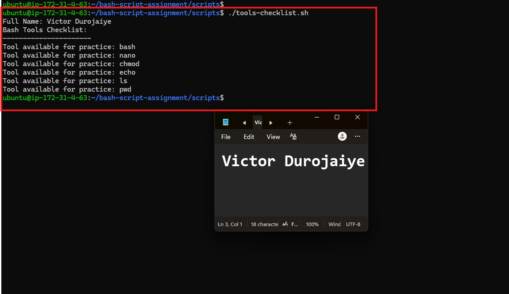

---

### Notes

Answer the following in your own words:

**1. What is an array in Bash?**

An array stores multiple values under one variable name. In this script the `tools` array holds several Linux and Bash tools, for example: `tools=("bash" "nano" "chmod" "echo" "ls" "pwd")`.

---

**2. Why are arrays useful in scripts?**

Arrays keep related values together. Instead of creating a separate variable for every tool, I store them all in one array and process them with a loop. That makes the script shorter and easier to update.

---

**3. What does `"${tools[@]}"` mean?**

`"${tools[@]}"` refers to all the values inside the `tools` array, which gives the loop access to every item. The double quotes keep each item as a separate value, which matters especially when an item contains spaces.

---

**4. What is the purpose of the `for` loop in this script?**

The `for` loop goes through each value in the `tools` array one by one. On each pass, the current value is stored in the `tool` variable and printed. So the first pass prints bash, the next nano, and so on until every tool has been printed.

---

# Task 5 — Loops: Number Counter Script

## Goal

Use loops to repeat a task multiple times.

### Evidence

#### Screenshot 1 — Content of `counter.sh`

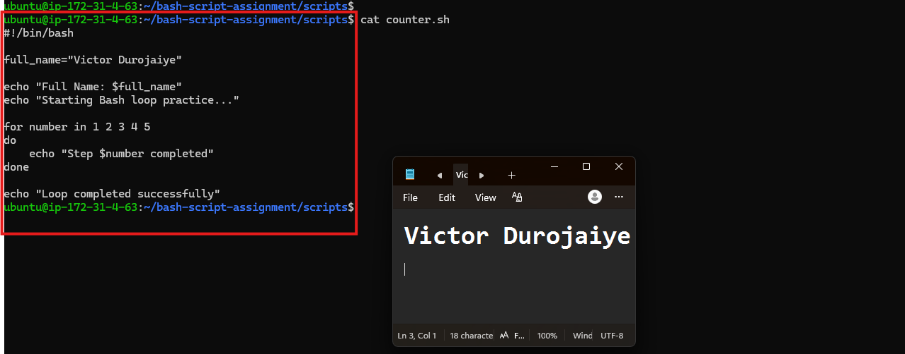

---

#### Screenshot 2 — Output of `./counter.sh`

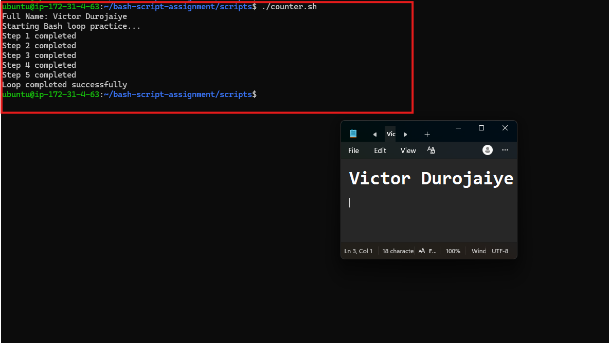

---

### Notes

Answer the following in your own words:

**1. What is a loop?**

A loop repeats a task multiple times. Instead of writing the same command over and over, I write it once inside a loop.

---

**2. Why do we use loops in Bash scripting?**

Loops automate repetitive tasks. They make scripts shorter and save me from typing the same commands many times.

---

**3. How many times did the loop run in your script?**

The loop ran five times because I gave it five values: 1 2 3 4 5. It ran once for each number.

---

**4. What would you change if you wanted the loop to run 10 times?**

I would extend the list with the numbers 6 to 10:

```bash
for number in 1 2 3 4 5 6 7 8 9 10
do
    echo "Step $number completed"
done
```

---

# Task 6 — Files & Conditionals: File Validation Script

## Goal

Use file checks and conditionals to verify whether files and directories exist.

### Evidence

#### Screenshot 1 — Output of `ls -lah ../test-folder`

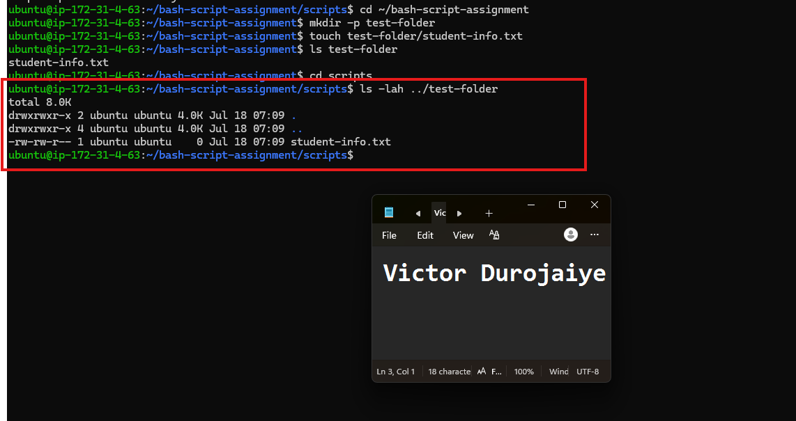

---

#### Screenshot 2 — Content of `file-check.sh`

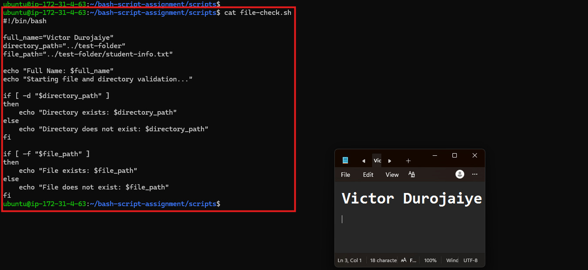

---

#### Screenshot 3 — Output of `./file-check.sh`

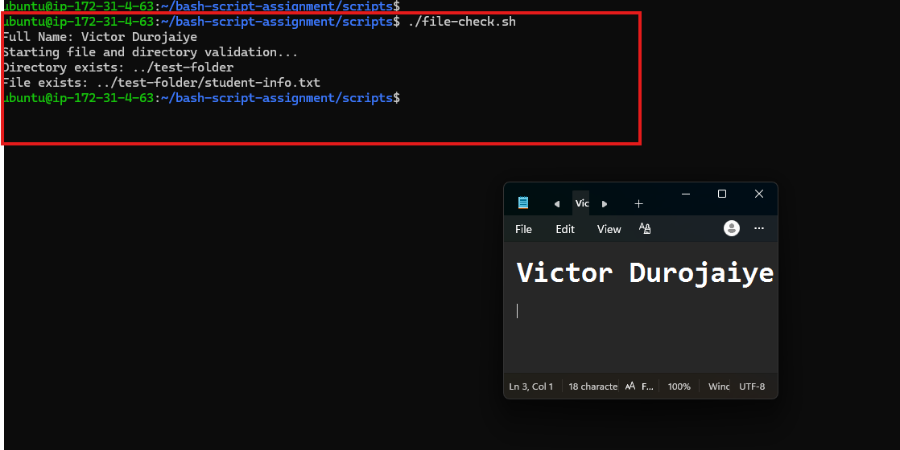

---

### Notes

Answer the following in your own words:

**1. What does `-d` check in Bash?**

`-d` checks whether the given path exists and is a directory. If the directory exists, the condition is true.

---

**2. What does `-f` check in Bash?**

`-f` checks whether the given path exists and is a regular file. If the file exists, the condition is true.

---

**3. Why should file and directory paths be stored in variables?**

Storing paths in variables makes the script easier to read and update. If a path changes, I only update the variable once instead of editing the same path in several places.

---

**4. What happens if the file does not exist?**

If the file does not exist, the `-f` check is false, so the commands under `else` run and the script prints: `File does not exist: ../test-folder/student-info.txt`.

---

# Task 7 — Conditionals: Pass or Retry Script

## Goal

Use if-else conditionals to make decisions based on a variable value.

### Evidence

#### Screenshot 1 — Content of `score-check.sh` with `score=85`

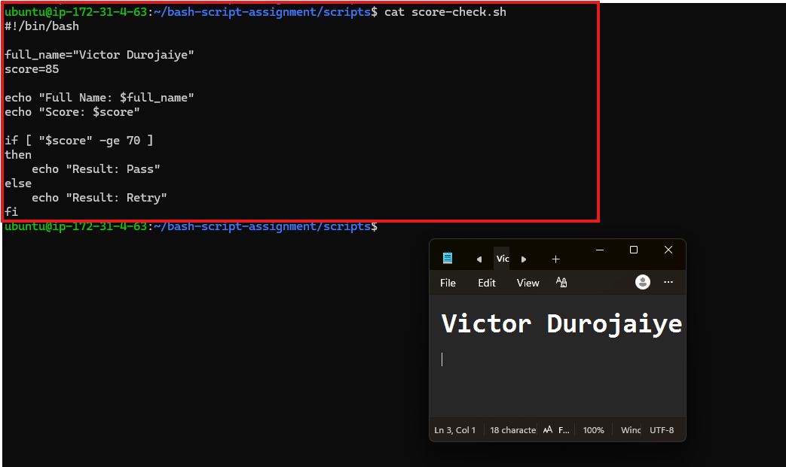

---

#### Screenshot 2 — Output showing `Result: Pass`

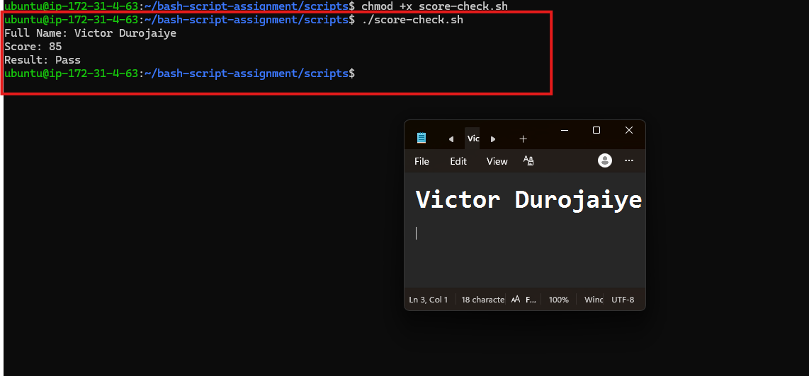

---

#### Screenshot 3 — Content of `score-check.sh` with `score=55`

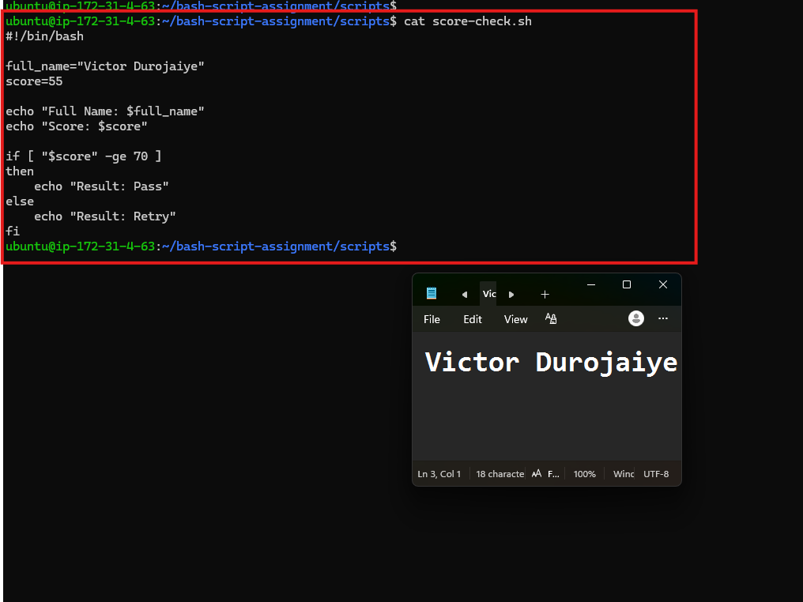

---

#### Screenshot 4 — Output showing `Result: Retry`

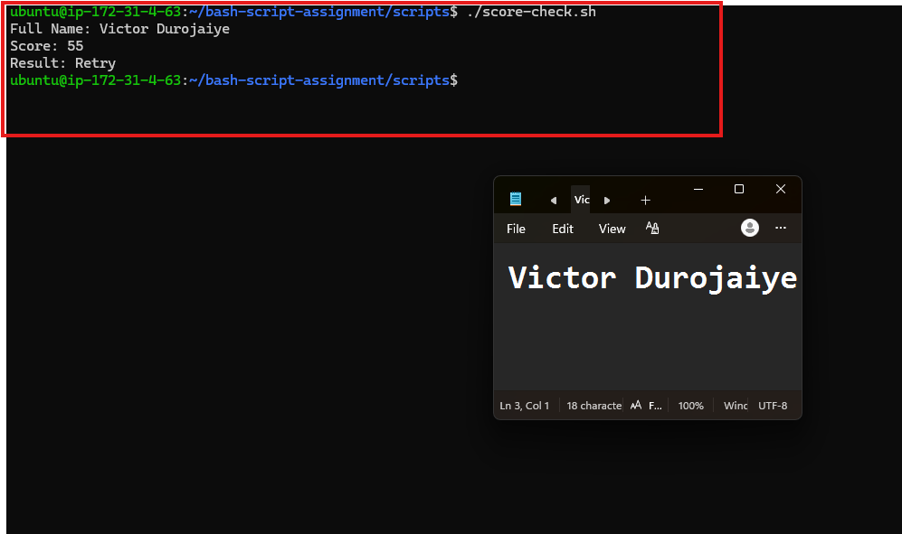

---

### Notes

Answer the following in your own words:

**1. What is the purpose of if-else in Bash?**

An if-else statement lets the script make a decision. If the condition is true it runs one set of commands, and if it is false it runs another set.

---

**2. What does `-ge` mean?**

`-ge` means greater than or equal to. In this script it checks whether the score is greater than or equal to 70: `[ "$score" -ge 70 ]`.

---

**3. Why should conditions be tested with different values?**

Testing with different values makes sure every possible result works. I used 85 to test the Pass path and 55 to test the Retry path. It also helps to test the boundary value, 70, since it should produce Pass.

---

**4. How can conditionals help in automation scripts?**

Conditionals let automation scripts decide what to do based on the current situation. A script can check whether a service is running, whether a file exists, or whether a disk is nearly full, and then take the right action based on the result.

---

# Task 8 — Functions: Final Bash Automation Script

## Goal

Create a final Bash script using functions to organize reusable code.

### Evidence

#### Screenshot 1 — Content of `final-automation.sh`

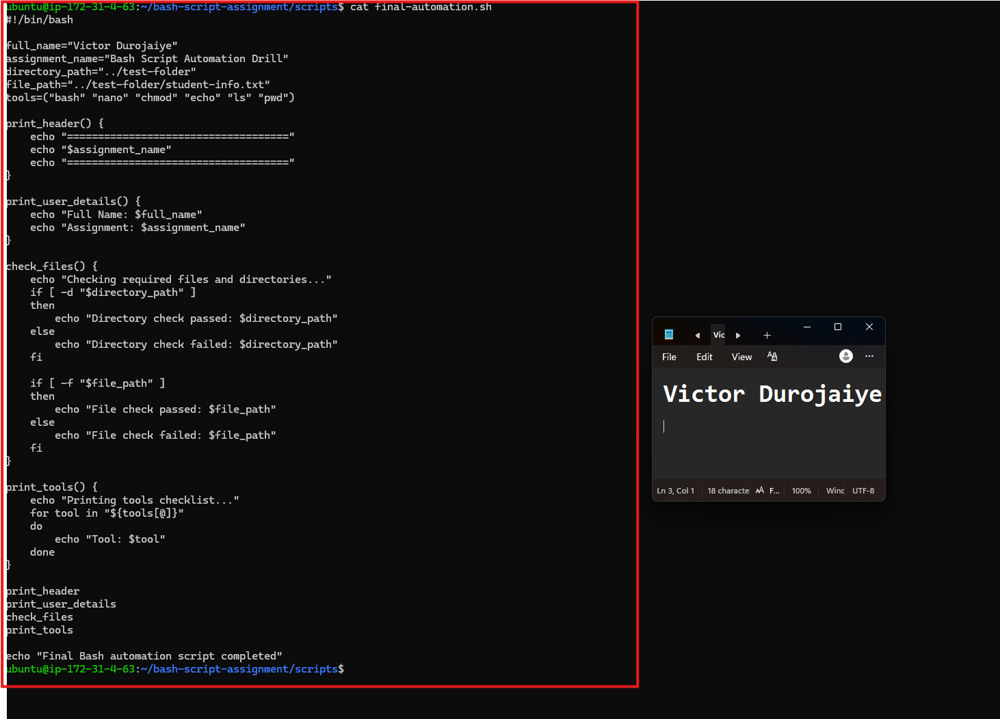

---

#### Screenshot 2 — Output of `./final-automation.sh`

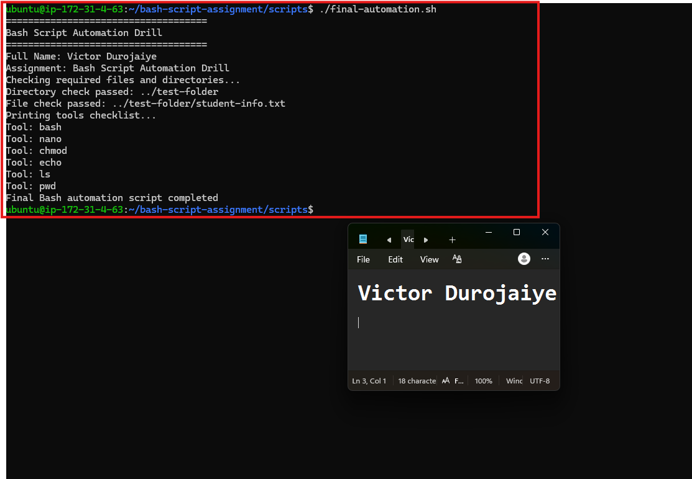

---

#### Screenshot 3 — Output of `ls -lah` showing all created scripts

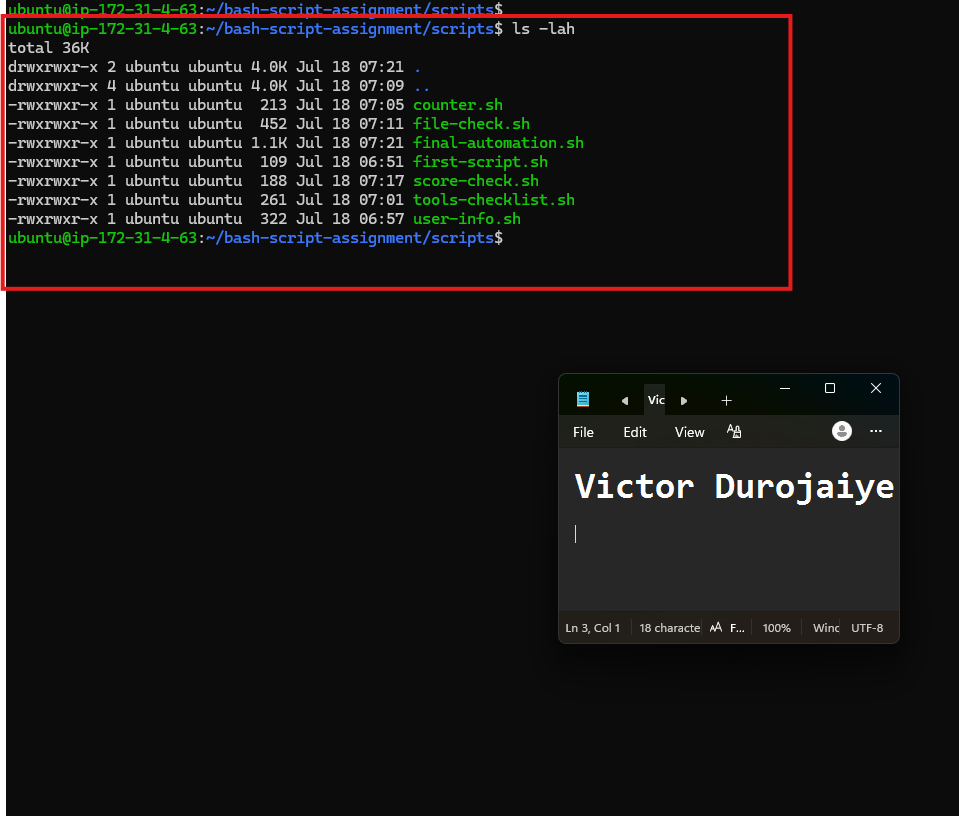

---

### Notes

Answer the following in your own words:

**1. What is a function in Bash?**

A function is a named block of commands created to do a specific task. Once it is defined, I can run all the commands inside it by calling the function name.

---

**2. Why are functions useful in scripts?**

Functions break a large script into smaller sections, which makes it easier to read, manage, and troubleshoot. If I need the same task more than once, I can call the function again instead of rewriting its commands.

---

**3. Which functions did you create in this script?**

I created four functions:

- `print_header` prints the assignment header.
- `print_user_details` prints my full name and the assignment name.
- `check_files` checks whether the required directory and file exist.
- `print_tools` uses a loop to print each tool stored in the array.

---

**4. How does this final script combine variables, arrays, loops, conditionals, files, and functions?**

The script uses variables to store my name, the assignment name, and the required paths. It uses an array to hold the tool names and a loop to print them one by one. It uses if-else conditionals with `-d` and `-f` to check the required directory and file. Finally, the related commands are organized into functions, and those functions are called in the correct order to run the complete automation.

---

# LinkedIn Post (Required)

## Evidence

#### LinkedIn Post URL

Paste your LinkedIn post URL here:

`https://www.linkedin.com/posts/victor-jaiye_dmi-cohort-4-live-micro-internship-waiting-share-7484148310275186688-O4PR/`

---

#### Screenshot — Published LinkedIn post


---

# Submission Instructions

- Add all required screenshots in your submission
- Full name must be visible in required screenshots
- All script files must be created and run successfully
- Required notes must be answered clearly for every task
- Do not expose sensitive information (keys, passwords, credentials)

---

# Completion Checklist

- [x] Task 1: Environment setup verified, workspace created (Screenshots 1–2, Notes answered)
- [x] Task 2: First script created, executed, permissions verified (Screenshots 1–3, Notes answered)
- [x] Task 3: Variables script created and run (Screenshots 1–2, Notes answered)
- [x] Task 4: Arrays and loops script created and run (Screenshots 1–2, Notes answered)
- [x] Task 5: Counter loop script created and run (Screenshots 1–2, Notes answered)
- [x] Task 6: File validation script created and run (Screenshots 1–3, Notes answered)
- [x] Task 7: Pass/Retry conditional script tested with both values (Screenshots 1–4, Notes answered)
- [x] Task 8: Final automation script created and run (Screenshots 1–3, Notes answered)
- [x] All scripts run without errors
- [x] Full Name visible in all required screenshots
- [x] LinkedIn post published and URL submitted
- [x] No sensitive data exposed

---

## 📌 About DMI & CloudAdvisory

DevOps Micro Internship (DMI) is a project-based DevOps program run by Pravin Mishra (The CloudAdvisory) focused on real-world execution, systems thinking, and career readiness.

It helps learners build strong DevOps foundations with hands-on experience.

---

## 📌 Resources

- 🌐 DMI Official Website: https://pravinmishra.com/dmi  
- 🎓 DevOps for Beginners (Udemy): https://www.udemy.com/course/devops-for-beginners-docker-k8s-cloud-cicd-4-projects/  
- 🎓 Agentic AI DevOps with Claude Code: https://www.udemy.com/course/ultimate-agentic-ai-devops-with-claude-code/  
- 🎓 DevOps with Claude Code: Terraform, EKS, ArgoCD & Helm: https://www.udemy.com/course/devops-with-claude-code-terraform-eks-argocd-helm/  
- ▶️ YouTube Playlist: https://www.youtube.com/playlist?list=PLFeSNDtI4Cho  
- 🔗 Pravin Mishra (LinkedIn): https://www.linkedin.com/in/pravin-mishra-aws-trainer/  
- 🏢 CloudAdvisory (LinkedIn): https://www.linkedin.com/company/thecloudadvisory/

---

*This submission is part of DevOps Micro Internship (DMI) Cohort 3 — Agentic AI Track.*
