# Assignment 6 — Build an AI-Assisted Linux Health Check (AI-Assisted Linux Incident Triage)

Part of the DevOps Micro Internship (DMI) Cohort 3 with Agentic AI

---

## Purpose

In this assignment, you will build a read-only Bash triage script that checks the health of your Ubuntu server and Nginx application, connect it to Claude Code as a reusable `/linux-triage` skill, simulate a controlled Nginx incident, use the skill to gather and analyze evidence, recover the service manually, and verify recovery. The workflow follows the Agentic Loop: Gather → Analyze → Human Act → Verify.

---

# Task 1 — Confirm the Healthy Baseline and Create the Workspace

## Goal

Confirm that Nginx and the React application are healthy before building the automation.

### Evidence

#### Screenshot 1 — Output of `systemctl is-active nginx`, `ss -ltn | grep ':80'`, and `curl -I http://localhost`

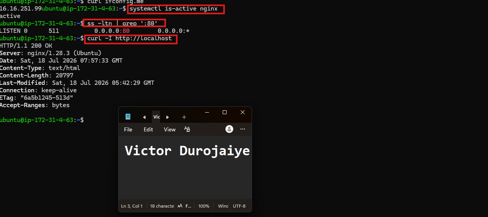

---

#### Screenshot 2 — Output of `pwd` and `find . -maxdepth 4 -type d | sort` showing the workspace folder structure

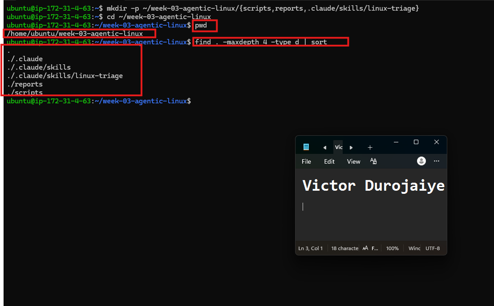

---

### Notes

Answer the following in your own words:

**1. What proves that Nginx is running?**

Running `systemctl is-active nginx` returns `active`, which confirms the Nginx service is currently running on the server.

---

**2. What proves that the server is listening for HTTP traffic?**

The output of `ss -ltn | grep ':80'` shows a `LISTEN` entry on `0.0.0.0:80`. This proves the server has an open listener on port 80 and is ready to accept HTTP requests.

---

**3. Why must you capture a healthy baseline before simulating an incident?**

The baseline records what a working system looks like. After I simulate the incident, I can compare the failed state against this healthy state to see exactly what changed, and once I recover the service I can check again to confirm everything is back to normal.

---

# Task 2 — Create Project Context and Safety Rules in CLAUDE.md

## Goal

Tell Claude exactly what this project does and what it is not allowed to do.

### Evidence

#### Screenshot 3 — CLAUDE.md open in VS Code showing all four sections (Project Overview, Incident Workflow, Safety Rules, Output Rules)

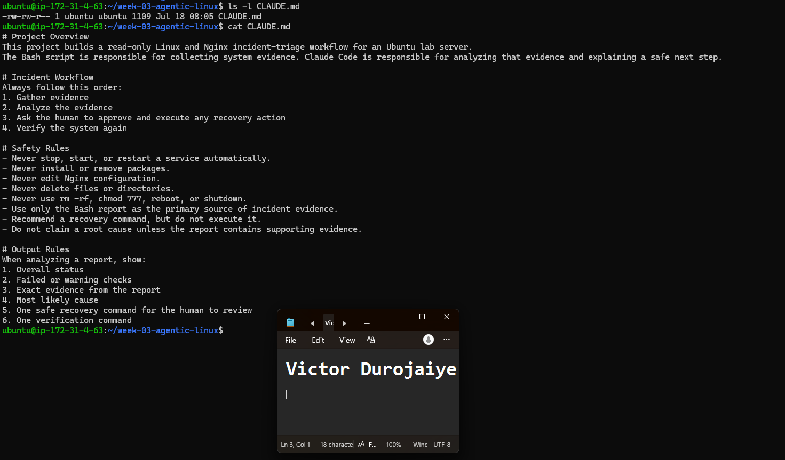

---

### Notes

Answer the following in your own words:

**1. Why should Claude receive project-specific operational rules?**

Project-specific rules tell Claude what the project is for, which order of steps to follow, and which actions it must never take. This keeps its answers aligned with the incident workflow instead of Claude making unnecessary or unsafe changes to the server.

---

**2. Why is the human required to execute the recovery command?**

The human has to review the evidence and decide whether the recovery command is safe before it runs. Claude can recommend a command, but the operator stays accountable for any change made to the server.

---

**3. Which rule prevents Claude from making an unsupported diagnosis?**

The rule "Do not claim a root cause unless the report contains supporting evidence" stops Claude from giving a diagnosis that is not backed by the actual report.

---

# Task 3 — Use Agentic AI to Plan Before Writing the Script

## Goal

Use Claude Code to inspect the environment and produce a read-only plan before creating any Bash code.

### Evidence

#### Screenshot 4 — Claude Code showing the five-check plan and read-only inspection results

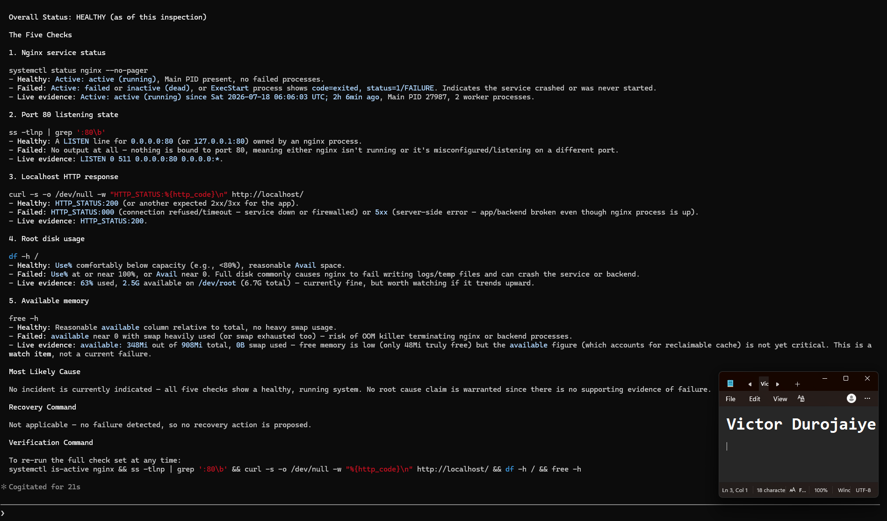

---

### Notes

Answer the following in your own words:

**1. Which part of this task represents the Gather phase?**

The read-only inspection of the Ubuntu server is the Gather phase. Claude ran commands to collect information about the Nginx service, port 80, the HTTP response, disk usage, and available memory before writing any code.

---

**2. Did Claude follow the instruction not to create files? How did you verify this?**

Yes. Claude only ran read-only inspection commands and produced a plan, it did not write anything. I verified this by running `find . -maxdepth 4 -type f | sort`, which showed only `./CLAUDE.md` and no Bash script in the `scripts` folder.

---

**3. Why is planning before coding useful in DevOps automation?**

Planning lets me decide what the script should check and what each result means before I write it. It also helps me catch missing or unsafe steps early, rather than discovering them after the script is already built.

---

# Task 4 — Build the Linux Triage Bash Script

## Goal

Create one Bash script that gathers consistent Linux and Nginx health evidence.

### Evidence

#### Screenshot 5 — Top section of `linux-triage.sh` showing variables, thresholds, and the checks array

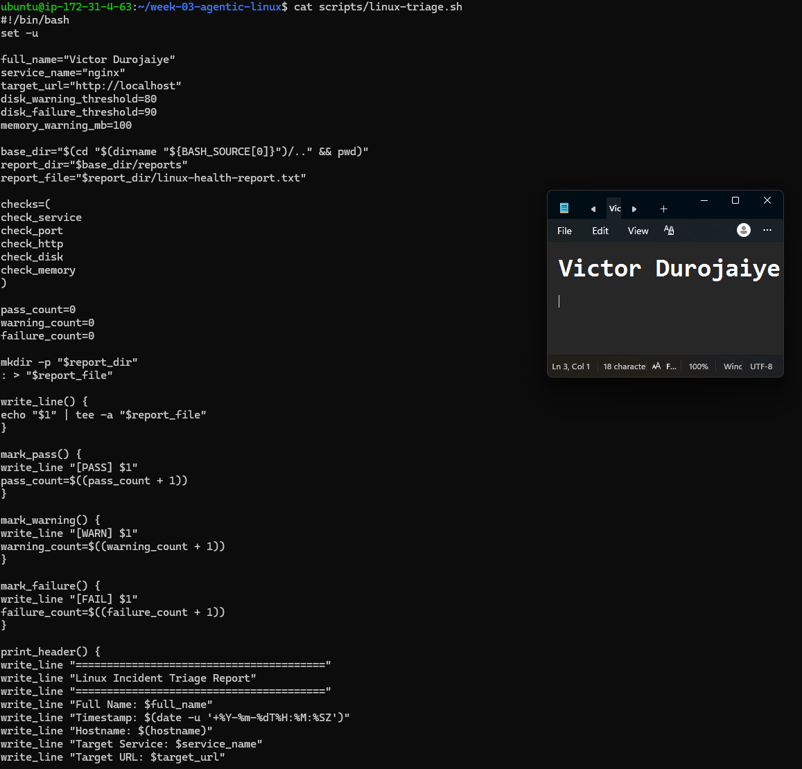

---

#### Screenshot 6 — Middle section showing check functions and conditionals

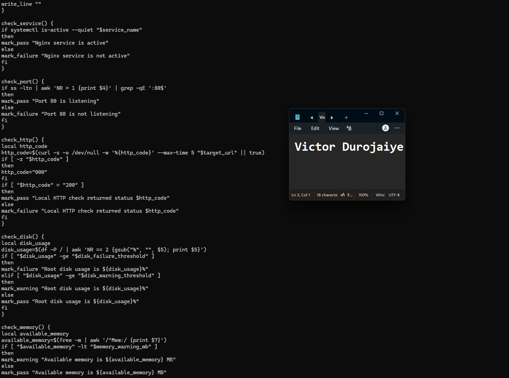

---

#### Screenshot 7 — Bottom section showing the loop, summary function, and exit behavior

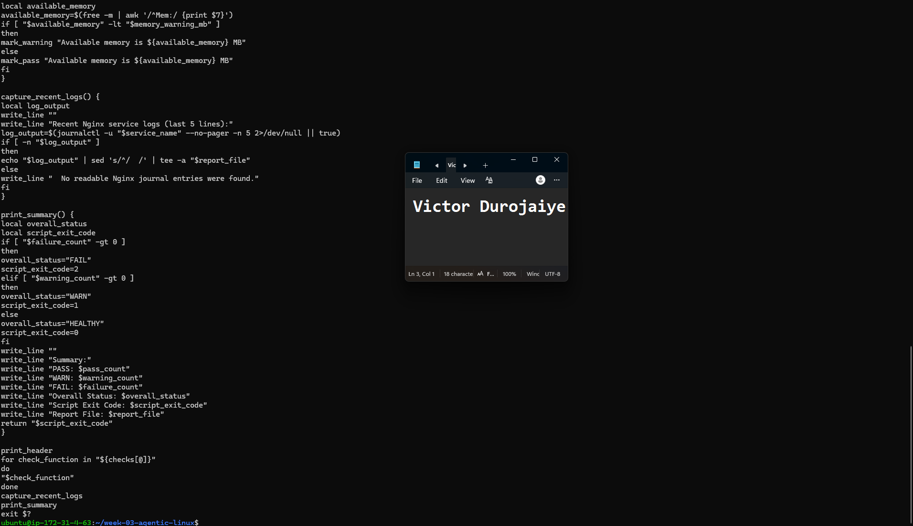

---

#### Screenshot 8 — Output of `bash -n scripts/linux-triage.sh` (no syntax errors) and `ls -l scripts/linux-triage.sh` showing executable permission

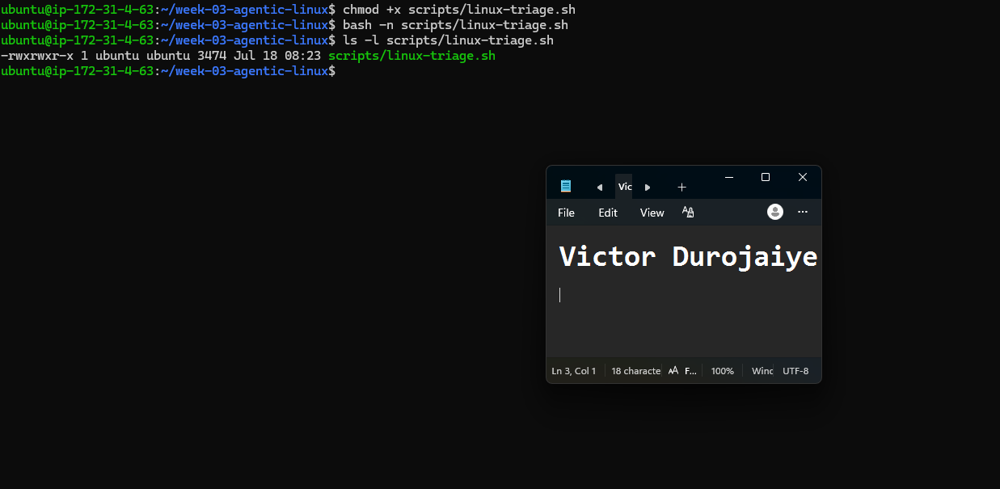

---

### Notes

Answer the following in your own words:

**1. What is stored in the checks array?**

The `checks` array stores the names of the five health-check functions: `check_service`, `check_port`, `check_http`, `check_disk`, and `check_memory`. These cover the Nginx service, port 80, the HTTP response, disk usage, and available memory.

---

**2. How does the `for` loop use that array?**

The `for` loop reads each function name out of the array and calls it one at a time, so all five checks run in order during a single execution of the script.

---

**3. Why are the health checks separated into functions?**

Each function handles one specific check, which keeps the script easy to read, test, and update. I can change or troubleshoot one check without affecting the others.

---

**4. What is the purpose of `$(...)` in this script?**

`$(...)` runs a command and captures its output into a variable. The script uses it to collect values like the timestamp, hostname, HTTP status code, disk usage percentage, available memory, and the recent Nginx logs.

---

**5. Why does the script use different exit codes for HEALTHY, WARN, and FAIL?**

The exit code reports the overall condition of the server so a person or another automation tool can understand the result without reading the whole report: `0` means all checks passed, `1` means a warning was found, and `2` means at least one check failed. This makes the severity of the outcome clear at a glance.

---

# Task 5 — Run and Understand the Healthy-State Report

## Goal

Run the Bash script against the healthy server and verify that it creates a report.

### Evidence

#### Screenshot 9 — Output of `./scripts/linux-triage.sh` showing your Full Name and all five check results

---

#### Screenshot 10 — Output showing the captured exit code and final summary

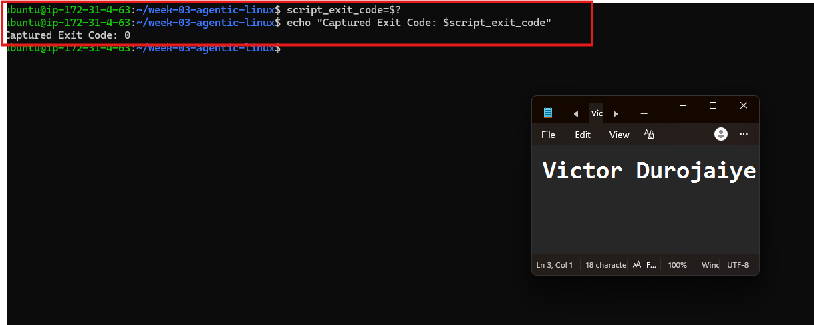

---

### Notes

Answer the following in your own words:

**1. What is the overall status of your healthy baseline?**

The overall status is HEALTHY. The report contains no failed checks, so I could safely continue to the incident simulation.

---

**2. Which exact Linux evidence proves the application is serving traffic?**

The report shows `[PASS] Port 80 is listening` and `[PASS] Local HTTP check returned status 200`. Port 80 listening confirms the server is ready to receive HTTP traffic, and the HTTP 200 status confirms the application responded successfully through Nginx.

---

**3. Did your script return exit code 0 or 1? Explain why.**

It returned exit code 0, because all five checks passed. Nginx was active, port 80 was listening, the application returned HTTP 200, and the disk and memory values were within healthy limits, so there were no warnings or failures.

---

**4. What is the difference between a warning and a failure in this script?**

A warning means the system is still working but a resource condition needs attention, for example root disk usage between 80% and 89%, or available memory below 100 MB. A failure means a critical check did not pass, for example Nginx is inactive, port 80 is not listening, the application does not return HTTP 200, or root disk usage reaches 90% or higher.

---

# Task 6 — Create and Run the /linux-triage Skill

## Goal

Turn the Bash script into a reusable, manually invoked Agentic AI workflow.

### Evidence

#### Screenshot 11 — `SKILL.md` showing the frontmatter, allowed tool restrictions, and safety rules

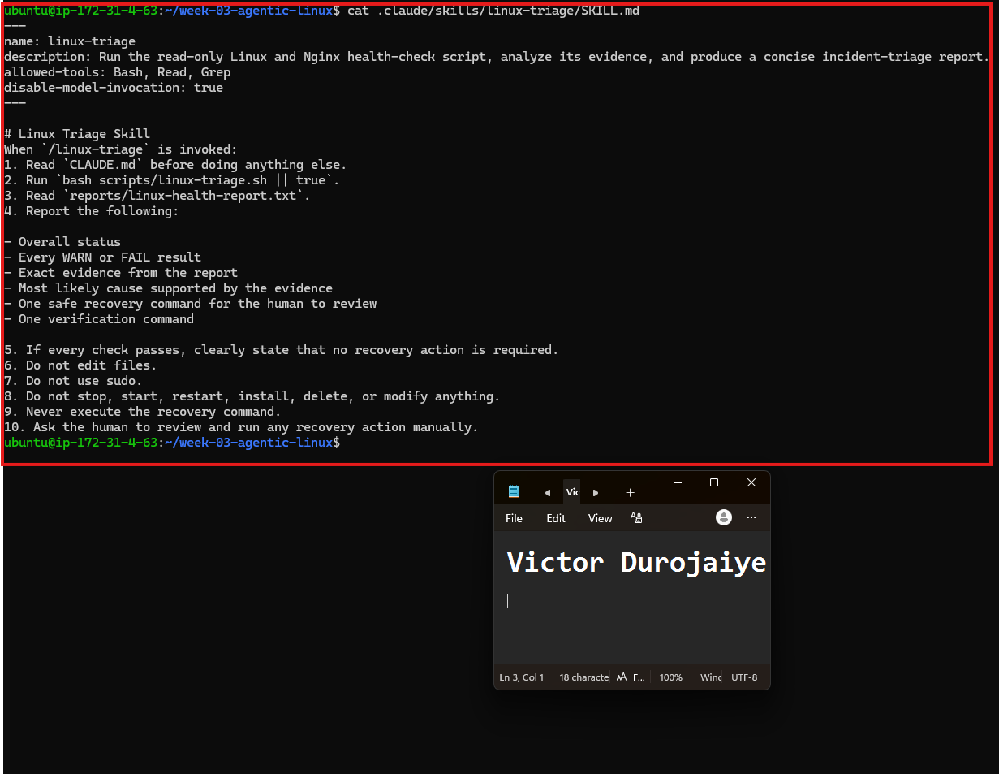

---

#### Screenshot 12 — `/linux-triage` output for the healthy server

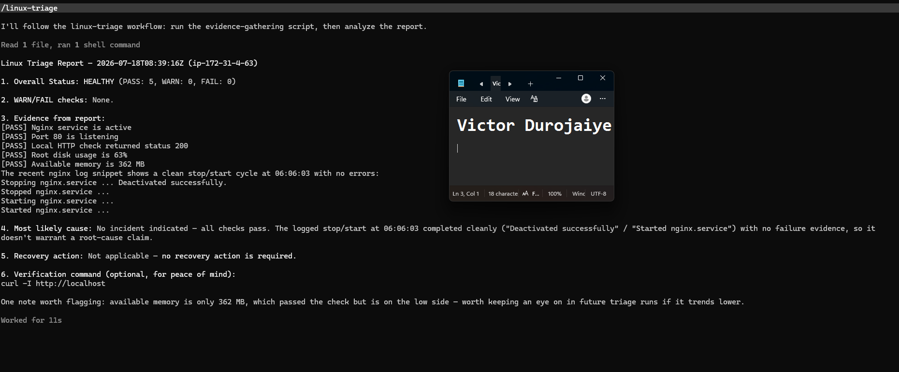

---

### Notes

Answer the following in your own words:

**1. Why does this skill have Bash, Read, and Grep, but not Write?**

The skill needs Bash to run the triage script, Read to open the generated report, and Grep to find specific PASS, WARN, or FAIL results. It does not get Write because Claude should never create or modify project files during triage, its job is to analyze evidence, not change anything.

---

**2. Why is `disable-model-invocation: true` useful for this skill?**

This setting stops Claude from choosing and running the skill on its own. I have to invoke `/linux-triage` manually, which keeps the server inspection under human control.

---

**3. What part is performed by Bash, and what part is performed by Claude?**

The Bash script does the gathering: it checks Nginx, port 80, the HTTP response, disk usage, available memory, and recent logs, and writes the results to `linux-health-report.txt`. Claude does the analysis: it reads that report, explains the results, points out any warnings or failures, and recommends a safe next step. Claude does not perform the recovery.

---

**4. Why is this better than asking Claude "Is my server healthy?" without giving it evidence?**

A bare question gives Claude no real information about the actual server, so it would only be guessing. The `/linux-triage` skill first collects current evidence with the Bash script, so Claude's answer is grounded in the real Nginx status, listening port, HTTP response, disk usage, memory, and logs.

---

# Task 7 — Simulate an Nginx Incident and Let the Skill Diagnose It

## Goal

Create a controlled service failure, gather evidence through Bash, and let Claude analyze the evidence without taking recovery action.

### Evidence

#### Screenshot 13 — Output showing Nginx is inactive and the HTTP request fails

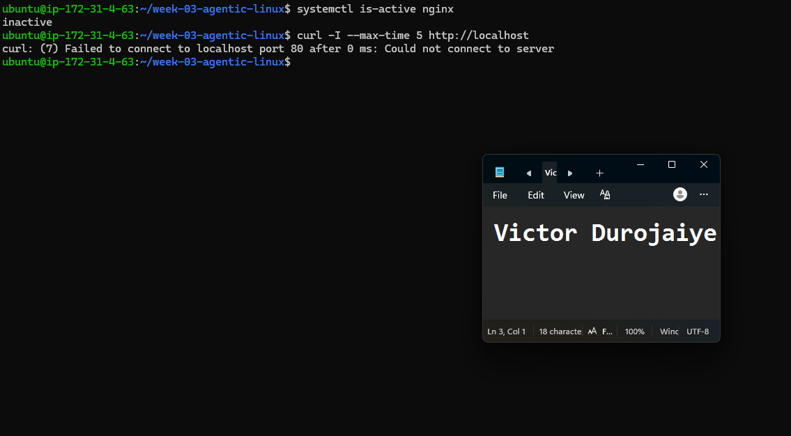

---

#### Screenshot 14 — `/linux-triage` output showing failed evidence, most likely cause, and a suggested recovery command

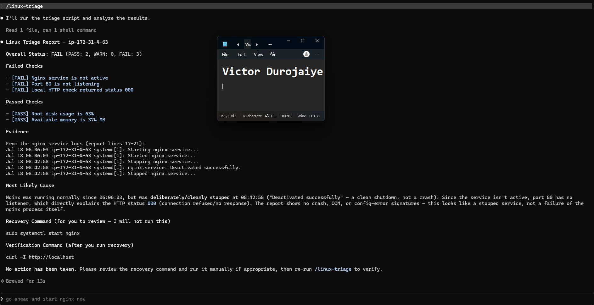

---

#### Screenshot 15 — `incident-failure-report.txt` showing the failed checks and your Full Name

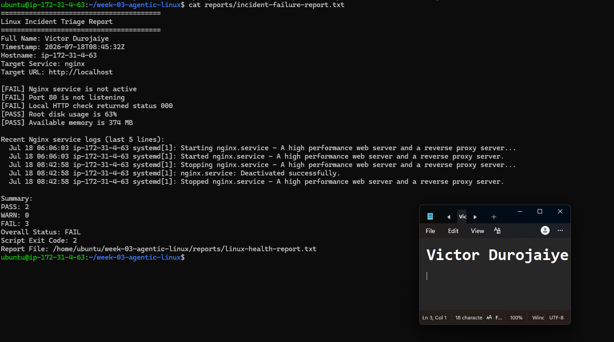

---

### Notes

Answer the following in your own words:

**1. Which three checks failed?**

The Nginx service check, the port 80 check, and the local HTTP check failed. The disk and memory checks were unaffected by stopping Nginx and still passed.

---

**2. What evidence supports the conclusion that Nginx is unavailable?**

The report shows Nginx is not active, port 80 is not listening, and the local HTTP request returned status 000. Together these three results show that Nginx is down and the application cannot receive HTTP traffic.

---

**3. Did Claude execute the recovery command? Why is that important?**

No. Claude only recommended `sudo systemctl start nginx` and explicitly stated it would not run it. This matters because I need to review the evidence and approve the action before any change is made, which prevents an AI tool from altering the service automatically during an incident.

---

**4. Which phase of the Agentic Loop is represented by the Bash report?**

The Bash report represents the Gather phase, because the script collects the current evidence about Nginx, port 80, the HTTP response, disk usage, memory, and recent logs.

---

**5. Which phase is represented by Claude's explanation?**

Claude's explanation represents the Analyze phase. Claude reads the gathered evidence, identifies the failed checks, explains the most likely cause, and recommends a recovery command for human review.

---

# Task 8 — Recover Manually, Verify Again, and Write the Incident Summary

## Goal

Recover the service as the human operator and prove that the system is healthy again.

### Evidence

#### Screenshot 16 — Output showing Nginx is active and `curl -I http://localhost` returns 200 OK

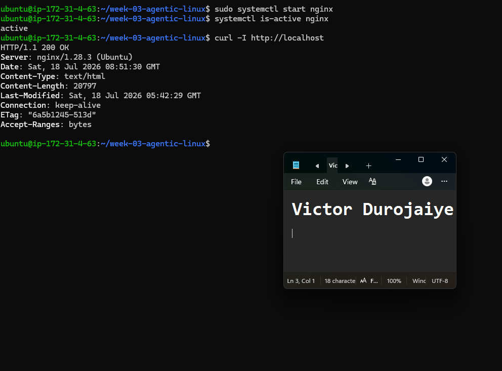

---

#### Screenshot 17 — Second `/linux-triage` output showing successful recovery with no FAIL results

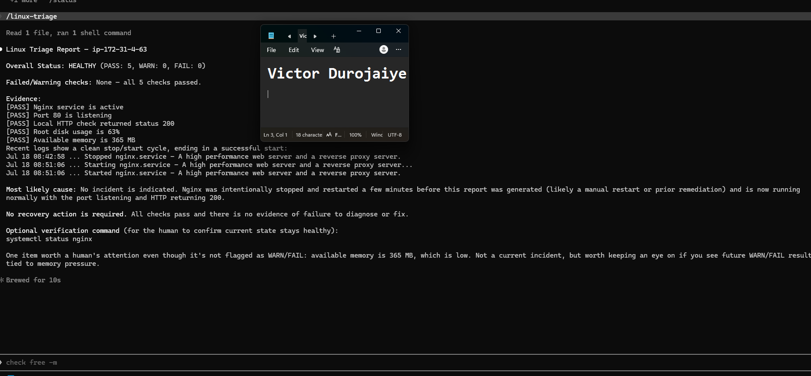

---

#### Screenshot 18 — Output of `ls -lah reports` showing both `incident-failure-report.txt` and `recovery-report.txt`

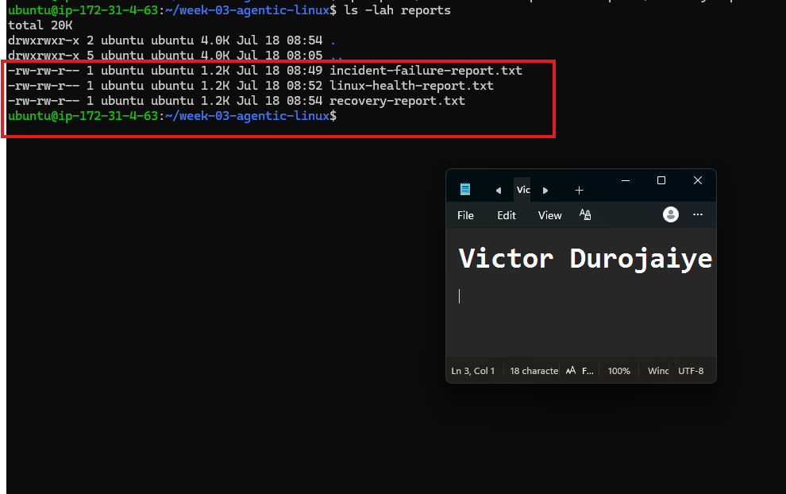

---

#### Screenshot 19 — `incident-summary.md` showing all required sections and your Full Name

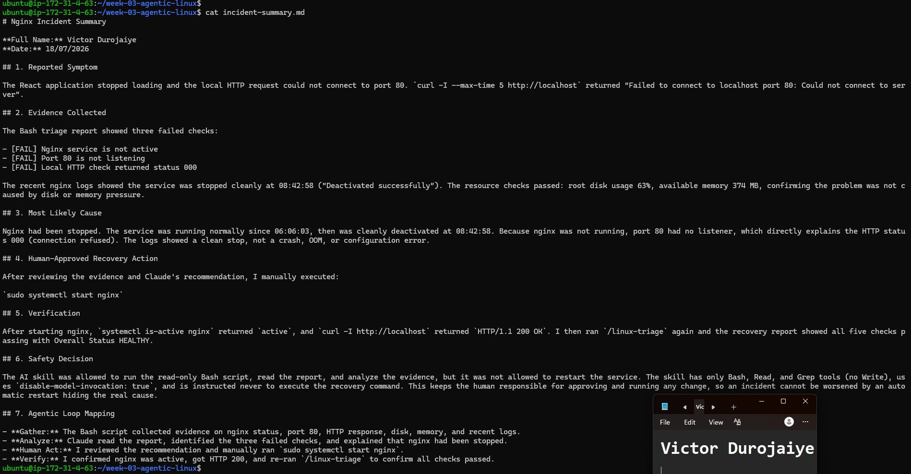

---

### Notes

Answer the following in your own words:

**1. What action did you execute manually?**

After reviewing the evidence and Claude's recommendation, I manually ran `sudo systemctl start nginx`, which started the Nginx service again.

---

**2. What evidence proves that the service recovered?**

`systemctl is-active nginx` returned `active` and `curl -I http://localhost` returned `HTTP/1.1 200 OK`. The second `/linux-triage` run also showed the service, port, and HTTP checks passing with an overall HEALTHY status.

---

**3. Why is the second triage run necessary?**

Starting Nginx by itself does not prove the whole application is healthy. The second triage run re-checks the service, port, HTTP response, disk, and memory to confirm the server actually returned to a healthy state.

---

**4. What could go wrong if an AI agent automatically restarted every failed service?**

A failed service might have a configuration problem, a resource issue, or a dependency failure. Automatically restarting it could hide the real cause, trigger a restart loop, or make the incident worse. The evidence should be reviewed by a human before any action is taken.

---

**5. In one sentence, explain the difference between using AI as a chatbot and using AI in this agentic workflow.**

A chatbot only answers my question, but in this agentic workflow Claude uses tools to gather and analyze real server evidence while I stay responsible for approving and performing the recovery action.

---

# Incident Summary

Fill in all seven sections below in your own words.

**Full Name:** Victor Durojaiye

**Date:** 18/07/2026

---

**1. Reported Symptom**

The React application stopped loading and the local HTTP request could not connect to port 80. `curl -I --max-time 5 http://localhost` returned "Failed to connect to localhost port 80: Could not connect to server".

---

**2. Evidence Collected**

The Bash triage report showed three failed checks:

- `[FAIL] Nginx service is not active`
- `[FAIL] Port 80 is not listening`
- `[FAIL] Local HTTP check returned status 000`

The recent Nginx logs showed the service was stopped cleanly at 08:42:58 ("Deactivated successfully"). The resource checks passed (root disk usage 63%, available memory 374 MB), which confirmed the problem was not caused by disk or memory pressure.

---

**3. Most Likely Cause**

Nginx had been stopped. The service was running normally since 06:06:03, then was cleanly deactivated at 08:42:58. Because Nginx was not running, port 80 had no listener, which directly explains the HTTP status 000 (connection refused). The logs showed a clean stop, not a crash, OOM, or configuration error.

---

**4. Human-Approved Recovery Action**

After reviewing the evidence and Claude's recommendation, I manually executed:

`sudo systemctl start nginx`

---

**5. Verification**

After starting Nginx, `systemctl is-active nginx` returned `active`, and `curl -I http://localhost` returned `HTTP/1.1 200 OK`. I then ran `/linux-triage` again and the recovery report showed all five checks passing with an overall status of HEALTHY.

---

**6. Safety Decision**

The AI skill was allowed to run the read-only Bash script, read the report, and analyze the evidence, but it was not allowed to restart the service. The skill has only Bash, Read, and Grep tools (no Write), uses `disable-model-invocation: true`, and is instructed never to execute the recovery command. This keeps the human accountable for approving and running any change, so an incident cannot be made worse by an automatic restart that hides the real cause.

---

**7. Agentic Loop Mapping**

- **Gather:** The Bash script collected evidence on Nginx status, port 80, the HTTP response, disk usage, available memory, and recent service logs.
- **Analyze:** Claude read the report, identified the three failed checks, and explained that Nginx had been stopped.
- **Human Act:** I reviewed Claude's recommendation and manually ran `sudo systemctl start nginx`.
- **Verify:** I confirmed Nginx was active, received HTTP 200 from the application, and re-ran `/linux-triage` to confirm all five checks passed.

---

# LinkedIn Post (Required)

## Evidence

#### LinkedIn Post URL

Paste your LinkedIn post URL here:

`https://www.linkedin.com/posts/victor-jaiye_completing-week-3-of-the-devops-micro-internship-share-7484170716788121601-btEl/`

---

#### Screenshot — Published LinkedIn post

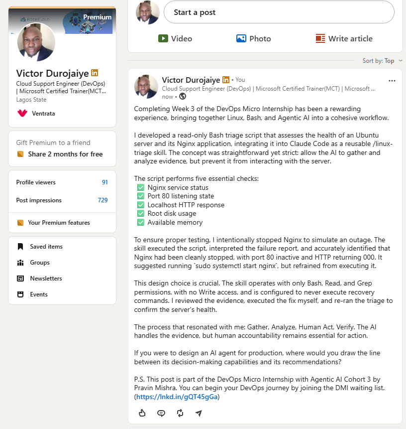

---

# GitHub Repository URL

Paste the URL of your GitHub folder or repository containing the assignment files here:

`https://github.com/Kingjaiyee/devops-micro-internship-pravinmishra`

---

# Submission Instructions

- Add all required screenshots in your submission
- Full Name must be visible in required screenshots and the Bash report
- All written answers must be in your own words
- Do not expose sensitive information (keys, passwords, AWS account IDs, tokens)
- GitHub URL must be included in this document

---

# Completion Checklist

- [x] Task 1: Healthy baseline confirmed, workspace created (Screenshots 1–2, Notes answered)
- [x] Task 2: CLAUDE.md created with all four sections (Screenshot 3, Notes answered)
- [x] Task 3: Five-check plan produced by Claude using read-only tools (Screenshot 4, Notes answered)
- [x] Task 4: `linux-triage.sh` created, syntax validated, executable permission set (Screenshots 5–8, Notes answered)
- [x] Task 5: Healthy-state report generated with no FAIL result (Screenshots 9–10, Notes answered)
- [x] Task 6: `/linux-triage` skill created and run successfully on healthy server (Screenshots 11–12, Notes answered)
- [x] Task 7: Nginx incident simulated, failed evidence captured, Claude did not execute recovery (Screenshots 13–15, Notes answered)
- [x] Task 8: Nginx recovered manually, recovery verified, reports saved, incident summary complete (Screenshots 16–19, Notes answered)
- [x] Incident summary contains all seven required sections
- [x] LinkedIn post published and URL submitted
- [x] Full Name visible in all required screenshots and the Bash report
- [x] Skill does not have Write permission
- [x] Skill did not execute any recovery commands
- [x] No sensitive data exposed

---

## 📌 About DMI & CloudAdvisory

DevOps Micro Internship (DMI) is a project-based DevOps program run by Pravin Mishra (The CloudAdvisory) focused on real-world execution, systems thinking, and career readiness.

It helps learners build strong DevOps foundations with hands-on experience.

---

## 📌 Resources

- 🌐 DMI Official Website: https://pravinmishra.com/dmi  
- 🎓 DevOps for Beginners (Udemy): https://www.udemy.com/course/devops-for-beginners-docker-k8s-cloud-cicd-4-projects/  
- 🎓 Agentic AI DevOps with Claude Code: https://www.udemy.com/course/ultimate-agentic-ai-devops-with-claude-code/  
- 🎓 DevOps with Claude Code: Terraform, EKS, ArgoCD & Helm: https://www.udemy.com/course/devops-with-claude-code-terraform-eks-argocd-helm/  
- ▶️ YouTube Playlist: https://www.youtube.com/playlist?list=PLFeSNDtI4Cho  
- 🔗 Pravin Mishra (LinkedIn): https://www.linkedin.com/in/pravin-mishra-aws-trainer/  
- 🏢 CloudAdvisory (LinkedIn): https://www.linkedin.com/company/thecloudadvisory/

---

*This submission is part of DevOps Micro Internship (DMI) Cohort 3 — Agentic AI Track.*
