# Assignment 2 — CodeTrack: Tracking, Staging, Committing + Deploy to EC2

Part of the DevOps Micro Internship (DMI) Cohort 3 with Agentic AI

**Student Name:** Victor Durojaiye
**Group Name:** Group 2

---

## Purpose

In this assignment, you will track and stage project files, create two meaningful Git commits in `CodeTrack`, verify your commit history, and deploy the CodeTrack static website to an EC2 instance using Nginx. This connects local version-control practice with a basic manual deployment workflow used in real DevOps environments.

---

# Task 1 — Verify Git Setup and Enter the Repository

## Goal

Confirm that Git works and that you are inside the correct `CodeTrack` repository.

I moved into the `CodeTrack` repository created in Assignment 1 and confirmed the location with `pwd`, which returned `/c/Users/victo/CodeTrack`. Running `git status` returned a normal status message with no "not a git repository" error, confirming the folder is a valid Git repository. The output showed the branch as `master` with no commits yet, which is the expected clean starting state for this assignment.

### Evidence

#### Screenshot 1 — Output of `pwd` showing you're inside `CodeTrack`

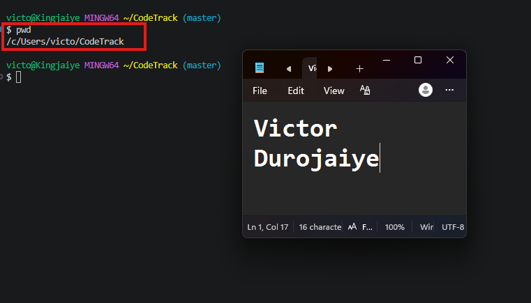

---

#### Screenshot 2 — Output of `git status` showing no "not a git repository" error

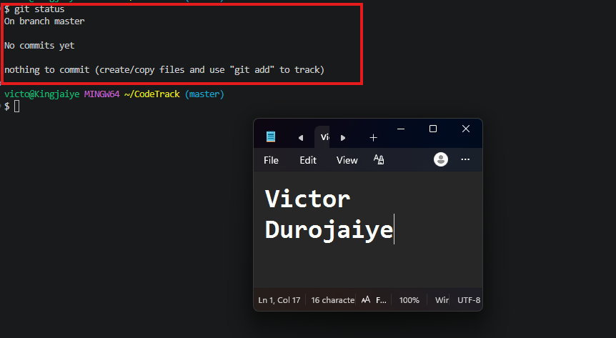

---

# Task 2 — Create index.html and style.css

## Goal

Create the two starter UI files inside `CodeTrack`.

I created both files in a single command with `touch index.html style.css`, then confirmed they existed on disk with `ls`. The listing returned `index.html  style.css`, showing both files were created successfully in the repository root.

### Evidence

#### Screenshot 3 — Output of `ls` showing `index.html` and `style.css`

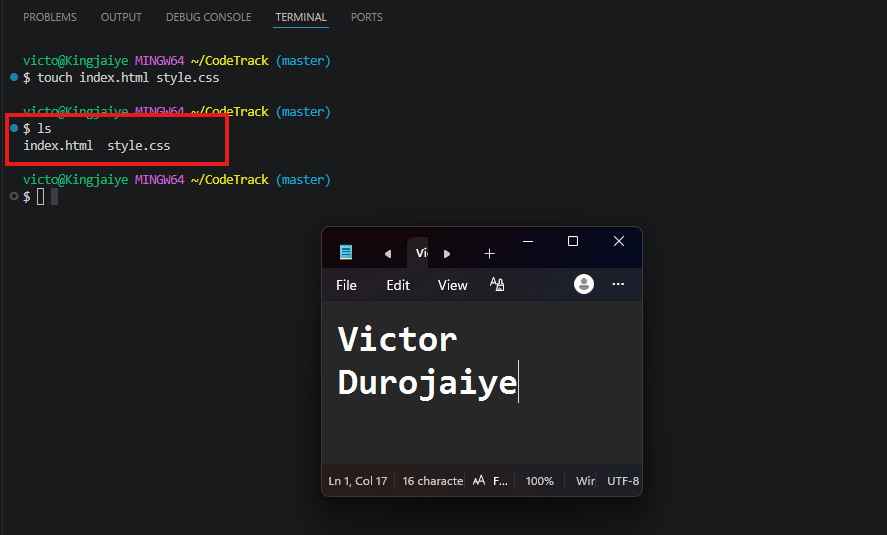

---

# Task 3 — Add Starter Content

## Goal

Copy the provided starter HTML and CSS content into your local `index.html` and `style.css` files.

I opened the starter repository at `https://github.com/pravinmishraaws/dmi-codetrack-starter-assignment`, copied the contents of its `index.html` and `style.css` using the Raw view, and pasted each into the matching local file. The page title confirmed the correct source: `CodeTrack – Starter UI (DMI Week 4)`.

I deliberately left the `[Your Name]` and `[Your Group]` placeholders untouched at this stage. The starter file contains a `TASK 6 — EDIT ME` comment instructing that those values be replaced later, so keeping them in place here means the first commit captures the unmodified scaffold and the second commit captures only my content change.

### Evidence

#### Screenshot 4 — Your editor showing the contents of `index.html` and `style.css`

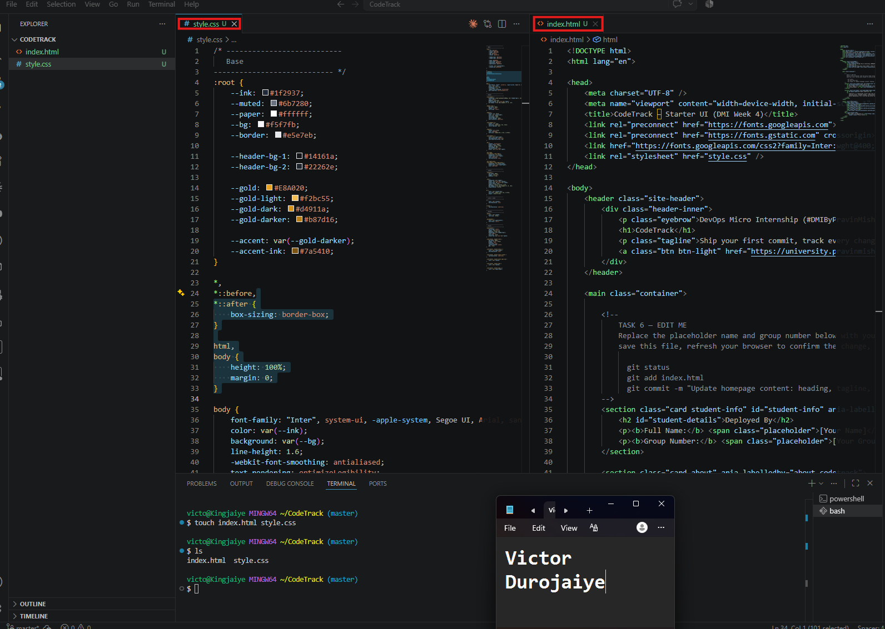

---

# Task 4 — Track and Stage Files Correctly

## Goal

Confirm both files show as untracked, then stage them individually with `git add`.

Running `git status` first showed both `index.html` and `style.css` under "Untracked files", since the files existed on disk but Git had not been told to track them yet.

I then staged them individually with `git add index.html` and `git add style.css` rather than bulk-staging with `git add .`. Staging file by file is the more deliberate approach and makes it explicit exactly what is going into the commit. A second `git status` confirmed both files had moved into "Changes to be committed", each listed as `new file:`.

### Evidence

#### Screenshot 5 — Output of `git status` showing both files as untracked

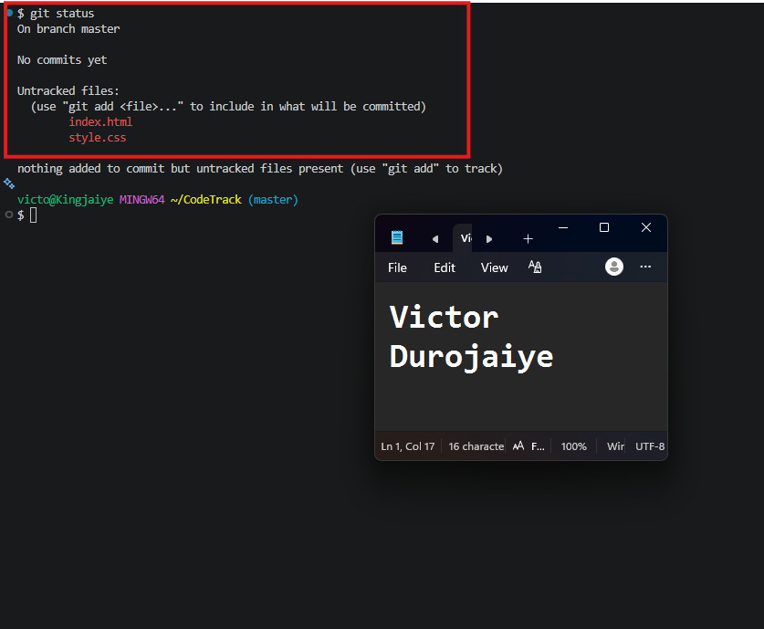

---

#### Screenshot 6 — Output of `git status` showing both files staged under "Changes to be committed"

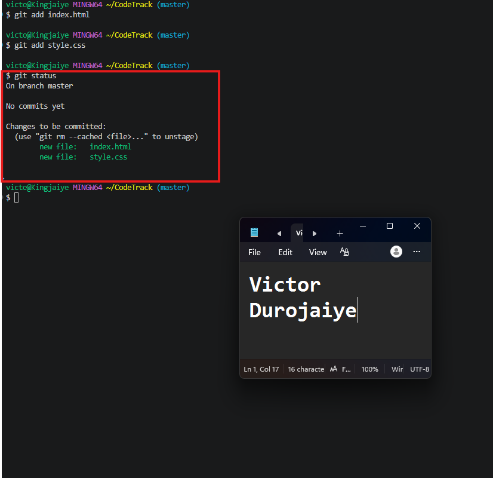

---

# Task 5 — Create the First Commit (Clean Initial Commit)

## Goal

Commit the staged starter files using the message `Initial UI scaffold: add index.html and style.css`, then check the log.

I committed the staged files with:

```
git commit -m "Initial UI scaffold: add index.html and style.css"
```

Because this repository had no prior commits, this became the root commit of the project history. Verifying with `git log --oneline` returned a single entry:

```
7c228e1 (HEAD -> master) Initial UI scaffold: add index.html and style.css
```

The commit hash is `7c228e1` and `HEAD -> master` confirms the branch pointer moved to this new commit.

### Evidence

#### Screenshot 7 — Output of `git commit`

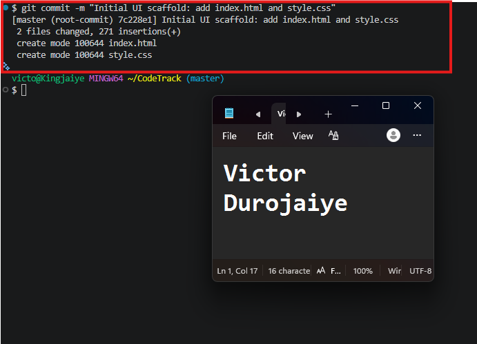

---

#### Screenshot 8 — Output of `git log --oneline` showing the first commit

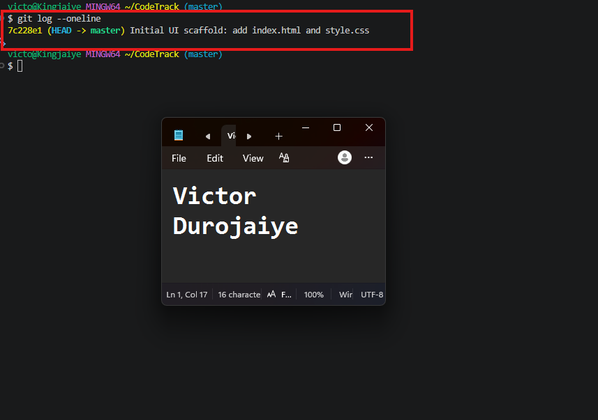

---

# Task 6 — Modify index.html and Create a Second Commit

## Goal

Follow the instruction comment inside `index.html` to update the Student Name and Group Name, then commit that change separately using the message `Update homepage content: heading, tagline, CTA button`.

Following the `TASK 6 — EDIT ME` comment inside `index.html`, I replaced the two placeholders in the "Deployed By" section:

- `[Your Name]` became `Victor Durojaiye`
- `[Your Group]` became `Group 2`

I saved the file and opened it in the browser to confirm the rendered page showed both values correctly.

`git status` then reported `index.html` as modified under "Changes not staged for commit". This is different from Task 4, where the files were untracked. Git had already seen `index.html` in the first commit, so it now reports a content change rather than a new file.

I staged only `index.html`, deliberately leaving `style.css` out because it was not touched. This keeps the commit scoped to exactly what changed. I then committed with:

```
git commit -m "Update homepage content: heading, tagline, CTA button"
```

`git log --oneline` confirmed two commits in history:

```
741959f (HEAD -> master) Update homepage content: heading, tagline, CTA button
7c228e1 Initial UI scaffold: add index.html and style.css
```

`HEAD -> master` has moved forward to the newer commit `741959f`, while the original scaffold commit `7c228e1` remains below it in history. Splitting the work this way means the content change could be reverted later without disturbing the original scaffold commit.

### Evidence

#### Screenshot 9 — Browser showing the updated page with your Student Name and Group Name visible

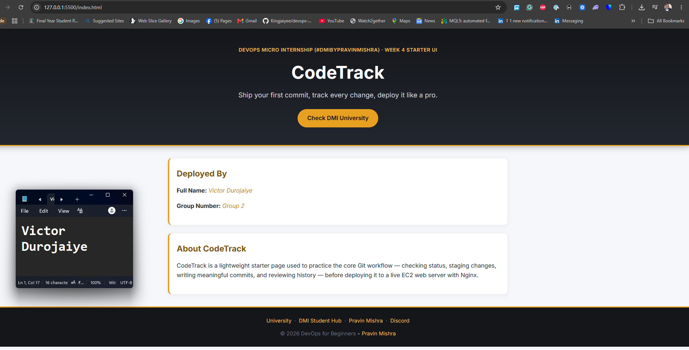

---

#### Screenshot 10 — Output of `git status` showing `index.html` as modified

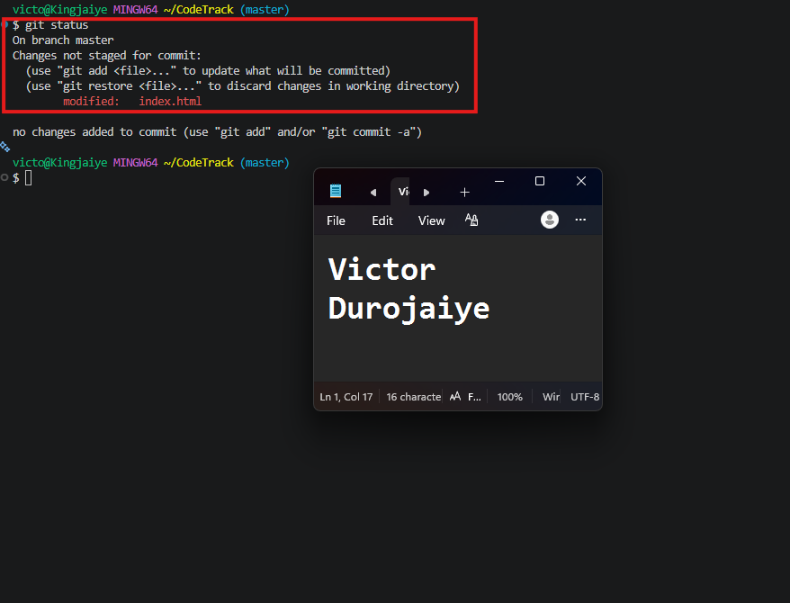

---

#### Screenshot 11 — Output of `git commit`

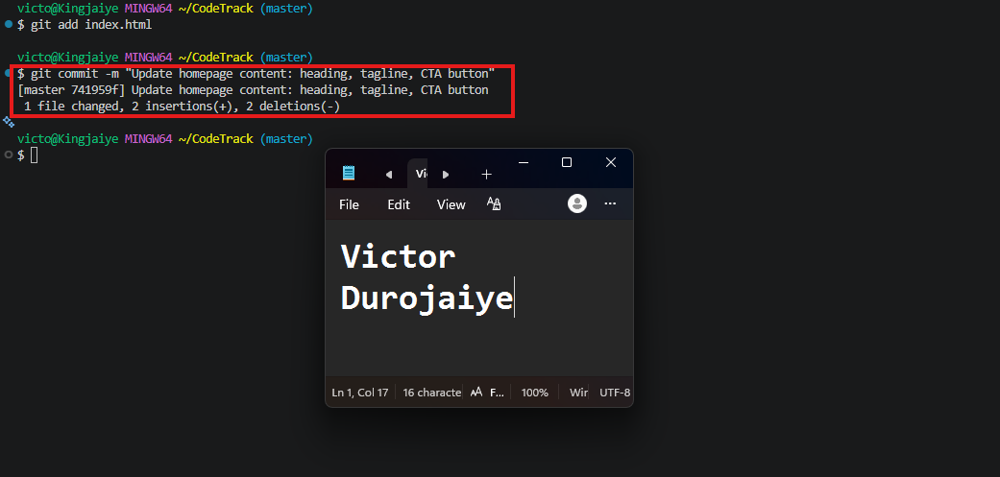

---

#### Screenshot 12 — Output of `git log --oneline` showing two commits

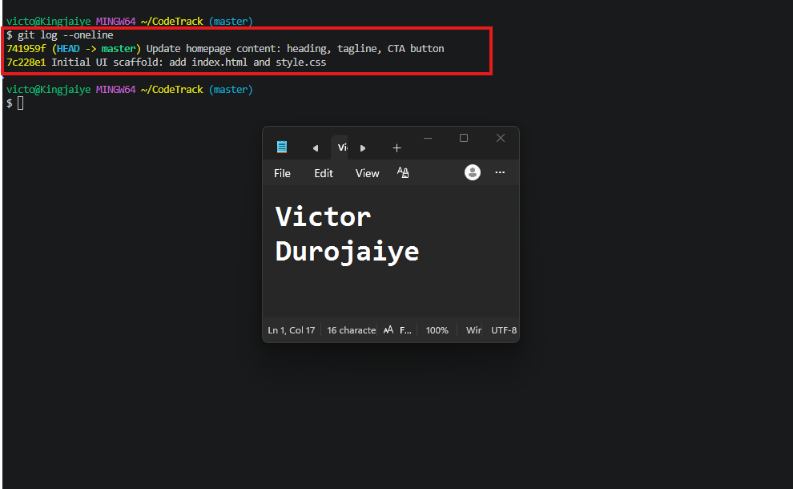

---

# Task 7 — Deploy to EC2 with Nginx (Static Website)

## Goal

Install and start Nginx on your EC2 instance, then copy `index.html` and `style.css` into the Nginx web root.

**Step 0 — Launch a fresh EC2 instance**

My previous EC2 instance had been terminated, so I launched a new Ubuntu instance for this deployment. The security group was configured with two inbound rules: SSH on port 22 and HTTP on port 80, which are the minimum required to connect to the server and serve the site publicly.

**Step A — Connect over SSH**

I connected from Git Bash on my local machine using the key pair selected at launch, referencing the private key by its path with the `-i` flag.

**Step B — Install and verify Nginx**

I refreshed the package index with `sudo apt update`, then installed Nginx with `sudo apt install nginx -y`. On Ubuntu, Nginx starts automatically once installed.

`sudo systemctl status nginx --no-pager` returned `Active: active (running)`, with the service loaded and enabled on boot. I then validated the configuration with `sudo nginx -t`, which returned:

```
nginx: the configuration file /etc/nginx/nginx.conf syntax is ok
nginx: configuration file /etc/nginx/nginx.conf test is successful
```

**Step C — Copy the site files to EC2**

I transferred `index.html` and `style.css` from my local machine to the EC2 instance using `scp` over the same key-based authentication used for SSH.

I initially ran `scp -r` on the whole `CodeTrack` folder and saw it begin copying the entire `.git` directory, including Git objects and hook samples. I stopped and copied only the two files the deployment actually needs. Serving a `.git` directory from a web root is unnecessary and would expose the full repository history publicly, so copying only the required files is the safer approach.

**Step D — Move files into the Nginx web root**

On the EC2 instance I cleared the default Nginx landing page, copied the site files into `/var/www/html/`, and corrected ownership and permissions:

```
sudo rm -rf /var/www/html/*
sudo cp index.html style.css /var/www/html/
sudo chown -R www-data:www-data /var/www/html
sudo chmod -R 755 /var/www/html
```

The `chown` step matters because files copied with `sudo` take the ownership of the user running the copy rather than inheriting the destination folder's ownership. Skipping it can cause Nginx to fail with permission errors even when the directory was previously configured correctly.

I re-validated the config and restarted the service, then confirmed `/var/www/html/` contained only `index.html` and `style.css`.

**Step E — Validate**

`curl -I http://localhost` on the server returned:

```
HTTP/1.1 200 OK
Server: nginx/1.28.3 (Ubuntu)
Content-Type: text/html
Content-Length: 3331
```

The `200 OK` confirms Nginx is serving successfully, and the content length confirms it is serving the CodeTrack page rather than the default Nginx welcome page.

Finally I loaded the site in my browser at the instance's public IP address and confirmed the fully styled CodeTrack page rendered, with my Full Name and Group Number both visible.

### Evidence

#### Screenshot 13 — Output of `systemctl status nginx --no-pager` showing Nginx `active (running)`

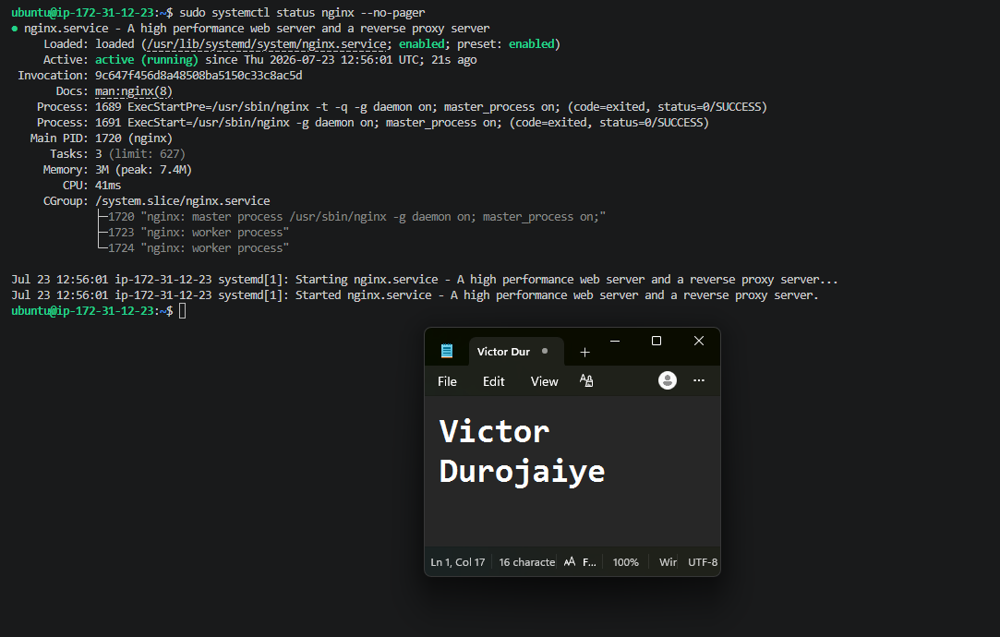

---

#### Screenshot 14 — Output of `curl -I http://localhost` showing `HTTP/1.1 200 OK`

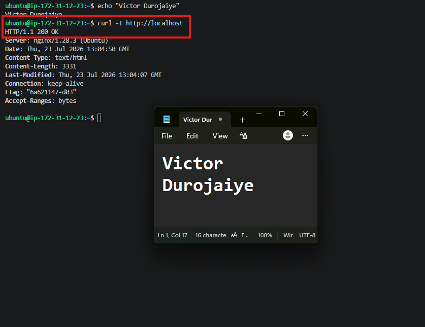

---

#### Screenshot 15 — Browser showing the CodeTrack site loaded at `http://<EC2_PUBLIC_IP>`, with your Full Name and Group Name visible

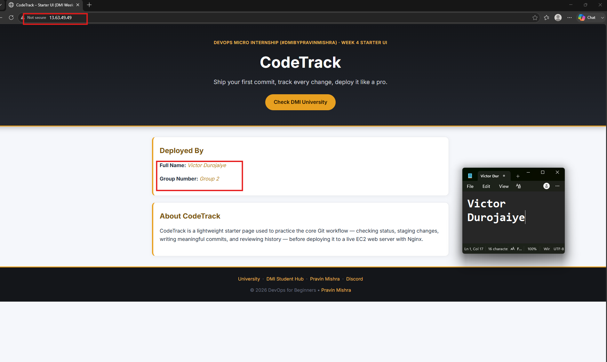

---

# LinkedIn Post (Required)

## Evidence

#### LinkedIn Post URL

Paste your LinkedIn post URL here:

`https://www.linkedin.com/posts/victor-jaiye_devops-git-nginx-share-7486160892938719232-ONBT/?utm_source=share&utm_medium=member_desktop&rcm=ACoAABkZOQEB3T6FCcu0A1jCAOaZB5ag2lTqKeE`

---

#### Screenshot — LinkedIn post showing the deployed CodeTrack application

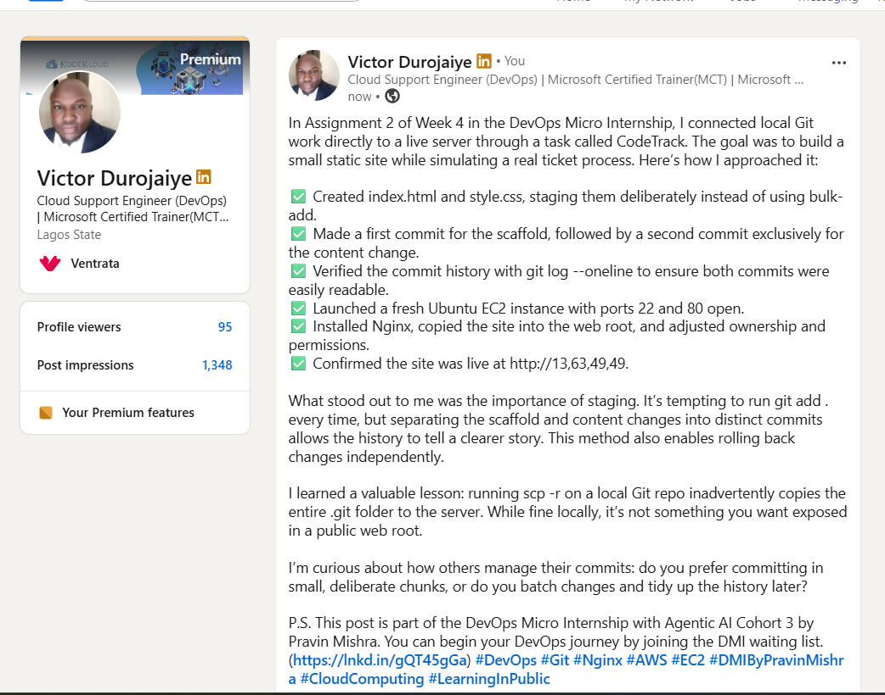

---

# Submission Instructions

- Add all required screenshots in your submission
- Full Name and Group Name must be visible in the deployed application evidence
- `git log --oneline` output must show at least two meaningful commits
- Do not expose AWS access keys, passwords, private key contents, or other sensitive information

---

# Completion Checklist

- [x] `CodeTrack` repository verified with `git status` (Screenshots 1–2)
- [x] `index.html` and `style.css` created and populated (Screenshots 3–4)
- [x] Starter files staged and committed in the first commit (Screenshots 5–8)
- [x] Student Name and Group Name updated in `index.html` (Screenshot 9)
- [x] Second controlled commit created (Screenshots 10–12)
- [x] Nginx active on the EC2 instance and CodeTrack reachable via its public IP (Screenshots 13–15)
- [x] LinkedIn post published and URL submitted
- [x] No sensitive data exposed

---

## 📌 About DMI & CloudAdvisory

DevOps Micro Internship (DMI) is a project-based DevOps program run by Pravin Mishra (The CloudAdvisory) focused on real-world execution, systems thinking, and career readiness.

It helps learners build strong DevOps foundations with hands-on experience.

---

## 📌 Resources

- 🌐 DMI Official Website: https://pravinmishra.com/dmi  
- 🎓 DevOps for Beginners (Udemy): https://www.udemy.com/course/devops-for-beginners-docker-k8s-cloud-cicd-4-projects/  
- 🎓 Agentic AI DevOps with Claude Code: https://www.udemy.com/course/ultimate-agentic-ai-devops-with-claude-code/  
- 🎓 DevOps with Claude Code: Terraform, EKS, ArgoCD & Helm: https://www.udemy.com/course/devops-with-claude-code-terraform-eks-argocd-helm/  
- ▶️ YouTube Playlist: https://www.youtube.com/playlist?list=PLFeSNDtI4Cho  
- 🔗 Pravin Mishra (LinkedIn): https://www.linkedin.com/in/pravin-mishra-aws-trainer/  
- 🏢 CloudAdvisory (LinkedIn): https://www.linkedin.com/company/thecloudadvisory/

---

*This submission is part of DevOps Micro Internship (DMI) Cohort 3 — Agentic AI Track.*
