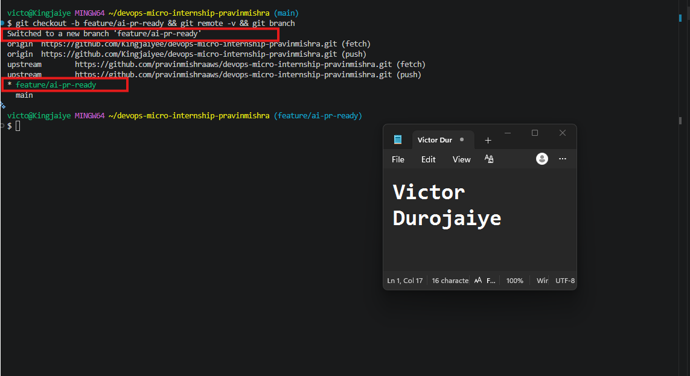
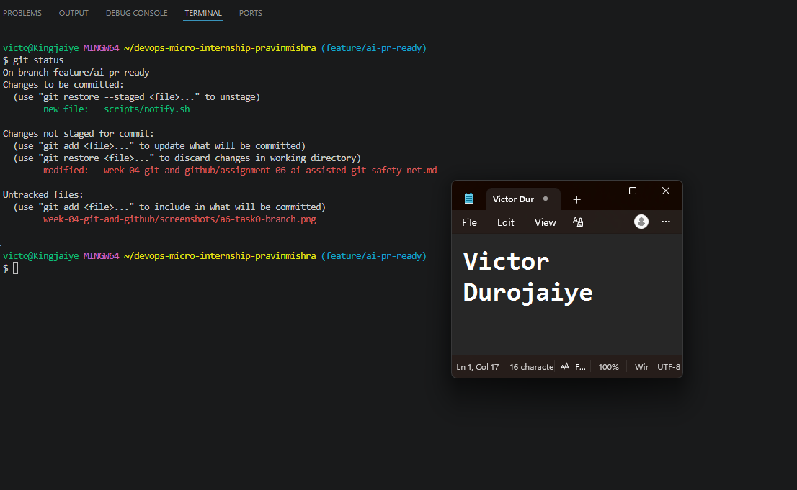
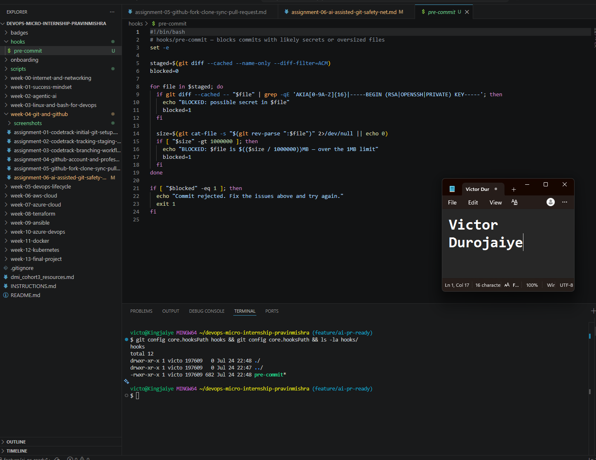
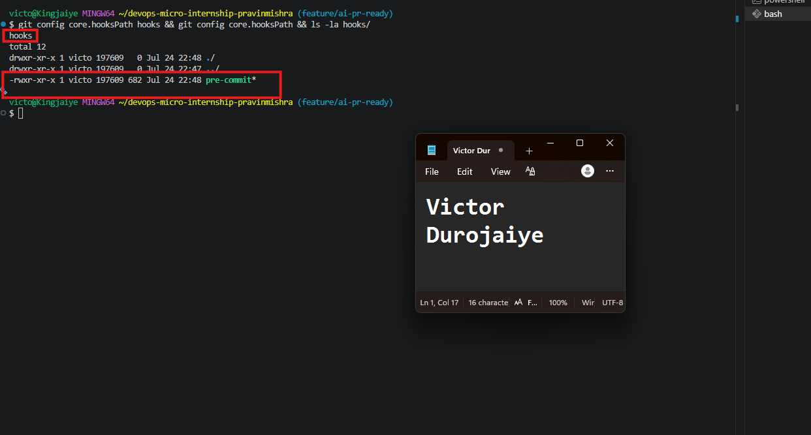
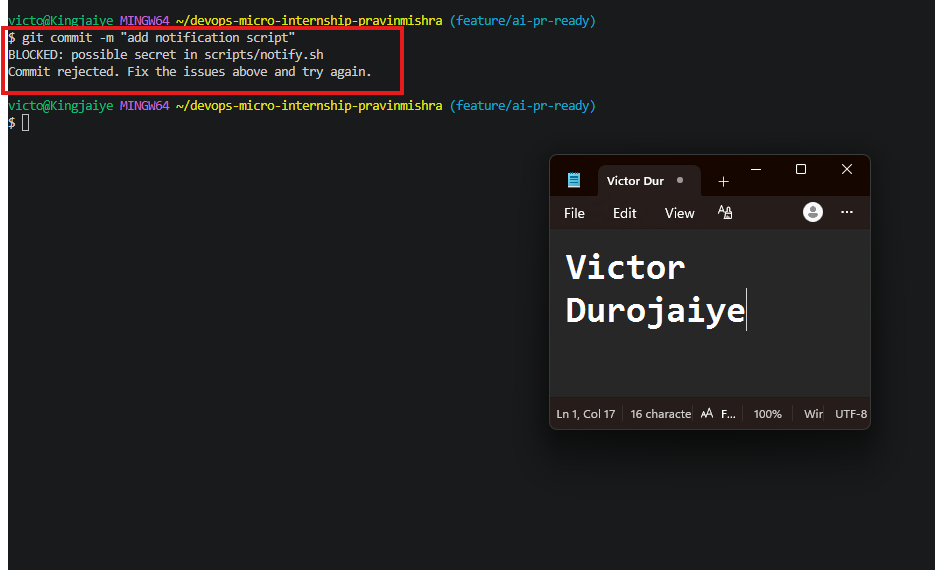
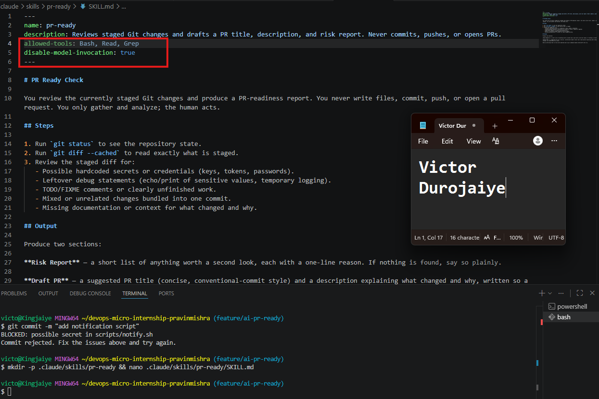
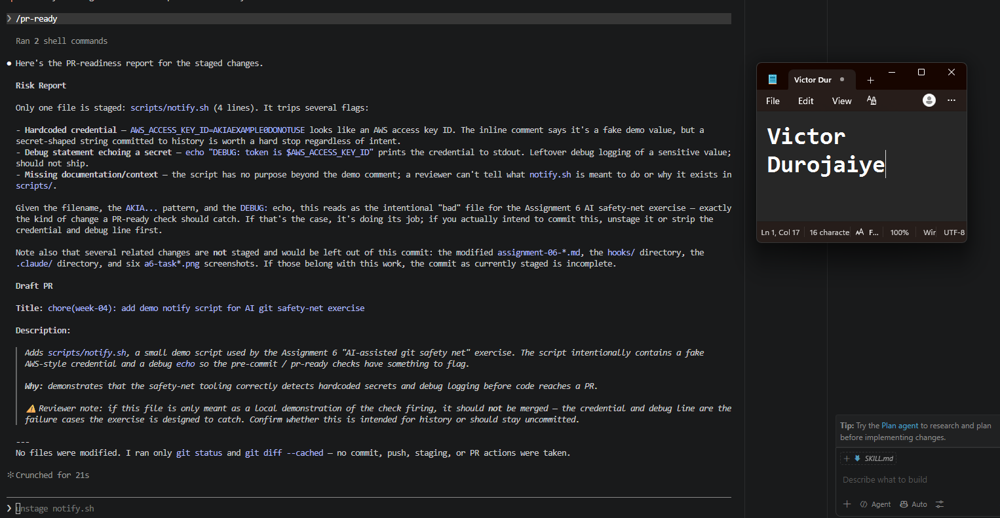
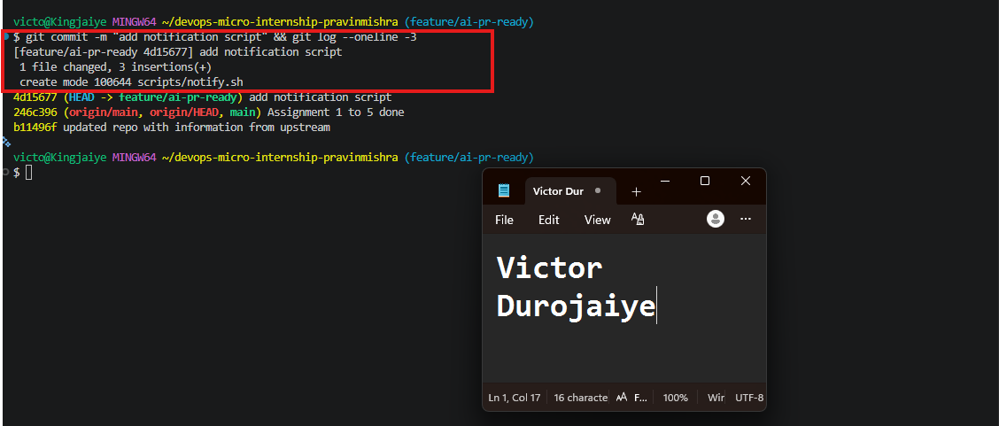
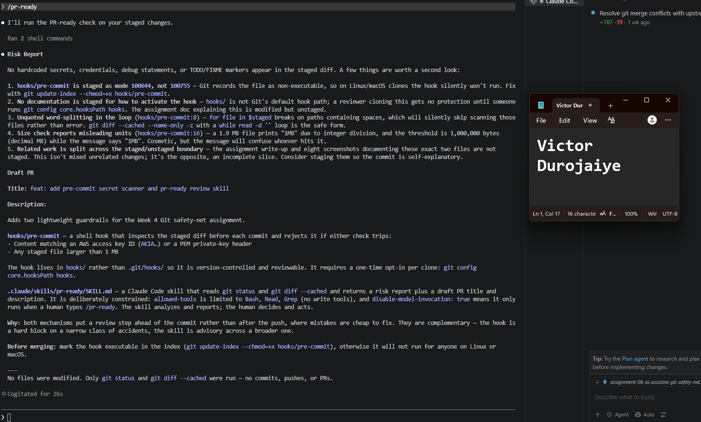
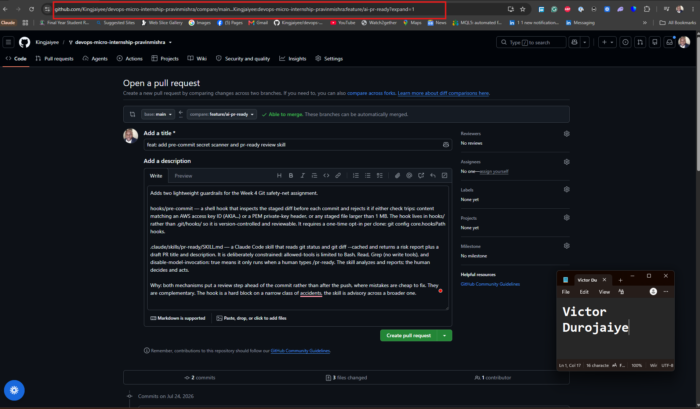

# Assignment 6 — Building an AI-Assisted Git Safety Net (PR Ready Check)

Part of the DevOps Micro Internship (DMI) Cohort 3 with Agentic AI

---

## Purpose

In Week 2 you built Claude Code hooks that block a dangerous action *before* it happens (`PreToolUse`), and a restricted skill that could look but not touch (`allowed-tools` without `Write`). In this assignment you will discover that Git has the exact same idea, decades older: a **pre-commit hook** that blocks a commit before it's created.

You will build both halves of a real "PR Ready" workflow:

1. A **Git hook that follows fixed rules** — scans staged changes for hardcoded secrets and oversized files and refuses the commit. No AI involved, no guessing, just a rule that gives the same answer every time.
2. A **restricted Claude Code skill** (`/pr-ready`) that reads your staged diff and drafts a Pull Request title, description, and a short list of things worth a second look — the kind of judgment a fixed rule can't make (mixed changes, missing context, unclear intent). The skill never commits, pushes, or opens the PR. You do that yourself, using its draft as a starting point.

This mirrors the Agentic Loop from Week 3's Linux triage assignment: **Gather → Analyze → Human Act → Verify**. The hook and the skill both gather and analyze; only you act.

---

# Task 0 — Confirm Your Fork and Create a Feature Branch

## Goal

Confirm you are working in your own fork, then create a dedicated branch for this assignment.

### Evidence

#### Screenshot 1 — Output of git remote -v and git branch showing the new branch

---

### Notes

**1. Why create a dedicated branch instead of doing this work on main?**

Working on a dedicated branch keeps this assignment's changes isolated from main, which stays the stable, known-good version of the repo. If something in the hook or skill work goes wrong, main is untouched. It also produces a clean Pull Request that contains only this assignment's commits, so a reviewer sees exactly the intended change and nothing else. This is the same isolation principle behind any feature-branch workflow: you develop and test in a sandbox, then propose the result through a PR rather than editing the mainline directly.

---

# Task 1 — Stage a Change With Realistic Risk

## Goal

On your own fork of this repository (the one you've been submitting your DMI work in since onboarding), create a new branch and stage a change that a real reviewer should catch: a hardcoded-looking secret and a leftover debug statement.

### Evidence

#### Screenshot 1 — Output of  `git status` showing the staged file on feature/ai-pr-ready

---

### Notes

**1. Why does this assignment use an obviously fake key instead of a real one?**

A real credential committed to Git is permanently recoverable from the repo history even after you delete it, so using one here, in a public fork tied to my name, would be a genuine security exposure. The point of the exercise is to trigger the detection tools, not to leak anything. A clearly fake key (AKIAEXAMPLE0DONOTUSE) still matches the hook's pattern and still trips the checks, which is all the demo needs, while the EXAMPLE and DONOTUSE markers make it unmistakable to any human reader that nothing real is at risk. It also means that if an automated secret scanner does flag it, no one has to treat it as a live incident.

---

# Task 2 — Write a Real Git Pre-Commit Hook

## Goal

Create a tracked, shareable pre-commit hook that blocks a commit containing secret-like patterns or files over 1MB.

### Evidence

#### Screenshot 2 — `hooks/pre-commit` open in VS Code showing the full script

---

#### Screenshot 3 — Output of `git config core.hooksPath` confirming it points to `hooks`

---

### Notes

**1. Why is `hooks/pre-commit` tracked in the repo instead of living only in `.git/hooks/`?**

The .git/hooks/ directory is local-only and never gets pushed, so a hook living there protects just my machine and vanishes the moment someone else clones the repo. By keeping the hook as a tracked file under hooks/ and pointing core.hooksPath at that folder, the hook travels with the repo. Anyone who clones it gets the same check, and the script's history is versioned like any other file. It turns a personal, easily-forgotten safeguard into a shared team standard.

---

**2. Compare this to `PreToolUse` from Week 2 Assignment 6. What does each one intercept, and what do they have in common?**

A PreToolUse hook intercepts a Claude Code tool call before the tool runs, letting you inspect or block an action the agent is about to take. The Git pre-commit hook intercepts a commit before Git records it, scanning the staged changes and aborting if something looks wrong. Different systems, but the same idea: both are gates that fire before a state-changing action completes, and both can veto that action by returning a non-zero/deny result rather than cleaning up after the fact. The pre-commit hook is just the decades-old Git version of the same "check before you act" pattern.

---

# Task 3 — Prove the Hook Blocks the Risky Commit

## Goal

Attempt to commit the staged file from Task 1 and show the hook rejecting it.

### Evidence

#### Screenshot 4 — Terminal showing `git commit` rejected with the hook's "BLOCKED" message naming the exact file

---

### Notes

**1. Which line in `hooks/pre-commit` matched your fake key, and why did it match?**

The match came from the secret-detection check, specifically the AKIA[0-9A-Z]{16} half of the grep pattern. My staged line contained AKIAEXAMPLE0DONOTUSE, which is the literal AKIA prefix followed by exactly 16 uppercase-alphanumeric characters, the exact shape of an AWS access key ID. The hook runs git diff --cached on the file and pipes it to grep -qE, so as soon as that pattern appeared in the staged diff, grep succeeded, the script printed the BLOCKED line, set blocked=1, and exited non-zero, which told Git to abort the commit.

---

**2. Could this hook have caught a poorly-named variable that stores a secret without the `AKIA` prefix? What does that tell you about the limits of a fixed rule like this?**

No. The hook only knows the patterns it was explicitly given, AWS-style AKIA... keys and PEM private-key headers. A secret stored in a plainly-named variable like db_password = "hunter2", or an API token that doesn't follow the AWS format, would sail straight through because nothing in it matches the regex. That's the core limitation of a fixed-rule check: it's fast and perfectly consistent, but it can only catch the specific things it was programmed to recognize. It has no understanding of what the code means, so a secret that doesn't fit a known shape is invisible to it. That gap is exactly why the /pr-ready skill exists, to bring judgment where the rule is blind.

---

# Task 4 — Build the `/pr-ready` Skill

## Goal

Create a manually invoked Claude Code skill that reads your staged changes and produces a PR-readiness report and a draft PR description — without writing, committing, or pushing anything itself.

### Evidence

#### Screenshot 5 — `SKILL.md` frontmatter showing `allowed-tools: Bash, Read, Grep` (no `Write`) and `disable-model-invocation: true`

---

#### Screenshot 6 — `/pr-ready` output while the risky file is still staged, showing it flagged the secret and/or debug statement

---

### Notes

**1. Why does `/pr-ready` have `Bash` and `Read` but not `Write`?**

The skill's whole job is to look, not touch. It needs Bash to run git status and git diff --cached, and Read to inspect file contents, that's the "gather and analyze" half of the loop. Leaving Write out is deliberate: it guarantees the skill physically cannot edit a file, stage anything, commit, or push, no matter what it decides. The judgment stays advisory. A human reads the risk report and chooses what to do. Removing Write is the same restricted-capability idea as a look-but-don't-touch skill from Week 2: you scope the tool to exactly what the task requires and nothing that changes state.

---

**2. The pre-commit hook and `/pr-ready` both looked at the same staged diff. Did they flag the same things? What did one catch that the other didn't?**

They overlapped on the hardcoded key but diverged everywhere else. The pre-commit hook caught only the AWS-style credential, because that's the single pattern its regex matches, and it responded by blocking, with no explanation of why. /pr-ready caught that same key but also flagged the debug echo as leaking the value to stdout, the complete lack of documentation for what the script is even for, and the fact that the staged commit was incomplete (the hooks and skill files weren't included). It also explained the reasoning behind each flag and drafted a PR title and description. So the hook is a fast, blunt gate on known-bad patterns; the skill reads the change like a reviewer and surfaces context problems a fixed rule is blind to. Neither replaces the other.

---

# Task 5 — Fix the Issues and Re-Verify

## Goal

Remove the secret and debug statement, then prove both gates now pass clean.

### Evidence

#### Screenshot 7 — `git commit` succeeding after the fix (no BLOCKED message)

---

#### Screenshot 8 — Second `/pr-ready` run showing a clean risk report and a drafted PR title + description

---

### Notes

**1. What exactly did you change to satisfy the pre-commit hook?**

I edited scripts/notify.sh to remove the two things the hook and the review flagged: the hardcoded AWS_ACCESS_KEY_ID=AKIAEXAMPLE0DONOTUSE line and the echo "DEBUG: token is $AWS_ACCESS_KEY_ID" debug statement. I replaced them with a plain placeholder comment and a harmless echo "Notification script running". With the AKIA-shaped string gone, there was nothing left for the hook's secret regex to match, so re-staging and committing went through with no BLOCKED message.

---

# Task 6 — Push and Open a Pull Request Using the AI Draft

## Goal

Push your branch and open a real Pull Request, using `/pr-ready`'s drafted title and description as your starting point — read it critically and edit before you use it.

**Important:** Open this Pull Request with base repository set to **your own fork** — not the shared upstream `pravinmishraaws/devops-micro-internship-pravinmishra` repository. This assignment's hook and skill files are your own practice work, not a change meant for the shared class repo.

### Evidence

#### Screenshot 9 — Your Pull Request showing the base repository is your own fork, plus the title and description, with the `/pr-ready` draft visible for comparison (paste it in the PR conversation or your notes below)

---

#### PR Link

`https://github.com/Kingjaiyee/devops-micro-internship-pravinmishra/pull/1`

---

### Notes

**1. What, if anything, did you edit in the AI's drafted PR description before using it? Why?**

I removed the AI's closing line that said "before merging, mark the hook executable with git update-index --chmod=+x." That instruction was accurate when the skill wrote it, my hook was staged as mode 100644, but I acted on it immediately and re-staged the hook as 100755 before opening the PR. So by the time I created the PR, the executable bit was already fixed and leaving that line in would have described a problem that no longer existed and told a reviewer to redo work that was done. I kept the rest of the draft largely intact because it accurately described both files.

---

**2. If you had blindly copy-pasted the AI's draft without reading it, what could go wrong?**

The description would have shipped with a "before merging, do X" instruction for something already handled, which is confusing and makes the PR look unfinished or the author look like they didn't understand their own change. More broadly, an AI draft can restate assumptions that were true at the moment it ran but have since changed, or it can describe intent slightly wrong. If I paste without reading, those inaccuracies become the official record a reviewer trusts. The draft is a starting point that saves typing; it still needs a human who knows the current state to verify every claim in it.

---

**3. Why does this PR need to target your own fork instead of the shared upstream repository?**

These files, the pre-commit hook and the pr-ready skill, are my own practice work for the assignment, not a change meant to become part of the shared class repository that everyone uses. Opening the PR against upstream would be proposing my personal exercise artifacts for merge into pravinmishraaws's project, which isn't the intent. Targeting my own fork's main keeps the whole exercise self-contained: I still practice the full push-and-PR workflow, but the "destination" is my own repo, where these demonstration files belong.

---

# Task 7 — Map the Workflow to the Agentic Loop

## Goal

Explain this assignment's workflow using the same Gather → Analyze → Human Act → Verify structure from Week 3.

### Notes

**1. Which step(s) represent Gather?**

Gathering is where information about the change is collected without judging it yet. That's git status and git diff --cached, run both by the pre-commit hook (which reads the staged diff) and by the /pr-ready skill (which reads status and the cached diff). Both tools pull in the raw facts of what's about to be committed.

---

**2. Which step(s) represent Analyze?**

Analyze is where the gathered changes get evaluated. Two things do this in parallel: the pre-commit hook applies its fixed regex rules to decide if the diff contains a secret or an oversized file, and the /pr-ready skill reads the same diff like a reviewer and reasons about secrets, debug statements, missing documentation, and whether the commit is complete. The hook analyzes against known patterns; the skill analyzes with judgment.

---

**3. Which step is Human Act, and why must a human — not Claude — run `git commit`, `git push`, and open the PR?**

Human Act is me editing the file to remove the secret and debug line, fixing the hook's executable bit, running git commit and git push, and opening the pull request. These are the only steps that change real state, my files, my repo history, and GitHub. A human has to run them because they carry consequences that need judgment and accountability: deciding a fix is actually correct, deciding the change is ready, and taking responsibility for what lands in a shared system. That's exactly why neither the hook nor the skill was given write or push ability, they gather and analyze, but the decision to act stays with a person.

---

**4. Which step is Verify?**

Verify is re-running the checks after the fix to confirm the issues are actually resolved: committing again and watching the pre-commit hook pass with no BLOCKED message, and running /pr-ready a second time to confirm a clean risk report. It closes the loop by proving the human action worked rather than assuming it did.

---

**5. In one or two sentences: why do you need *both* the fixed-rule pre-commit hook and the AI skill? Isn't one enough?**

No single one covers the gap. The fixed-rule hook is fast, deterministic, and impossible to talk out of blocking a known-bad pattern like an AKIA key, but it's blind to anything it wasn't explicitly programmed to match. The AI skill reads context and catches broader problems, a debug statement leaking a value, missing docs, an incomplete commit, but it's advisory and shouldn't be the hard gate. You want the hard block for the narrow, high-confidence cases and the judgment for everything else. Together they cover both the known and the unanticipated; either alone leaves a hole.

---

# Task 8 — LinkedIn Post

## Goal

Publish a LinkedIn post summarizing what you built and what you learned about combining fixed-rule safety checks with AI-assisted review.

### Evidence

#### LinkedIn Post URL

`https://www.linkedin.com/posts/victor-jaiye_dmibypravinmishra-devops-git-share-7486547400371920896-WfFi/`

---

## Key Learnings

- A tracked pre-commit hook under `hooks/` with `core.hooksPath` turns a local, easily-forgotten safeguard into one that every clone of the repo inherits, unlike a hook hidden in `.git/hooks/`.
- Fixed-rule checks are fast and perfectly consistent but only catch the exact patterns they were programmed for; a secret in a plainly-named variable slips straight past a regex like `AKIA[0-9A-Z]{16}`.
- A read-only AI skill (`allowed-tools` without `Write`, plus `disable-model-invocation: true`) can gather and analyze and give real judgment while being physically unable to change state, so acting stays a human decision.
- The hook and the skill flagged the same staged diff differently: the hook blocked on the key alone, while the skill also caught the debug echo leaking the value, missing documentation, and even a non-executable hook mode that would have silently broken on Linux.
- The two are complementary, not redundant. The hard block covers narrow known dangers; the AI review covers the broader, context-dependent ones; and Gather → Analyze → Human Act → Verify keeps a person accountable for what actually lands.

---

# Submission Instructions

- Ensure `hooks/pre-commit` and `.claude/skills/pr-ready/SKILL.md` are committed to your GitHub repository
- Add all required screenshots to your submission
- All written answers must be in your own words
- Do not use a real secret or credential anywhere in your submission — the fake key in Task 1 is intentional and must stay clearly fake
- Open your Pull Request against your own fork, not the shared upstream repository
- Push your final changes to your forked repository
- Include your PR link and LinkedIn post URL

---

## GitHub Repository URL

Paste your forked repository URL here:

`https://github.com/Kingjaiyee/devops-micro-internship-pravinmishra`

---

# Completion Checklist

- [x] Branch `feature/ai-pr-ready` created with a staged file containing a fake secret and a debug statement
- [x] `hooks/pre-commit` created and tracked in the repo (not only in `.git/hooks/`)
- [x] `core.hooksPath` configured to point at `hooks/`
- [x] Pre-commit hook shown blocking the risky commit
- [x] `.claude/skills/pr-ready/SKILL.md` created with correct `allowed-tools` (no `Write`) and `disable-model-invocation: true`
- [x] `/pr-ready` run against the risky diff and shown flagging issues
- [x] Risky file fixed; `git commit` succeeds cleanly
- [x] `/pr-ready` re-run showing a clean report and drafted PR title/description
- [x] Pull Request opened using the AI draft as a starting point, with your own fork as the base repository (not upstream), PR link included
- [x] Agentic Loop mapping (Task 7) completed in your own words
- [x] LinkedIn post published and URL submitted
- [x] All required screenshots added
- [x] GitHub repository URL provided

---

## 📌 About DMI & CloudAdvisory

DevOps Micro Internship (DMI) is a project-based DevOps program run by Pravin Mishra (The CloudAdvisory) focused on real-world execution, systems thinking, and career readiness.

It helps learners build strong DevOps foundations with hands-on experience.

---

## 📌 Resources

- 🌐 DMI Official Website: https://dmi.pravinmishra.com?utm_source=github&utm_medium=readme  
- 🎓 University: https://university.pravinmishra.com?utm_source=github&utm_medium=readme  
- 💬 Discord Community: https://discord.pravinmishra.com?utm_source=github&utm_medium=readme  
- 📝 Blog: https://dmi.pravinmishra.com/blog?utm_source=github&utm_medium=readme  
- ▶️ YouTube Playlist: https://www.youtube.com/playlist?list=PLFeSNDtI4Cho  
- 🔗 Pravin Mishra (LinkedIn): https://www.linkedin.com/in/pravin-mishra-aws-trainer/  
- 🏢 CloudAdvisory (LinkedIn): https://www.linkedin.com/company/thecloudadvisory/

---

*This submission is part of DevOps Micro Internship (DMI) Cohort 3 — Agentic AI Track.*
