# Assignment 4 — Gotto Job: Backlog Refinement & Sprint 1 in Jira

Part of the DevOps Micro Internship (DMI) Cohort 3 with Agentic AI

---

## Purpose

In this 90-minute, time-boxed exercise, you will act as a Scrum team — or run in Solo Mode, playing every role yourself — to turn the Gotto Job template into a value-ordered backlog, estimate the work in story points, plan Sprint 1, open the burndown chart, and ship one small UI-only increment (text, color, spacing, a label, or a CTA — no backend changes).

---

# Task 1 — Roles & Mode Setup (Team vs Solo)

## Goal

Choose Team Mode or Solo Mode, and document how each Scrum role (Product Owner, Scrum Master, Dev Lead, DevOps Lead) was handled.

### Evidence

#### Screenshot 1 — Jira "Create project" screen, or the project sidebar after creation

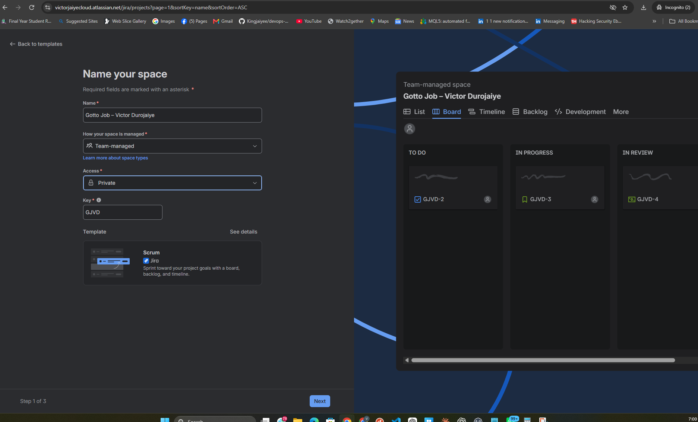

---

### Notes

Write one line for each role: PO (what you prioritized), SM (how you ensured process), Dev Lead (what you built), DevOps Lead (how you shipped).

Solo Mode: I played all four roles myself.

PO: Ranked the 8-Story backlog by value, putting Hero tagline clarity at the top as the highest-value, lowest-risk increment to ship first.
SM: Kept to the 90-minute timebox, ran planning and retro, and enforced the process, including catching and correcting the sub-task status gap.
Dev Lead: Built the increment by editing the hero headline in index.html to "Find your next role, fast." and committing it with a conventional feat(ui) message.
DevOps Lead: Shipped it by copying to EC2 over scp, deploying into the Nginx web root, reloading the service, and verifying live at http://16.192.160.133.

---

# Task 2 — Create the Jira Project (Team-managed → Scrum)

## Goal

Create a Team-managed Scrum project named `Gotto Job – Team <#>` (Team Mode) or `Gotto Job – <YourName>` (Solo Mode).

### Evidence

#### Screenshot 2 — Project created page showing the project name and key

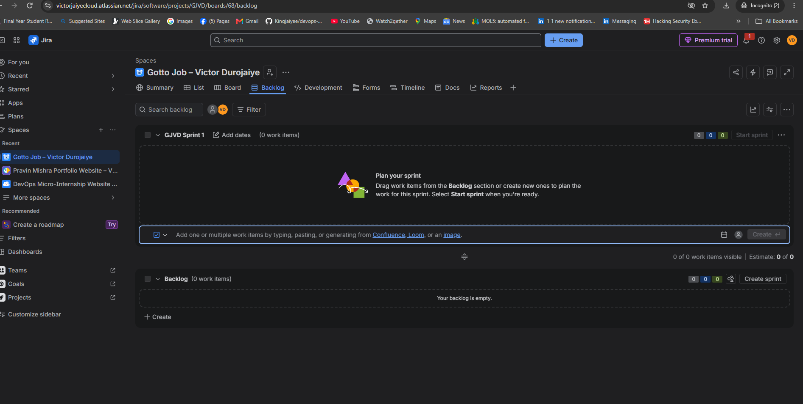

---

# Task 3 — Create the Epic

## Goal

Create the Epic `Improve Gotto Job UI discoverability & trust` to group the UI improvement initiative.

### Evidence

#### Screenshot 3 — Backlog showing the Epic panel with the Epic visible

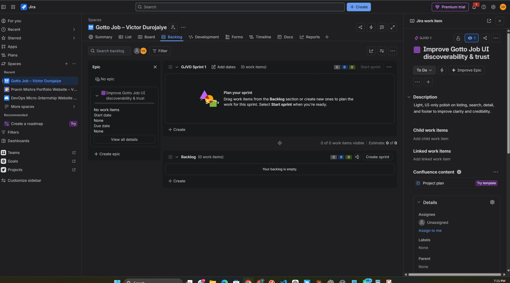

---

# Task 4 — Seed the Product Backlog (6–8 Stories + Fibonacci Points + Ranking)

## Goal

Create at least six Stories under the Epic, estimate each with 1, 2, or 3 story points, and rank them by value.

### Evidence

#### Screenshot 4 — Backlog showing the Epic and at least six Stories under it

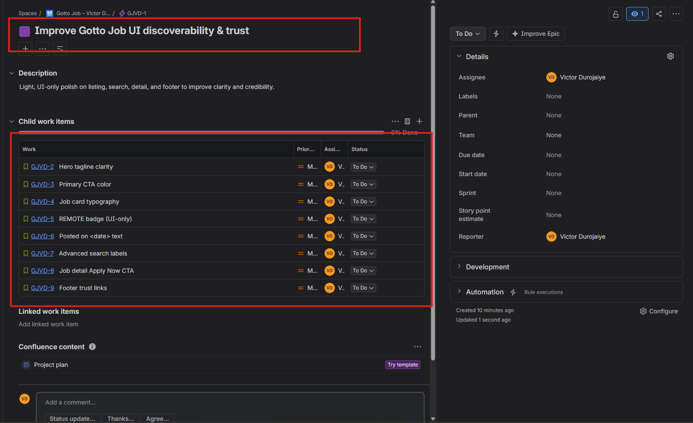

---

#### Screenshot 5 — One Story opened showing its Story Points and acceptance criteria filled in

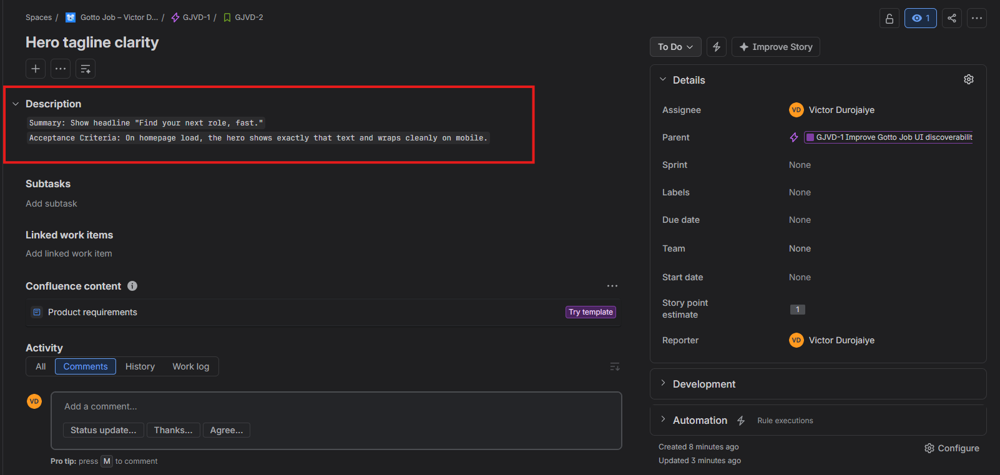

---

# Task 5 — Planning Poker (Estimate + Debate Notes)

## Goal

Confirm the Story Points (1, 2, or 3) for each Story and record brief reasoning for each estimate.

### Evidence

#### Screenshot 6 — Backlog showing Story Points visible, or two or three Stories opened showing their points

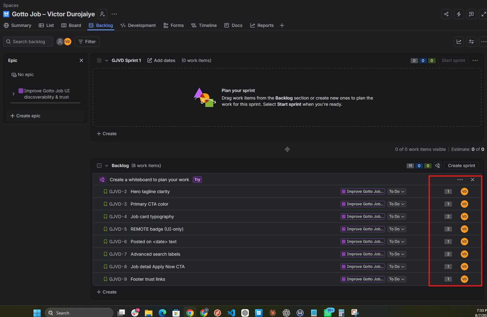

---

### Notes

For each story, explain in one or two lines why it is a 1, 2, or 3 (mention any debate, even in Solo Mode).

S1 Hero tagline clarity (1): One heading change, so it is small.
S2 Primary CTA color (1): A simple CSS color change. I considered 2 because it touches multiple buttons, but kept it at 1 since it is one style rule applied site-wide.
S3 Job card typography (2): Font size and weight change, plus checking the layout still holds up across screen sizes.
S4 REMOTE badge (2): Adds a new badge shown only on remote cards, slightly more involved than a plain text change.
S5 Posted on date (1): A simple static text addition with no logic.
S6 Advanced search labels (2): Several labels and placeholders to update and test, more work than a single text change.
S7 Job detail Apply Now CTA (1): A single button linking to a placeholder, no extra logic.
S8 Footer trust links (1): Two footer links, a small HTML update with no complex behavior.

---

# Task 6 — Sprint Planning: Create Sprint 1 + Sprint Goal + Scope

## Goal

Create Sprint 1, move three or four Stories into it (approximately 3–6 points), set the Sprint Goal, and break each selected Story into Build, Verify, Deploy, and Screenshot Sub-tasks.

### Evidence

#### Screenshot 7 — Sprint 1 with the selected Stories inside it

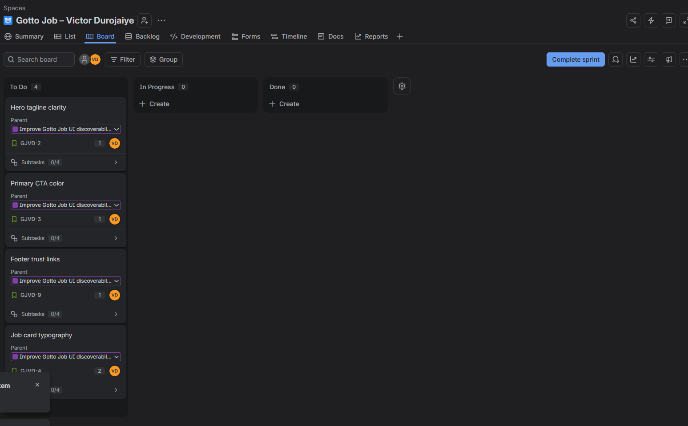

---

#### Screenshot 8 — One Story showing the Sub-tasks created

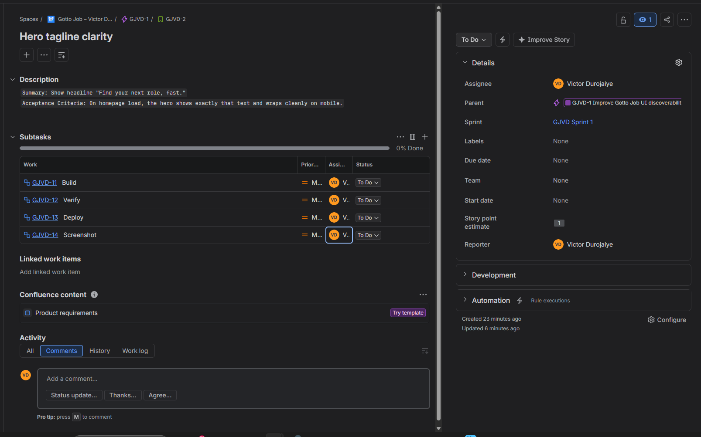

---

# Task 7 — Reports: Open Burndown Chart

## Goal

Open the Burndown Chart and confirm it exists for Sprint 1. It is acceptable if the chart is not yet populated.

### Evidence

#### Screenshot 9 — Burndown Chart page opened, even if empty

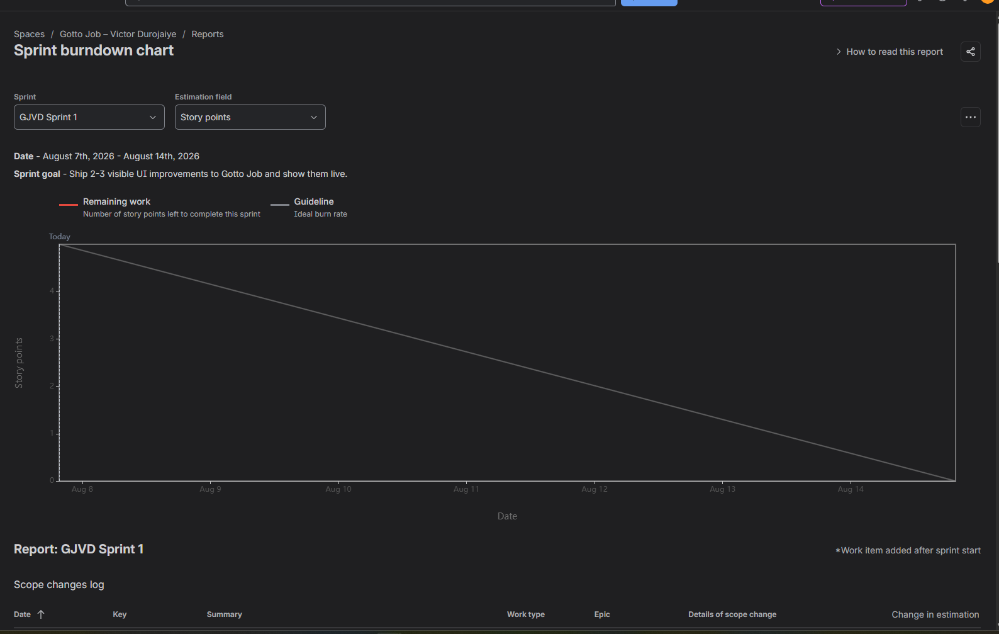

---

# Task 8 — Ship One Small Increment (Build + Deploy + Proof)

## Goal

Implement one small UI-only Story from Sprint 1, commit it, deploy it live, and move the Story and its Sub-tasks to Done in Jira.

### Evidence

#### Screenshot 10 — Jira board showing the Story moved to Done

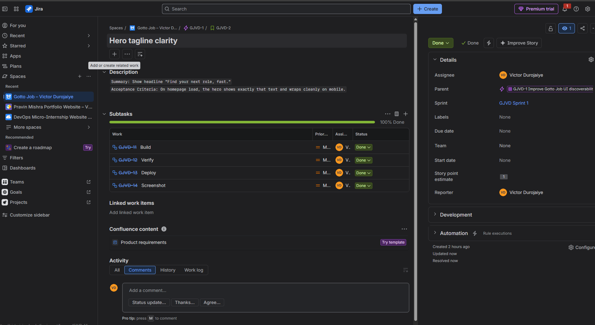

---

#### Screenshot 11 — Git commit output

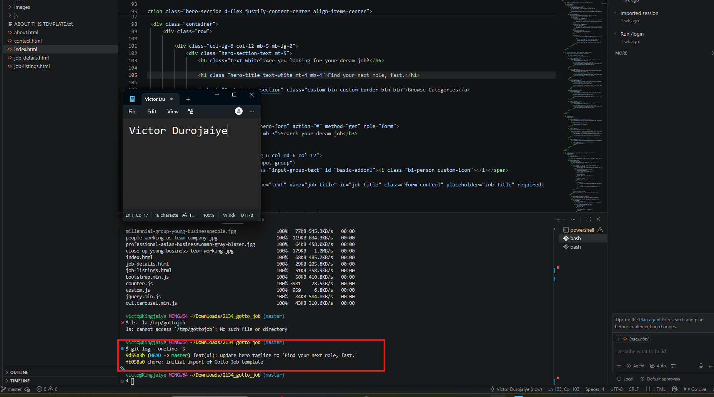

---

#### Screenshot 12 — Live URL in the browser showing the UI change, with the URL visible

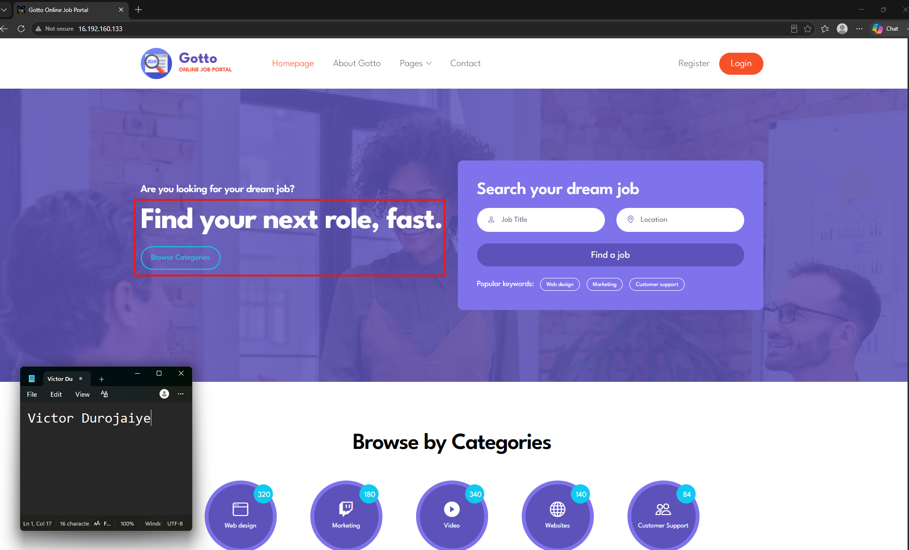

---

# Task 9 — Retro Notes (Scrum Pillar + Value)

## Goal

Add a retro comment covering what went well, what to improve, one Scrum pillar observed (Transparency, Inspection, or Adaptation), and one Scrum value (Openness, Focus, Commitment, Courage, or Respect).

### Evidence

#### Screenshot 13 — Jira retro comment visible

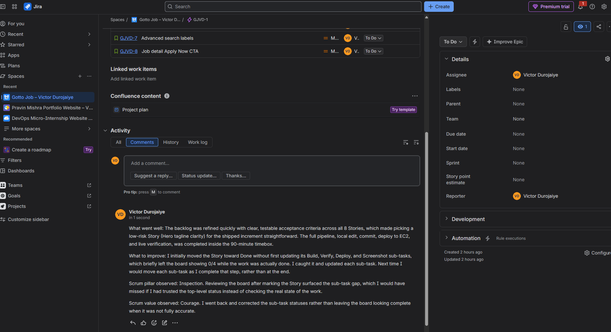

---

# Task 10 — LinkedIn Post (Mandatory)

## Goal

Publish a LinkedIn post about what you delivered, including your live URL, three to five lines on what you did and learned, and one screenshot (Burndown Chart, Sprint board, or the live UI change).

## Evidence

#### LinkedIn Post URL

Paste your LinkedIn post URL here:

`https://www.linkedin.com/posts/victor-jaiye_devops-scrum-jira-share-7491591844611588097-T_p0/`

---

#### Screenshot 14 — Published LinkedIn post

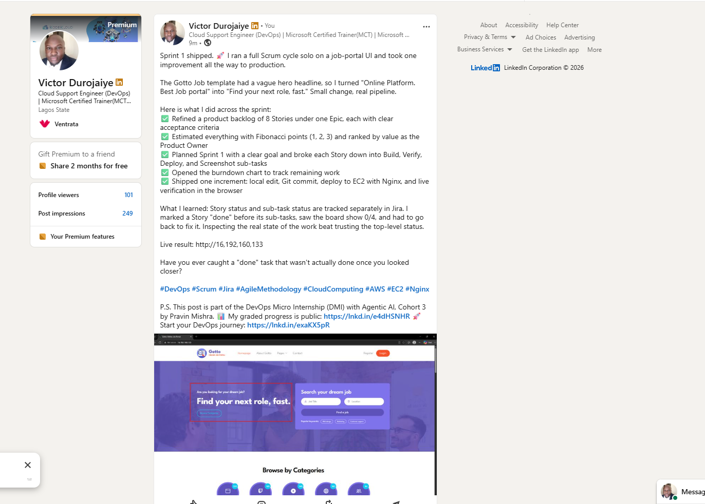

---

# Submission Instructions

- Add all 14 required screenshots
- Full name must be visible in required screenshots
- Do not expose sensitive information (keys, passwords, account IDs)

---

# Completion Checklist

- [x] Task 1: Team Mode or Solo Mode selected and all four roles documented (Screenshot 1 & Notes)
- [x] Task 2: Team-managed Scrum project created with the required name (Screenshot 2)
- [x] Task 3: UI improvement Epic created (Screenshot 3)
- [x] Task 4: 6–8 Stories added under the Epic and ranked by value (Screenshots 4 & 5)
- [x] Task 5: Story Points set (1, 2, or 3) with reasoning recorded (Screenshot 6 & Notes)
- [x] Task 6: Sprint 1 created with Sprint Goal, 3–4 Stories, and Sub-tasks (Screenshots 7 & 8)
- [x] Task 7: Burndown Chart opened (Screenshot 9)
- [x] Task 8: One UI-only increment implemented, committed, deployed, and verified (Screenshots 10–12)
- [x] Task 9: Retro comment with one Scrum pillar and one Scrum value (Screenshot 13)
- [x] Task 10: Mandatory LinkedIn post published with the live URL, backlog refinement, Sprint planning, one shipped increment, proof, and Screenshot 14
- [x] Full Name visible in required screenshots
- [x] No sensitive data exposed

---

## 📌 About DMI & CloudAdvisory

DevOps Micro Internship (DMI) is a project-based DevOps program run by Pravin Mishra (The CloudAdvisory) focused on real-world execution, systems thinking, and career readiness.

It helps learners build strong DevOps foundations with hands-on experience.

---

## 📌 Resources

- 🌐 DMI Official Website: https://dmi.pravinmishra.com?utm_source=github&utm_medium=readme  
- 🎓 University: https://university.pravinmishra.com?utm_source=github&utm_medium=readme  
- 💬 Discord Community: https://discord.pravinmishra.com?utm_source=github&utm_medium=readme  
- 📝 Blog: https://dmi.pravinmishra.com/blog?utm_source=github&utm_medium=readme  
- ▶️ YouTube Playlist: https://www.youtube.com/playlist?list=PLFeSNDtI4Cho  
- 🔗 Pravin Mishra (LinkedIn): https://www.linkedin.com/in/pravin-mishra-aws-trainer/  
- 🏢 CloudAdvisory (LinkedIn): https://www.linkedin.com/company/thecloudadvisory/

---

*This submission is part of DevOps Micro Internship (DMI) Cohort 3 — Agentic AI Track.*
