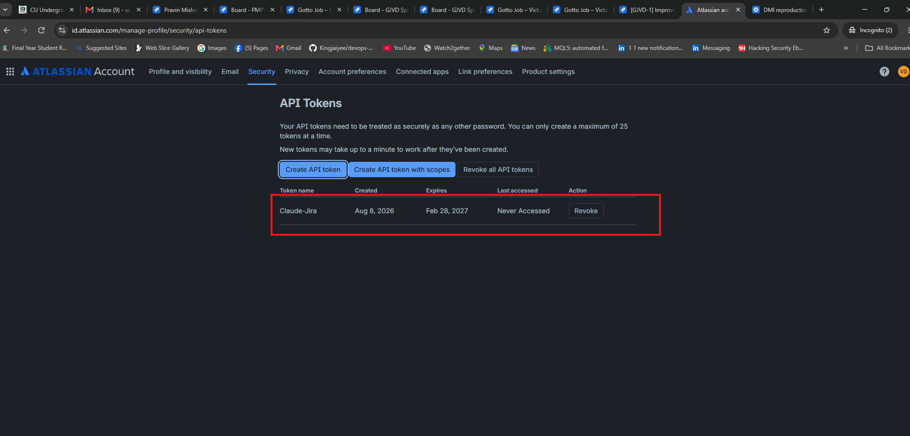
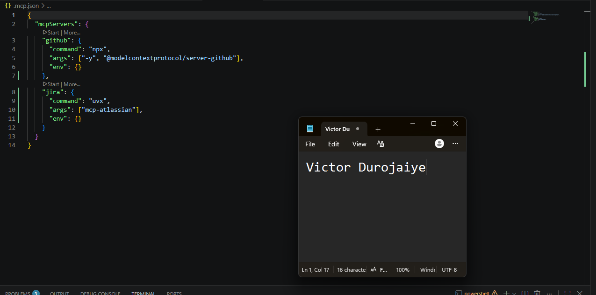
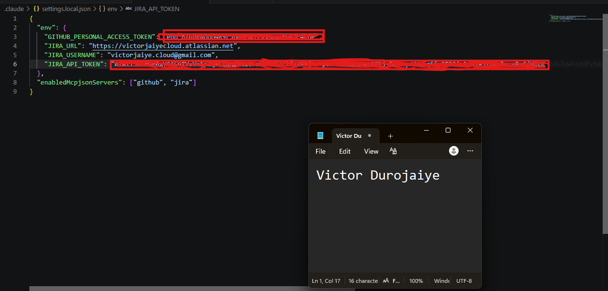
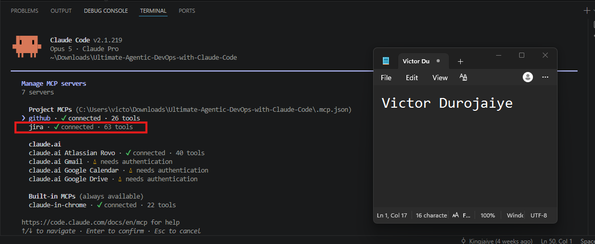
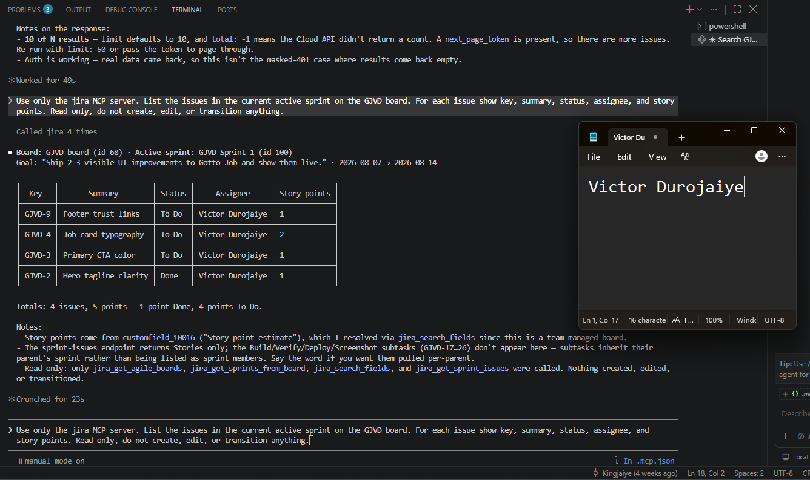
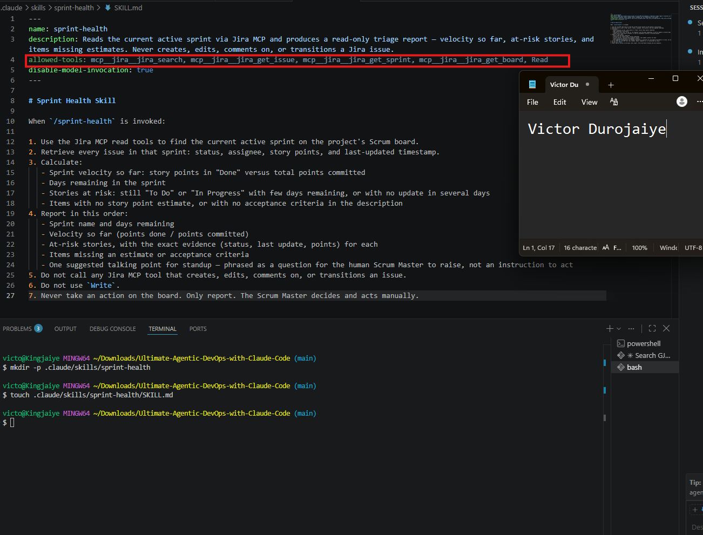
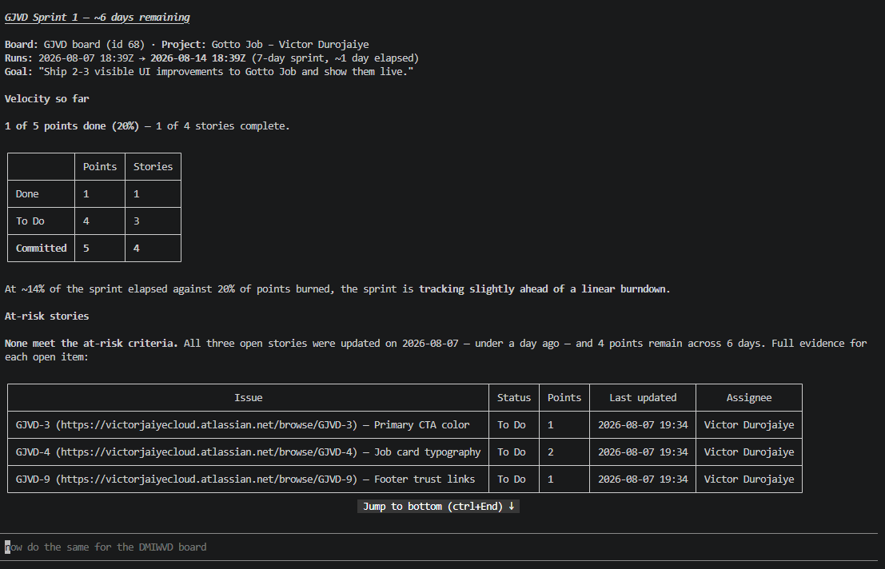
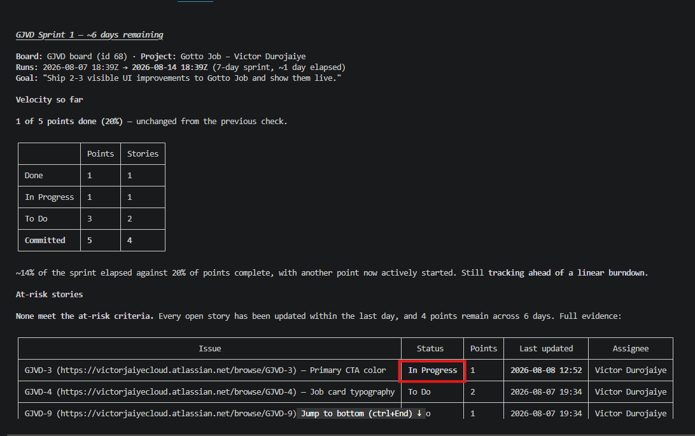

# Assignment 5 — AI-Assisted Sprint Health Report via Jira MCP

Part of the DevOps Micro Internship (DMI) Cohort 3 with Agentic AI

---

## Purpose

In this assignment, you will connect Claude Code to your Jira board through an MCP server, the same way you connected it to GitHub in Week 2, and build a read-only `/sprint-health` skill. The skill reads your current sprint through Jira's API and reports sprint velocity, stories at risk of missing the sprint, and items missing an estimate — but it must never create, edit, comment on, or transition a single ticket itself. You will prove that boundary holds by making a real change on the board yourself and confirming the skill only ever reports, never acts.

---

# Task 1 — Create a Jira API Token

## Goal

Generate an API token from your Atlassian account that the MCP server will use to authenticate with your Jira site. Do not screenshot the token value itself.

### Evidence

#### Screenshot 1 — Jira API token creation confirmation page showing the token name, with the token value not visible

### Notes You Must Write (Very Important):

Why does the MCP server need your site URL and account email in addition to the token?

The token alone is not enough to make an authenticated Jira request. Jira's REST API uses Basic Auth, which pairs a username with a secret, so the account email tells Jira which account the request is acting as, and the token is the secret that proves it. The site URL is needed because Atlassian hosts many separate Jira instances, and my token is only valid on mine, so the URL points the MCP server at the right one. Put simply: the email says who, the token says prove it, and the URL says where.

---

# Task 2 — Create .mcp.json at the Project Root

## Goal

Create or update `.mcp.json` at your project root with a Jira MCP server block, following the same shape as the GitHub MCP server you configured in Week 2.

### Evidence

#### Screenshot 2 — `.mcp.json` open in VS Code showing the Jira server configuration

### Notes You Must Write (Very Important):

Compare this jira block to the github block from Week 2 Assignment 5. The GitHub server ran via npx (a Node.js package); this one runs via uvx (a Python package) — what stays exactly the same shape despite that difference, and why doesn't Claude Code care which language a given MCP server is written in?

Both blocks have the exact same shape: a server name as the key, then command, args, and env inside. The github block runs via npx (a Node.js runner) and the jira block runs via uvx (a Python runner), but that difference lives entirely inside the command and args fields. The structure around them does not change. Claude Code does not care which language a server is written in because it never talks to the server in that language. It only speaks MCP, the shared protocol, over standard input and output. As long as the command Claude Code launches starts a process that speaks MCP back, the language behind it is invisible. npx starts a Node process, uvx starts a Python process, and both answer in the same MCP format, so to Claude Code they are interchangeable.

---

# Task 3 — Add Your Credentials to settings.local.json

## Goal

Add your Jira site URL, account email, and API token to `.claude/settings.local.json`, and confirm that file is listed in `.gitignore` so it is never committed.

### Evidence

#### Screenshot 3 — `settings.local.json` open in VS Code showing the `env` section, with the actual token value blurred or covered

### Notes You Must Write (Very Important):

Why must JIRA_API_TOKEN live in settings.local.json and never in .mcp.json?

Because .mcp.json is safe to commit and settings.local.json is not. The .mcp.json file only describes which servers exist and how to start them, so it gets tracked in git and pushed to my fork where anyone can see it. The API token is a live credential, the equivalent of a password, so if it sat in .mcp.json it would be committed and exposed the moment I pushed. settings.local.json is listed in .gitignore, so git never tracks it and the token never leaves my machine. Keeping the token out of the committed file is the whole reason the config is split into two files: one public that says what to run, one private that holds the secrets.

---

# Task 4 — Verify the Connection with /mcp

## Goal

Restart Claude Code and confirm the Jira MCP server shows as connected.

### Evidence

#### Screenshot 4 — `/mcp` output showing `jira: connected`

---

# Task 5 — Run a Live Query to Prove Real Board Data

## Goal

Ask Claude to list the issues in your current active sprint through the Jira MCP connection, and confirm the result matches what you see on your live board in the browser.

### Evidence

#### Screenshot 5 — Claude's response showing the live sprint issue list retrieved via Jira MCP

### Notes You Must Write (Very Important):

How did you confirm this was real board data and not something Claude guessed?

I confirmed it by putting Claude's output next to my live GJVD board in the browser and checking they matched. The four issue keys (GJVD-2, GJVD-3, GJVD-4, GJVD-9), their statuses (GJVD-2 Done, the other three To Do), their story points (1, 1, 2, 1 for a 5-point total), the sprint name (GJVD Sprint 1), the sprint goal, and the dates (7 Aug to 14 Aug) were all identical to what the board shows. Claude also named the exact board and sprint IDs (board 68, sprint 100) and the custom field the points came from (customfield_10016), which are internal Jira values it could not invent. Earlier in setup the same connection returned an empty result when the token had a trailing space, so I know the tool reports what Jira actually sends rather than filling in a plausible guess. Once the credential was fixed, the data lined up with the board exactly.

---

# Task 6 — Build the /sprint-health Skill

## Goal

Create a `/sprint-health` skill restricted to read-only Jira tools plus `Read`, with no issue-mutating tools and no `Write`. Run it and confirm it produces a report covering sprint velocity, at-risk stories, and items missing an estimate.

### Evidence

#### Screenshot 6 — `SKILL.md` frontmatter showing `allowed-tools` limited to read-only Jira tools plus `Read`, with `disable-model-invocation: true`

#### Screenshot 7 — `/sprint-health` output showing the full triage report against your real sprint

### Notes You Must Write (Very Important):

1. Which Jira MCP tools does this skill's allowed-tools list include, and which mutating tools (create issue, update issue, transition issue, add comment) does it deliberately exclude?

The allowed-tools list includes four read-only Jira MCP tools plus Read: mcp__jira__jira_search, mcp__jira__jira_get_issue, mcp__jira__jira_get_sprint, and mcp__jira__jira_get_board. These can look up sprints, boards, and issues and return their details, but none of them can change anything. The skill deliberately excludes every mutating tool: it has no create-issue tool, no update-issue or edit-issue tool, no transition-issue tool (which would move a ticket between statuses like To Do and Done), and no add-comment tool. Because a Claude Code skill can only call the tools named in allowed-tools, leaving these off means the skill has no mechanical way to write to the board even if asked. Write is also excluded, so it cannot edit local files either. The setting disable-model-invocation: true keeps it on the fixed read-only workflow rather than choosing tools on its own.

2. Why does a Scrum Master need this restriction more than almost any other role in this course?

The Scrum Master's whole job runs through the board: moving tickets across the sprint, editing estimates, assigning work, closing items, adding comments. So a Scrum Master's assistant is exactly the one you would most expect to have full write access to Jira, and that is what makes it dangerous. The board is the team's single source of truth for what is done and what is left, and everyone plans off it. If an assistant with the Scrum Master's authority quietly transitioned a story to Done, changed an estimate, or reassigned work while "helping," the whole team would be planning off a false picture, and no one would know a machine made the change rather than a person. Other roles in the course mostly read or work in their own files, where a wrong action is contained. Here a wrong action rewrites shared reality for the entire team. That is why the analysis has to stay read-only: the skill surfaces what needs attention, and the human Scrum Master decides and acts, so responsibility for any board change always stays with a person.

---

# Task 7 — Prove the Skill Never Mutates the Board

## Goal

Manually update one ticket on your board in the browser (for example, move a story to "Done" or add a missing estimate), then run `/sprint-health` again and confirm the new report reflects your change — proving the skill only ever reads live state and never wrote to the board itself.

### Evidence

#### Screenshot 8 — Second `/sprint-health` run showing the report now reflects your manual board change

### Notes You Must Write (Very Important):

Map this assignment to Gather → Analyze → Human Act → Verify from Week 3 Assignment 6. Which step did you perform manually in the browser, and why must that step stay human?

Gather was the skill reading the live sprint from Jira through the read-only MCP tools: statuses, points, assignees, timestamps. Analyze was the skill turning that raw data into a report: velocity, at-risk stories, missing estimates, and a standup question. Human Act was the step I did myself in the browser, moving GJVD-3 from To Do to In Progress by hand. Verify was running /sprint-health a second time and confirming the new report reflected my change: GJVD-3 now shows In Progress with today's timestamp (2026-08-08 12:52), while GJVD-4 and GJVD-9 still carry their old 2026-08-07 timestamps, proving the skill only read the change I made rather than making it.

The Act step must stay human because acting on the board changes shared reality for the whole team, and that decision needs a person who is accountable for it. The skill can see that a ticket looks stalled or that an estimate is missing, but whether to move a ticket, close it, or reassign work is a judgment call with consequences, and it should never happen silently because a machine inferred it. Keeping Act human means the analysis informs the Scrum Master, and the Scrum Master decides and acts, so responsibility for every board change always rests with a person.

---

# Submission Instructions

Complete all tasks in sequence.

Your submission must include:
- All 8 required screenshots
- All the required notes

---

# Completion Checklist

- [x] Task 1: Jira API token created, value never screenshotted (Screenshot 1)
- [x] Task 2: `.mcp.json` has the Jira server block (Screenshot 2)
- [x] Task 3: Credentials stored in `settings.local.json`, token blurred, file gitignored (Screenshot 3)
- [x] Task 4: `/mcp` shows the Jira server connected (Screenshot 4)
- [x] Task 5: Live query returned real sprint data, verified against the browser (Screenshot 5)
- [x] Task 6: `/sprint-health` skill created with correct read-only `allowed-tools`, and produced a full report (Screenshots 6–7)
- [x] Task 7: A manual board change was reflected in a second `/sprint-health` run (Screenshot 8)
- [x] Skill never created, edited, transitioned, or commented on any issue
- [x] Reflection answered (Notes)
- [x] No API token value exposed

---

## 📌 About DMI & CloudAdvisory

DevOps Micro Internship (DMI) is a project-based DevOps program run by Pravin Mishra (The CloudAdvisory) focused on real-world execution, systems thinking, and career readiness.

It helps learners build strong DevOps foundations with hands-on experience.

---

## 📌 Resources

- 🌐 DMI Official Website: https://dmi.pravinmishra.com?utm_source=github&utm_medium=readme  
- 🎓 University: https://university.pravinmishra.com?utm_source=github&utm_medium=readme  
- 💬 Discord Community: https://discord.pravinmishra.com?utm_source=github&utm_medium=readme  
- 📝 Blog: https://dmi.pravinmishra.com/blog?utm_source=github&utm_medium=readme  
- ▶️ YouTube Playlist: https://www.youtube.com/playlist?list=PLFeSNDtI4Cho  
- 🔗 Pravin Mishra (LinkedIn): https://www.linkedin.com/in/pravin-mishra-aws-trainer/  
- 🏢 CloudAdvisory (LinkedIn): https://www.linkedin.com/company/thecloudadvisory/

---

*This submission is part of DevOps Micro Internship (DMI) Cohort 3 — Agentic AI Track.*
