# Assignment 4 — Deploy EpicBook on Ubuntu VM + MySQL RDS with Secure Cloud Network

Part of the DevOps Micro Internship (DMI) Cohort 3 with Agentic AI

---

## Purpose

In this assignment, you will deploy the EpicBook web application in AWS using a secure two-tier architecture: an Ubuntu EC2 instance with Nginx in a public subnet, and a private MySQL RDS database with restricted security-group access. The completed deployment must prove that the frontend, backend, and private database communicate successfully end to end.

---

# Task 1 — Create VPC + Public/Private Subnets + Routing

## Goal

Create `epicbook-vpc` (10.0.0.0/16) with a public subnet (10.0.1.0/24) and a private subnet (10.0.2.0/24), attach an Internet Gateway, and route only the public subnet to it.

### Evidence

#### Screenshot 1 — VPC details showing CIDR 10.0.0.0/16

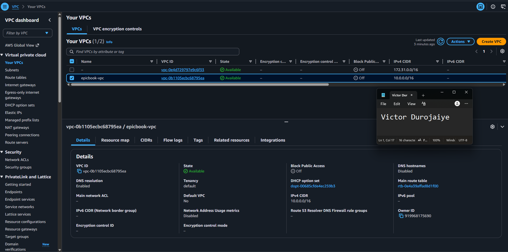

---

#### Screenshot 2 — Subnets list showing both subnets and their CIDRs

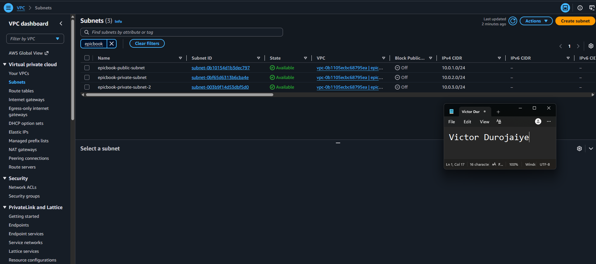

---

#### Screenshot 3 — Route table showing 0.0.0.0/0 → IGW and association with the public subnet

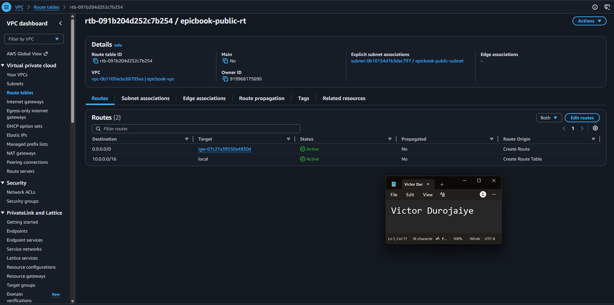

---

# Task 2 — Create Security Groups (EC2 + RDS) with Least Privilege

## Goal

Create `epicbook-ec2-sg` (SSH from your IP, HTTP/HTTPS public) and `epicbook-rds-sg` (MySQL 3306 only from `epicbook-ec2-sg`).

### Evidence

#### Screenshot 4 — EC2 security-group inbound rules showing ports and sources

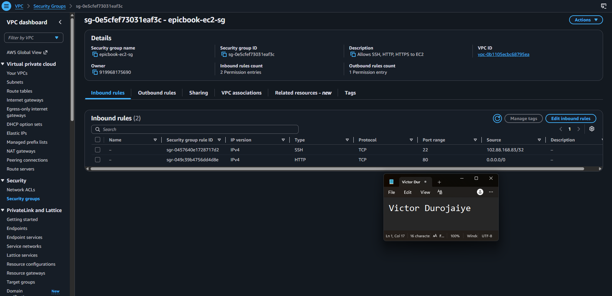

---

#### Screenshot 5 — RDS security-group inbound rule showing MySQL 3306 allowed from the EC2 security group

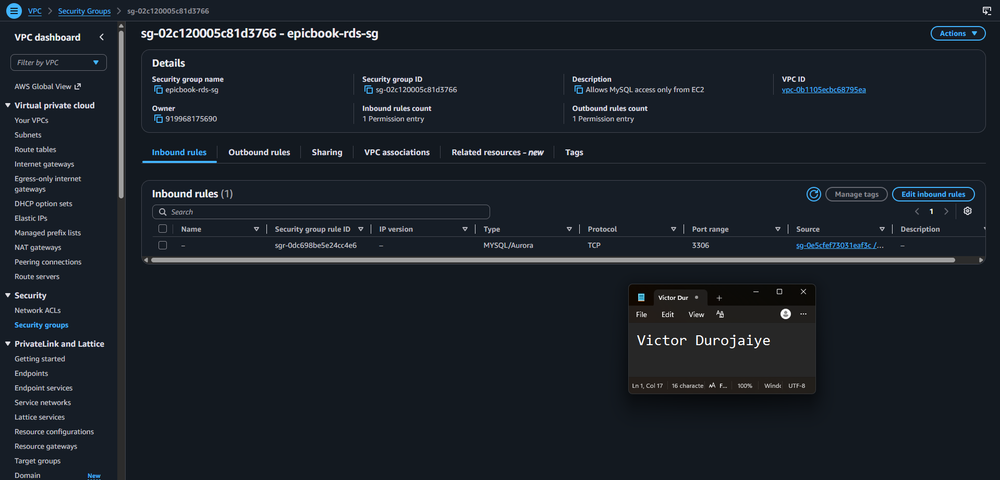

---

# Task 3 — Launch Ubuntu EC2 in Public Subnet

## Goal

Launch an Ubuntu 20.04 instance in the public subnet with `epicbook-ec2-sg` attached, and connect to it over SSH.

### Evidence

#### Screenshot 6 — EC2 instance summary showing the public IPv4 address, subnet, and security group

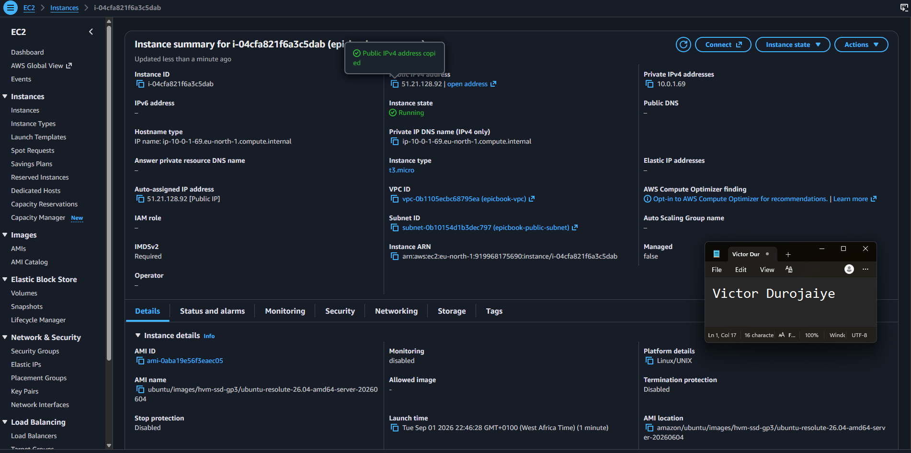

---

#### Screenshot 7 — Terminal showing a successful SSH login with the `ubuntu@...` prompt

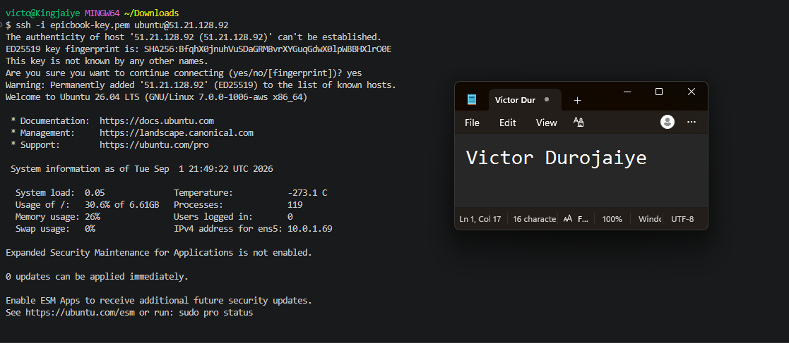

---

# Task 4 — Install Required Software on EC2

## Goal

Install Node.js, npm, Nginx, and the MySQL client on the instance, and confirm Nginx is running.

### Evidence

#### Screenshot 8 — Output of `node -v` and `npm -v`

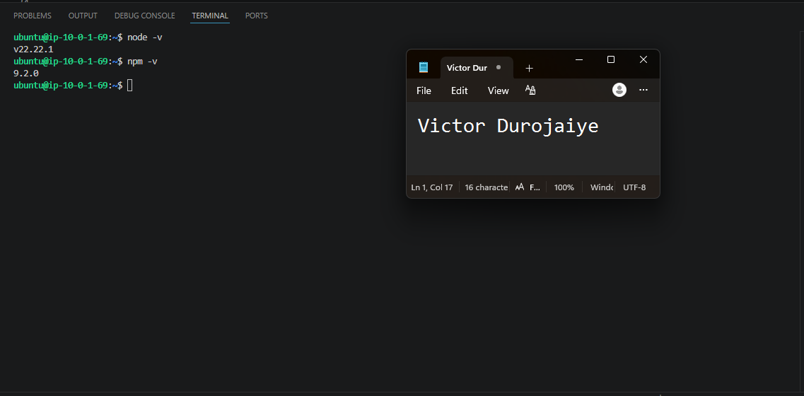

---

#### Screenshot 9 — Output of `systemctl status nginx`

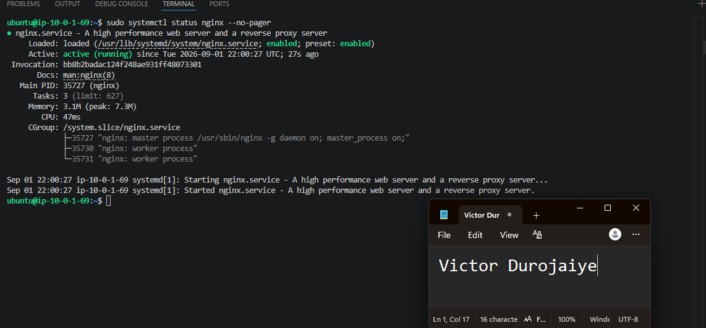

---

#### Screenshot 10 — Output of `mysql --version`

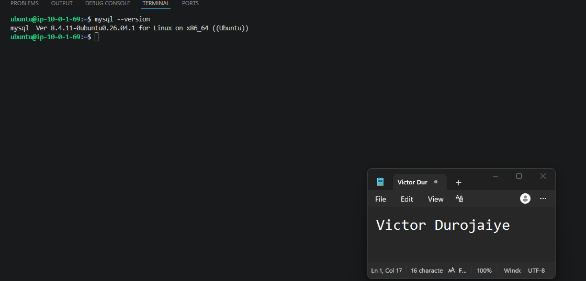

---

# Task 5 — Create RDS MySQL in Private Subnet (No Public Access)

## Goal

Create a private MySQL RDS instance in `epicbook-vpc` using a DB Subnet Group over the private subnet, with `epicbook-rds-sg` attached and public access disabled.

### Evidence

#### Screenshot 11 — RDS instance summary showing Publicly accessible: No

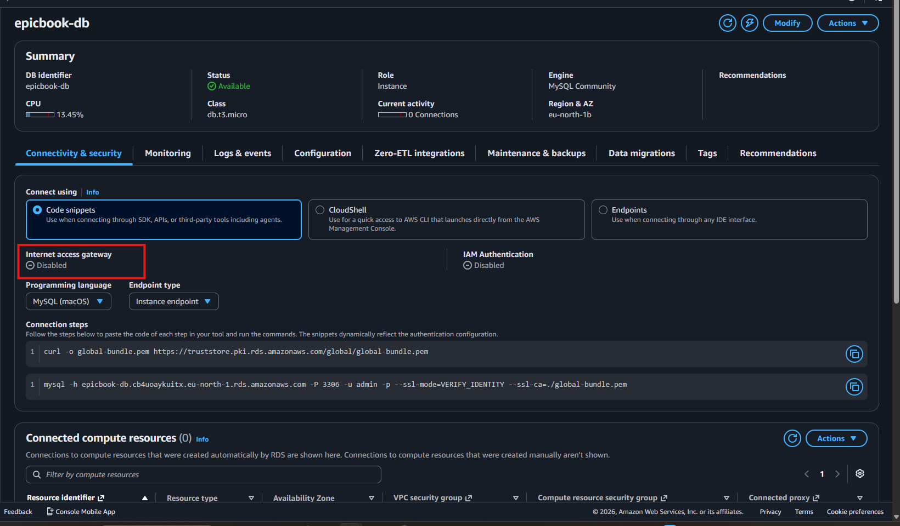

---

#### Screenshot 12 — Connectivity & security section showing the VPC and attached security group

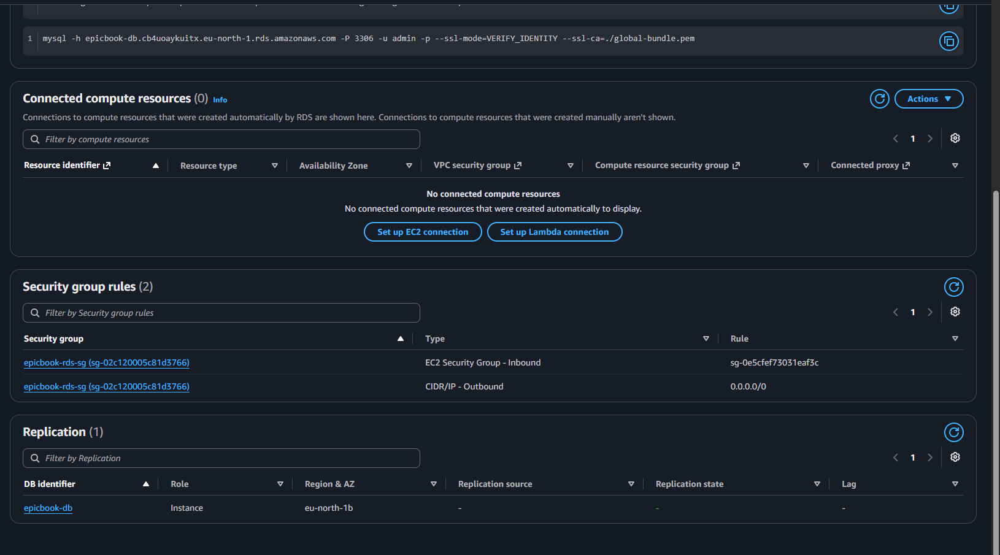

---

# Task 6 — Initialize Database (SQL Dump Import)

## Goal

Connect to RDS from EC2, create the `epicbook` database, and import the provided SQL dump.

### Evidence

#### Screenshot 13 — Terminal showing successful `SHOW TABLES;` output with tables listed

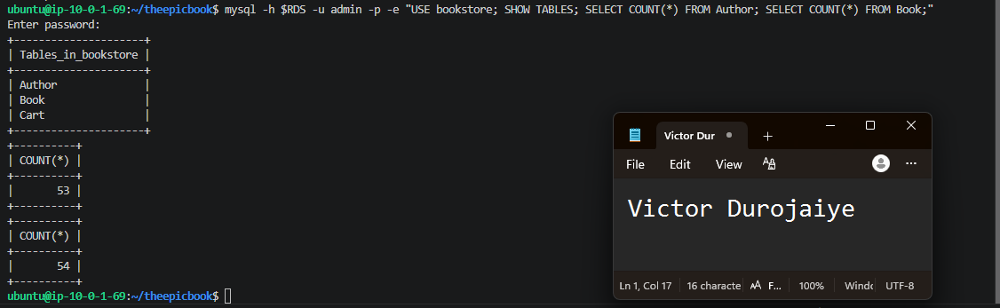

---

# Task 7 — Deploy EpicBook Backend and Configure Environment Variables

## Goal

Clone the EpicBook repository, install backend dependencies, configure `.env` with the RDS endpoint and credentials, and start the backend on port 3000.

### Evidence

#### Screenshot 14 — Terminal showing the repository cloned and the `ls` output

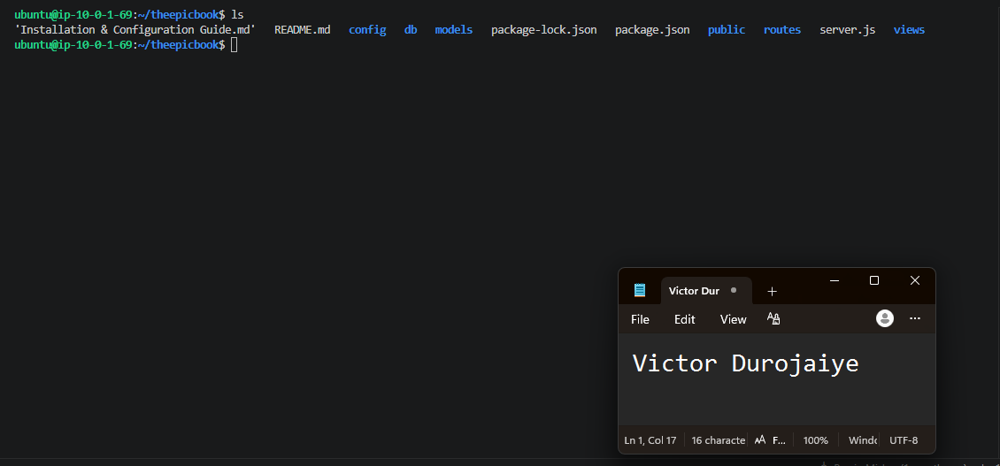

---

#### Screenshot 15 — Terminal showing the backend running, or `ss -tulpn` showing the port open

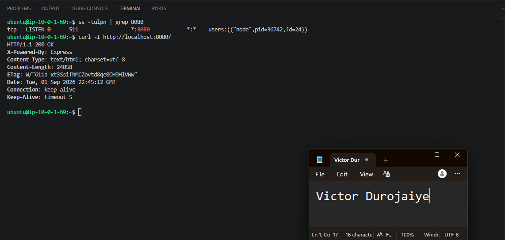

---

#### Screenshot 16 — `curl` output proving the backend responds; a 200, 301, or 404 response is acceptable if the service responds

---

# Task 8 — Serve Frontend Using Nginx + Reverse Proxy to Backend

## Goal

Copy the frontend files to the Nginx web root and configure Nginx to reverse-proxy `/api/` to the Node backend.

### Evidence

#### Screenshot 17 — `nginx -t` success output

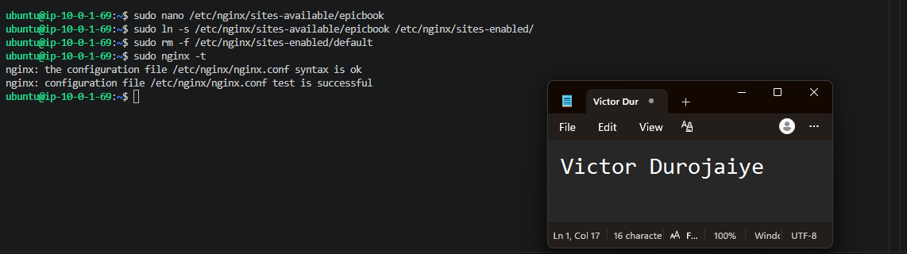

---

#### Screenshot 18 — Nginx configuration snippet showing the `/api/` reverse proxy

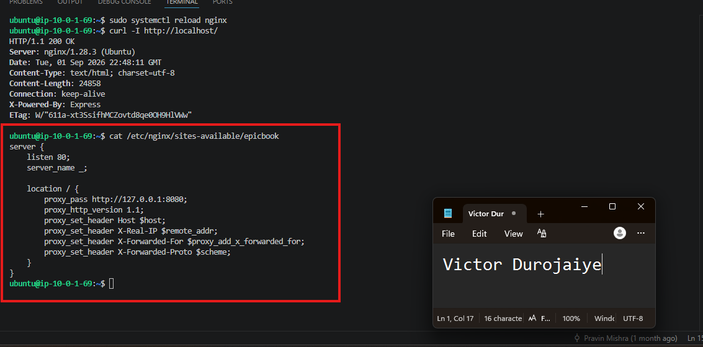

---

# Task 9 — End-to-End Testing (Frontend ↔ Backend ↔ RDS)

## Goal

Verify the frontend loads publicly, the backend responds through Nginx, and EC2 can query the private RDS database.

### Evidence

#### Screenshot 19 — Browser showing the EpicBook application loaded with the public IP visible

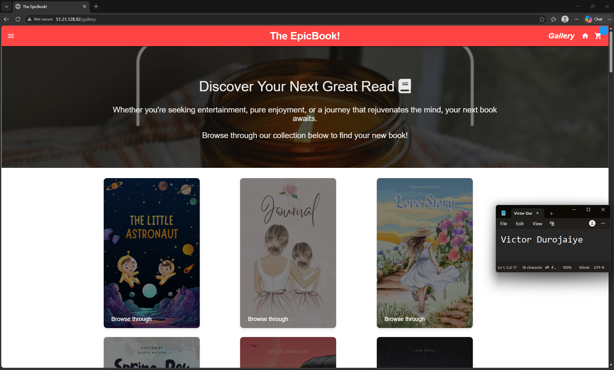

---

#### Screenshot 20 — Terminal showing a successful API call through the public endpoint, such as `curl http://<EC2_PUBLIC_IP>/api/...`

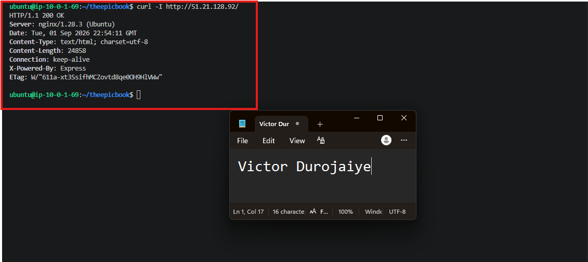

---

#### Screenshot 21 — Terminal showing the successful database connectivity test using `SELECT 1;` or similar

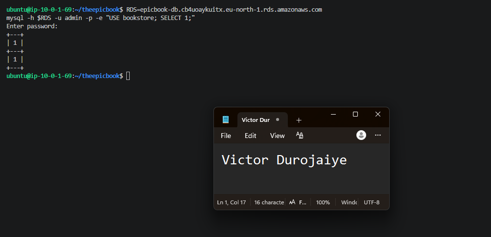

---

# Submission Instructions

- Add all required screenshots in your submission
- Do not expose PEM contents, passwords, `.env` values, or other secrets

---

# Completion Checklist

- [x] Task 1: VPC, public/private subnets, IGW, and public routing created (Screenshots 1–3)
- [x] Task 2: Least-privilege EC2 and RDS security groups created (Screenshots 4–5)
- [x] Task 3: Ubuntu EC2 launched in the public subnet with SSH verified (Screenshots 6–7)
- [x] Task 4: Node.js, npm, Nginx, and MySQL client installed (Screenshots 8–10)
- [x] Task 5: Private MySQL RDS created with no public access (Screenshots 11–12)
- [x] Task 6: Database initialized from the SQL dump (Screenshot 13)
- [x] Task 7: Backend deployed and responding on port 3000 (Screenshots 14–16)
- [x] Task 8: Nginx serving the frontend and reverse-proxying to the backend (Screenshots 17–18)
- [x] Task 9: Frontend, backend, and RDS verified end to end (Screenshots 19–21)
- [x] No sensitive data exposed

---

## 📌 About DMI & CloudAdvisory

DevOps Micro Internship (DMI) is a project-based DevOps program run by Pravin Mishra (The CloudAdvisory) focused on real-world execution, systems thinking, and career readiness.

It helps learners build strong DevOps foundations with hands-on experience.

---

## 📌 Resources

- 🌐 DMI Official Website: https://dmi.pravinmishra.com?utm_source=github&utm_medium=readme  
- 🎓 University: https://university.pravinmishra.com?utm_source=github&utm_medium=readme  
- 💬 Discord Community: https://discord.pravinmishra.com?utm_source=github&utm_medium=readme  
- 📝 Blog: https://dmi.pravinmishra.com/blog?utm_source=github&utm_medium=readme  
- ▶️ YouTube Playlist: https://www.youtube.com/playlist?list=PLFeSNDtI4Cho  
- 🔗 Pravin Mishra (LinkedIn): https://www.linkedin.com/in/pravin-mishra-aws-trainer/  
- 🏢 CloudAdvisory (LinkedIn): https://www.linkedin.com/company/thecloudadvisory/

---

*This submission is part of DevOps Micro Internship (DMI) Cohort 3 — Agentic AI Track.*
