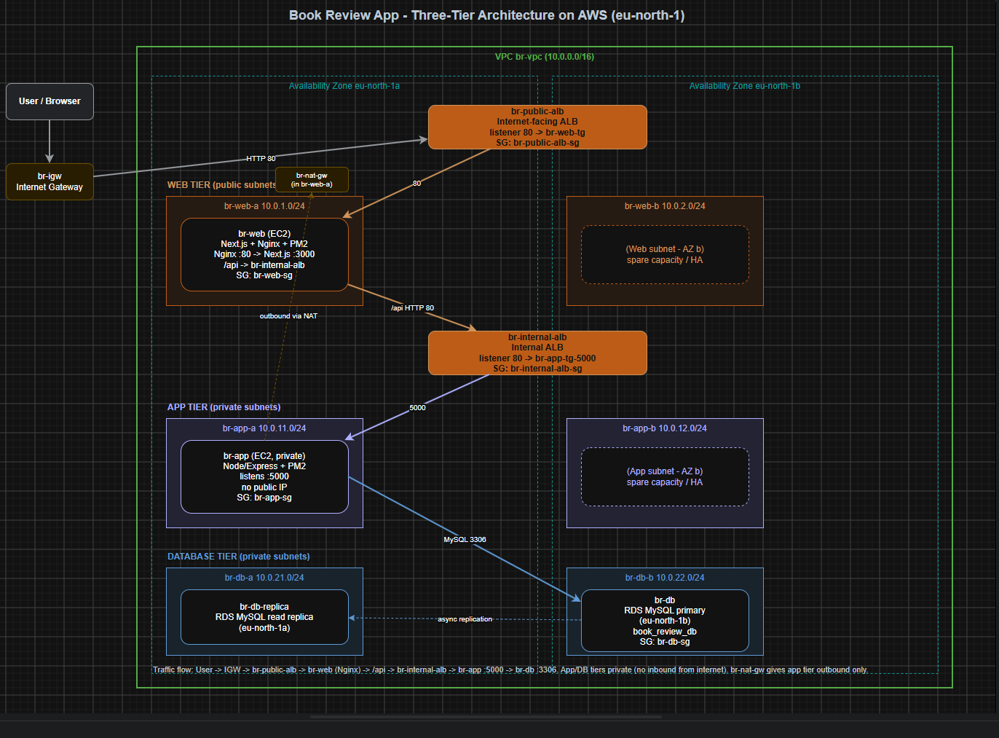
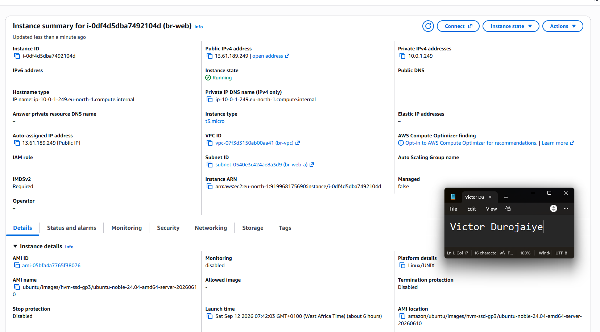
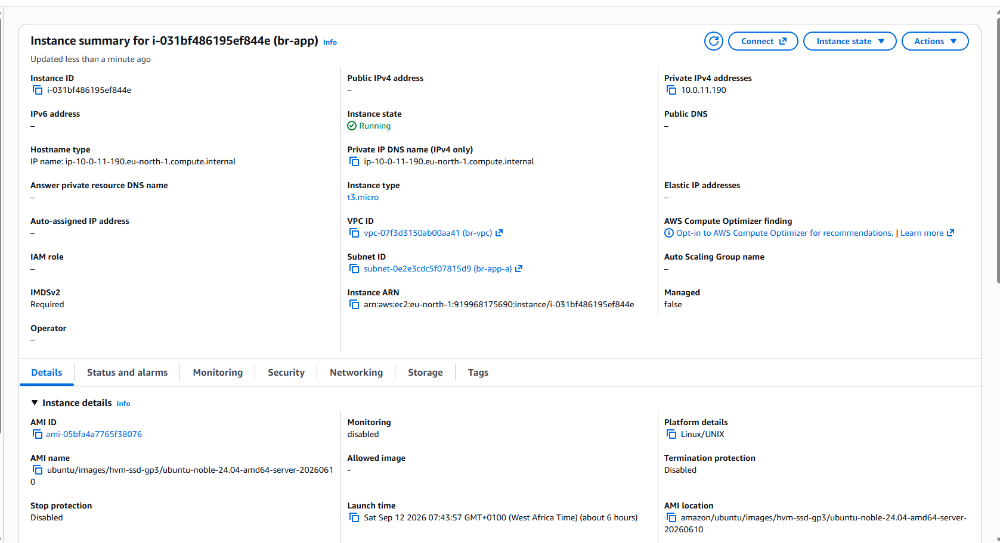
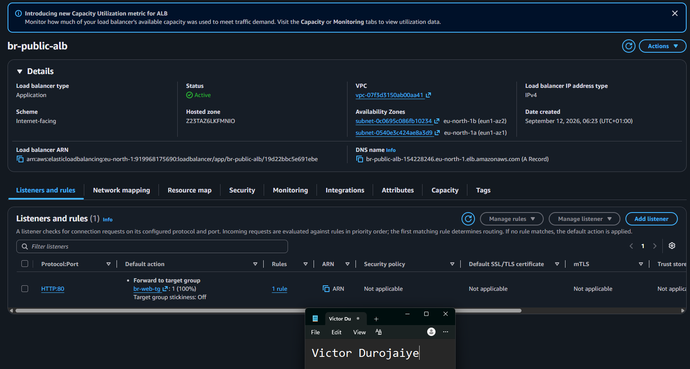
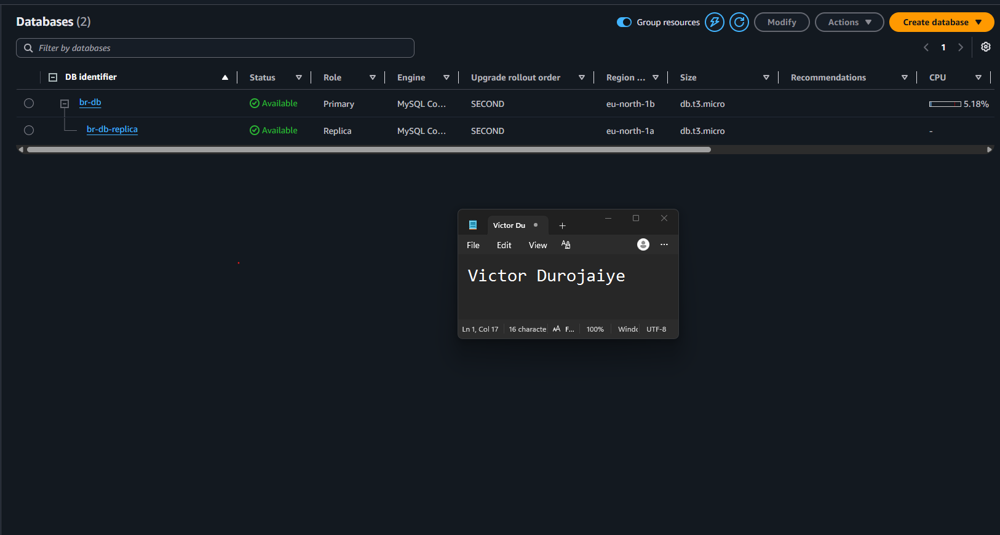
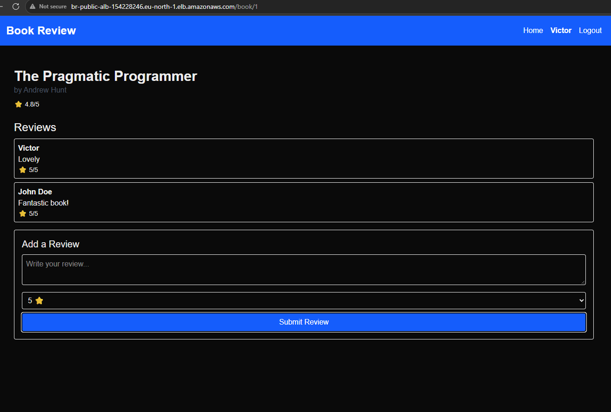
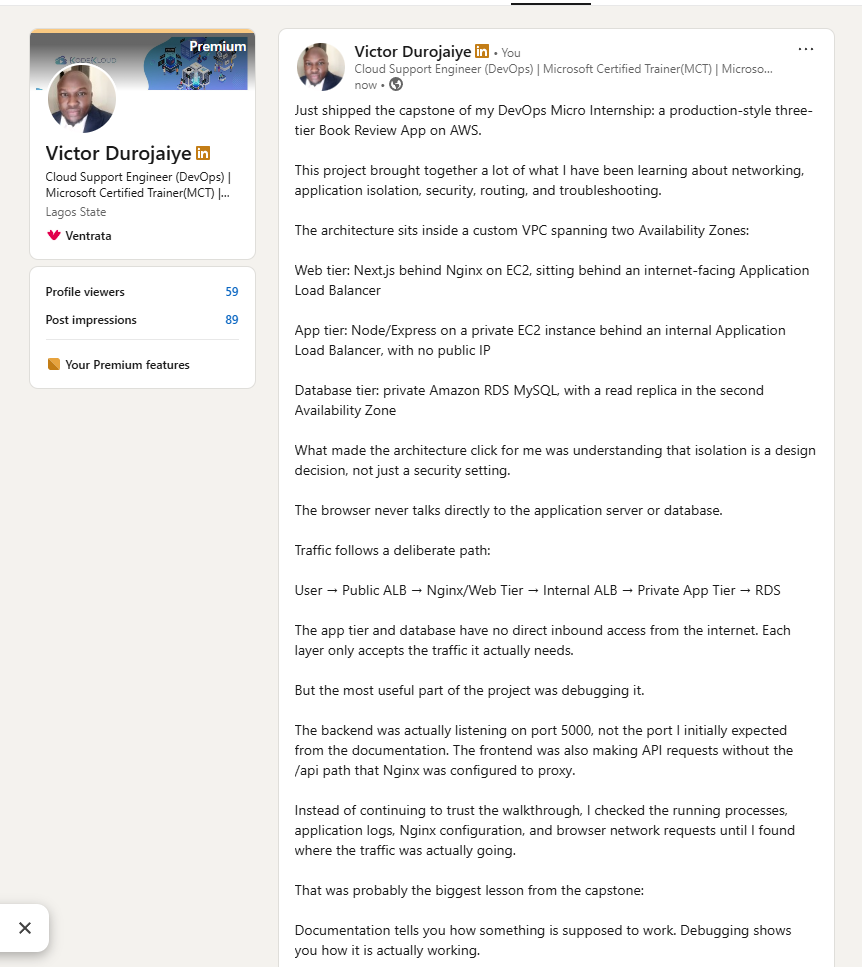

# Assignment 6 — Capstone Assignment — Deploy Book Review App (Three-Tier Architecture) on AWS

Part of the DevOps Micro Internship (DMI) Cohort 3 with Agentic AI

---

## Purpose

This is the most important assignment of the course. You will deploy the Book Review App in a fully production-style three-tier architecture on AWS: a Next.js Web Tier behind Nginx and a public ALB, a private Node.js/Express App Tier behind an internal ALB, and a private Multi-AZ MySQL RDS database with a read replica. You are expected to design, deploy, isolate, debug, and document the result independently.

---

# Task 1 — Architecture Diagram

## Goal

Create an architecture diagram showing the custom VPC (10.0.0.0/16), the six subnets across two Availability Zones (two public Web Tier, two private App Tier, two private Database Tier), the public ALB, Web Tier EC2/Nginx, internal ALB, private App Tier EC2, private Multi-AZ RDS with its read replica, and the permitted traffic flow.

### Evidence

#### Diagram image or link

---

# Task 2 — AWS Region & Services Used

## Goal

Record the AWS Region used and list every AWS service used across networking, compute, load balancing, security, and the database.

### Notes

**Region:**

eu-north-1 (Stockholm), Availability Zones eu-north-1a and eu-north-1b

---

**Services:**

Networking:
- Amazon VPC (br-vpc, 10.0.0.0/16)
- Subnets (6 total across 2 AZs: 2 public web, 2 private app, 2 private database)
- Internet Gateway (br-igw)
- NAT Gateway (br-nat-gw, in br-web-a)
- Route Tables (br-public-rt, br-app-rt, br-db-rt)

Compute:
- Amazon EC2 (br-web: Next.js + Nginx + PM2; br-app: Node/Express + PM2, private)

Load Balancing:
- Elastic Load Balancing / Application Load Balancer (br-public-alb internet-facing; br-internal-alb internal)
- Target Groups (br-web-tg on 80; br-app-tg-5000 on 5000)

Security:
- Security Groups (br-public-alb-sg, br-web-sg, br-internal-alb-sg, br-app-sg, br-db-sg)

Database:
- Amazon RDS for MySQL (br-db primary; br-db-replica read replica in second AZ)
- DB Subnet Group (br-db-subnet-group)

---

# Task 3 — Public Entry Point

## Goal

Confirm the Book Review App loads through the public ALB DNS name.

### Evidence

#### Public ALB DNS

Paste your public ALB DNS name here:

`http://br-public-alb-154228246.eu-north-1.elb.amazonaws.com`

---

# Task 4 — Evidence Screenshots

## Goal

Capture visual proof of every tier and load balancer.

### Evidence

#### Web EC2

---

#### App EC2

---

#### Public ALB

---

#### Internal ALB

---

#### RDS + Replica

---

#### App UI proof

---

# Task 5 — Summary

## Goal

Summarize what worked in the final deployment, the issues encountered and how each was fixed, and the tools or sources used to research and debug.

### Notes

**What worked:**

The full three-tier stack deployed and worked end to end in a custom VPC across two Availability Zones. The browser reaches only the internet-facing public ALB, which routes to the Next.js/Nginx web tier. Nginx serves the frontend and proxies /api requests to the internal ALB, which forwards to the private Node/Express app tier on port 5000, which connects to the private RDS MySQL database over SSL. The app tier has no public IP and the database has no public access, so neither is reachable from the internet. I verified the whole path by registering a user, logging in, and posting a review through the public ALB URL, with the data persisting in RDS and reading back through every tier. A read replica was created in the second AZ.

---

**Issues + fixes:**

1. Backend port mismatch. The documentation implied port 3001, but the running backend actually bound to port 5000. I found it by reading the PM2 logs. Fixed by updating br-app-sg to allow TCP 5000 from the internal ALB security group, creating a new target group (br-app-tg-5000) on port 5000, and repointing the internal ALB listener to it.

2. Frontend API path mismatch. The frontend was calling backend routes without the /api prefix (for example /users/register), which returned 404 because Nginx only proxied /api to the internal ALB. I found it in the browser network tab. Fixed by rebuilding the frontend with NEXT_PUBLIC_API_URL=/api, so all API calls became same-origin relative paths that Nginx proxies correctly.

3. Enhanced Monitoring IAM error during RDS creation. Resolved by disabling Enhanced Monitoring.

4. Multi-AZ not available. Multi-AZ deployment is blocked on my account (RDS Free Tier permits single-AZ only), so the RDS primary was launched single-AZ. A read replica in the second AZ was allowed and created, which still demonstrates cross-AZ replication. In a Multi-AZ deployment RDS would keep a synchronous standby in the second AZ and fail over automatically on the same endpoint.

---

**Tools/sources used:**

- AWS Management Console (VPC, EC2, RDS, ELB, Security Groups). All infrastructure built via console, no CLI.
- Git Bash on Windows for SSH, with SSH agent forwarding to reach the private app tier through the web tier.
- PM2 for process management on both EC2 instances.
- PM2 logs and the browser DevTools network tab for debugging.
- Nginx as reverse proxy on the web tier.
- The Book Review App repository (forked to my GitHub).
- DMI course material and community walkthroughs for reference.

---

# LinkedIn Post (Required)

## Goal

Publish a LinkedIn post sharing the capstone deployment, including the public ALB DNS (or a redacted screenshot), three to five lines on what you built and why it is production-style, and one proof screenshot.

## Evidence

#### LinkedIn Post URL

Paste your LinkedIn post URL here:

https://www.linkedin.com/posts/victor-jaiye_devops-aws-cloudcomputing-activity-7504528277487849472-IbIK

---

#### Screenshot of LinkedIn post

---

# Submission Instructions

- Add all required screenshots and links in your submission
- Do not expose passwords, RDS credentials, connection strings, private keys, or account IDs

---

# Completion Checklist

- [x] Task 1: Architecture diagram completed
- [x] Task 2: AWS Region and services documented
- [x] Task 3: Public ALB DNS confirmed working
- [x] Task 4: All six evidence screenshots captured (Web Tier, App Tier, both ALBs, RDS + replica, app UI)
- [x] Task 5: Deployment summary completed (what worked, issues/fixes, tools/sources)
- [x] LinkedIn post published and URL submitted
- [x] App Tier and Database Tier confirmed not publicly accessible
- [x] No sensitive data exposed

---

## 📌 About DMI & CloudAdvisory

DevOps Micro Internship (DMI) is a project-based DevOps program run by Pravin Mishra (The CloudAdvisory) focused on real-world execution, systems thinking, and career readiness.

It helps learners build strong DevOps foundations with hands-on experience.

---

## 📌 Resources

- 🌐 DMI Official Website: https://dmi.pravinmishra.com?utm_source=github&utm_medium=readme  
- 🎓 University: https://university.pravinmishra.com?utm_source=github&utm_medium=readme  
- 💬 Discord Community: https://discord.pravinmishra.com?utm_source=github&utm_medium=readme  
- 📝 Blog: https://dmi.pravinmishra.com/blog?utm_source=github&utm_medium=readme  
- ▶️ YouTube Playlist: https://www.youtube.com/playlist?list=PLFeSNDtI4Cho  
- 🔗 Pravin Mishra (LinkedIn): https://www.linkedin.com/in/pravin-mishra-aws-trainer/  
- 🏢 CloudAdvisory (LinkedIn): https://www.linkedin.com/company/thecloudadvisory/

---

*This submission is part of DevOps Micro Internship (DMI) Cohort 3 — Agentic AI Track.*
