# Assignment 7 — AI-Assisted AWS Security and Cost Audit

Part of the DevOps Micro Internship (DMI) Cohort 3 with Agentic AI

---

## Purpose

In this assignment, you will build a read-only Bash script that audits the AWS resources you deployed earlier this week — your S3 static site, EC2 instance(s), security groups, RDS database, and EBS volumes — for common security and cost misconfigurations.

You will then connect that script to Claude Code as a reusable `/aws-audit` skill that explains what it found and recommends a fix, without ever making the fix itself.

Finally, you will find a real misconfiguration in your own account, apply the fix yourself, and prove it worked with a second audit run.

---

# Task 1 — Confirm Your AWS Resources and Set Up Your Workspace

## Goal

Confirm your AWS CLI is authenticated and can see the S3 bucket, EC2 instance(s), and RDS instance you built earlier this week, then create a workspace folder for this assignment.

### Evidence

#### Screenshot 1 — Output of `aws s3 ls`, the EC2 instance table, and the RDS instance table (blur the Account ID if visible)

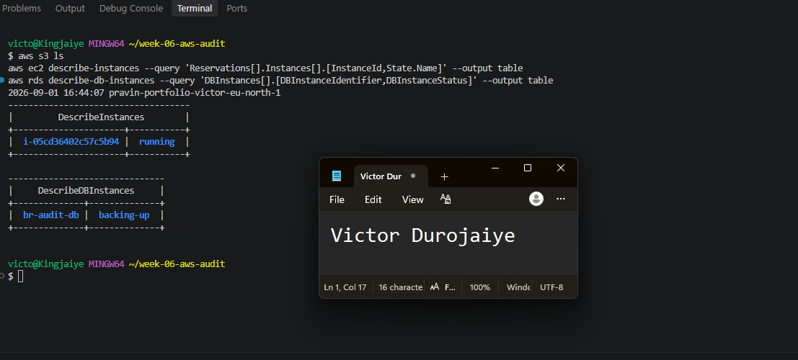

---

#### Screenshot 2 — Output of `pwd` and `find . -maxdepth 4 -type d | sort`

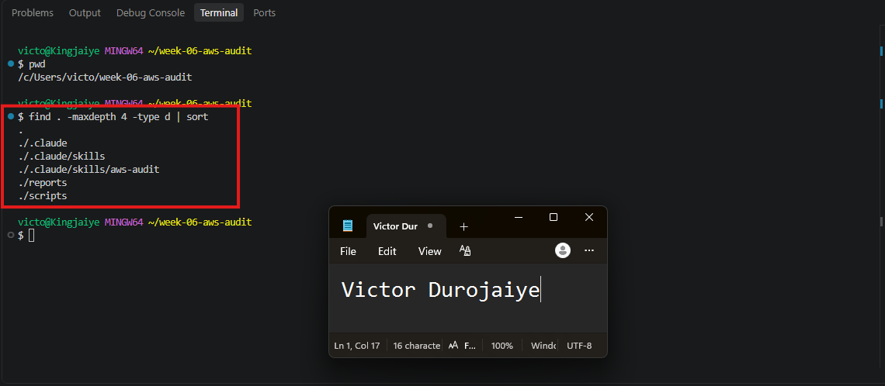

---

### Notes You Must Write (Very Important)

**1. Which resources from this week's earlier assignments did you see in the listings?**

I saw my S3 static site bucket pravin-portfolio-victor-eu-north-1 from the portfolio assignment earlier this week. Because I had already torn down my Assignment 5 and Assignment 6 stacks to avoid charges, I recreated the minimum resources this audit needs: one EC2 instance with a security group (br-audit-sg) and one MySQL RDS instance (br-audit-db). Those three, the S3 bucket, the EC2 instance, and the RDS instance, are what showed up in the listings.

**2. Why must you confirm your resources exist before writing an audit script against them?**

The audit script hardcodes resource identifiers like the bucket name, the RDS instance ID, and the region. If any of those point at a resource that no longer exists, the checks return empty results or errors instead of real findings, so the PASS/FAIL verdicts would be meaningless. Confirming the resources exist first means the script is auditing real infrastructure and its results actually reflect the state of my account.

---

# Task 2 — Define Safety Rules in CLAUDE.md

## Goal

Create a `CLAUDE.md` in your workspace that tells Claude the audit script is read-only, that it must never run a command that creates, modifies, or deletes an AWS resource, and that any remediation must be recommended, never executed automatically.

### Evidence

#### Screenshot 3 — `CLAUDE.md` open in VS Code showing all four sections

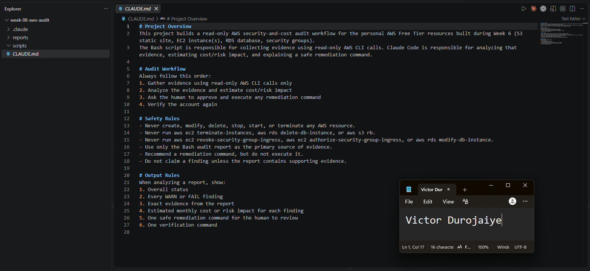

---

### Notes You Must Write (Very Important)

**1. Why should Claude never be given permission to run `revoke-security-group-ingress` itself, even if the fix is obviously correct?**

Because if the AI acts on a misread of the evidence, a wrong judgment turns straight into a change to live infrastructure. Keeping the AI as recommend-only puts a human review step between analysis and action, so a bad call becomes a rejected suggestion instead of a lockout or an outage. It also keeps accountability with a person who reviews and owns each change. "Obviously correct" is exactly the moment people stop checking, which is when the wrong security group or wrong CIDR does real damage.

**2. Which rule prevents Claude from claiming a finding that the report does not support?**

The Safety Rules line "Do not claim a finding unless the report contains supporting evidence," backed up by "Use only the Bash audit report as the primary source of evidence." Together they tie every finding Claude reports to what the script's report actually shows, so it cannot invent or assume a problem the evidence does not contain.

---

# Task 3 — Plan the Audit with Claude Code

## Goal

Ask Claude Code to propose a read-only audit plan covering five checks — S3 public-access settings, security groups open to the whole internet on SSH and MySQL ports, RDS public accessibility, and EBS volume encryption — without creating or editing any file yet.

### Evidence

#### Screenshot 4 — Claude Code showing the five-check plan

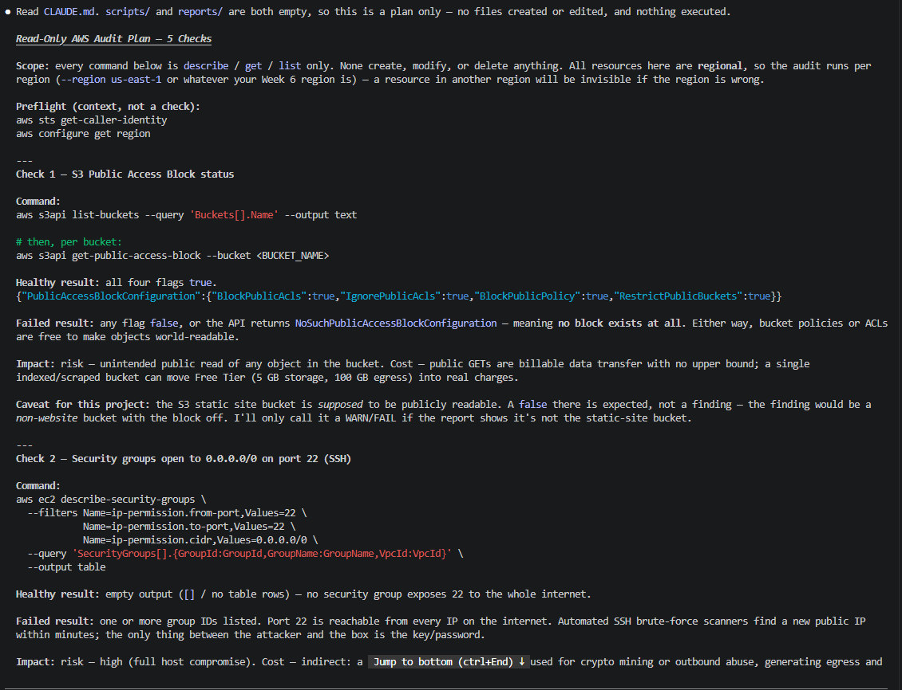

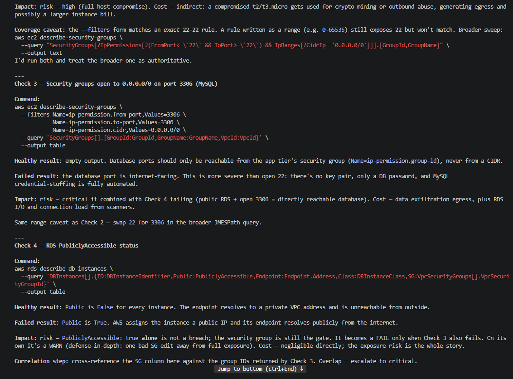

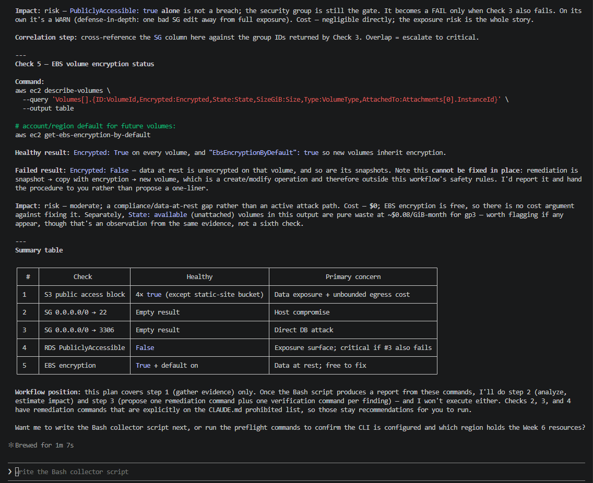

---

### Notes You Must Write (Very Important)

**1. Which part of this task represents the Gather phase?**

The five read-only checks themselves, the describe and get commands that collect evidence about the current state of the account (S3 public-access config, security group rules on ports 22 and 3306, RDS public accessibility, and EBS encryption). Planning them here defines what the Gather phase will do; the Gather phase is that evidence-collection step.

**2. Did every proposed command start with `describe-`, `get-`, or `list-`? Why does that matter?**

Yes, every command in the plan was a read-only call (list-buckets, get-public-access-block, describe-security-groups, describe-db-instances, describe-volumes, get-ebs-encryption-by-default). It matters because the whole safety guarantee of the audit rests on it: a command that only reads can never change, break, or expose anything, no matter how it is used or misread. That makes the audit safe to run repeatedly against a live account with zero risk of the audit itself causing an incident.

---

# Task 4 — Build the AWS Audit Script

## Goal

Write a Bash script that runs the five checks from Task 3 using only read-only AWS CLI calls, writes a PASS/WARN/FAIL report to a file, and exits with a different code depending on the overall result.

Make it executable and confirm it has no syntax errors.

### Evidence

#### Screenshot 5 — Top section of `aws-audit.sh` showing the variables and the checks array

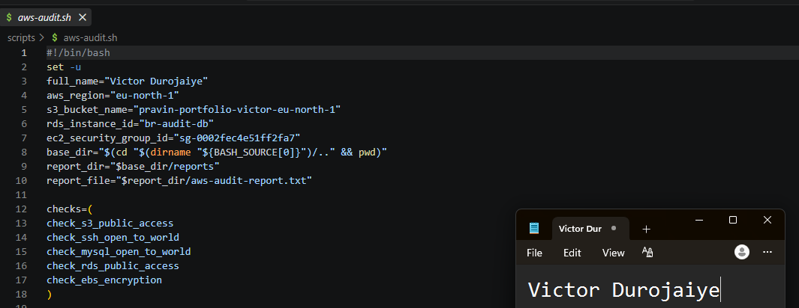

---

#### Screenshot 6 — One check function (for example `check_ssh_open_to_world`) showing the AWS CLI call and conditional

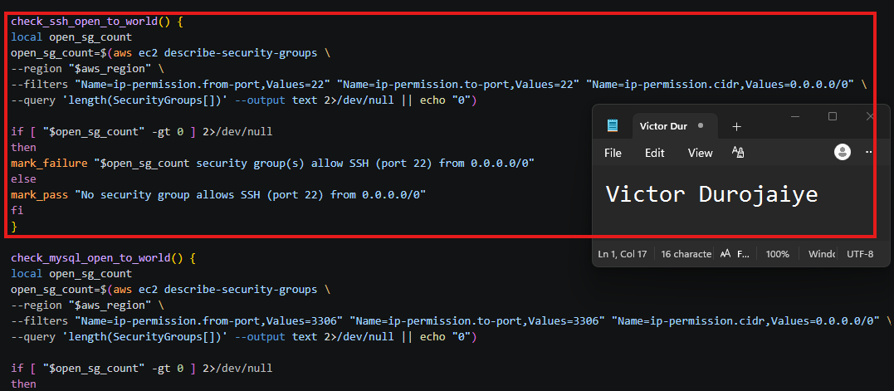

---

#### Screenshot 7 — Output of `bash -n scripts/aws-audit.sh` and `ls -l scripts/aws-audit.sh`

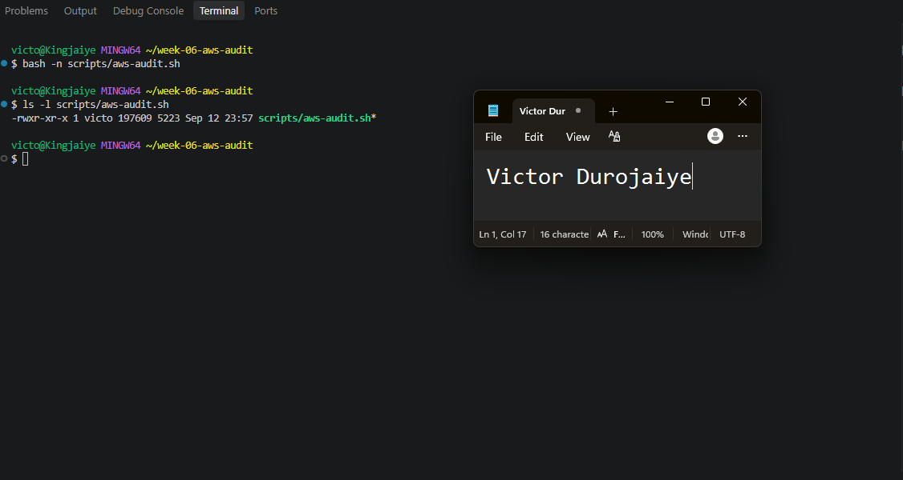

---

### Notes You Must Write (Very Important)

**1. What is stored in the checks array, and how does the loop use it?**

The checks array holds the names of the five check functions as strings. The loop iterates over the array and calls each name as a function, so running all the checks is just a matter of looping through the list. Adding or removing a check is a one-line edit to the array, which keeps the list of checks separate from the logic that runs them.

**2. Why does every AWS CLI call in this script use `--query` and `--output text` instead of parsing raw JSON?**

--query uses JMESPath to pull out just the one field each check needs on the AWS side, and --output text returns it as a plain string that a Bash if statement can compare directly. Parsing raw JSON inside Bash would need extra tooling like jq and would be fragile. This way each check comes down to a single value that is trivial to test.

**3. Why does the script use different exit codes for HEALTHY, WARN, and FAIL?**

So the result is machine-readable. Exit 0 for healthy, 1 for warn, and 2 for fail let other tools, a CI pipeline, a scheduled job, or the skill, react to the outcome without parsing the text report. A caller can branch on severity programmatically instead of reading the words.

---

# Task 5 — Run the Baseline Audit

## Goal

Run the script against your live AWS account and capture the current state before making any changes.

### Evidence

#### Screenshot 8 — Output of `./scripts/aws-audit.sh` showing your Full Name and all five checks

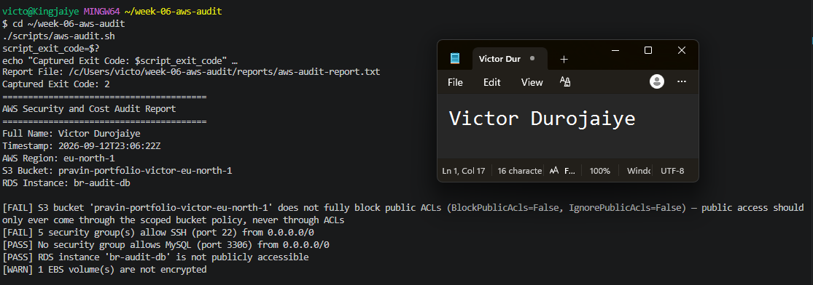

---

#### Screenshot 9 — Output showing the captured exit code and final summary

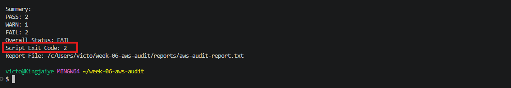

---

### Notes You Must Write (Very Important)

**1. What is the overall status of your baseline audit?**

FAIL, with a script exit code of 2. The baseline had 2 PASS, 1 WARN, and 2 FAIL results.

**2. Did any check return FAIL or WARN? If so, which one, and what evidence did it show?**

Yes. Two checks failed and one warned:
- FAIL, S3 public ACLs: the bucket reported BlockPublicAcls=False and IgnorePublicAcls=False, meaning ACLs could be used to make objects world-readable rather than access coming only through a scoped bucket policy.
- FAIL, SSH open to the world: 5 security groups allowed port 22 from 0.0.0.0/0, exposing SSH to the entire internet.
- WARN, EBS encryption: 1 EBS volume was not encrypted, so its data at rest was unencrypted.
The two PASS results were MySQL not open to the world and RDS not publicly accessible.

**3. If every check passed, what does that tell you about the security posture of your account so far?**

My baseline did not pass everything, so real remediation was required. A fully clean baseline would indicate the resources followed least-privilege networking and encryption defaults, but it would only cover these five specific checks, not a full security posture, so it would be a good sign rather than a guarantee of overall security.

---

# Task 6 — Build and Run the /aws-audit Skill

## Goal

Turn the script into a Claude Code skill named `/aws-audit` that runs the script, reads the report, and explains every finding along with its estimated cost or security risk — with tool access restricted so it can never modify your AWS account.

### Evidence

#### Screenshot 10 — `SKILL.md` showing the frontmatter, tool restrictions, and safety rules

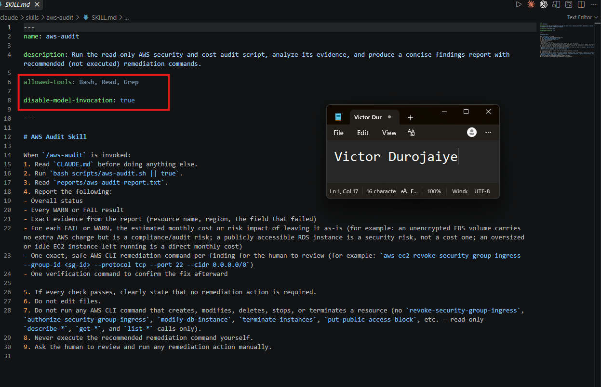

---

#### Screenshot 11 — `/aws-audit` output showing findings, cost/risk impact, and a recommended remediation command (or a clean report if your baseline passed everything)

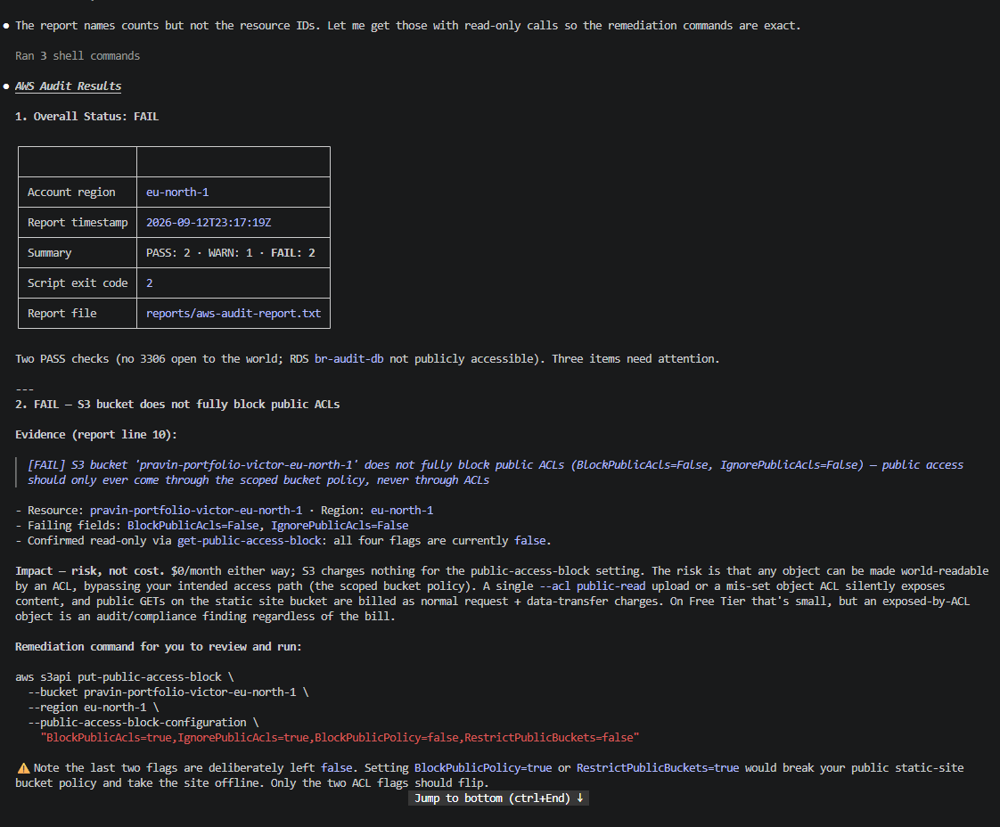

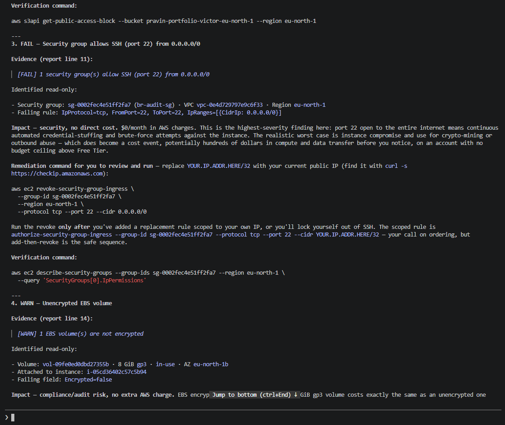

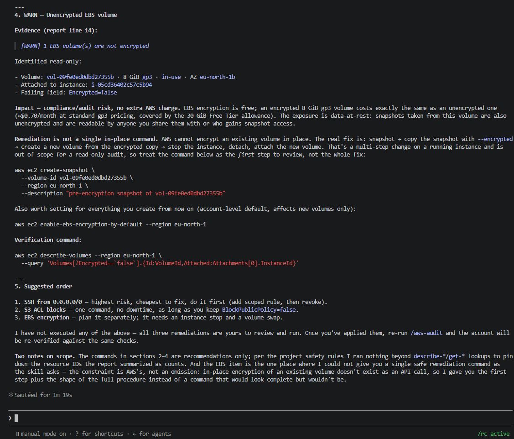

---

### Notes You Must Write (Very Important)

**1. Why does this skill have Bash, Read, and Grep, but not Write?**

The skill needs Bash to run the audit script, Read to open the report and CLAUDE.md, and Grep to search the report text. It has no Write because an audit must never alter files or state. Leaving Write out means the skill structurally cannot modify the script, the report, or anything else, so read-only is enforced at the tool level rather than relying only on instructions.

**2. What part is performed by Bash, and what part is performed by Claude?**

Bash, the script, gathers the evidence. It runs the read-only AWS CLI calls and produces a deterministic PASS/WARN/FAIL report. Claude analyzes that evidence: it interprets each finding, estimates the cost or risk of leaving it, and drafts the remediation and verification commands for me to review. Facts come from Bash, judgment comes from Claude.

**3. Why is estimating cost/risk impact something the AI adds on top of a plain PASS/FAIL script?**

The script only classifies each check as PASS, WARN, or FAIL. It cannot say what a finding means in dollars or in exposure. The AI adds that context, turning "SSH open to 0.0.0.0/0" into "internet-wide brute-force exposure, risk of host compromise and unexpected compute bills," which is what lets me prioritize which finding to fix first. That interpretation is judgment the plain script does not provide.

---

# Task 7 — Fix a Real Finding and Re-Verify

## Goal

Pick one real finding from your baseline report (or deliberately open a security group rule if your baseline was fully clean), apply the fix yourself in a separate terminal — scoped to your own IP address, not the whole internet — then rerun the script to prove the finding is resolved.

### Evidence

#### Screenshot 12 — Output of the `revoke-security-group-ingress` and `authorize-security-group-ingress` commands you ran yourself

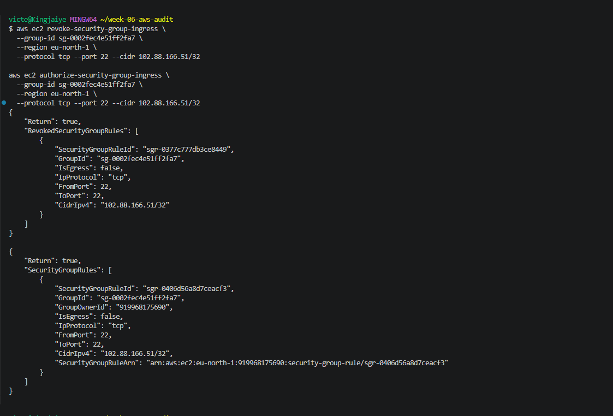

---

#### Screenshot 13 — Rerun of `./scripts/aws-audit.sh` showing the finding is now PASS

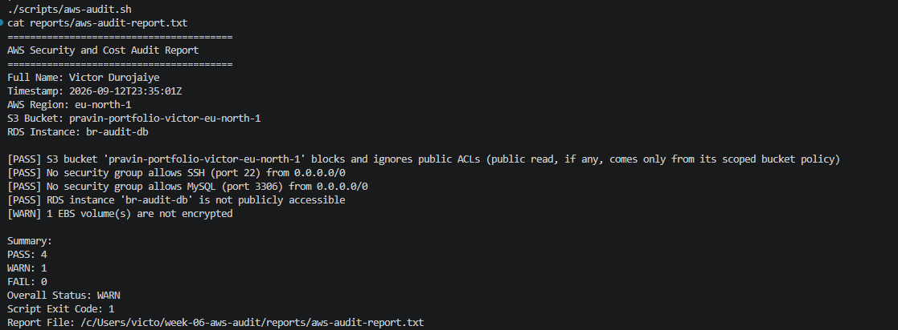

---

### Notes You Must Write (Very Important)

**1. Which exact finding did you fix, and what command did you run?**

I fixed the SSH-open-to-the-world finding on my br-audit-sg security group. I added a replacement rule scoped to my own IP and then removed the open one:
aws ec2 authorize-security-group-ingress --group-id sg-0002fec4e51ff2fa7 --region eu-north-1 --protocol tcp --port 22 --cidr <my-ip>/32
aws ec2 revoke-security-group-ingress --group-id sg-0002fec4e51ff2fa7 --region eu-north-1 --protocol tcp --port 22 --cidr 0.0.0.0/0
I also deleted four orphaned launch-wizard security groups from earlier weeks that still had port 22 open to 0.0.0.0/0, so the check dropped from 5 open groups to zero. I later also fixed the S3 finding by enabling the two ACL block flags while leaving the policy flags off so my live portfolio site stayed up.

**2. Why did you scope the new rule to your own IP address instead of leaving it open to `0.0.0.0/0`?**

0.0.0.0/0 exposes SSH to the entire internet, where automated scanners find and brute-force open port 22 within minutes. Scoping the rule to my own /32 means only my address can reach the port, which keeps my own access while removing the public attack surface.

**3. Did Claude execute the remediation command, or did you? Why does that matter?**

I executed it. The skill only recommended the commands. It matters because if the AI ran the fix, a misread of the evidence would turn straight into a live change, a lockout or an exposure. Keeping the human as the one who runs the write commands preserves a review checkpoint and keeps accountability with a person.

**4. Which phase of the Agentic Loop does the Bash script represent? Which phase does Claude's explanation represent? Which phase is you running the fix?**

The Bash script is the Gather phase (collect evidence). Claude's explanation is the Analyze phase (interpret the evidence and estimate impact). Me running the fix is the Human Act phase (approved remediation). Rerunning the script afterward is the Verify phase.

---

# LinkedIn Post (Required)

## Goal

Create a LinkedIn post including:

- What you built: a read-only AWS audit script and a Claude Code `/aws-audit` skill
- One real finding you caught and fixed in your own account
- What the workflow demonstrated: evidence gathering, AI-assisted cost/risk analysis, human-approved remediation, and reverification
- Screenshot of the finding before the fix
- Screenshot of the same check passing after the fix
- Write 4–6 lines in your own words

Suggested tags:

`#DMIByPravinMishra #AWS #AgenticAI #ClaudeCode #DevOps`

### Evidence

#### LinkedIn Post URL

Paste your LinkedIn post URL here:

https://www.linkedin.com/posts/victor-jaiye_dmibypravinmishra-aws-agenticai-activity-7504689718060773376-kUGu?utm_source=share&utm_medium=member_desktop&rcm=ACoAABkZOQEB3T6FCcu0A1jCAOaZB5ag2lTqKeE

---

#### Screenshot of Published LinkedIn Post

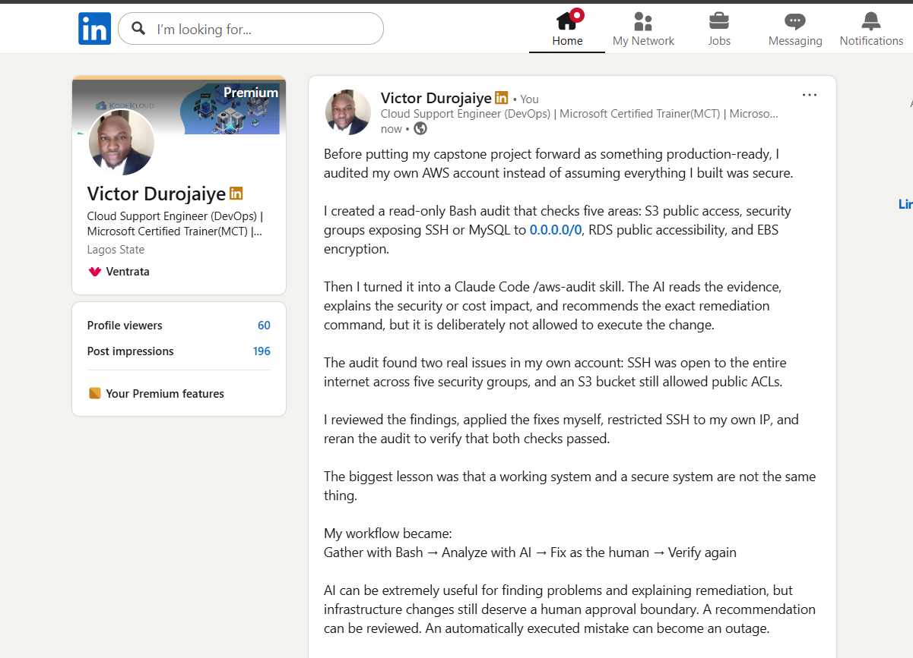

---

# Submission Instructions

Complete all tasks in sequence.

Your submission must include:

- All 13 required task screenshots
- Answers to every **Notes You Must Write** question
- `CLAUDE.md`
- `scripts/aws-audit.sh`
- `.claude/skills/aws-audit/SKILL.md`
- `reports/aws-audit-report.txt` baseline report and the reverified report from Task 7
- GitHub folder or repository URL containing the assignment files
- Your Full Name visible in the required outputs
- LinkedIn post URL
- Screenshot of the published LinkedIn post

Submit only a Google Doc link.

Add the GitHub URL inside the Google Doc.

Follow the Assignment Submission Guidelines.

---

# Completion Checklist

- [x] Task 1: AWS resources confirmed and workspace created (Screenshots 1–2)
- [x] Task 2: `CLAUDE.md` created with project context and safety rules (Screenshot 3)
- [x] Task 3: Claude produced a read-only five-check audit plan before any script existed (Screenshot 4)
- [x] Task 4: `aws-audit.sh` built, executable, and passes `bash -n` (Screenshots 5–7)
- [x] Task 5: Baseline audit captured and saved with Full Name visible (Screenshots 8–9)
- [x] Task 6: `/aws-audit` skill loads and runs successfully with no Write permission (Screenshots 10–11)
- [x] Task 7: A real finding was fixed by you and reverified as PASS (Screenshots 12–13)
- [x] Skill never executed a remediation command
- [x] New security group rule is scoped to your own IP, not `0.0.0.0/0`
- [x] All 13 required task screenshots are included
- [x] All "Notes You Must Write" questions are answered in your own words
- [x] No AWS credentials or unblurred account IDs exposed
- [x] LinkedIn post published and URL submitted
- [x] GitHub URL included in the Google Doc
- [x] Google Doc is accessible
- [x] Link tested in incognito mode

---

# Final Submission

Submit only your Google Doc link.

### Question

Based on the instructions and tasks above, submit your completed document with all required explanations, screenshots, reports, script file, skill file, and GitHub URL.

`Add your Google Doc link here`

---

## 📌 About DMI & CloudAdvisory

DevOps Micro Internship (DMI) is a project-based DevOps program run by Pravin Mishra (The CloudAdvisory) focused on real-world execution, systems thinking, and career readiness.

It helps learners build strong DevOps foundations with hands-on experience.

---

## 📌 Resources

- 🌐 DMI Official Website: https://dmi.pravinmishra.com?utm_source=github&utm_medium=readme  
- 🎓 University: https://university.pravinmishra.com?utm_source=github&utm_medium=readme  
- 💬 Discord Community: https://discord.pravinmishra.com?utm_source=github&utm_medium=readme  
- 📝 Blog: https://dmi.pravinmishra.com/blog?utm_source=github&utm_medium=readme  
- ▶️ YouTube Playlist: https://www.youtube.com/playlist?list=PLFeSNDtI4Cho  
- 🔗 Pravin Mishra (LinkedIn): https://www.linkedin.com/in/pravin-mishra-aws-trainer/  
- 🏢 CloudAdvisory (LinkedIn): https://www.linkedin.com/company/thecloudadvisory/

---

*This submission is part of DevOps Micro Internship (DMI) Cohort 3 — Agentic AI Track.*
