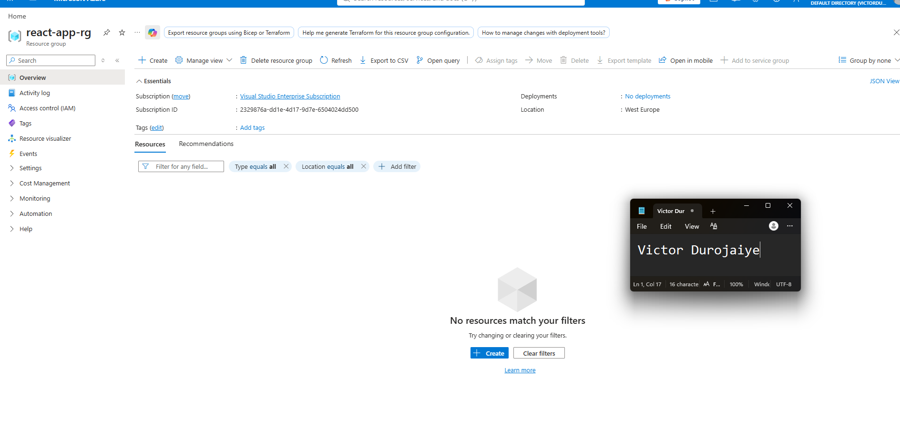
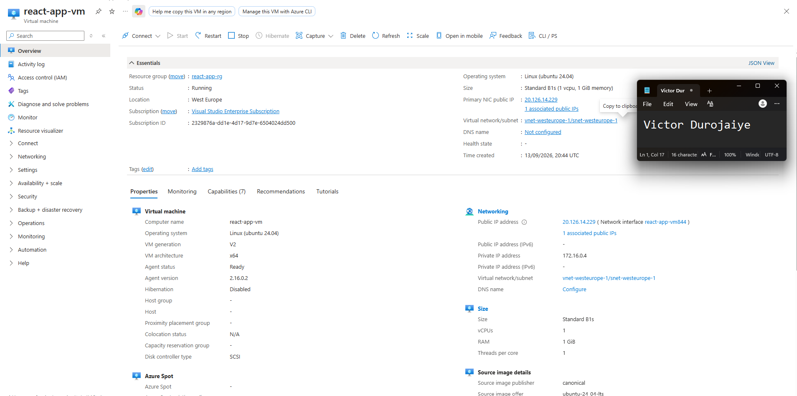
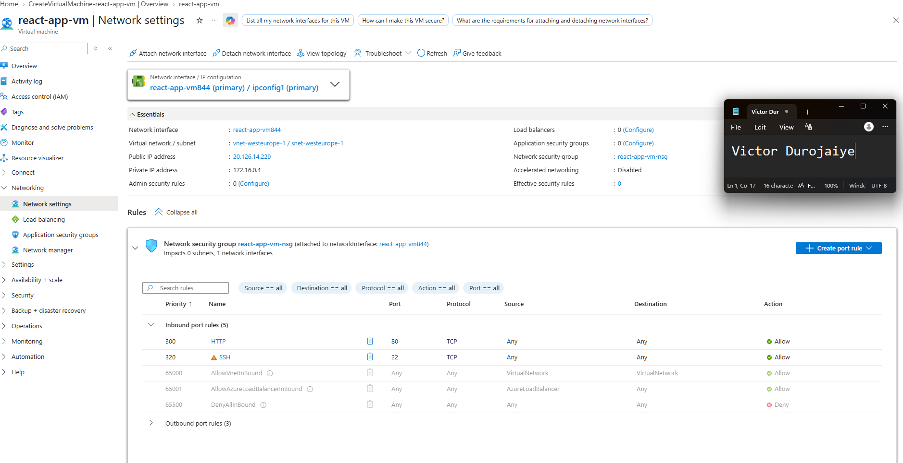
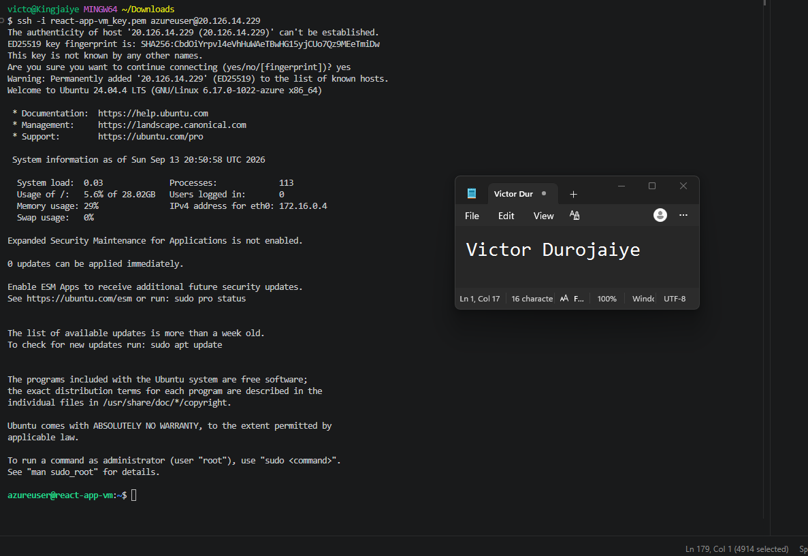
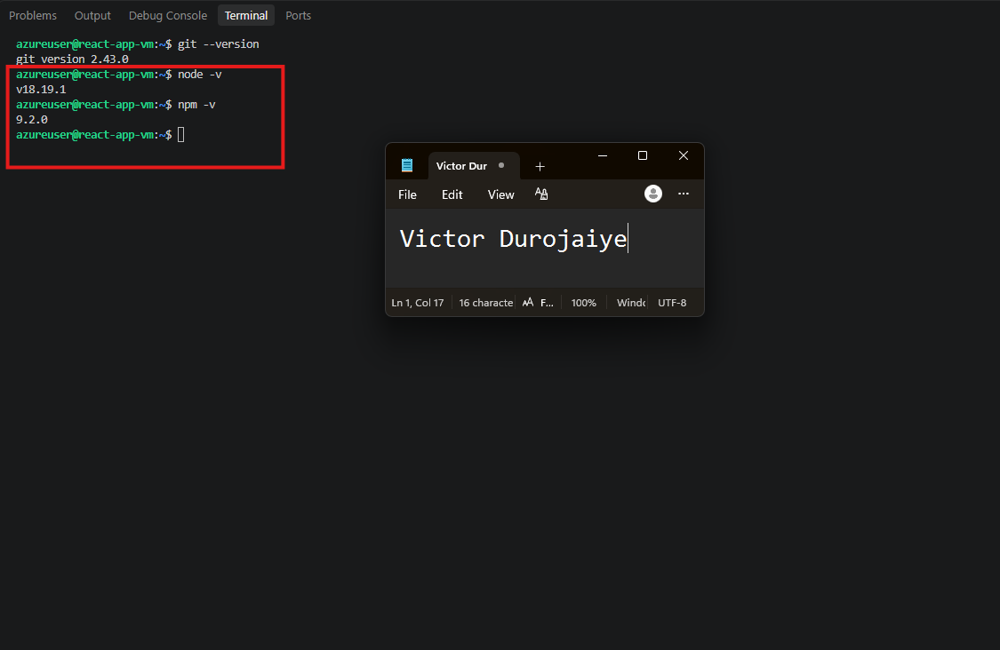
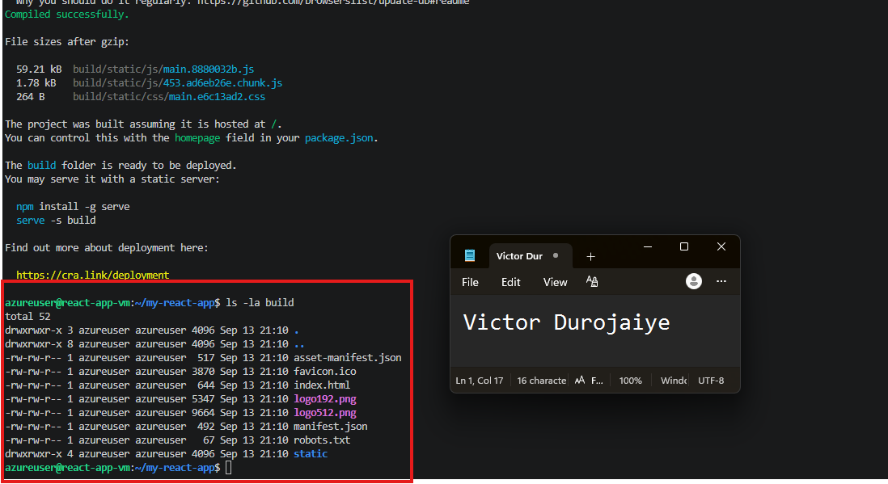
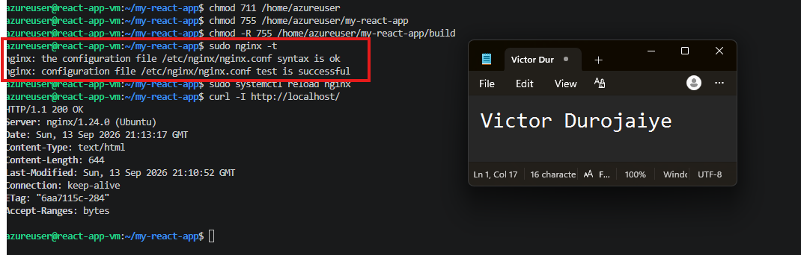
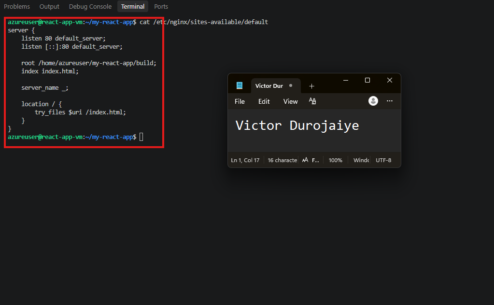
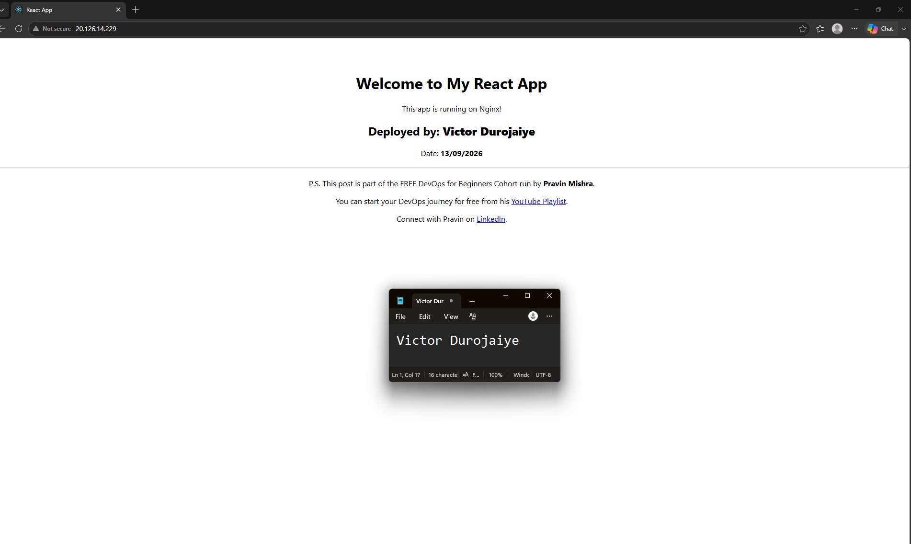
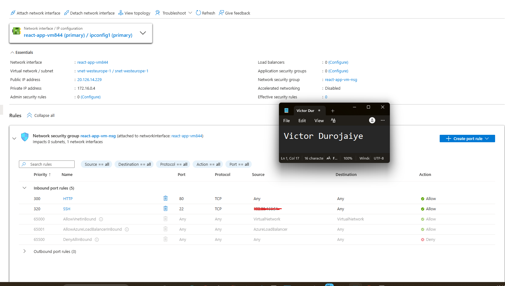

# Assignment 2 — Deploy a React App on an Azure VM (Ubuntu + Nginx)

Part of the DevOps Micro Internship (DMI) Cohort 3 with Agentic AI

---

## Purpose

In this assignment, you will provision a secure Ubuntu virtual machine in Microsoft Azure, build the `my-react-app` React application, and serve the production static build through Nginx. You will validate the deployment from the VM's public IP.

---

# Task 1 — Create a Resource Group

## Goal

Create the Azure Resource Group `react-app-rg` in a region close to you.

### Evidence

#### Screenshot 1 — Resource Group overview showing the name and region

Region: West Europe. I am based in Lagos, and West Europe gave me better routing than the East US and North Europe examples in the walkthrough.

---

# Task 2 — Provision Ubuntu VM (20.04) with Correct Networking

## Goal

Create an Ubuntu 20.04 LTS VM (size B1s) with a Network Security Group allowing SSH (22, restricted to your IP where possible) and HTTP (80).

### Evidence

#### Screenshot 2 — Azure VM overview page showing the VM name, Resource Group, and region

Note: I used Ubuntu Server 24.04 LTS rather than 20.04. Ubuntu 20.04 is past its standard support window, and `apt install nodejs` on 20.04 installs Node 10, which cannot run `react-scripts build`. On 24.04 the same command gives Node 18 and the build completes. Everything else matches the assignment, including the B1s size.

---

#### Screenshot 3 — Network Security Group inbound rules showing ports 22 and 80 allowed

---

# Task 3 — SSH into the Azure VM

## Goal

Connect to the VM over SSH and confirm the Linux prompt is visible.

### Evidence

#### Screenshot 4 — Terminal showing a successful SSH login with the prompt visible

---

# Task 4 — Update OS and Install Prerequisites (Git, Node.js, npm)

## Goal

Update Ubuntu and install Git, Node.js, and npm.

### Evidence

#### Screenshot 5 — Terminal output showing `node -v` and `npm -v`

---

# Task 5 — Clone and Build the React App

## Goal

Clone `my-react-app`, install dependencies, and run `npm run build` to produce the `build/` directory.

### Evidence

#### Screenshot 6 — Terminal showing successful `npm run build` completion and `ls -la build` output

Before building, I replaced the `Your Full Name` and `DD/MM/YYYY` placeholders in the app source with my own name and the deployment date, so the served page shows real values rather than the template defaults.

---

# Task 6 — Install and Configure Nginx to Serve the React Build

## Goal

Install Nginx and configure it to serve the `build/` directory with `try_files $uri /index.html;` for SPA routing support.

### Evidence

#### Screenshot 7 — Successful `sudo nginx -t` output

---

#### Screenshot 8 — Nginx configuration snippet showing the build root and `try_files` directive

Nginx runs as `www-data`, so it also needed execute permission to traverse into `/home/azureuser` before it could read the build folder. Without that it returns 403 even with a correct config.

---

# Task 7 — Test the Deployment (Public IP)

## Goal

Confirm the React app loads through the VM's public IP, navigation works, and a nested route still works after a page refresh.

### Evidence

#### Screenshot 9 — Browser showing the React app with the public IP visible in the address bar

Note: `my-react-app` is a single-page app with no nested routes, so there is no second route to navigate to or refresh on. The `try_files $uri /index.html;` directive is in place and shown in Screenshot 8, so SPA routing would be handled correctly if routes were added. Refreshing the page served the app normally.

---

# Task 8 — Basic Hardening (Recommended)

## Goal

Restrict the SSH Network Security Group rule to your IP if not already restricted, and confirm the firewall does not block port 80.

### Evidence

#### Screenshot 10 (optional) — Network Security Group rule showing SSH restricted to your IP

`sudo ufw status` returned inactive, which is the Ubuntu default on Azure, so nothing at the OS level was blocking port 80. Filtering is handled by the NSG. The source IP is redacted in the screenshot.

---

# Submission Instructions

- Add all required screenshots in your submission
- Do not expose SSH private keys, passwords, or Azure account information

---

# Completion Checklist

- [x] Task 1: Resource Group created (Screenshot 1)
- [x] Task 2: Ubuntu VM provisioned with correct NSG rules (Screenshots 2 & 3)
- [x] Task 3: SSH access verified (Screenshot 4)
- [x] Task 4: Git, Node.js, and npm installed (Screenshot 5)
- [x] Task 5: React app built successfully (Screenshot 6)
- [x] Task 6: Nginx configured with SPA routing support (Screenshots 7 & 8)
- [x] Task 7: App verified via the VM public IP, including route refresh (Screenshot 9)
- [x] Task 8: SSH hardening applied (Screenshot 10, optional)
- [x] No sensitive data exposed

---

## 📌 About DMI & CloudAdvisory

DevOps Micro Internship (DMI) is a project-based DevOps program run by Pravin Mishra (The CloudAdvisory) focused on real-world execution, systems thinking, and career readiness.

It helps learners build strong DevOps foundations with hands-on experience.

---

## 📌 Resources

- 🌐 DMI Official Website: https://dmi.pravinmishra.com?utm_source=github&utm_medium=readme  
- 🎓 University: https://university.pravinmishra.com?utm_source=github&utm_medium=readme  
- 💬 Discord Community: https://discord.pravinmishra.com?utm_source=github&utm_medium=readme  
- 📝 Blog: https://dmi.pravinmishra.com/blog?utm_source=github&utm_medium=readme  
- ▶️ YouTube Playlist: https://www.youtube.com/playlist?list=PLFeSNDtI4Cho  
- 🔗 Pravin Mishra (LinkedIn): https://www.linkedin.com/in/pravin-mishra-aws-trainer/  
- 🏢 CloudAdvisory (LinkedIn): https://www.linkedin.com/company/thecloudadvisory/

---

*This submission is part of DevOps Micro Internship (DMI) Cohort 3 — Agentic AI Track.*
