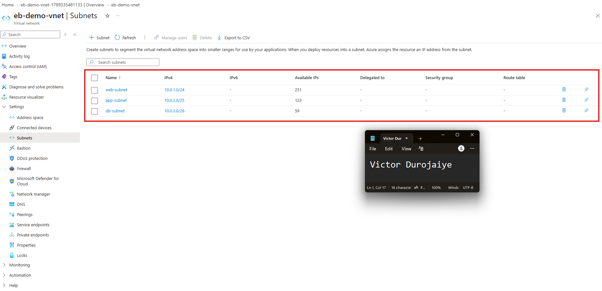
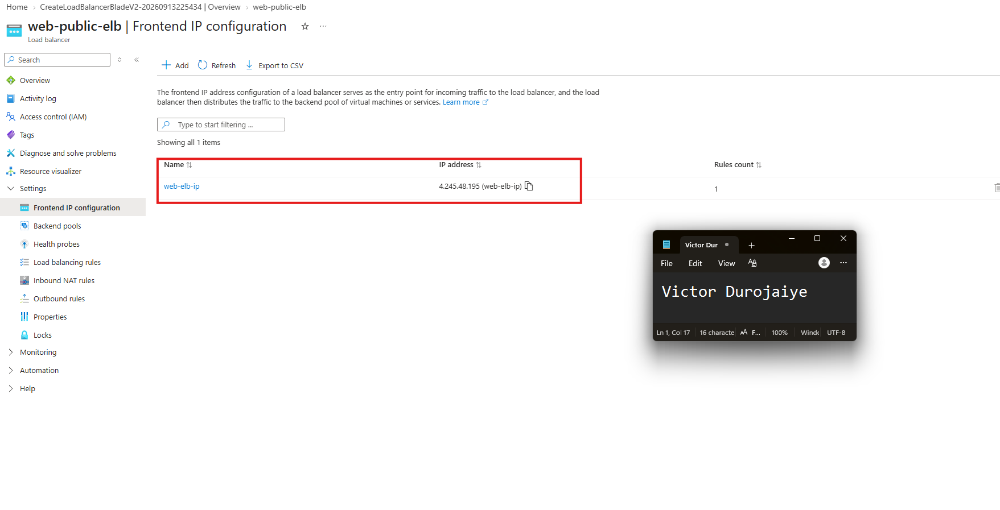
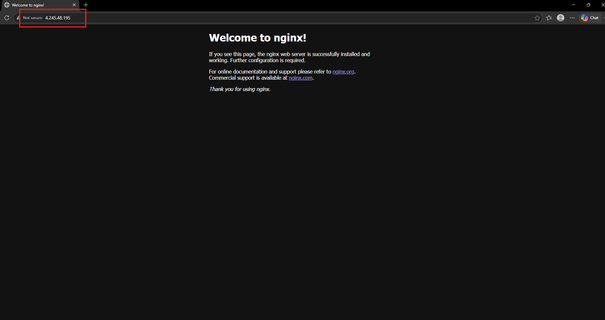

# Assignment 3 — Design a Three-Tier Network with Load Balancer on Azure

Part of the DevOps Micro Internship (DMI) Cohort 3 with Agentic AI

---

## Purpose

In this assignment, you will design and deploy a three-tier network architecture on Azure using a Virtual Network, subnets, a Virtual Machine, NGINX, and a Public Load Balancer. The web, application, and database tiers are separated into dedicated subnets, and a Public Load Balancer provides the application entry point.

---

# Task 1 — Create a Virtual Network with Three Subnets

## Goal

Create `eb-demo-vnet` (10.0.0.0/16) with `web-subnet` (10.0.1.0/24), `app-subnet` (10.0.2.0/25), and `db-subnet` (10.0.3.0/26), inside Resource Group `vnet-demo-rg`.

### Evidence

#### Screenshot 1 — Subnet configuration screen showing the three subnets and Bastion subnet (if enabled)

I did not enable Azure Bastion, so there is no AzureBastionSubnet in the list. Bastion is the better production pattern for reaching VMs without opening port 22 to the internet, but this assignment gives the VM its own public IP and SSHes to it directly, so Bastion would have added cost without being used. Everything was built in West Europe, the closest practical region to me in Lagos.

---

# Task 2 — Deploy the Web VM and Install NGINX

## Goal

Create Ubuntu 22.04 LTS VM `web-nginx` in `web-subnet` with a public IP and inbound SSH (22) and HTTP (80), then install and start NGINX and verify the default page via the VM's public IP.

> No screenshot required for this task. Completion is verified through Task 4.

I used the Standard_B1s size, which is enough to serve a static NGINX page and keeps the cost down. Before building the load balancer I confirmed the NGINX welcome page loaded on the VM's own public IP. That ordering matters: the health probe checks TCP port 80, so if NGINX were not already running the backend would never be marked healthy and the Task 4 test would fail for a reason that looks like a load balancer problem.

---

# Task 3 — Create a Public Load Balancer

## Goal

Create Standard Public Load Balancer `web-public-elb` with frontend IP `web-elb-ip`, backend pool `web-backend-pool` (containing `web-nginx`), a TCP port-80 health probe `web-health-probe`, and load-balancing rule `web-http-rule`.

### Evidence

#### Screenshot 2 — Load Balancer frontend IP configuration

---

# Task 4 — Test the Architecture

## Goal

Confirm the NGINX default page is reachable through the Load Balancer's public IP.

### Evidence

#### Screenshot 3 — Browser showing the NGINX welcome page through the Load Balancer Public IP

This is the same page served in Task 2, but reached through the load balancer's frontend IP rather than the VM's own. Testing the VM directly first and the load balancer second is what makes a failure diagnosable: if the VM works and the load balancer does not, the problem is in the frontend, backend pool, probe, or rule, not in the web server.

---

# Task 5 — Clean Up Resources

## Goal

After capturing all required evidence, delete the `vnet-demo-rg` Resource Group to avoid ongoing charges.

> No screenshot required for this task.

All three screenshots were captured before deleting anything. Deleting the resource group removed the VNet, the three subnets, the VM and its disk, the NIC, the NSG, both public IPs, and the whole load balancer configuration in a single action. The Standard load balancer and its public IPs bill by the hour whether or not traffic flows, so leaving them running after the evidence is captured is pure waste.

---

# Submission Instructions

- Add all required screenshots in your submission
- Capture all evidence before deleting the Resource Group
- Do not expose passwords or sensitive Azure account information

---

# Completion Checklist

- [x] Task 1: VNet and three subnets created (Screenshot 1)
- [x] Task 2: Web VM created and NGINX installed and verified
- [x] Task 3: Public Load Balancer configured (Screenshot 2)
- [x] Task 4: NGINX reachable through the Load Balancer public IP (Screenshot 3)
- [x] Task 5: Resource Group deleted after evidence was captured
- [x] No sensitive data exposed

---

## 📌 About DMI & CloudAdvisory

DevOps Micro Internship (DMI) is a project-based DevOps program run by Pravin Mishra (The CloudAdvisory) focused on real-world execution, systems thinking, and career readiness.

It helps learners build strong DevOps foundations with hands-on experience.

---

## 📌 Resources

- 🌐 DMI Official Website: https://dmi.pravinmishra.com?utm_source=github&utm_medium=readme  
- 🎓 University: https://university.pravinmishra.com?utm_source=github&utm_medium=readme  
- 💬 Discord Community: https://discord.pravinmishra.com?utm_source=github&utm_medium=readme  
- 📝 Blog: https://dmi.pravinmishra.com/blog?utm_source=github&utm_medium=readme  
- ▶️ YouTube Playlist: https://www.youtube.com/playlist?list=PLFeSNDtI4Cho  
- 🔗 Pravin Mishra (LinkedIn): https://www.linkedin.com/in/pravin-mishra-aws-trainer/  
- 🏢 CloudAdvisory (LinkedIn): https://www.linkedin.com/company/thecloudadvisory/

---

*This submission is part of DevOps Micro Internship (DMI) Cohort 3 — Agentic AI Track.*
