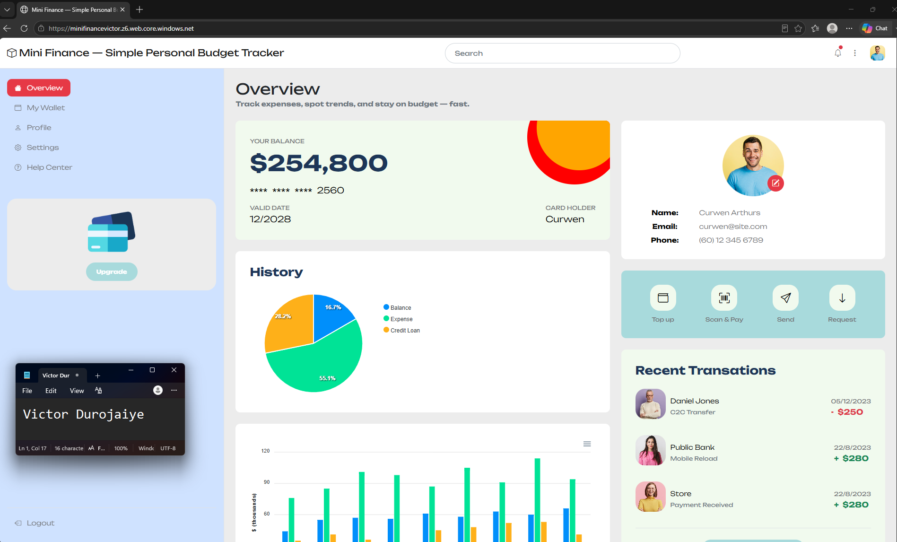

# Assignment 4 — Host a Static Website on Azure Storage

Part of the DevOps Micro Internship (DMI) Cohort 3 with Agentic AI

---

## Purpose

In this assignment, you will deploy the Mini Finance static web application directly from an Azure Storage Account by enabling Static Website Hosting. The completed website must be publicly accessible through the Azure Storage primary endpoint URL.

---

# Task 1 — Download the Mini Finance Application

## Goal

Download and extract the Mini Finance static website files (`index.html`, `style.css`, images, and other assets) from `https://github.com/pravinmishraaws/mini_finance`.

> No screenshot required for this task.

I cloned the repository with Git rather than downloading the ZIP. Extracting the ZIP produces a `mini_finance-main` wrapper folder, and uploading that folder instead of its contents would put `index.html` one level below the container root, where the static website endpoint would never find it.

---

# Task 2 — Create a Storage Account and Enable Static Website Hosting

## Goal

Create Resource Group `mini-finance-rg` and a globally unique Storage Account named `minifinance<uniqueid>` (Standard performance, LRS redundancy), then enable Static Website Hosting with `index.html` as the index document.

> No screenshot required for this task. Completion is verified through Task 4.

I built this with the Azure CLI instead of the portal. Everything went into West Europe, the same region I used for the rest of Week 7.

---

# Task 3 — Upload Your Website Files

## Goal

Upload all Mini Finance project files to the `$web` container.

> No screenshot required for this task.

I used `az storage blob upload-batch` rather than uploading through the portal, because the site references its assets by relative path (`css/`, `images/`, `js/`) and the batch upload preserves the folder tree in one command. Uploading the files flat through the portal is what makes the page load unstyled.

Two things came up here that were worth learning:

The first upload attempt failed with a permissions error even though my account had just created the storage account. Creating a storage account is a control-plane action, but reading and writing the blobs inside it is a separate data-plane permission that is not granted automatically. The options are to assign the Storage Blob Data Contributor role or to authenticate with the account key. I used the account key.

I also deleted the `.git` directory from the cloned folder before uploading. `upload-batch` does not skip hidden directories, so the repository history would otherwise have been published to a public web endpoint.

---

# Task 4 — Test Your Website

## Goal

Open the primary endpoint URL and confirm the Mini Finance application, styling, and images all load correctly.

### Evidence

#### Screenshot 1 — Mini Finance website running in the browser

The page loads through the static website endpoint (`*.web.core.windows.net`) rather than the raw blob URL, with stylesheets, images, fonts, and the chart scripts all resolving correctly. No VM, no web server, and no server-side code involved. Azure Storage is serving the site itself.

---

#### Website URL

Paste the Azure Storage static website URL here:

`https://minifinancevictor.z6.web.core.windows.net/`

---

# Submission Instructions

- Add the required screenshot and URL in your submission
- Do not expose subscription identifiers or other sensitive account information

---

# Completion Checklist

- [x] Mini Finance project downloaded and extracted
- [x] Storage Account created with Static Website Hosting enabled
- [x] All website files uploaded to the `$web` container
- [x] Website verified through the primary endpoint (Screenshot 1)
- [x] Website URL included
- [x] No sensitive account information exposed

---

## 📌 About DMI & CloudAdvisory

DevOps Micro Internship (DMI) is a project-based DevOps program run by Pravin Mishra (The CloudAdvisory) focused on real-world execution, systems thinking, and career readiness.

It helps learners build strong DevOps foundations with hands-on experience.

---

## 📌 Resources

- 🌐 DMI Official Website: https://dmi.pravinmishra.com?utm_source=github&utm_medium=readme  
- 🎓 University: https://university.pravinmishra.com?utm_source=github&utm_medium=readme  
- 💬 Discord Community: https://discord.pravinmishra.com?utm_source=github&utm_medium=readme  
- 📝 Blog: https://dmi.pravinmishra.com/blog?utm_source=github&utm_medium=readme  
- ▶️ YouTube Playlist: https://www.youtube.com/playlist?list=PLFeSNDtI4Cho  
- 🔗 Pravin Mishra (LinkedIn): https://www.linkedin.com/in/pravin-mishra-aws-trainer/  
- 🏢 CloudAdvisory (LinkedIn): https://www.linkedin.com/company/thecloudadvisory/

---

*This submission is part of DevOps Micro Internship (DMI) Cohort 3 — Agentic AI Track.*
