# Assignment 5 — Deploy EpicBook Web App on Azure VM with Azure Database for MySQL

Part of the DevOps Micro Internship (DMI) Cohort 3 with Agentic AI

---

## Purpose

In this assignment, you will deploy the EpicBook web application on Azure using an Ubuntu Virtual Machine to host the frontend and backend, and Azure Database for MySQL Flexible Server (private access) to store user and product data. You will build the network, provision the resources, deploy the application, and prove that the complete user flow works through the VM's public IP.

> **Deployment note.** The entire stack is deployed in **Sweden Central**. The first build was attempted in West Europe, where this subscription is blocked from provisioning Azure Database for MySQL Flexible Server. The request is refused at validation. Because private access (VNet Integration) requires the database server to sit in the same region as the VNet, one blocked resource type forced the whole stack to be rebuilt in a different region.

---

# Task 1 — Create Network Infrastructure

## Goal

Create a VNet (10.0.0.0/16) with a public subnet (10.0.1.0/24) for the VM and a private subnet (10.0.2.0/24) for MySQL, with NSGs allowing HTTP (80)/SSH (22) publicly and MySQL (3306) only from the VM subnet, plus a Public IP and Network Interface for the VM.

### Evidence

#### Screenshot 1 — Virtual Network overview showing the 10.0.0.0/16 address space and both subnets

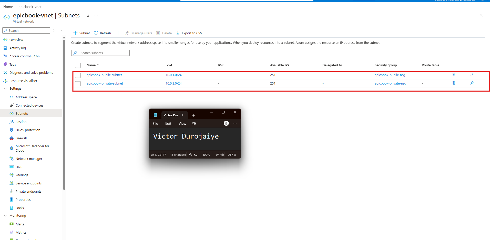

`epicbook-vnet` carries the 10.0.0.0/16 address space. `epicbook-public-subnet` is 10.0.1.0/24 and holds the VM. `epicbook-private-subnet` is 10.0.2.0/24 and is delegated to `Microsoft.DBforMySQL/flexibleServers` so it can host the MySQL Flexible Server.

---

#### Screenshot 2 — Public and private NSG inbound rules showing ports 80, 22, and restricted 3306 access

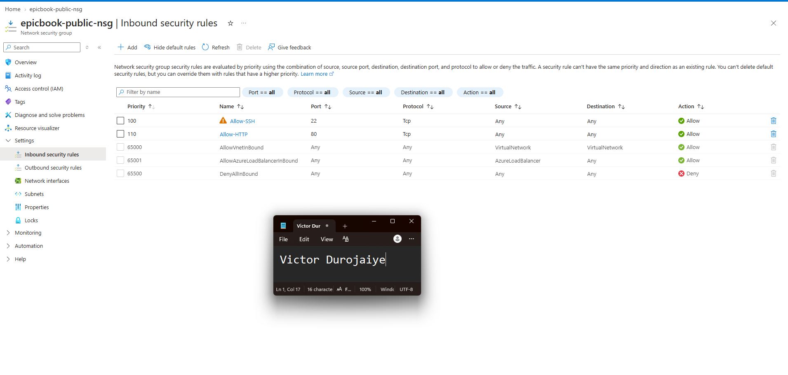

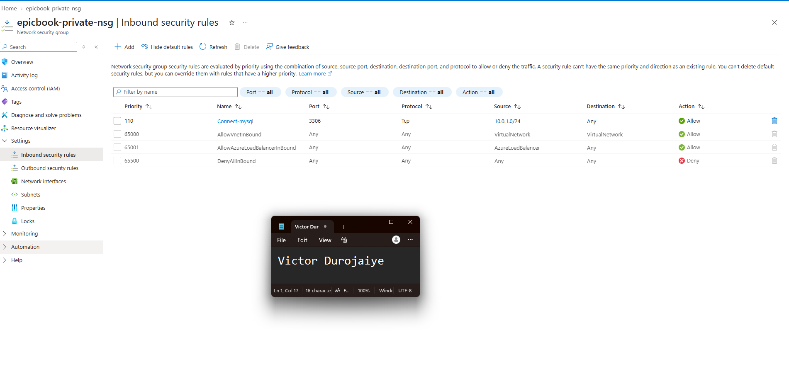

`epicbook-public-nsg` allows SSH on port 22 at priority 100 and HTTP on port 80 at priority 110, and is associated with the public subnet.

`epicbook-private-nsg` allows MySQL on port 3306 at priority 110 with the source restricted to **10.0.1.0/24**, the VM subnet only, and is associated with the private subnet. The walkthrough sets this rule's source to Any. That would allow inbound 3306 from anywhere the subnet is reachable, so the assignment requirement was followed instead of the walkthrough.

---

#### Screenshot 3 — Public IP and Network Interface association for the Virtual Machine

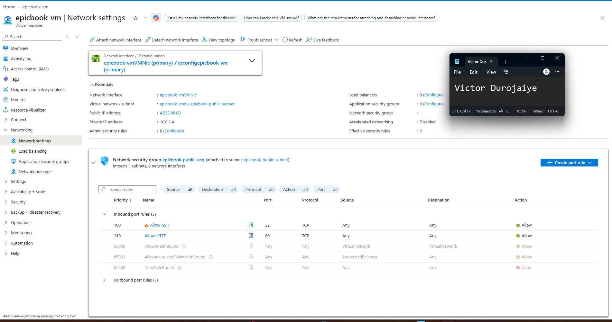

`epicbook-vm-public-ip` is a Standard SKU static address. Static allocation means the address does not change between deployment and testing, so the URL recorded in this submission stays valid. The blade shows the public IP bound to the VM network interface and to `epicbook-vm`.

The network interface does not exist until the Virtual Machine is created, so this association evidence was captured after Task 2 provisioning completed.

---

# Task 2 — Provision Azure Virtual Machine

## Goal

Launch an Ubuntu 22.04 LTS VM (Standard B1s or equivalent) in the public subnet, and install Node.js, npm, Nginx, Git, and MySQL Client.

### Evidence

#### Screenshot 4 — Virtual Machine overview showing Ubuntu, size, public IP, and subnet

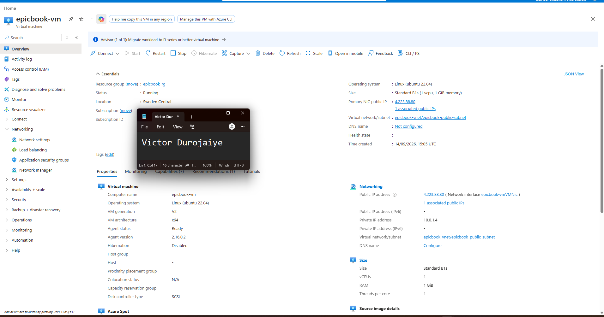

`epicbook-vm` runs Ubuntu 22.04 LTS on a Standard_B1s with Standard SSD storage. It sits in `epicbook-vnet/epicbook-public-subnet` and is reachable on 4.223.88.80. The VM was created with no NIC level network security group, so the public subnet NSG is the only inbound control point.

---

#### Screenshot 5 — Terminal showing successful software installation or installed-version checks

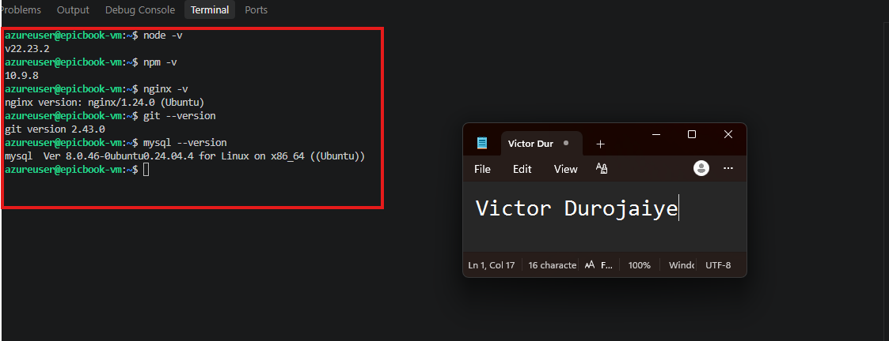

Installed versions: Node.js v22.23.2, npm 10.9.8, nginx 1.18.0, git 2.34.1, mysql client 8.0.46.

Node.js was installed from the NodeSource repository rather than from Ubuntu's own `nodejs` package, which ships a version too old for this application's dependencies.

---

# Task 3 — Deploy the EpicBook Application

## Goal

Clone the EpicBook repository, install dependencies, build the frontend, configure Nginx to serve it, and configure the Node.js/Express.js backend to connect to MySQL using environment variables.

> **Note on the goal wording.** Two parts of this goal do not match the application as it is actually built, so the deployment differs from the wording in a way worth recording rather than faking.
>
> **There is no frontend build step.** `package.json` defines only `start` and `lint` scripts, with no `build`. The dependencies are `express`, `express-handlebars`, `sequelize` and `mysql2`. There is no React, no bundler and no static build output. EpicBook is a single Express application that renders server side Handlebars templates and serves its own assets from `public/` through `express.static`. Nginx is therefore configured as a reverse proxy to the Express process on port 8080, not as a server for a separate frontend build.
>
> **The backend does not read environment variables.** `dotenv` is absent from the dependency list and no `.env` file is used. Sequelize reads `config/config.json` and selects the `development` block because `NODE_ENV` is unset on this VM. Database credentials were supplied there.

### Evidence

#### Screenshot 6 — Terminal showing the EpicBook repository cloned and dependencies installed

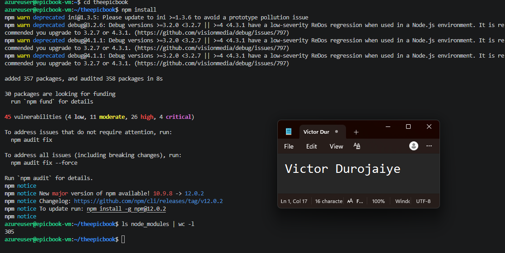

The repository was cloned to `~/theepicbook` and `npm install` added 357 packages. `ls node_modules | wc -l` returns 305 entries.

---

#### Screenshot 7 — Nginx configuration or service status proving the frontend is configured to be served

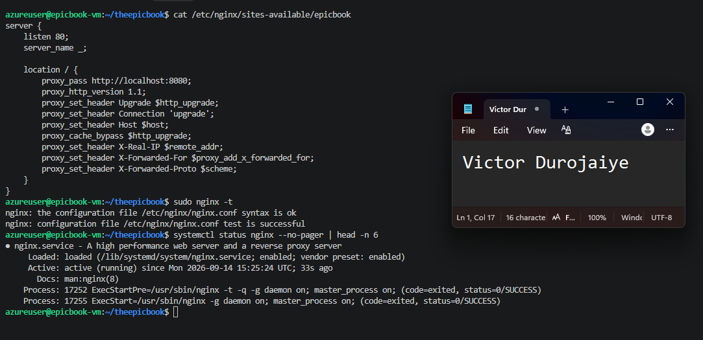

`/etc/nginx/sites-available/epicbook` listens on port 80 and proxies all traffic to `http://localhost:8080`. The site is symlinked into `sites-enabled` and the default site was removed. `nginx -t` reports the configuration valid and the service is active and running.

---

#### Screenshot 8 — Backend process or listening-port evidence (without exposing environment-variable secrets)

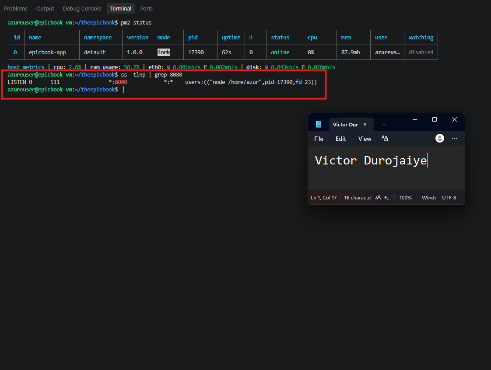

`epicbook-app` runs under PM2 with status online and zero restarts. `ss -tlnp` confirms the node process listening on port 8080. `pm2 save` and `pm2 startup` registered a systemd unit so the application survives both SSH disconnects and VM reboots.

Process and port evidence was used here deliberately. The application's credentials live in `config/config.json`, so that file is never displayed in any screenshot in this submission.

---

# Task 4 — Setup Azure Database for MySQL

## Goal

Create a private Azure Database for MySQL Flexible Server (VNet Integration) in the private subnet, create the database user and schema, import the SQL dump, and restrict access to the VM subnet only.

### Evidence

#### Screenshot 9 — MySQL Flexible Server overview showing Private access (VNet Integration)

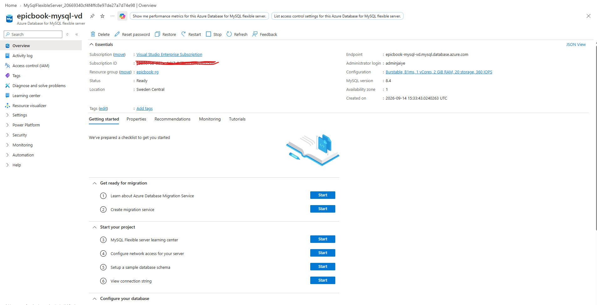

`epicbook-mysql-vd` is an Azure Database for MySQL Flexible Server in Sweden Central, Development/Test workload tier, with MySQL authentication only and a custom administrator account. It has no public endpoint.

The server was created through Advanced Create. Quick Create defaults to public access, and the connectivity method cannot be changed after the server is provisioned.

---

#### Screenshot 10 — Networking configuration showing the private subnet and restricted access

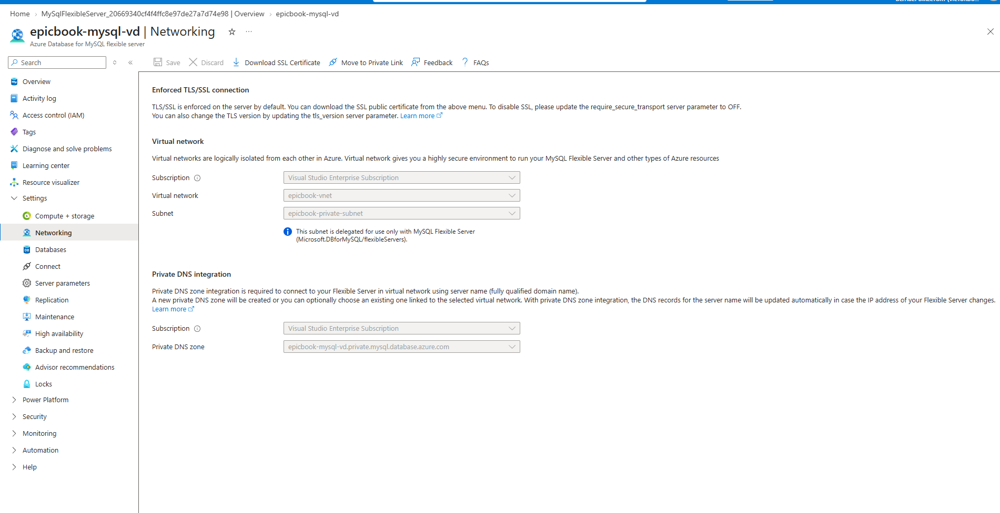

Connectivity is Private access (VNet Integration) into `epicbook-vnet/epicbook-private-subnet`, with the portal confirming the subnet is delegated for use only with MySQL Flexible Server. Private DNS integration resolves the server name to its private address inside the VNet. TLS is enforced on the server.

A server in private access mode has no public endpoint and therefore no firewall rules table. Access restriction is enforced at two layers instead: the server is only reachable from inside the VNet, and `epicbook-private-nsg` permits inbound 3306 only from 10.0.1.0/24, shown in Screenshot 2.

---

#### Screenshot 11 — MySQL Client output showing the EpicBook database or imported tables (no password visible)

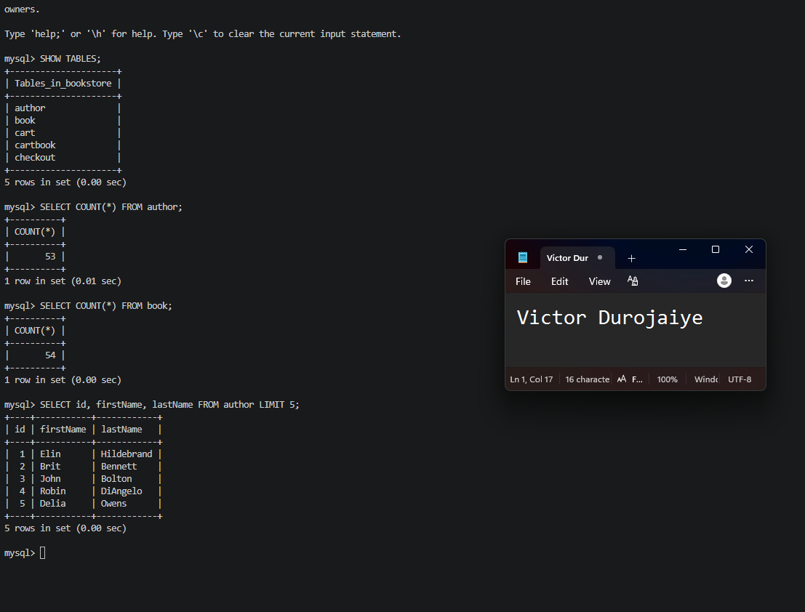

The `bookstore` database contains five tables created by `sequelize.sync()` on first application start: author, book, cart, cartbook and checkout. Row counts after importing the seed files confirm 53 authors and 54 books.

`sequelize.sync()` creates table structure only and inserts no data. The seed files in the project's `db` folder, `author_seed.sql` and `books_seed.sql`, were imported separately through the MySQL Client. Authors were imported first, since book records reference author ids.

The database name is `bookstore` exactly, because that value is hardcoded in the application's Sequelize configuration.

---

# Task 5 — Test End-to-End Functionality

## Goal

Confirm the EpicBook application loads through the VM's public IP and that viewing products, adding items to the cart, and placing orders all work.

### Evidence

#### Screenshot 12 — Browser showing the EpicBook application with the Virtual Machine public IP visible

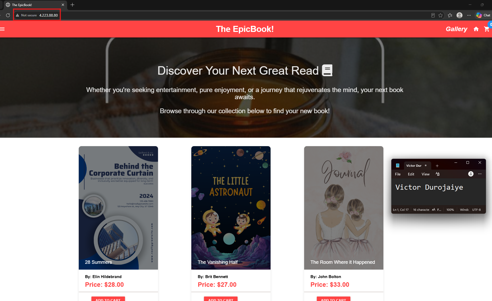

EpicBook serves over HTTP at the VM public IP, with Nginx proxying to the Express application on port 8080.

---

#### Screenshot 13 — Proof of a successful database-backed action (viewing products, adding to cart, or placing an order)

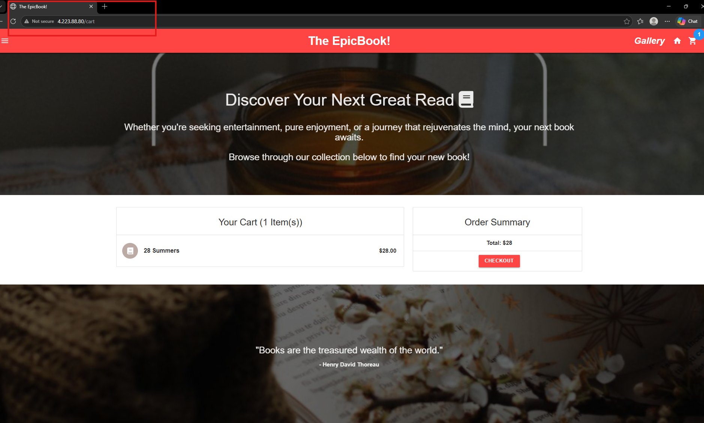

The catalogue renders records read from the `book` and `author` tables on the private MySQL Flexible Server, and a cart action writes back to the database. The page could not render this content unless the VM reached the private database successfully across the VNet.

---

#### Public IP URL

Paste the public IP URL of your Virtual Machine here:

`http://4.223.88.80`

---

# Submission Instructions

- Add all required screenshots in your submission
- Include the Virtual Machine public IP URL
- Do not expose database passwords, connection strings, or subscription IDs

---

# Completion Checklist

- [x] Task 1: Network foundation created with public/private subnets and NSGs (Screenshots 1–3)
- [x] Task 2: VM provisioned and required software installed (Screenshots 4–5)
- [x] Task 3: EpicBook frontend and backend deployed (Screenshots 6–8)
- [x] Task 4: Private Azure Database for MySQL created and data imported (Screenshots 9–11)
- [x] Task 5: End-to-end functionality validated (Screenshots 12–13, Public IP URL)
- [x] No sensitive data exposed

---

## 📌 About DMI & CloudAdvisory

DevOps Micro Internship (DMI) is a project-based DevOps program run by Pravin Mishra (The CloudAdvisory) focused on real-world execution, systems thinking, and career readiness.

It helps learners build strong DevOps foundations with hands-on experience.

---

## 📌 Resources

- 🌐 DMI Official Website: https://dmi.pravinmishra.com?utm_source=github&utm_medium=readme  
- 🎓 University: https://university.pravinmishra.com?utm_source=github&utm_medium=readme  
- 💬 Discord Community: https://discord.pravinmishra.com?utm_source=github&utm_medium=readme  
- 📝 Blog: https://dmi.pravinmishra.com/blog?utm_source=github&utm_medium=readme  
- ▶️ YouTube Playlist: https://www.youtube.com/playlist?list=PLFeSNDtI4Cho  
- 🔗 Pravin Mishra (LinkedIn): https://www.linkedin.com/in/pravin-mishra-aws-trainer/  
- 🏢 CloudAdvisory (LinkedIn): https://www.linkedin.com/company/thecloudadvisory/

---

*This submission is part of DevOps Micro Internship (DMI) Cohort 3 — Agentic AI Track.*
