# Assignment 6 — Capstone: Deploy Book Review App (Three-Tier Architecture) on Azure

Part of the DevOps Micro Internship (DMI) Cohort 3 with Agentic AI

---

## Purpose

This is the most important assignment of the course. You will deploy the Book Review App in a production-ready, best-practice-compliant three-tier architecture on Azure: separated presentation, application, and database tiers, least-privilege network access, a controlled public entry point, protected secrets, and availability/monitoring evidence.

> **Region note.** The entire stack runs in **Sweden Central**. This subscription is blocked from provisioning Azure Database for MySQL Flexible Server in West Europe, and private access requires the database in the same region as the VNet, so one blocked resource type determined the region for every resource in the deployment.

---

# Task 1 — Design the Azure Three-Tier Architecture

## Goal

Create an architecture diagram and implementation plan identifying the presentation, application, and database components, the chosen Azure services, the public entry point, and the internal traffic paths.

### Evidence

#### Screenshot 1 — Architecture diagram showing the public entry point, three tiers, network boundaries, and traffic flow

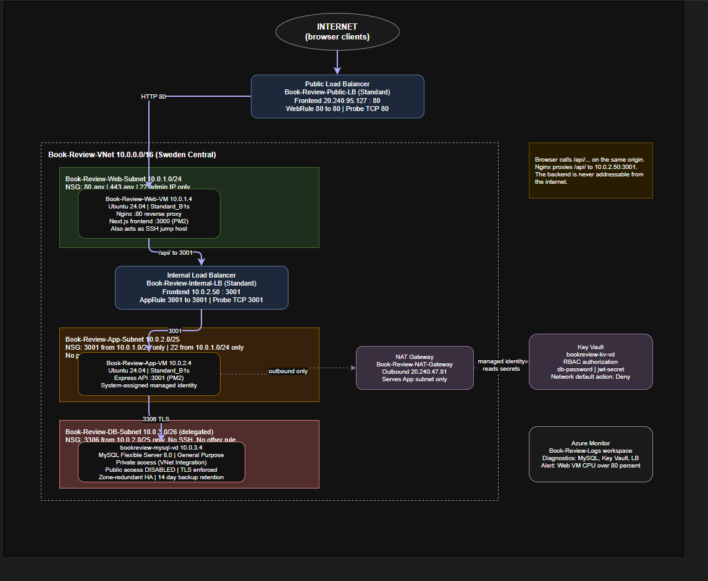

The public entry point is a Standard Load Balancer. Traffic reaches the Web tier, where Nginx splits it between the local Next.js frontend and the application tier via an Internal Load Balancer. The application tier connects to a private MySQL Flexible Server. Each subnet boundary is enforced by its own NSG, and only the Web subnet accepts traffic originating outside the VNet.

---

#### Screenshot 2 — Written architecture assumptions and selected Azure services

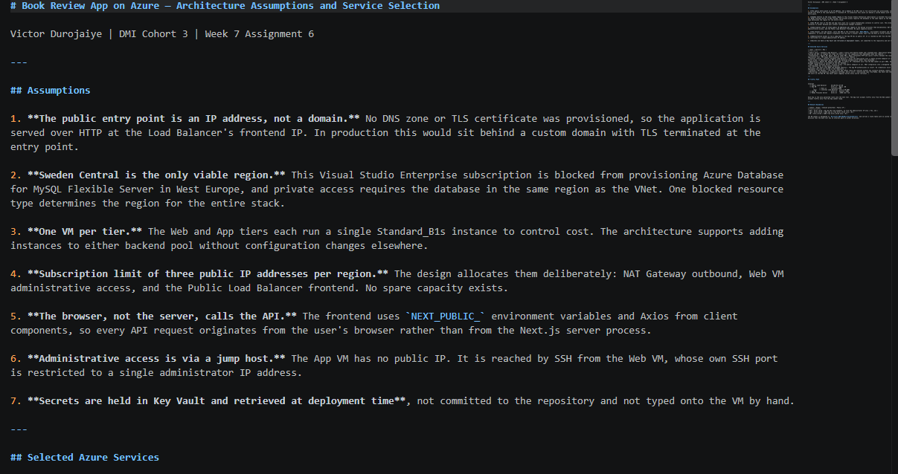
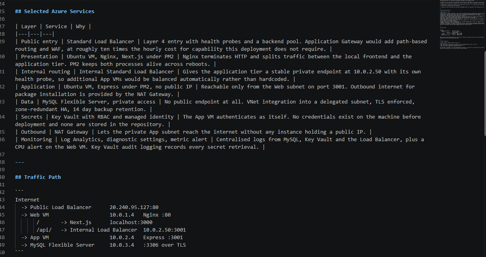
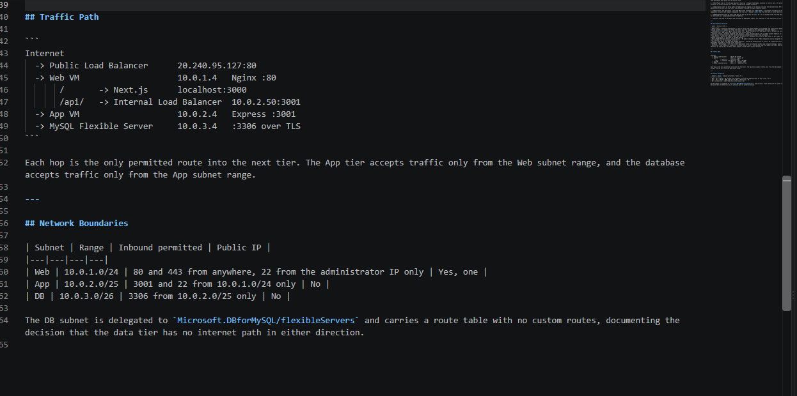

---

# Task 2 — Create the Azure Network Foundation

## Goal

Create a dedicated Resource Group and VNet with separate subnets for the web, application, and database tiers, keeping the application and database tiers without direct public access.

### Evidence

#### Screenshot 3 — Resource Group overview showing the assignment resources

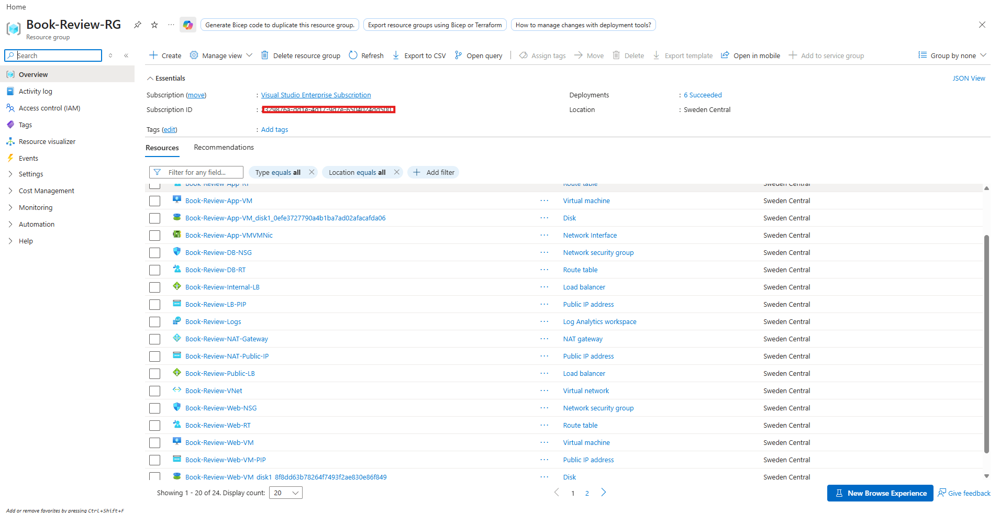

`Book-Review-RG` holds the complete deployment: the VNet and three route tables, the NAT Gateway and its public IP, three NSGs, both Virtual Machines, both Load Balancers, the MySQL Flexible Server and its private DNS zone, the Key Vault, and the Log Analytics workspace.

---

#### Screenshot 4 — VNet overview showing the address space and all required subnets

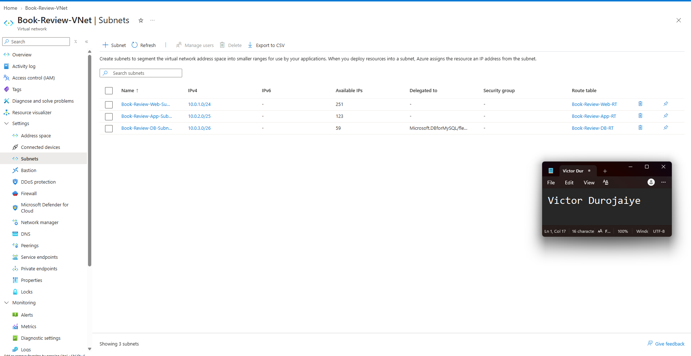

`Book-Review-VNet` uses 10.0.0.0/16. The Web subnet is 10.0.1.0/24, the App subnet is 10.0.2.0/25, and the DB subnet is 10.0.3.0/26. The sizes differ deliberately: the Web and App tiers may need to scale out, while the database tier holds a single managed service. The DB subnet is delegated to `Microsoft.DBforMySQL/flexibleServers`, which is a prerequisite for private access.

---

#### Screenshot 5 — Route-table or Private DNS evidence where applicable

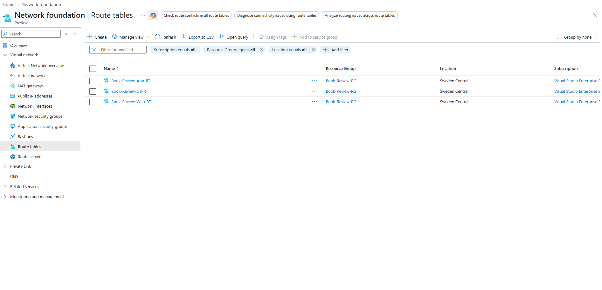

Three route tables, one per tier, each associated with its own subnet. The Web table routes 0.0.0.0/0 to Internet. The App table carries the same route, with outbound traffic actually leaving through the NAT Gateway, since NAT association is applied at the subnet and takes precedence for outbound flows. The DB table deliberately contains **no** custom routes, documenting that the data tier has no internet path in either direction.

Private DNS evidence appears in Screenshot 13, where the MySQL server's private zone is visible on the Networking blade.

---

# Task 3 — Configure Security and Secret Management

## Goal

Apply least-privilege NSG rules so traffic flows Internet → public entry point → web tier → application tier → database tier, and store credentials in Azure Key Vault or another approved secure mechanism.

### Evidence

#### Screenshot 6 — NSG rules proving least-privilege access between the tiers

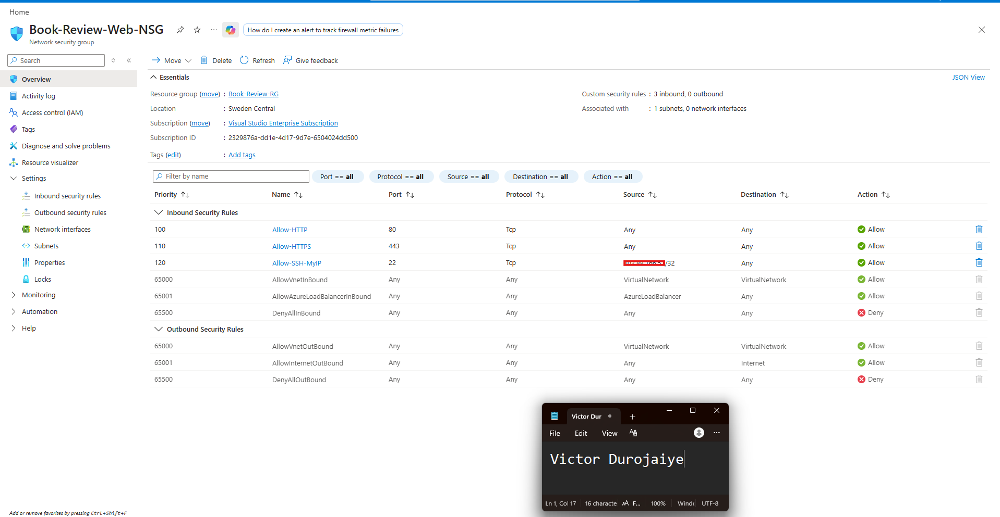

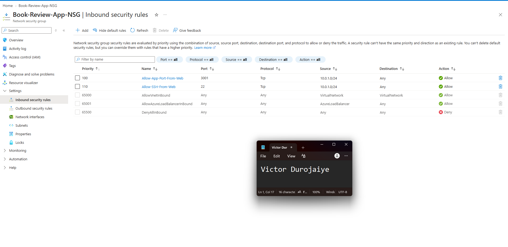

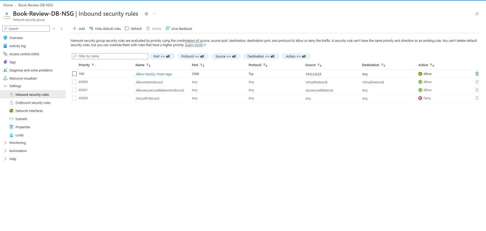

Three captures, one per tier, because the least-privilege argument is the relationship between them rather than any single rule set.

`Book-Review-Web-NSG` allows 80 and 443 from any source, since real users need to load the application, and 22 from a single administrator IP address rather than from anywhere.

`Book-Review-App-NSG` allows 3001 and 22 **only from 10.0.1.0/24**, the Web subnet. Nothing on the internet can address this tier, and nothing outside the Web tier can reach it inside the VNet either.

`Book-Review-DB-NSG` allows 3306 **only from 10.0.2.0/25**, the App subnet, and nothing else. There is no SSH rule and no second rule of any kind. That deliberate emptiness is the point: the database has no legitimate reason to accept any other traffic.

The chain is therefore Internet → Web NSG → App NSG → DB NSG, with each tier reachable only from the one in front of it.

Azure's built-in `AllowAzureLoadBalancerInBound` default rule at priority 65001 was left in place in all three NSGs. Health probes originate from Azure's infrastructure address rather than from the subnet ranges above, so removing it would silently break both Load Balancer backend pools.

---

#### Screenshot 7 — Key Vault or approved secret-management configuration (without displaying secret values)

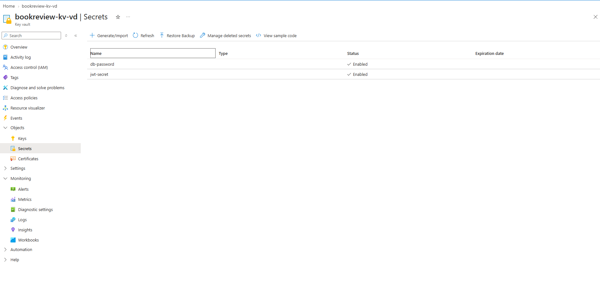

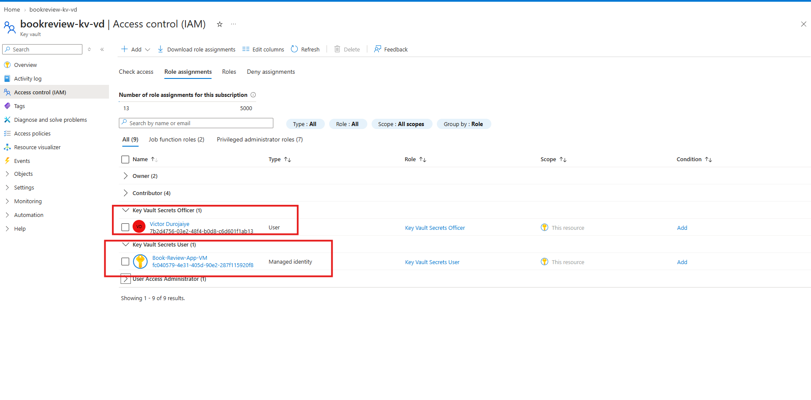

`bookreview-kv-vd` holds two secrets, `db-password` and `jwt-secret`, shown by name with values never displayed.

Access is RBAC-based rather than access-policy based. Two assignments exist: the administrator account as **Key Vault Secrets Officer**, and the App VM's system-assigned managed identity as **Key Vault Secrets User**, which is read-only on secret values.

The App VM therefore authenticates as itself with `az login --identity`, retrieves both secrets at deployment time, and writes them into its `.env` file. No credential is ever typed on the VM, committed to the repository, or transmitted from the administrator's machine.

The vault's network access is additionally restricted with a default action of Deny and two allowed addresses: the administrator IP and the NAT Gateway's outbound address, which is how the App VM egresses.

The database password was rotated mid-deployment after the Azure CLI printed it in plaintext in its server-creation output. The rotation updated both the server and the vault in one step, and the exposed value was never used by the application.

---

# Task 4 — Deploy the Presentation (Web) Tier

## Goal

Deploy the Book Review App presentation layer on the approved web-tier compute service, configured to route requests to the internal application-tier endpoint, and not directly exposed except through the public entry service.

### Evidence

#### Screenshot 8 — Web-tier compute overview showing subnet and availability configuration

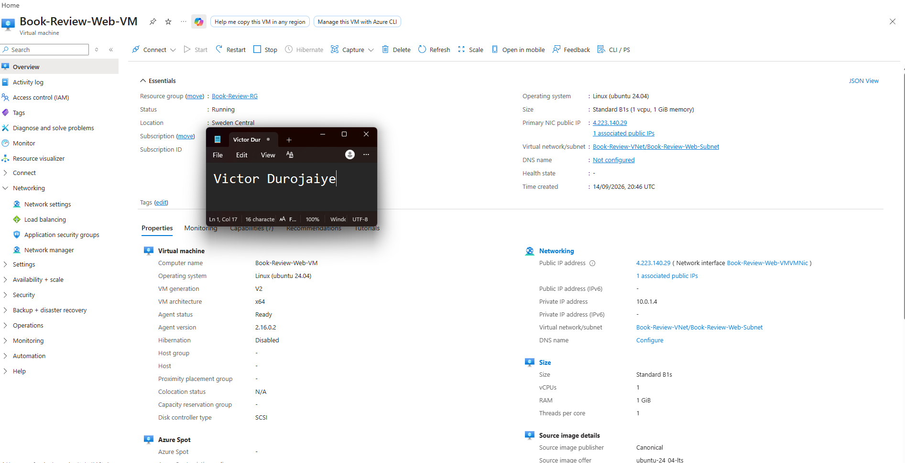

`Book-Review-Web-VM` runs Ubuntu 24.04 LTS on a Standard_B1s in `Book-Review-VNet/Book-Review-Web-Subnet`. It holds a Standard SKU public IP, required for membership of a Standard Load Balancer backend pool, and serves as the administrative jump host for the private tiers.

No NIC-level NSG was attached. The subnet NSG is the single control point, which avoids evaluating the same rules twice and leaves one place to look when traffic is blocked.

---

#### Screenshot 9 — Terminal or service output proving the presentation layer is running

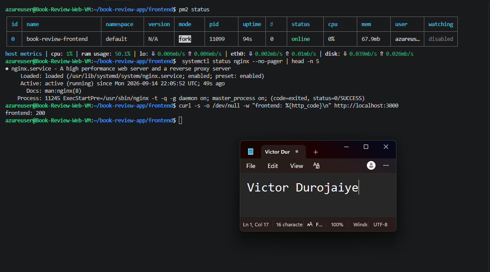

Nginx is active and the Next.js frontend runs under PM2, which is registered with systemd so both survive reboots as well as SSH disconnects.

Nginx serves as a reverse proxy rather than a static file server. Requests to `/api/` are forwarded to the Internal Load Balancer, and everything else is proxied to the Next.js process on port 3000.

---

# Task 5 — Deploy the Business (Application) Tier

## Goal

Deploy the Book Review App backend privately in the application subnet, configured to use the private database endpoint and secured environment values, reachable only through its internal endpoint.

### Evidence

#### Screenshot 10 — Application-tier compute overview showing private subnet placement

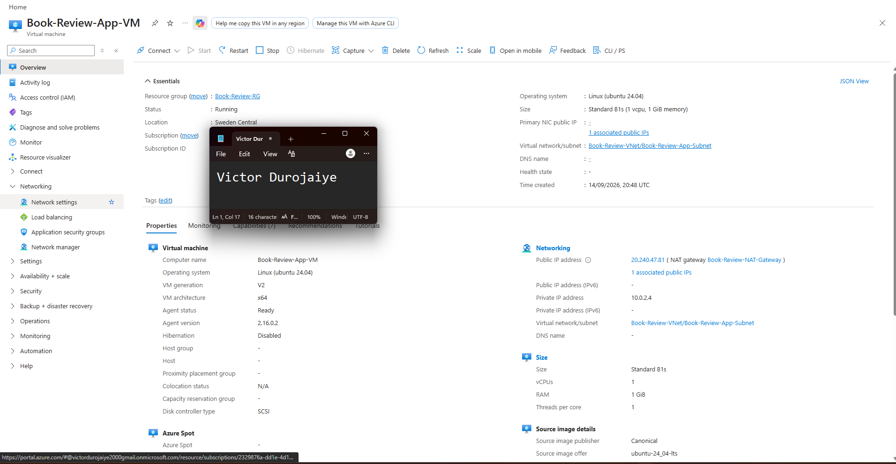

`Book-Review-App-VM` sits in `Book-Review-App-Subnet` with the private address 10.0.2.4 and **no public IP address at all**. The empty public IP field next to the private one is the evidence. It carries a system-assigned managed identity, which is what grants it read access to Key Vault.

Outbound internet access for package installation is provided by the NAT Gateway, so the VM can pull from apt and npm without ever being addressable from the internet.

---

#### Screenshot 11 — Backend process, service, or listening-port evidence

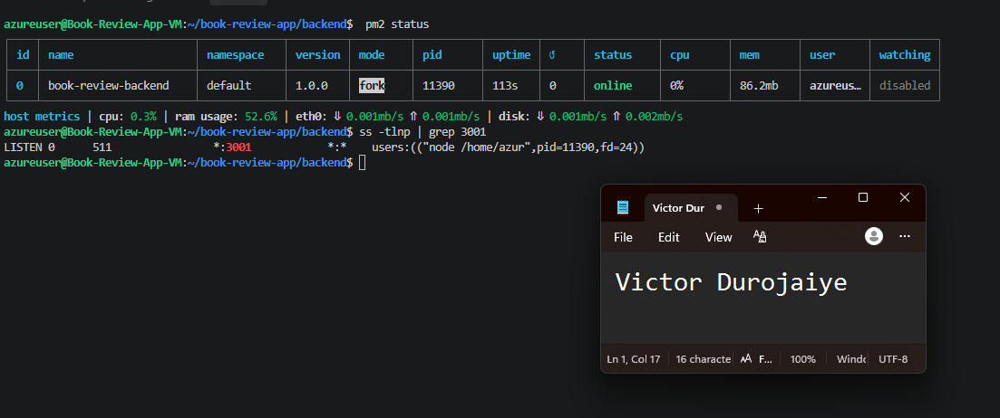

The Express backend runs under PM2 with status online and zero restarts, and `ss -tlnp` confirms the process listening on port 3001.

Process and port evidence was used deliberately in place of displaying configuration. The application's `.env` file holds both the database password and the JWT secret in plaintext on disk, so it is never displayed in any capture in this submission.

---

#### Screenshot 12 — Internal health-check or API response (without exposing secrets)

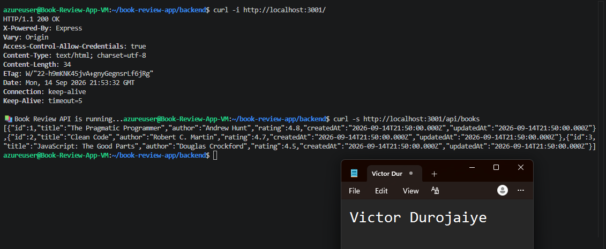

The backend's root path returns its health message and `/api/books` returns the seeded book records as JSON. That second response is the stronger proof: the data can only have come from the private MySQL server, so a successful response demonstrates the application tier reaching the database tier across the VNet with TLS.

---

# Task 6 — Deploy the Managed Database Tier

## Goal

Create a private Azure managed database (public access disabled), with availability/backup/retention settings, the Book Review App schema imported, and access restricted to the application tier only.

### Evidence

#### Screenshot 13 — Database overview showing private connectivity and public access disabled

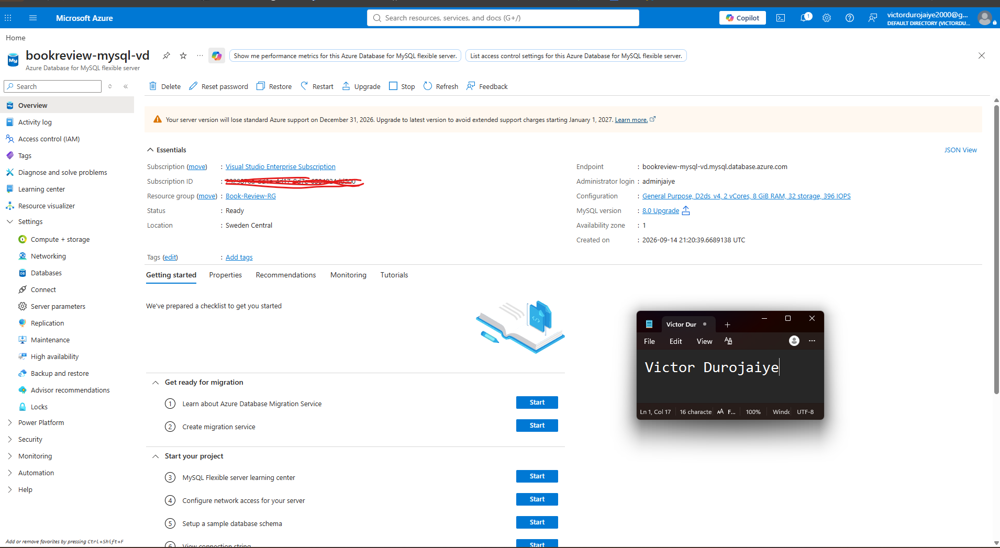

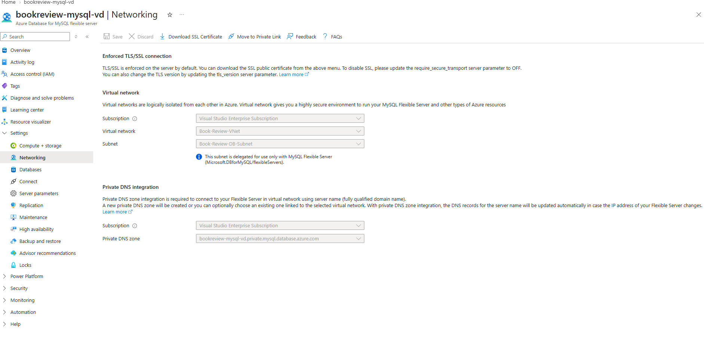

`bookreview-mysql-vd` is a MySQL Flexible Server 8.0 on the General Purpose tier in Sweden Central, with public network access **Disabled**.

Connectivity is Private access (VNet Integration) into `Book-Review-DB-Subnet`, with the portal confirming the subnet is delegated for use only with MySQL Flexible Server. A private DNS zone resolves the server name to its private address from inside the VNet, and TLS is enforced on the server.

A server in private access mode has no public endpoint and therefore no firewall rules table. Access restriction is enforced at two layers instead: the server is unreachable from outside the VNet, and `Book-Review-DB-NSG` permits inbound 3306 only from the App subnet, shown in Screenshot 6.

The connectivity method cannot be changed after creation, so private access was selected at provisioning time rather than corrected afterwards.

---

#### Screenshot 14 — Availability, backup, and retention configuration

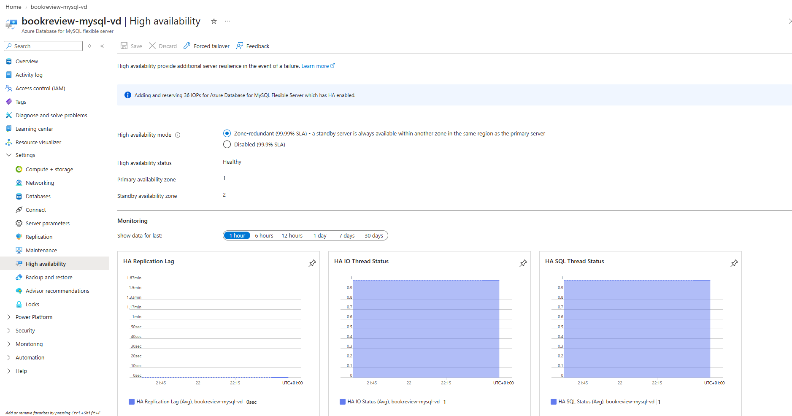

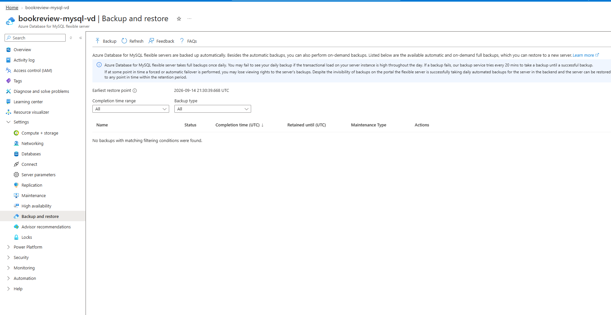

Zone-redundant High Availability is enabled with a standby in a separate availability zone, and backup retention is set to 14 days rather than the 7 day default.

High Availability required moving from the Burstable tier to General Purpose, since Burstable does not support it, and both zone redundancy and the backup configuration can only be set at creation time.

Geo-redundant backup was requested but rejected by the platform, which reported that the region does not support the geo-restore feature. The backup strategy is therefore zone-redundant rather than geo-redundant, which is a regional limitation rather than a configuration choice.

---

#### Screenshot 15 — Successful schema or connectivity verification (without exposing credentials)

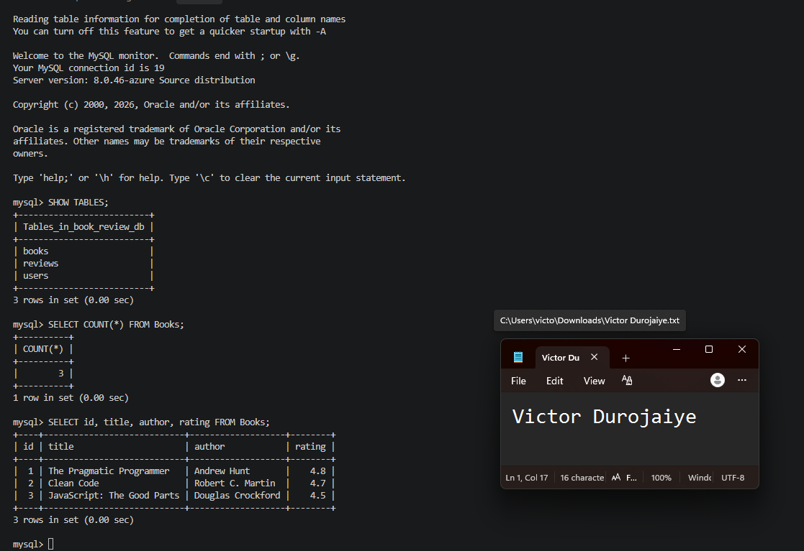

The `book_review_db` database contains the Users, Books and Reviews tables created by the application's Sequelize models on first start, along with the seeded records.

The MySQL client was invoked with the password supplied through an environment variable read from Key Vault, so no credential appears on screen and none was typed by hand. The connection succeeded over TLS, which the server enforces.

---

# Task 7 — Configure Traffic Management, Availability, and Monitoring

## Goal

Configure the approved public entry service with health probes and backend pools, internal routing for the application tier where required, and enable Azure Monitor/diagnostics/logs/alerts for the key resources.

### Evidence

#### Screenshot 16 — Public entry service showing listener, frontend endpoint, and healthy web targets

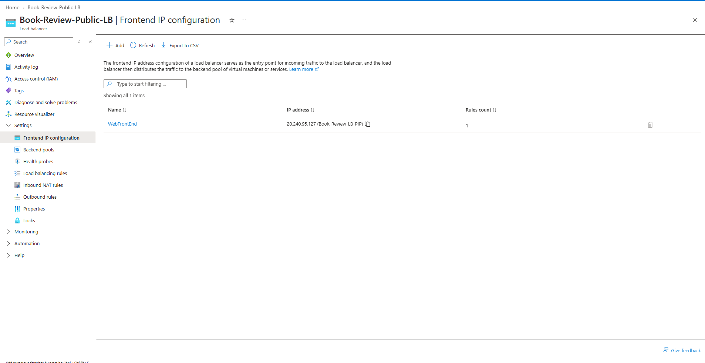

`Book-Review-Public-LB` is a Standard Load Balancer with a static frontend IP configuration, a load balancing rule forwarding port 80 to port 80, a TCP health probe on port 80, and a backend pool containing the Web VM.

The template's wording asks for a listener, which is Application Gateway terminology. A Standard Load Balancer expresses the same concept as a frontend IP configuration bound to a load balancing rule and a health probe. Application Gateway would additionally provide path-based routing and a WAF, at roughly ten times the hourly cost for capability this deployment does not require. The Load Balancer was selected accordingly and the mapping is noted here rather than glossed over.

---

#### Screenshot 17 — Internal application-tier load-balancing or routing configuration where applicable

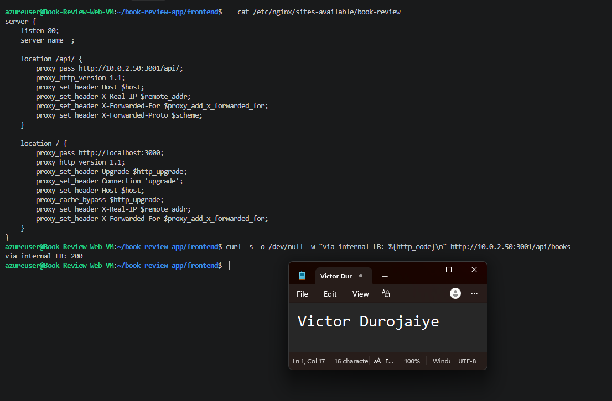

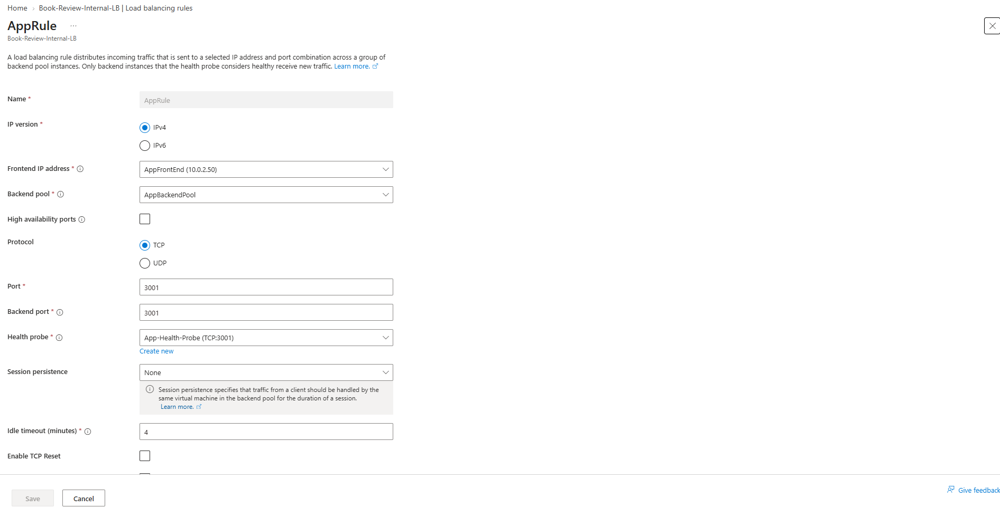

`Book-Review-Internal-LB` has no public IP. Its frontend is the private address 10.0.2.50 inside the App subnet, with a rule and a TCP health probe both on port 3001, and a backend pool containing the App VM.

Nginx on the Web VM forwards `/api/` to that internal frontend rather than directly to the App VM's private address. Traffic therefore flows Web tier → Internal Load Balancer → App tier, which means additional App VMs could be added to the pool and would receive balanced, health-checked traffic with no change to the Nginx configuration.

**Port correction.** The step-by-step solution specifies port 5000 for the Internal Load Balancer rule and probe, while its own `.env` template sets `PORT=3001` and its App NSG rule opens 3001. Following it literally produces a backend pool that never becomes healthy, because the probe checks a port nothing listens on, and an Nginx proxy target with no matching rule. The application's `server.js` defaults to 5000 only when `PORT` is unset. Since `.env` sets it explicitly, 3001 is the port in use, and 3001 was applied consistently to the `.env` value, the NSG rule, the Load Balancer rule, the health probe and the Nginx proxy target.

---

#### Screenshot 18 — Azure Monitor, diagnostic settings, logs, metrics, or alert evidence

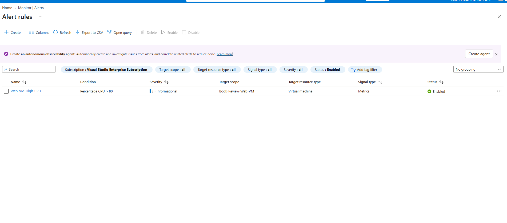

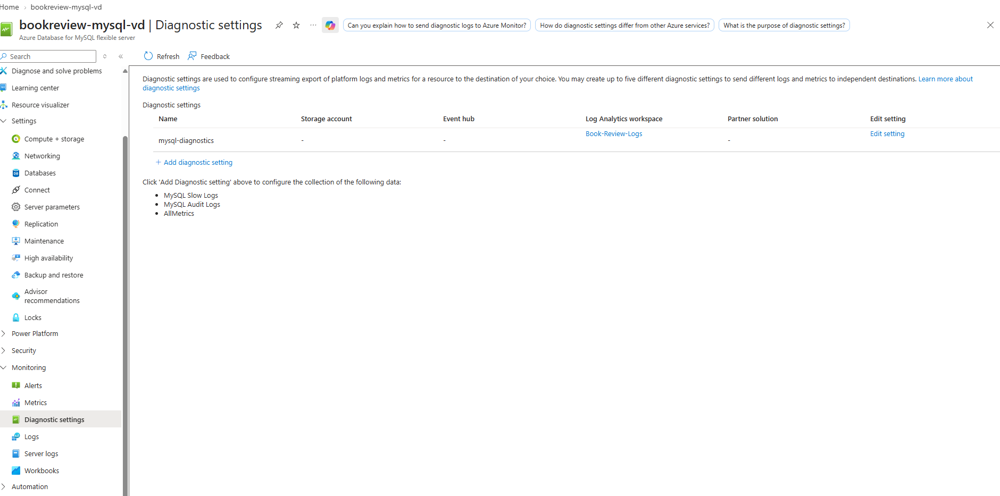

A Log Analytics workspace, `Book-Review-Logs`, collects diagnostics from the MySQL server, the Key Vault and the Load Balancer. A metric alert rule fires when the Web VM's CPU exceeds 80 percent over a five minute window.

The Key Vault audit log is the most useful of these. It records every secret retrieval, including the App VM managed identity's pulls at deployment time, which makes the secret management in Task 3 auditable rather than merely configured.

---

# Task 8 — Validate the Production-Style Deployment

## Goal

Confirm the Book Review App works end to end through the public endpoint, with at least one database read and one write, confirm private tiers are not internet-reachable, and complete a safe availability test.

### Evidence

#### Screenshot 19 — Browser showing the Book Review App through the public endpoint

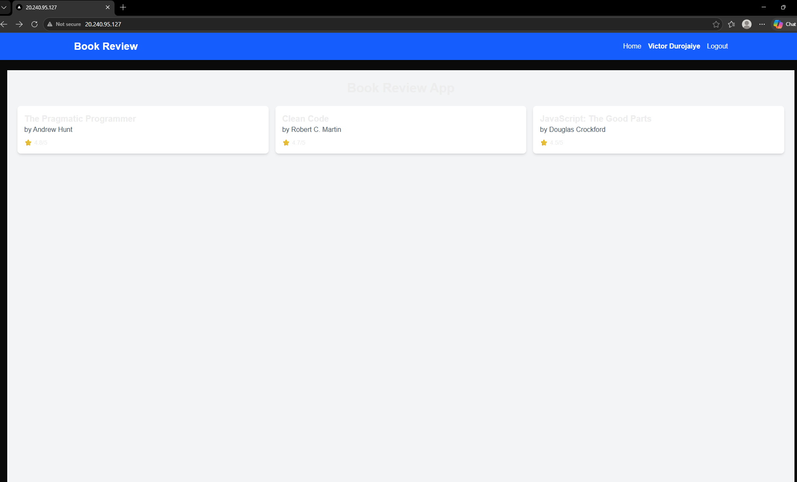

The application loads at the Load Balancer's frontend IP with the book catalogue rendered from the database.

---

#### Screenshot 20 — Proof of successful database-backed read and write operations

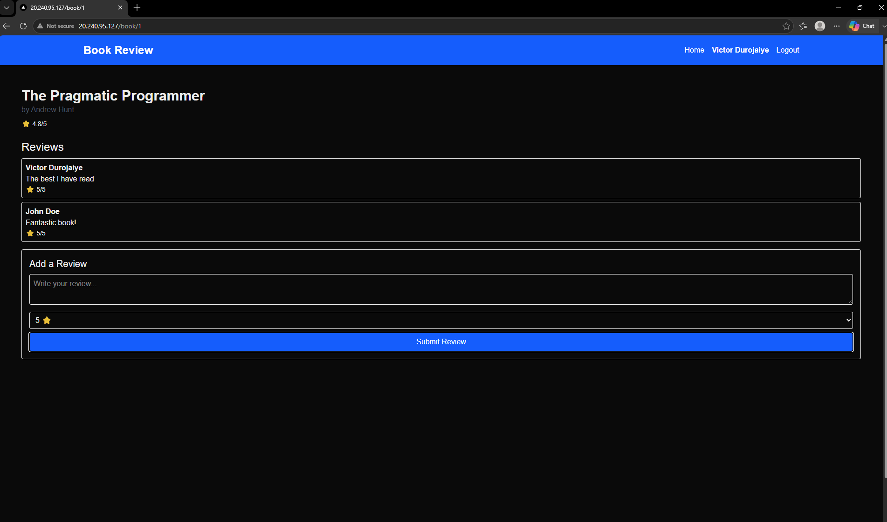

The read is the book detail and the pre-existing review, retrieved from the Books and Reviews tables. The write is a new user account registered through the public endpoint and a review posted against that account, which appears immediately with the registered username.

Both operations traversed the full chain: browser, Public Load Balancer, Nginx, Internal Load Balancer, Express, and the private MySQL server, and back.

The seeded sample users could not be used for this test. Their passwords are stored in the application's seed data as literal strings rather than bcrypt hashes, so they fail authentication by design. A new account was registered instead, which exercises the write path more completely.

---

#### Screenshot 21 — Evidence that private tiers are not publicly accessible

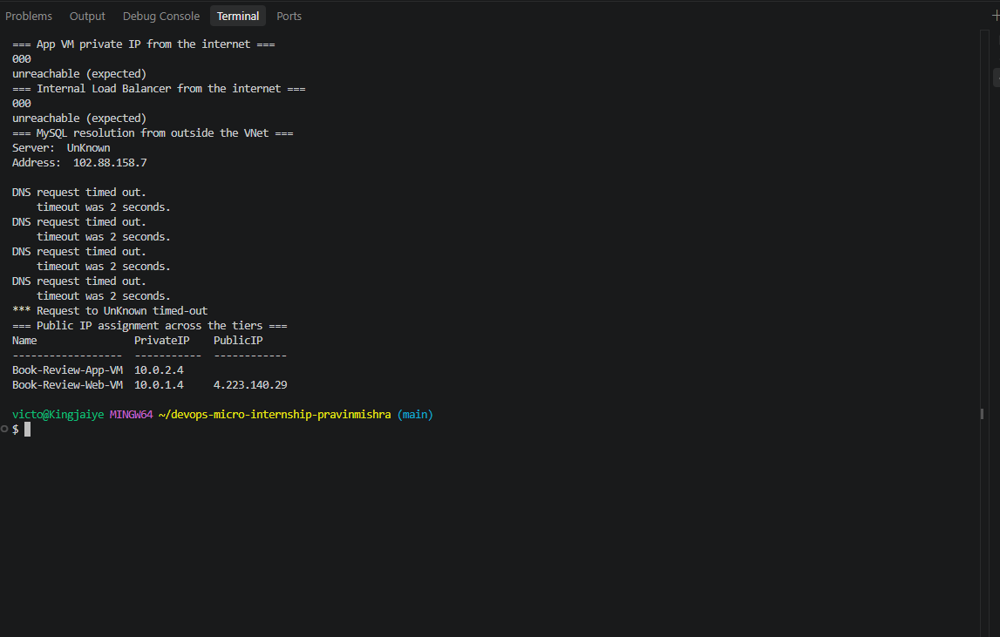

Requests from outside the VNet to the App VM's private address and to the Internal Load Balancer's frontend both fail, since RFC1918 addresses are not routable across the internet. The App VM's public IP field is empty. The MySQL server resolves differently from outside the VNet than it does from inside, where it returns 10.0.3.4 through the private DNS zone.

That contrast is the strongest single piece of evidence here: the same hostname resolves to a private address from the Web VM and to nothing usable from outside.

---

#### Screenshot 22 — Availability-test and healthy-target evidence

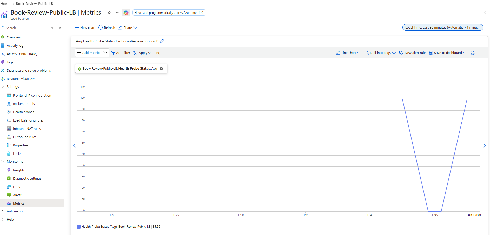

The Load Balancer's Health Probe Status metric shows the target steady at 100 percent healthy, dropping to 0 when Nginx was deliberately stopped on the Web VM, and recovering to 100 percent once the service was restarted.

This deployment ran a single Web VM for cost reasons, so the test demonstrates probe-driven failure detection and recovery rather than failover. With one target in the pool, the application is genuinely unavailable during the outage window, and the chart reflects that honestly. Adding a second VM to `WebBackendPool` would provide true redundancy with no other configuration change, since the rule, probe and pool are already in place.

---

#### Public Endpoint

Paste your public endpoint URL here:

`http://20.240.95.127`

---

### Notes

Summarize what worked, issues encountered and how they were fixed, and the availability/security/secrets/monitoring/backup choices made.

**What worked.** The network foundation, the two-tier Load Balancer design, private database access and Key Vault integration all came up without rework. Building the network, security and routing before any compute meant the VMs joined a working environment rather than being retrofitted into one. The Internal Load Balancer in particular paid for itself: the application tier gained a stable endpoint that survives instance replacement.

**Issue 1: contradictory ports in the reference material.** The solution document specifies port 5000 for the Internal Load Balancer rule and probe, 3001 in its `.env` template, and 3001 in its App NSG rule. The application's `server.js` uses `process.env.PORT || 5000`, so the `.env` value wins and the backend listens on 3001. Following the document literally would have produced a permanently unhealthy backend pool and a proxy target with no matching rule. Resolved by reading the source rather than the documentation and applying 3001 consistently across all five places.

**Issue 2: a doubled API path in the frontend.** After deployment, login worked but the book list was empty. The browser console showed requests to `/api/api/books` returning 404. The cause was two components using incompatible conventions for the same environment variable: `services/api.js` builds `${API_URL}/books`, expecting the base to end in `/api`, while `app/page.js` builds `${API_URL}/api/books`, expecting it not to. No single value satisfies both. Resolved by setting `NEXT_PUBLIC_API_URL=/api`, the convention used in five places, and editing the single outlier. A first attempt at setting the variable to an empty string made things worse, because `api.js` falls back to `http://localhost:3001` on a falsy value, which broke the book detail page while appearing to fix the home page. Diagnosing this required the browser Network tab, since the failure was entirely client-side and produced no server log.

**Issue 3: a credential printed in plaintext.** The Azure CLI printed the database password in its server-creation output. The password was rotated immediately on both the server and in Key Vault, and the exposed value was never used by the application. Adding `-o none` to provisioning commands prevents a recurrence.

**Issue 4: repeated CLI failures.** Several `az` commands returned `InvalidApiVersionParameter` against a current CLI version with all relevant resource providers registered. Upgrading the CLI resolved some of them but not others. The Log Analytics workspace, diagnostic settings and alert rule were created through the portal instead. The root cause was not determined and is noted here rather than presented as solved.

**Security choices.** Least privilege applied per tier: the Web tier accepts HTTP and HTTPS from anywhere but SSH only from a single administrator IP; the App tier accepts traffic only from the Web subnet range; the database accepts traffic only from the App subnet range and carries exactly one inbound rule. NSGs are attached at the subnet rather than the NIC, giving a single evaluation point per tier. The App VM has no public IP and no internet-routable path inbound.

**Secrets choices.** Key Vault with RBAC authorization rather than access policies, and a system-assigned managed identity on the App VM holding the read-only Secrets User role. The VM authenticates as itself and retrieves secrets at deployment time. No credential exists in the repository, and none was transmitted from the administrator's machine. The vault is additionally restricted at the network layer to the administrator IP and the NAT Gateway's outbound address. Key Vault audit logging records every retrieval.

**Availability choices.** Zone-redundant HA on the database with a standby in a separate zone. Health probes on both Load Balancers with a five second interval and a threshold of two, giving detection in roughly ten seconds. The Web tier runs a single instance, which is the deployment's main availability limitation and is stated as such in Screenshot 22 rather than disguised.

**Backup choices.** 14 day retention rather than the 7 day default. Geo-redundant backup was requested but is unavailable in this region, so protection is zone-redundant.

**Monitoring choices.** Centralised Log Analytics collecting MySQL slow and audit logs, Key Vault audit events, and Load Balancer metrics, plus a CPU alert on the Web VM.

**Known compromises.** The administrator's private SSH key was placed on the Web VM to enable jumping to the App VM. Azure Bastion or SSH agent forwarding would avoid this and would be the production choice. The application is served over HTTP with no TLS, since no domain was provisioned. The backend's `.env` file holds retrieved secrets in plaintext on disk at rest, which a production deployment would address with a secrets agent or a mounted volume rather than a file written at deploy time.

---

# Submission Instructions

- Add all required screenshots and links in your submission
- Do not expose passwords, keys, connection strings, or subscription IDs

---

# Completion Checklist

- [x] Task 1: Architecture diagram and assumptions documented (Screenshots 1–2)
- [x] Task 2: Network foundation created with isolated tiers (Screenshots 3–5)
- [x] Task 3: Least-privilege security and secret management configured (Screenshots 6–7)
- [x] Task 4: Presentation tier deployed (Screenshots 8–9)
- [x] Task 5: Application tier deployed privately (Screenshots 10–12)
- [x] Task 6: Managed database tier deployed privately (Screenshots 13–15)
- [x] Task 7: Public entry, internal routing, and monitoring configured (Screenshots 16–18)
- [x] Task 8: End-to-end validation and availability test completed (Screenshots 19–22, Public Endpoint, Notes)
- [x] No sensitive data exposed

---

## 📌 About DMI & CloudAdvisory

DevOps Micro Internship (DMI) is a project-based DevOps program run by Pravin Mishra (The CloudAdvisory) focused on real-world execution, systems thinking, and career readiness.

It helps learners build strong DevOps foundations with hands-on experience.

---

## 📌 Resources

- 🌐 DMI Official Website: https://dmi.pravinmishra.com?utm_source=github&utm_medium=readme  
- 🎓 University: https://university.pravinmishra.com?utm_source=github&utm_medium=readme  
- 💬 Discord Community: https://discord.pravinmishra.com?utm_source=github&utm_medium=readme  
- 📝 Blog: https://dmi.pravinmishra.com/blog?utm_source=github&utm_medium=readme  
- ▶️ YouTube Playlist: https://www.youtube.com/playlist?list=PLFeSNDtI4Cho  
- 🔗 Pravin Mishra (LinkedIn): https://www.linkedin.com/in/pravin-mishra-aws-trainer/  
- 🏢 CloudAdvisory (LinkedIn): https://www.linkedin.com/company/thecloudadvisory/

---

*This submission is part of DevOps Micro Internship (DMI) Cohort 3 — Agentic AI Track.*
