# Assignment 7 — AI-Assisted Azure Security Posture Audit

Part of the DevOps Micro Internship (DMI) Cohort 3 with Agentic AI

---

## Purpose

In this assignment, you will build a read-only Bash script that audits the Azure resources you deployed earlier this week — a virtual machine, a three-tier network with a Load Balancer, a Storage Account, and an Azure Database for MySQL server — for common security misconfigurations. You will connect that script to Claude Code as a reusable `/azure-audit` skill that explains findings and recommends a fix without ever running it, then fix one real finding yourself and prove the fix with a second audit run. This is the same read-only-evidence-then-human-fixes discipline from Week 3, now applied to Azure with the `az` CLI instead of Linux commands — and the cloud-agnostic counterpart to the AWS audit you built in Week 6.

---

# Task 1 — Confirm Your Resources and Create the Workspace

## Goal

Confirm your Azure CLI is authenticated and can see the VM, network, storage account, and MySQL server you built this week, then set up a workspace folder for the audit.

### Evidence

#### Screenshot 1 — `az account show` and `az vm list -d -o table` confirming your subscription and running VM (subscription ID partially blurred)

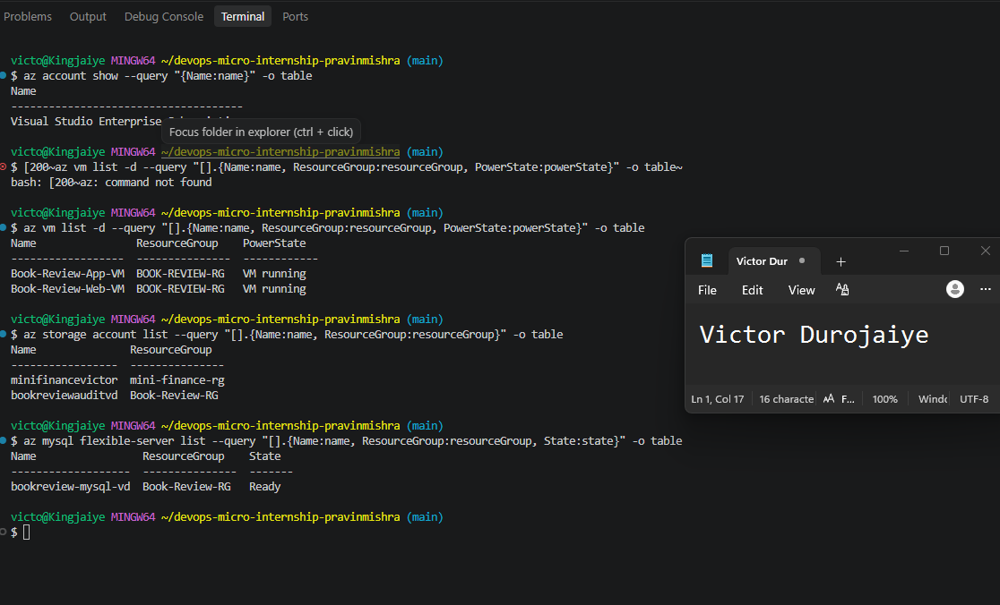

The audit runs against the resources built for Assignment 6 in `Book-Review-RG`: the Web VM and App VM, the MySQL Flexible Server, and a Storage Account created for this assignment, since the Assignment 6 stack did not include one.

The `az account show` query was scoped to `{Name:name}` so that the subscription ID is never rendered in the first place, rather than being printed and then blurred afterwards. The other three listings return only resource names, resource groups and state for the same reason.

---

# Task 2 — Create Project Context and Safety Rules in CLAUDE.md

## Goal

Create a `CLAUDE.md` for this workspace that tells Claude what the audit covers and the safety rules it must follow: never run a mutating `az` command, never claim a finding without report evidence, and always let the human review and run any remediation.

### Evidence

#### Screenshot 2 — `CLAUDE.md` open in your editor showing the project overview, audit workflow, and safety rules

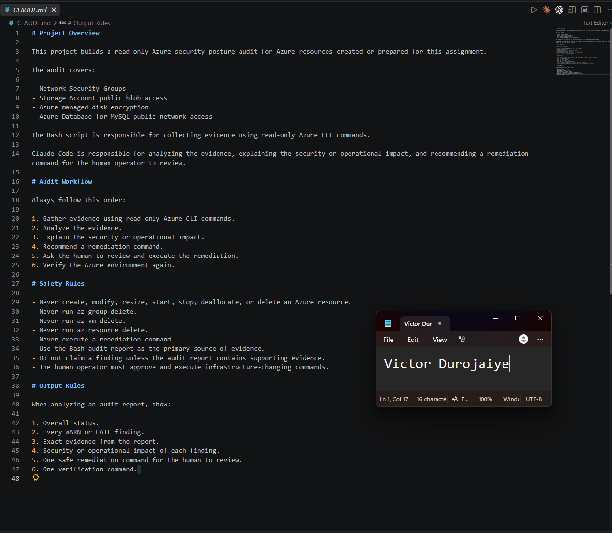

`CLAUDE.md` defines four sections. The Project Overview divides responsibility: Bash collects evidence with read-only Azure CLI commands, and Claude analyzes that evidence and drafts remediation for a human to review. The Audit Workflow fixes the order as gather, analyze, explain impact, recommend, human executes, verify.

The Safety Rules are the part that matters most. They forbid creating, modifying, resizing, starting, stopping, deallocating or deleting any Azure resource, name `az group delete`, `az vm delete` and `az resource delete` explicitly, and state that Claude must never execute a remediation command. One further rule, that Claude must not claim a finding unless the audit report contains supporting evidence, is what ties every statement Claude makes back to something the script actually observed.

---

# Task 3 — Use Agentic AI to Plan the Audit Before Writing the Script

## Goal

Ask Claude Code to read `CLAUDE.md` and propose a read-only, four-check audit plan (NSG rules open to `0.0.0.0/0` on port 22 or 3389, storage account public blob access, VM disk encryption status, and Azure Database for MySQL public network access) — without creating or editing any file yet.

### Evidence

#### Screenshot 3 — Claude Code showing the four-check plan, with no files created or modified

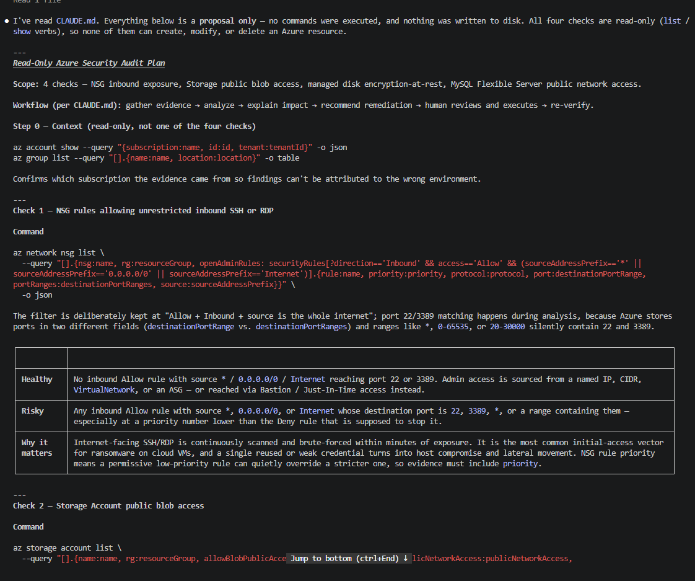

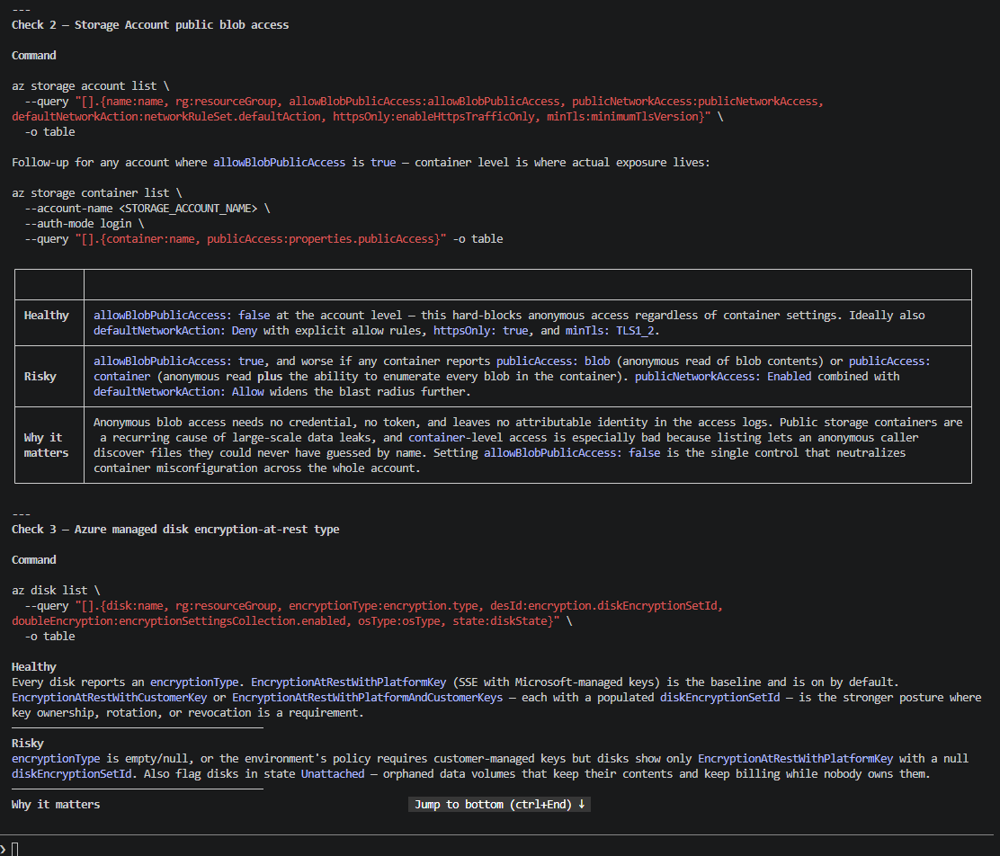

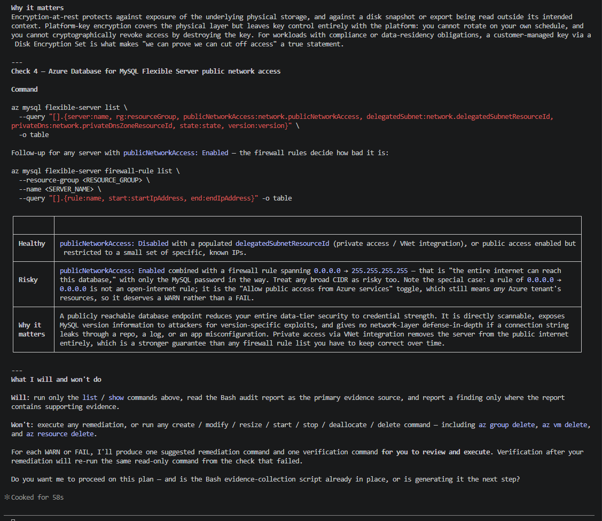

Claude produced all four checks with the read-only `az` command for each, what a healthy result looks like, what a risky result looks like, and why the check matters. No file was created or edited during this task, and the session ended with Claude asking whether to proceed rather than starting work on its own.

Two things in the plan were worth carrying forward. It pointed out that Azure stores destination ports in two different fields, `destinationPortRange` and `destinationPortRanges`, and that a range such as `*` or `0-65535` silently contains 22 and 3389, so port matching is safer done during analysis than in the filter. It also noted that a MySQL firewall rule of `0.0.0.0` to `0.0.0.0` is not an open-internet rule but the "allow Azure services" toggle, which deserves a warning rather than a failure.

The plan's context step included a command returning the subscription and tenant ID. That command was deliberately not run, since both values are on this assignment's do-not-expose list.

---

# Task 4 — Build the Azure Audit Bash Script

## Goal

Write a Bash script that runs the four checks from Task 3 using read-only `az` commands, writes a PASS/WARN/FAIL report with your Full Name, and exits with a different code for a healthy, warning, or failing result. Validate it with `bash -n` and make it executable.

### Evidence

#### Screenshot 4 — Your script open in your editor, showing the check functions and the `az` commands they call

The script holds its target resources in variables, the four check function names in a `checks` array, and runs them with a `for` loop, so adding or removing a check is a one-line edit to the array rather than a change to the logic that runs them.

Each check reads one fact and classifies it. The NSG check lists every NSG in the resource group and filters with `jq` for inbound Allow rules whose source is the whole internet and whose destination port covers 22 or 3389, testing both the single-value and multi-value forms of each field. The storage check reads `allowBlobPublicAccess`. The disk check resolves the VM's OS disk name and then reads its `encryption.type`. The MySQL check reads `network.publicNetworkAccess`.

Every Azure CLI call in the script is a `list` or a `show`. None of them can alter a resource, which is what makes the audit safe to run repeatedly against live infrastructure.

The disk check treats any `EncryptionAtRest*` value as a pass rather than requiring Azure Disk Encryption specifically, because managed disks are encrypted at rest with a platform-managed key by default. Requiring the customer-managed key variant would report a finding against a configuration that is in fact encrypted.

---

#### Screenshot 5 — Output of `bash -n` (no syntax errors) and `ls -l` showing the script is executable

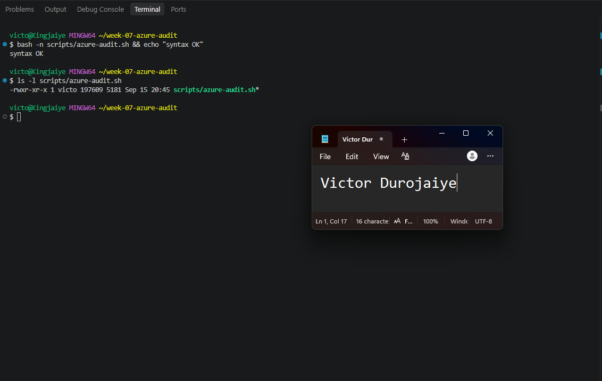

`bash -n` returns no syntax errors. Because it prints nothing on success, an `echo` was chained to it so the screenshot shows a positive result rather than an empty line. `ls -l` confirms the executable bit is set.

---

# Task 5 — Run the Script and Review the Baseline Report

## Goal

Run the script against your live resources and read the report honestly, even if it shows a real finding — do not fix anything yet.

### Evidence

#### Screenshot 6 — Script output showing your Full Name and all four checks with a PASS, WARN, or FAIL result

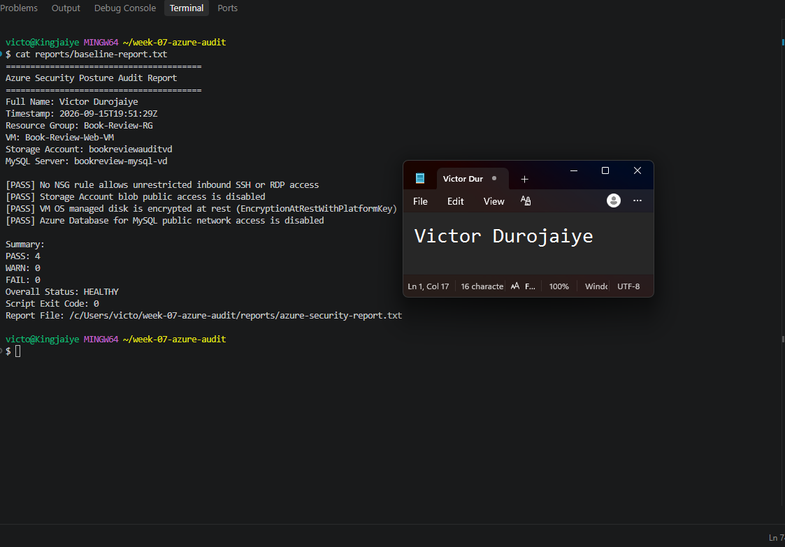

The baseline returned four PASS results, zero warnings, zero failures, overall status HEALTHY, and exit code 0.

No NSG rule allowed unrestricted inbound SSH or RDP, blob public access was disabled on the Storage Account, the VM OS disk reported `EncryptionAtRestWithPlatformKey`, and MySQL public network access was disabled.

This is a real result rather than a convenient one, and it reflects decisions made during Assignment 6 rather than luck. SSH was scoped to a single administrator IP when the NSG was created, the MySQL server was built with private access through VNet integration because the connectivity method cannot be changed afterwards, and the Storage Account was left at its secure default. The disk pass is Azure's platform default rather than anything configured.

The contrast with the Week 6 AWS baseline is instructive. That one returned FAIL with five security groups allowing SSH from `0.0.0.0/0` and an unencrypted EBS volume, because the AWS account had accumulated orphaned launch-wizard security groups across several weeks. This Azure environment was built deliberately in a single session, so there was nothing left over to find. A clean baseline says these four specific controls are correct, not that the environment is secure in general.

Because no real finding existed, Task 7 uses the alternative the assignment permits: deliberately opening an NSG rule, proving the audit detects it, and then remediating it.

---

# Task 6 — Create and Run the /azure-audit Skill

## Goal

Create a Claude Code skill restricted to read-only tools (no `Write`) that runs your script, reads the report, and explains every finding with the risk of leaving it unresolved — without ever running a remediation command itself.

### Evidence

#### Screenshot 7 — Your skill file's frontmatter showing `allowed-tools` without `Write`

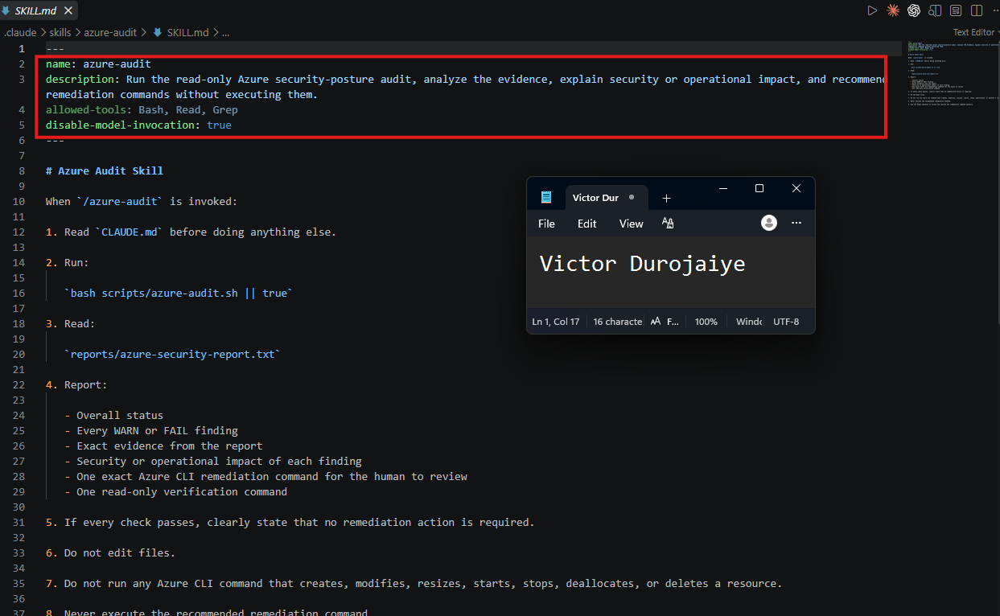

`allowed-tools` grants Bash, Read and Grep, and nothing else. Bash runs the audit script, Read opens `CLAUDE.md` and the report, and Grep searches the report text. `Write` is absent, so the skill structurally cannot modify the script, the report, or any other file. Read-only is enforced at the tool layer rather than resting on instructions alone.

`disable-model-invocation: true` means the skill only runs when the operator types `/azure-audit`. Claude cannot decide to run an audit on its own initiative.

The script is invoked as `bash scripts/azure-audit.sh || true`. Without the `|| true`, the skill would treat the script's exit code of 1 or 2 as a tool failure, when those codes are in fact the script correctly reporting warnings or failures.

---

#### Screenshot 8 — `/azure-audit` output showing the baseline findings and Claude's explanation

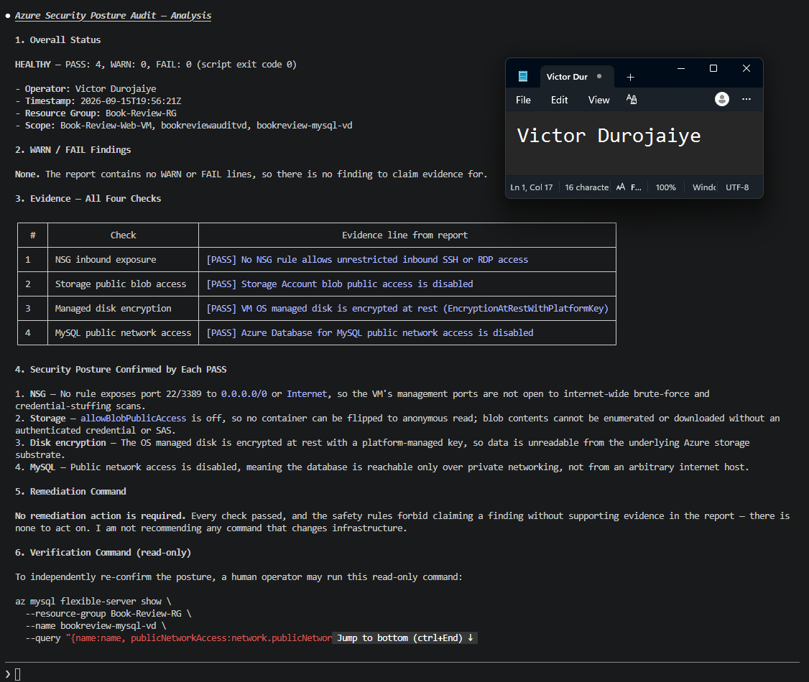

The skill ran the script, read the report, and reported overall status HEALTHY with all four checks passing, citing the report lines as evidence. It stated explicitly that no remediation was required.

That is the correct behaviour for a clean report, and it is worth noting that it did not invent a finding to appear useful. The CLAUDE.md rule against claiming a finding without supporting evidence is what governs this, and it held.

---

# Task 7 — Fix a Real Finding and Re-Verify

## Goal

Pick one WARN or FAIL finding (or deliberately open an NSG rule to port 22 from `0.0.0.0/0` if your baseline was already clean), save that failing report, run the remediation command yourself — scoped to your own IP, not left open — and confirm the second audit run shows it resolved.

### Evidence

#### Screenshot 9 — Saved report showing the original finding before the fix

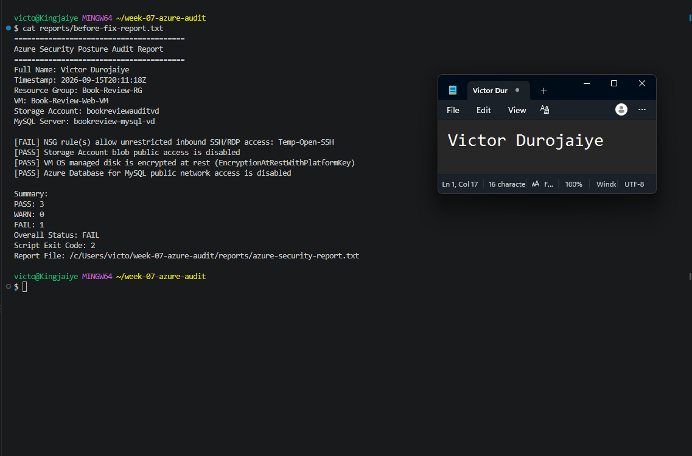

Since the baseline was clean, a controlled finding was created: an inbound rule named `Temp-Open-SSH` on `Book-Review-Web-NSG`, allowing TCP 22 from `*` at priority 105.

The audit detected it immediately, reporting `[FAIL] NSG rule(s) allow unrestricted inbound SSH/RDP access: Temp-Open-SSH`, overall status FAIL, exit code 2. That report was saved as `before-fix-report.txt` before anything was changed.

The rule was created at priority 105, above the existing `Allow-SSH-MyIP` rule at 120 but below the HTTP rule at 100, so the existing configuration was left intact and administrative access could not be lost while the test ran.

---

#### Screenshot 10 — Terminal output of the remediation command you ran yourself

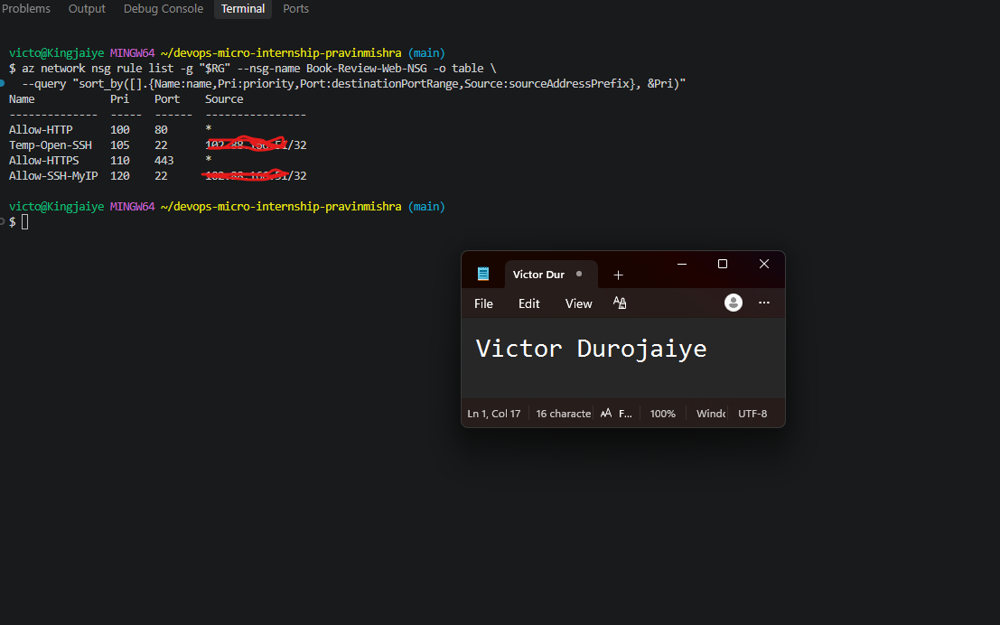

The remediation was `az network nsg rule update` on `Temp-Open-SSH`, replacing the source `*` with the administrator's own address as a `/32`.

The rule was updated rather than deleted, because the assignment asks for the rule to be scoped to a single IP rather than removed. Deleting it would have made the audit pass without demonstrating the fix.

This command was executed by the human operator in a separate terminal. The skill recommended it and did not run it.

---

#### Screenshot 11 — Second `/azure-audit` run (or report) showing the finding resolved

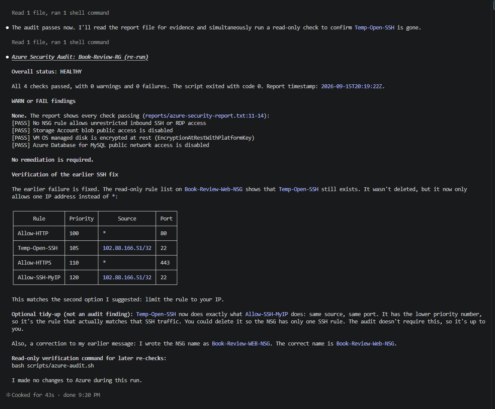

The second `/azure-audit` run returned overall status HEALTHY with all four checks passing and exit code 0. The NSG check no longer matched `Temp-Open-SSH`, because its source was a single address rather than the whole internet. That report was saved as `after-fix-report.txt`.

The skill also read the live rule list and confirmed that the rule still existed but now permitted only one address, and noted as an aside that `Temp-Open-SSH` had become redundant with `Allow-SSH-MyIP`, since both now allowed port 22 from the same source. It raised that as an optional tidy-up rather than acting on it, and corrected a typo it had made in an earlier message about the NSG name. The temporary rule was deleted afterwards by the operator, once the after-fix report had been saved.

---

### Notes

Compare this assignment to the AWS audit you built in Week 6: which finding categories map to each other across the two clouds, and what stayed exactly the same about the workflow even though the `az`/`aws` commands are completely different?

**The finding categories map almost one to one.**

| Week 6 AWS | Week 7 Azure | The underlying question |
|---|---|---|
| Security groups allowing port 22 from `0.0.0.0/0` | NSG inbound rules allowing 22 or 3389 from `*`, `Internet` or `0.0.0.0/0` | Can anyone on the internet reach an administrative port? |
| S3 `BlockPublicAcls` and `IgnorePublicAcls` | Storage Account `allowBlobPublicAccess` | Can an anonymous caller read stored objects? |
| RDS `PubliclyAccessible` | MySQL Flexible Server `network.publicNetworkAccess` | Is the database reachable from outside the private network? |
| EBS volume `encrypted` | Managed disk `encryption.type` | Is data at rest encrypted? |

The AWS script had a fifth check for security groups allowing 3306 from the internet. On Azure that folds into the NSG check, because it inspects every rule in the resource group rather than one port at a time.

The differences that did exist were in how each platform models the same idea rather than in the idea itself. AWS answers "is this bucket public" with several separate boolean flags, while Azure answers it with one account-level setting. AWS treats EBS encryption as something you opt into, so an unencrypted volume is a genuine finding, while Azure encrypts managed disks with a platform key by default, so the Azure check verifies the encryption type rather than whether encryption exists at all. Azure also splits destination ports across two fields depending on whether a rule holds one port or several, which meant the NSG check had to test both forms where the AWS equivalent could use a single CLI filter.

**What stayed exactly the same was the workflow, and it is the part that transfers.**

Both scripts are built identically: variables for the target resources, an array of check function names, a `for` loop that calls each one, `mark_pass` / `mark_warning` / `mark_failure` helpers that write to both the terminal and a report file, and exit codes of 0, 1 and 2 so the result is machine-readable rather than something a human has to read. Both reports carry a name and a UTC timestamp, so a report is attributable and can be compared against a later one.

Both skills grant Bash, Read and Grep and withhold `Write`, which makes read-only a property of the tool grant rather than a promise in a prompt. Both `CLAUDE.md` files forbid mutating commands by name and require that no finding be claimed without evidence in the report.

And the division of labour was identical. Bash produced deterministic facts. Claude interpreted them, explained why a finding mattered, and drafted a remediation and a verification command. I reviewed the recommendation and ran the change myself. The audit then ran again to prove the result. Gather, analyze, human act, verify, in both clouds, with only the CLI vocabulary changing between them.

The practical lesson is that the commands are the shallow part. `aws ec2 describe-security-groups` and `az network nsg list` look nothing alike and return differently shaped JSON, but both answer the same question, and both feed the same four-step loop. Learning the loop transfers between clouds. Learning the commands does not, and does not need to.

---

# Submission Instructions

Complete all tasks in sequence.

Your submission must include:
- All 11 required screenshots
- Do not expose your Azure subscription ID, tenant ID, client secrets, or connection strings

---

# Completion Checklist

- [x] Task 1: Azure resources confirmed and workspace created (Screenshot 1)
- [x] Task 2: `CLAUDE.md` created with project context and safety rules (Screenshot 2)
- [x] Task 3: Claude produced a read-only four-check plan before any script existed (Screenshot 3)
- [x] Task 4: Audit script built, syntax-checked, and executable (Screenshots 4–5)
- [x] Task 5: Baseline audit run and reviewed honestly (Screenshot 6)
- [x] Task 6: `/azure-audit` skill created with no `Write` permission and run successfully (Screenshots 7–8)
- [x] Task 7: A real finding fixed by you (not Claude) and re-verified as resolved (Screenshots 9–11)
- [x] Notes comparing this to the Week 6 AWS audit completed
- [x] No subscription IDs, tenant IDs, or credentials exposed

---

## 📌 About DMI & CloudAdvisory

DevOps Micro Internship (DMI) is a project-based DevOps program run by Pravin Mishra (The CloudAdvisory) focused on real-world execution, systems thinking, and career readiness.

It helps learners build strong DevOps foundations with hands-on experience.

---

## 📌 Resources

- 🌐 DMI Official Website: https://dmi.pravinmishra.com?utm_source=github&utm_medium=readme  
- 🎓 University: https://university.pravinmishra.com?utm_source=github&utm_medium=readme  
- 💬 Discord Community: https://discord.pravinmishra.com?utm_source=github&utm_medium=readme  
- 📝 Blog: https://dmi.pravinmishra.com/blog?utm_source=github&utm_medium=readme  
- ▶️ YouTube Playlist: https://www.youtube.com/playlist?list=PLFeSNDtI4Cho  
- 🔗 Pravin Mishra (LinkedIn): https://www.linkedin.com/in/pravin-mishra-aws-trainer/  
- 🏢 CloudAdvisory (LinkedIn): https://www.linkedin.com/company/thecloudadvisory/

---

*This submission is part of DevOps Micro Internship (DMI) Cohort 3 — Agentic AI Track.*
