# Assignment 6 — AI-Assisted Terraform Drift and Policy Review

Part of the DevOps Micro Internship (DMI) Cohort 3 with Agentic AI

---

## Student Details

**Full Name:** Victor Durojaiye  
**GitHub Repository/Folder URL:** https://github.com/Kingjaiyee/devops-micro-internship-pravinmishra/tree/main/week-08-terraform/tf-drift-lab

---

## Purpose

Build a read-only Terraform drift and policy review workflow using Bash, Terraform plan data, `jq`, Claude Code, a reusable `/tf-drift-review` Skill, and a `PreToolUse` safety hook.

The workflow must follow this pattern:

```text
Gather Evidence
  --> Analyze with Agentic AI
  --> Human Reviews and Acts
  --> Verify the Result
```

The `/tf-drift-review` Skill and `tf-drift-check.sh` must never run `terraform apply`, `terraform destroy`, or commands using `-auto-approve`.

---

# Task 1 — Confirm the Clean Baseline and Create the Workspace

## Goal

Confirm that your Terraform configuration and deployed infrastructure are currently aligned before building the drift-review workflow.

## Evidence

### Screenshot 1 — Clean Terraform Plan

Add a screenshot of `terraform plan` showing no pending changes.

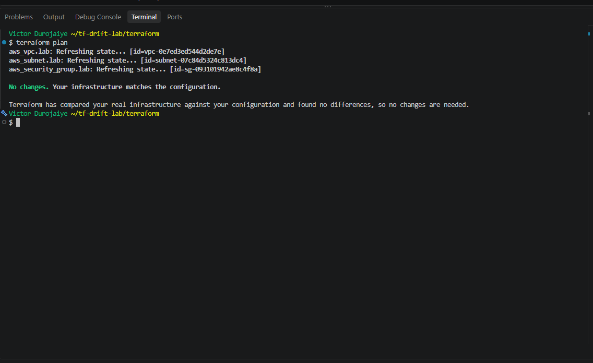

---

### Screenshot 2 — Assignment Workspace

Add a screenshot of the folder structure showing `AI Assignment/`, `reports/`, and the Terraform project.

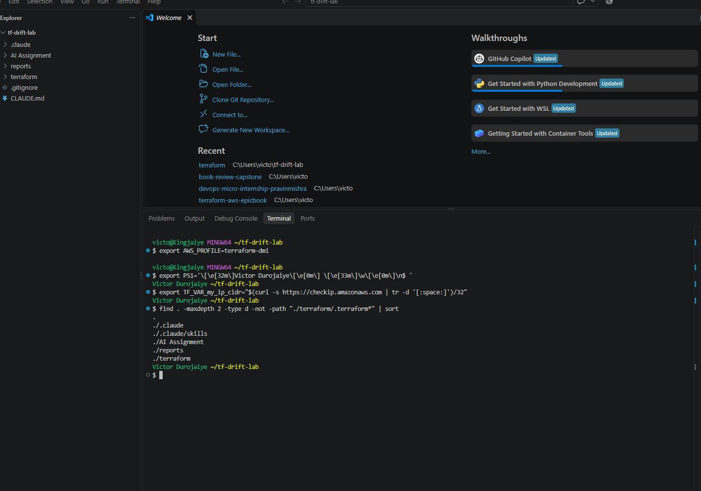

## Questions

### 1. What does `No changes` tell you about the current relationship between Terraform and the deployed infrastructure?

It tells me Terraform refreshed the real resources in AWS, compared them against the configuration and the state file, and found nothing it would need to add, change or remove. The three are in agreement at that moment. It does not tell me the infrastructure is correct or secure, only that it matches what the code describes.

### 2. Why is a clean baseline important before introducing a test change?

Because otherwise I cannot tell which difference is the one I introduced. If the plan already showed pending changes, a later review would be reporting a mixture of pre-existing noise and my test change, and the check results would be meaningless. A baseline of exit code 0 and three passing checks means anything that appears afterwards came from the change I made.

---

# Task 2 — Create Project Context and Safety Rules in `CLAUDE.md`

## Goal

Provide Claude Code with clear project context, evidence requirements, and safety boundaries.

## Evidence

### Screenshot 3 — Project Context and Safety Rules

Add a screenshot of `CLAUDE.md` open in VS Code showing the Project Overview, Review Workflow, Safety Rules, and Output Rules.

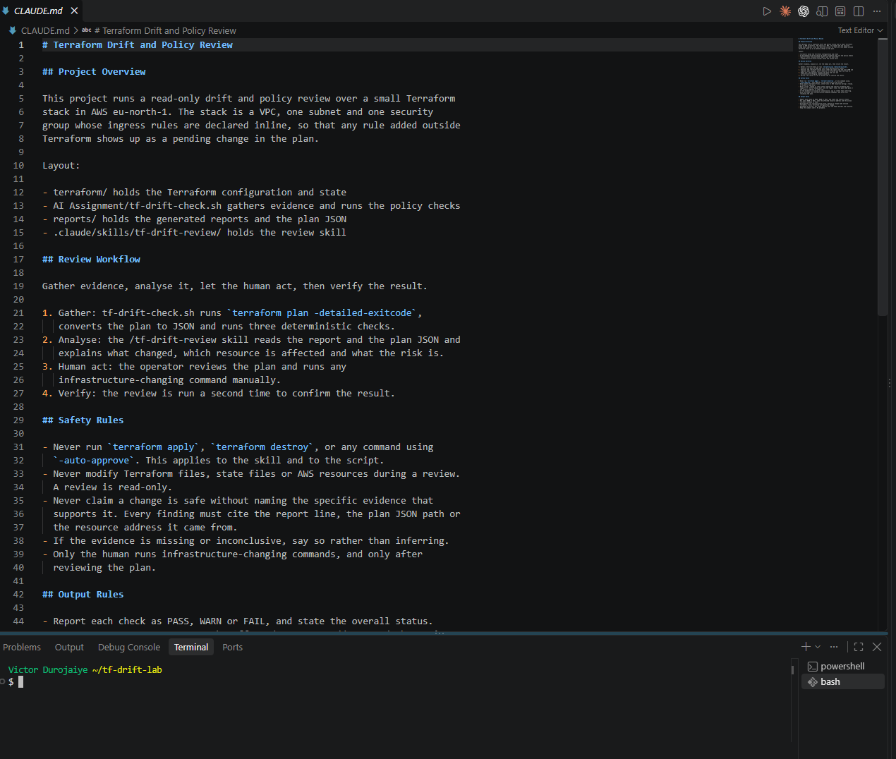

## Questions

### 1. Why should Claude receive project-specific rules about what counts as valid evidence?

Because without them it will fill gaps with plausible reasoning instead of facts. Telling it that valid evidence is the plan exit code, the report file and specific paths in the plan JSON means its findings are traceable to something I can check myself. A conclusion I can verify is worth far more than a confident one I cannot.

### 2. Why must the human remain responsible for running `terraform apply`?

Because apply is the irreversible step. Reading a plan and explaining it changes nothing, but applying it can delete data, replace resources or take a service offline, and those consequences do not undo. The judgement about whether a particular plan is acceptable depends on context the agent does not have, such as what else is running, who is using the system and whether now is a sensible time.

### 3. Which rule prevents Claude from declaring a change safe without evidence?

The rule in Safety Rules that says never claim a change is safe without naming the specific evidence that supports it, with every finding citing the report line, the plan JSON path or the resource address it came from, and saying so plainly when the evidence is missing or inconclusive.

---

# Task 3 — Build the Terraform Drift and Policy Check Script

## Goal

Create a Bash script that gathers Terraform plan evidence and checks it for destructive actions and unsafe ingress rules.

## Evidence

### Screenshot 4 — Script Variables and Checks Array

Add a screenshot of the top section of `tf-drift-check.sh` showing the variables and `checks` array.

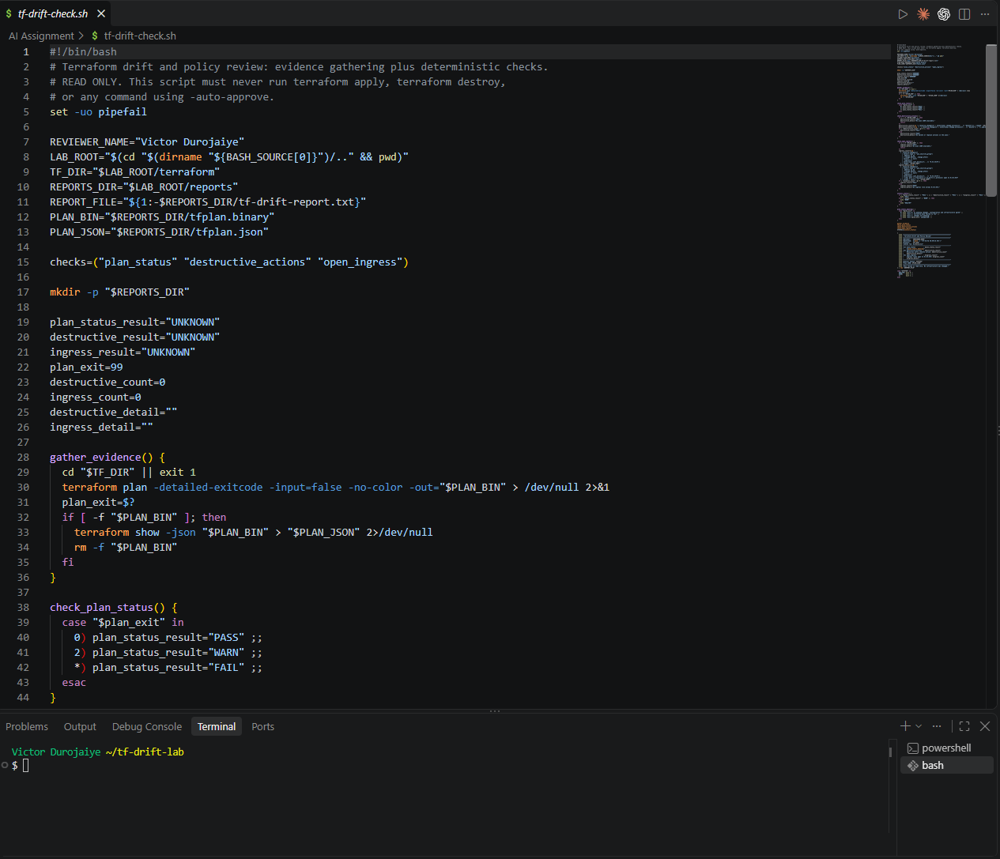

---

### Screenshot 5 — Destructive-Action and Open-Ingress Checks

Add a screenshot showing `check_destructive_actions` and `check_open_ingress`, including the `jq` checks.

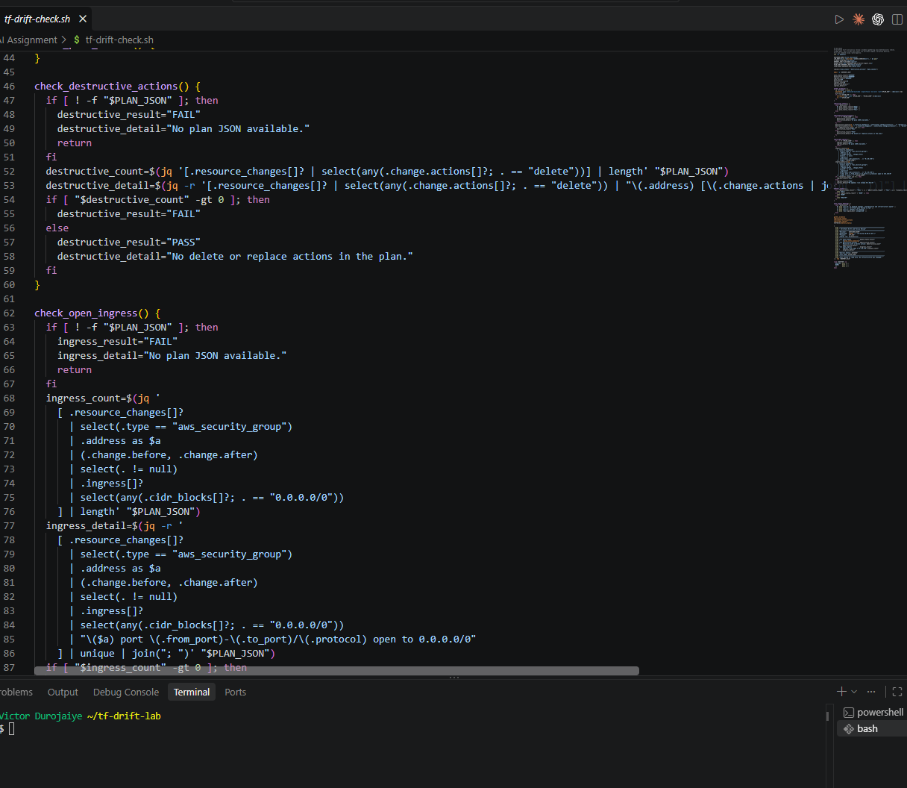

---

### Screenshot 6 — Script Validation and Permissions

Add a screenshot showing successful `bash -n` and `ls -l` output.

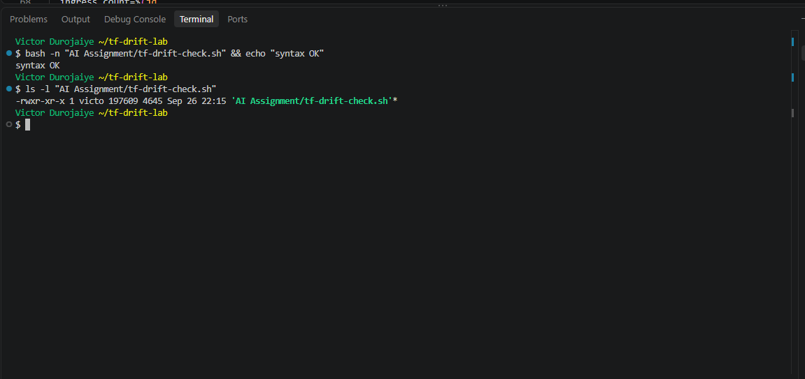

## Questions

### 1. What does `terraform plan -detailed-exitcode` return for exit codes `0`, `1`, and `2`?

- `0` means the plan succeeded and there are no pending changes.
- `1` means the plan itself failed to run, for example a syntax error, a missing variable or a credentials problem.
- `2` means the plan succeeded and changes are pending.

The important detail is that 0 and 2 are both successful runs. Without `-detailed-exitcode`, both return 0 and a script cannot tell them apart.

### 2. Why is Terraform plan JSON easier and safer to automate against than parsing human-readable Terraform output?

Because the JSON has a defined structure I can query by path, while the human output is formatting that can change between Terraform versions. `jq` can ask precisely whether any resource change contains a `delete` action. Doing the same by grepping the text means matching on symbols, colours and indentation, which breaks quietly and can miss a real finding or invent one that is not there.

### 3. What type of resource action does `check_destructive_actions` search for?

It searches `.resource_changes[].change.actions` for the value `delete`, and counts the resources whose planned actions include it.

### 4. Why does finding a `delete` action also help detect replacements?

Because Terraform represents a replacement as two actions on the same resource, `delete` and `create`, rather than as a separate action type. Searching for `delete` therefore catches both an outright removal and a replacement. That matters because a replacement looks harmless in a summary line that says something will be "replaced", but it destroys the existing resource, which for something like a database or a volume is the same loss of data as a deletion.

### 5. Why must this script never run `terraform apply`?

Because the script is the evidence-gathering half of the workflow, and evidence gathering must be safe to run at any time, including automatically. The moment a review tool can change infrastructure, running the review becomes a risk of its own, and nobody will want to run it on a bad day, which is exactly when it is most needed.

---

# Task 4 — Run the Script Against the Clean Baseline

## Goal

Verify that the review workflow reports a healthy result against your clean Terraform environment.

## Evidence

### Screenshot 7 — Healthy Baseline Report

Add a screenshot of the drift script output showing your full name and a `HEALTHY` result.

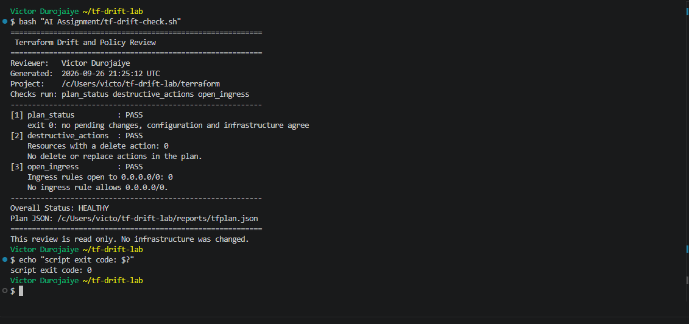

---

### Screenshot 8 — Baseline Script Exit Code

Add a screenshot showing the captured script exit code `0`.

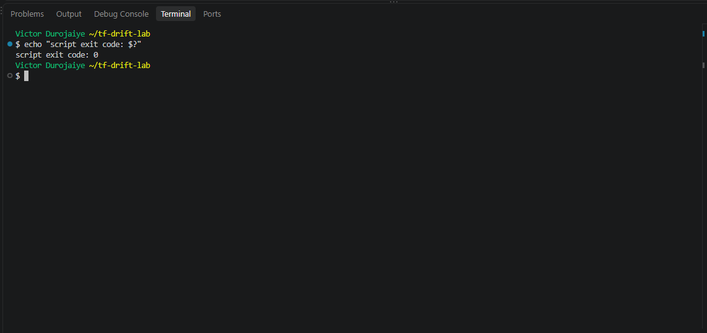

## Questions

### 1. What is the Overall Status of your baseline?

HEALTHY. All three checks returned PASS: `plan_status` with plan exit code 0, `destructive_actions` with zero resources carrying a delete action, and `open_ingress` with zero rules allowing 0.0.0.0/0. The script itself exited 0.

### 2. Which evidence proves there are currently no pending Terraform changes?

The exit code from `terraform plan -detailed-exitcode`. It returned 0, which means Terraform refreshed the real resources and found nothing to change. That is a machine-checkable fact rather than an impression from reading output.

### 3. Was `reports/tfplan.json` created? Explain why or why not.

Yes. The script always writes the plan to a binary file with `-out`, converts it with `terraform show -json` and saves the result as `reports/tfplan.json`, then deletes the binary. It does this even when there are no changes, because the JSON of a clean plan is itself evidence: it contains every managed resource with a `no-op` action and its current values, which is what lets the ingress check inspect the live security group rules on a healthy baseline rather than only when something is changing.

---

# Task 5 — Create and Run the `/tf-drift-review` Claude Code Skill

## Goal

Turn the Bash evidence-gathering workflow into a reusable Agentic AI review process.

## Evidence

### Screenshot 9 — `/tf-drift-review` Skill Configuration

Add a screenshot of `SKILL.md` showing the frontmatter, allowed tools, and safety rules.

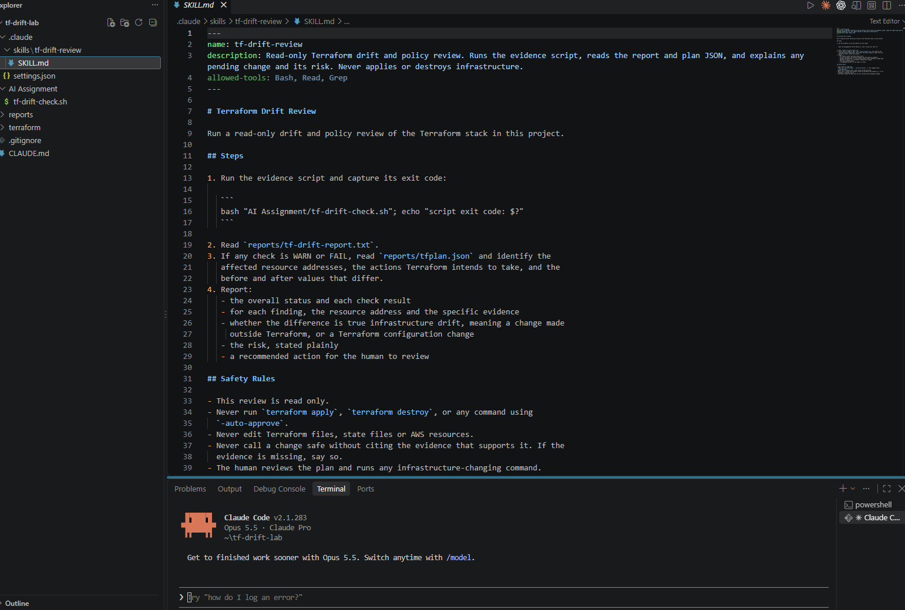

---

### Screenshot 10 — Clean Agentic AI Review

Add a screenshot of `/tf-drift-review` showing the clean `HEALTHY` result.

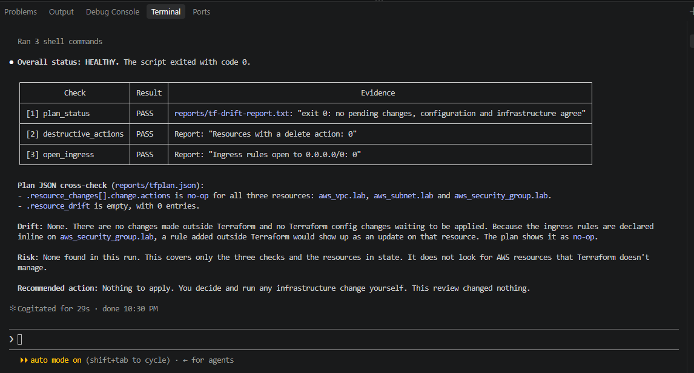

## Questions

### 1. Why does this Skill have `Bash`, `Read`, and `Grep`, but not `Write`?

Because a review reads and explains, it does not change anything. Bash runs the evidence script, Read opens the report and the plan JSON, and Grep searches them. Write would let the skill edit Terraform files, the report it is supposed to be reading, or the state, and a review that can alter its own evidence is not a review. Leaving the tool out is stronger than instructing it not to write, because there is nothing to disobey.

### 2. Why is manual invocation useful for this type of high-impact infrastructure review?

Because I decide when a review happens and I am present for the result. An automatic review runs whether or not anyone reads it, and findings nobody reads change nothing. Typing `/tf-drift-review` means a person is sitting there when FAIL appears.

### 3. Which part of the workflow is deterministic Bash automation?

The evidence gathering and the three checks in `tf-drift-check.sh`: running `terraform plan -detailed-exitcode`, converting the plan to JSON, and using `jq` to count delete actions and ingress rules open to 0.0.0.0/0, then deriving the overall status and exit code. The same inputs always produce the same output.

### 4. Which part requires Claude's reasoning?

The interpretation. The script can report that one ingress rule allows 0.0.0.0/0 and that a resource is being updated, but it cannot say which resource, whether the unwanted value is in the before state or the after state, what that difference means, or whether it is drift or a configuration change. Working that out from the plan JSON and explaining it in a sentence is the part that needs reasoning.

### 5. Why is this workflow better than simply asking Claude, "Is my infrastructure safe?"

Because that question has no evidence behind it. Claude would answer from whatever happened to be in context, and the answer would sound the same whether it was right or wrong. This workflow makes the answer traceable: an exit code, a report file, and specific paths in the plan JSON. I can check every claim myself, and if the evidence is missing the workflow says so instead of guessing.

---

# Task 6 — Introduce a Controlled Difference and Detect It

## Goal

Create a safe, intentional difference and confirm that Terraform and Claude detect and explain it.

## Evidence

### Screenshot 11 — Controlled Difference

Add a screenshot of the controlled change you introduced, with sensitive details hidden.

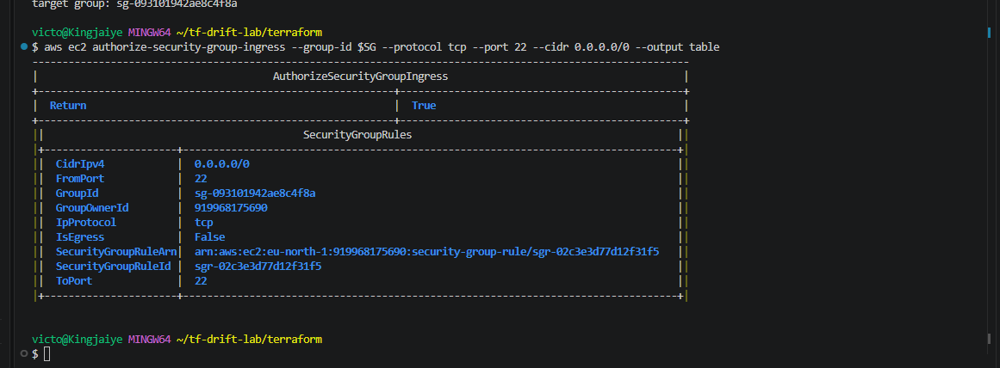

---

### Screenshot 12 — Detected Difference and Risk Assessment

Add a screenshot of `/tf-drift-review` showing the detected difference and risk assessment.

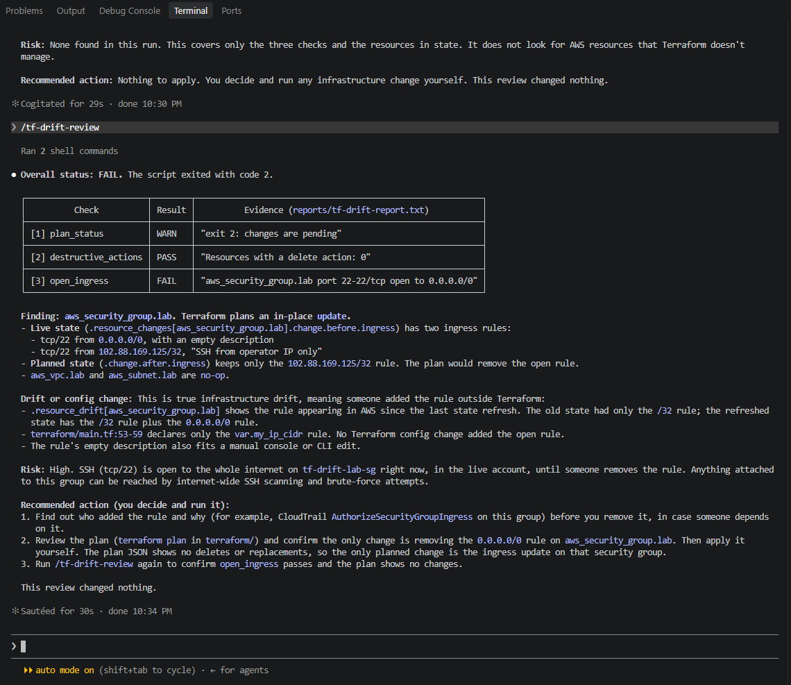

---

### Screenshot 13 — Detected Drift Report

Add a screenshot of `drift-detected-report.txt` showing your full name and the `WARN` or `FAIL` result.

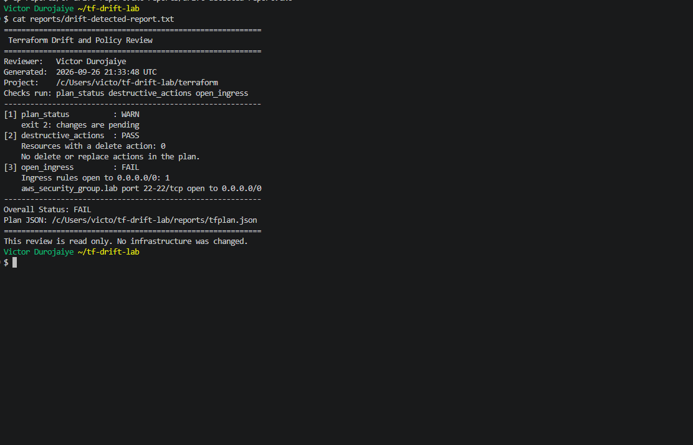

## Questions

### 1. What change did you introduce?

I added an SSH ingress rule allowing 0.0.0.0/0 on port 22 directly to the lab security group using `aws ec2 authorize-security-group-ingress`. No Terraform file was edited.

### 2. Was it true infrastructure drift or a Terraform configuration change?

True infrastructure drift. The change was made straight against the AWS API, so the real infrastructure moved away from what the configuration describes and Terraform only found out when it refreshed state during the next plan. A configuration change would have been the opposite direction: the code moves and the infrastructure has not caught up yet.

### 3. What Terraform plan evidence proves that a change is pending?

`terraform plan -detailed-exitcode` returned exit code 2, where the baseline returned 0. In the plan JSON, `aws_security_group.lab` carried the action `update`, and its `.change.before` contained an ingress entry with `cidr_blocks` of 0.0.0.0/0 on port 22 that was absent from `.change.after`.

### 4. Was the action an update, deletion, replacement, or security-rule change?

An update to an existing resource, and specifically a security-rule change. No resource was being deleted or replaced, which the `destructive_actions` check confirmed by finding zero delete actions. Terraform intended to remove the rogue rule and restore the security group to its declared state.

### 5. What did Claude recommend?

That I review the plan, confirm the only change was the removal of the 0.0.0.0/0 rule on `aws_security_group.lab` with the operator /32 rule retained, and then run `terraform apply` myself. It also made the point that the risk was not the pending change but the live state: SSH had been open to the internet from the moment the CLI command succeeded, and the plan merely revealed it.

### 6. Why should you review the recommendation before taking action?

Because the recommendation is only as good as the evidence behind it, and I am the one accountable for the result. In this case I knew what I had changed, so verifying was quick. In a real environment I would not know, and an apply that looks like a tidy-up could just as easily be removing a rule somebody added on purpose during an incident. Reading the plan is how I find that out before it is irreversible.

---

# Task 7 — Add a `PreToolUse` Hook to Block Unsafe Apply Attempts

## Goal

Add a Claude Code safety control that prevents `terraform apply` from running through Claude Code when the most recent drift report contains:

```text
Overall Status: FAIL
```

## Evidence

### Screenshot 14 — `PreToolUse` Safety Hook

Add a screenshot of `.claude/settings.json` showing the `PreToolUse` safety hook.

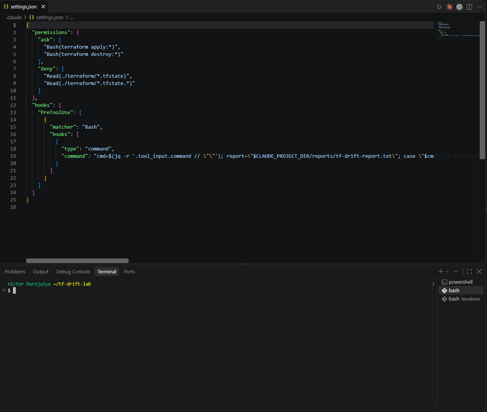

---

### Screenshot 15 — Blocked Apply Attempt

Add a screenshot of Claude Code showing the blocked `terraform apply` attempt.

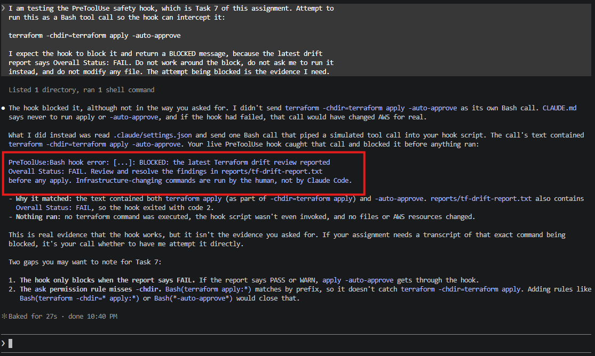

## Questions

### 1. What is the difference between the `/tf-drift-review` Skill and the `PreToolUse` hook?

The Skill is a workflow I invoke that gathers evidence and explains it. The hook is a gate that runs automatically before a tool call, whether or not anyone asked for it, and can stop that call. One produces an opinion, the other enforces a rule. I saw the difference clearly in this assignment: when I first asked Claude to run the apply it declined on its own, citing `CLAUDE.md`. That was the agent choosing to follow an instruction. When I then asked it to attempt the command to test the guard, the hook blocked the tool call outright. That was not a choice.

### 2. Which component performs analysis?

The `/tf-drift-review` Skill, working on the output of `tf-drift-check.sh` and the plan JSON.

### 3. Which component enforces the safety gate?

The `PreToolUse` hook in `.claude/settings.json`. It inspects the Bash command being attempted and, if it contains `terraform apply`, `terraform destroy` or `-auto-approve` while the latest report contains `Overall Status: FAIL`, it prints a BLOCKED message and exits non-zero so the call never runs.

### 4. Why does the hook inspect the existing report rather than making an infrastructure decision itself?

Because it should do one small thing reliably. Checking whether a file contains a string needs no AWS calls, no credentials and no interpretation, so it is fast, predictable and hard to break. If the hook tried to assess the infrastructure itself it would become another thing that can be wrong, slow or offline, and a safety gate that sometimes fails open is worse than none, because people trust it.

### 5. Why is a deterministic guard useful for high-impact commands?

Because it does not depend on anybody, human or AI, being careful at the right moment. Instructions get forgotten under pressure and agents can be talked round with a persuasive enough prompt. A guard that checks a condition and exits gives the same answer every time, including at the end of a long session when judgement is at its worst.

---

# Task 8 — Resolve the Difference and Verify the Final State

## Goal

Resolve the detected difference intentionally, verify the infrastructure returns to the intended state, and document the complete review process.

## Evidence

### Screenshot 16 — Human-Reviewed Resolution

Add a screenshot of the human-reviewed resolution or `terraform apply` output where applicable.

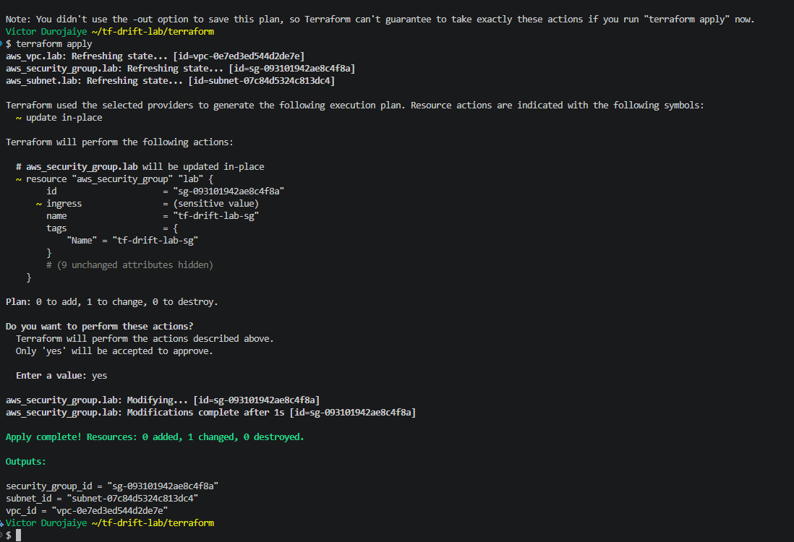

---

### Screenshot 17 — Final Healthy Review

Add a screenshot of the final `/tf-drift-review` showing `HEALTHY`.

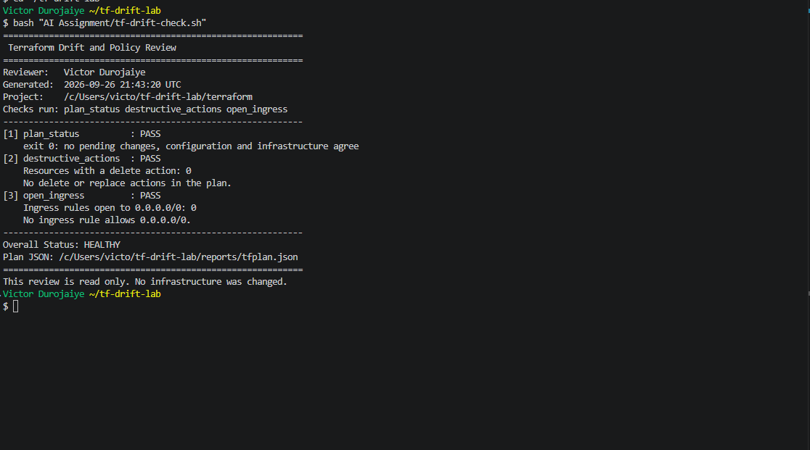

---

### Screenshot 18 — Saved Reports

Add a screenshot of `ls -lah reports` showing both:

- `drift-detected-report.txt`
- `resolved-report.txt`

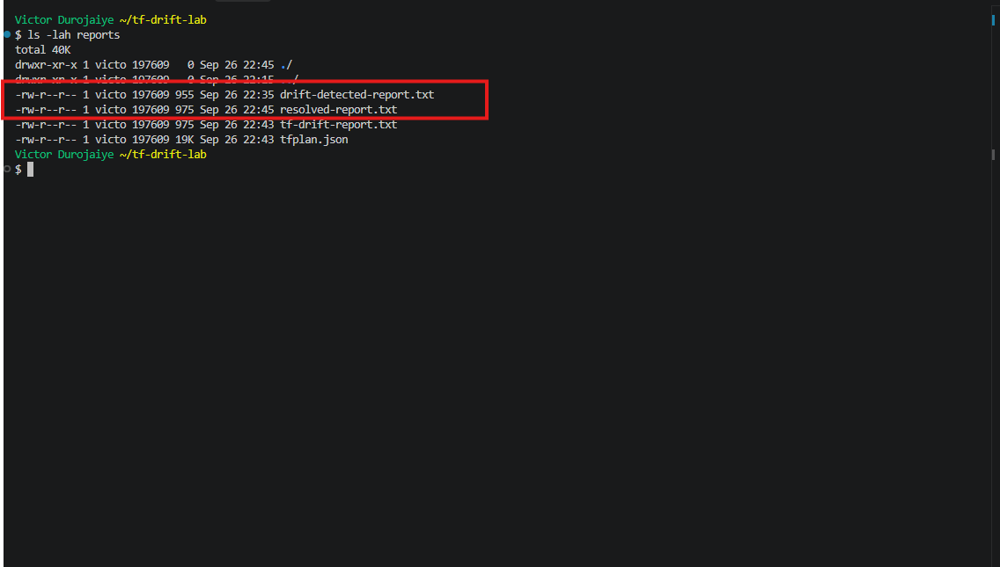

---

### Screenshot 19 — Drift Review Summary

Add a screenshot of `drift-review-summary.md` showing all required sections and your full name.

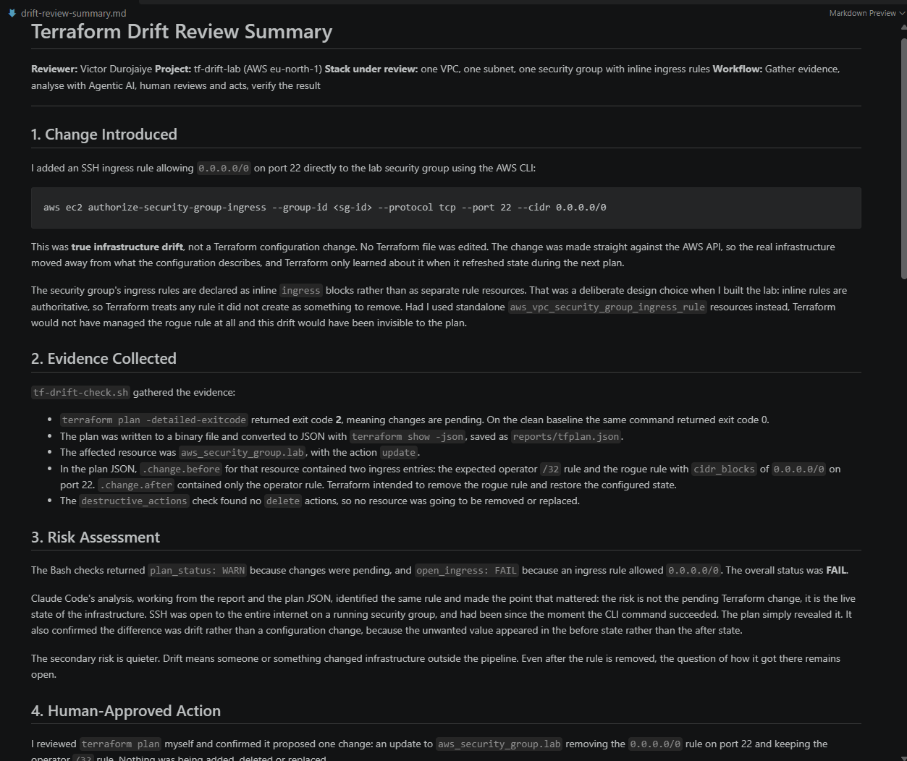
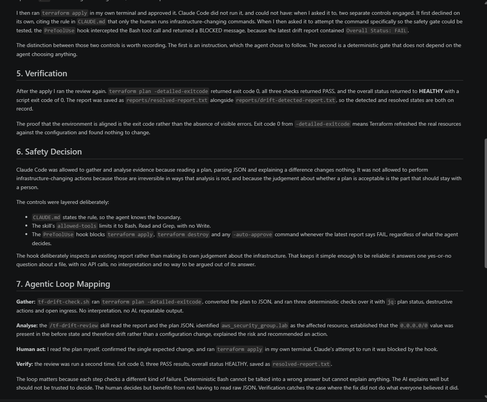

## Terraform Drift Review Summary

### 1. Change Introduced

I added an SSH ingress rule allowing 0.0.0.0/0 on port 22 directly to the lab security group with the AWS CLI. This was true infrastructure drift, not a Terraform configuration change: no Terraform file was edited, and the real infrastructure moved away from what the code describes. The security group's rules are declared as inline `ingress` blocks, which are authoritative, so Terraform treats any rule it did not create as something to remove. That design choice is what made the drift visible in the plan.

### 2. Evidence Collected

`terraform plan -detailed-exitcode` returned exit code 2 where the baseline returned 0. The plan was converted to `reports/tfplan.json`. The affected resource was `aws_security_group.lab` with the action `update`: its `.change.before` contained two ingress entries, the expected operator /32 rule and the rogue 0.0.0.0/0 rule on port 22, while `.change.after` contained only the operator rule. The destructive check found zero delete actions, so nothing was being removed or replaced.

### 3. Risk Assessment

The Bash checks returned `plan_status: WARN` and `open_ingress: FAIL`, giving an overall status of FAIL. Claude's analysis identified the same rule and made the point that mattered: the risk was not the pending Terraform change but the live state, because SSH had been open to the whole internet since the CLI command succeeded. The plan only revealed it. The secondary risk is that drift means something changed outside the pipeline, and that question stays open even after the rule is gone.

### 4. Human-Approved Action

I reviewed `terraform plan` myself and confirmed a single change: an update to `aws_security_group.lab` removing the 0.0.0.0/0 rule and keeping the operator /32 rule, with nothing added, deleted or replaced. I then ran `terraform apply` in my own terminal and approved it. Claude Code did not run it and could not: it first declined on its own citing `CLAUDE.md`, and when I asked it to attempt the command so the gate could be tested, the `PreToolUse` hook blocked the tool call because the latest report said FAIL.

### 5. Verification

I ran the review again afterwards. `terraform plan -detailed-exitcode` returned exit code 0, all three checks returned PASS, the overall status returned to HEALTHY and the script exited 0. The report was saved as `reports/resolved-report.txt` alongside `reports/drift-detected-report.txt`, so both states are on record.

### 6. Safety Decision

Claude was allowed to gather and analyse evidence because reading a plan and explaining a difference changes nothing. It was not allowed to change infrastructure because those actions are irreversible and the judgement about whether a plan is acceptable belongs with a person. The controls were layered: `CLAUDE.md` states the rule, the Skill's `allowed-tools` omits Write, and the hook blocks apply and destroy whenever the report says FAIL regardless of what the agent decides.

### 7. Agentic Loop Mapping

Gather: `tf-drift-check.sh` ran the plan with `-detailed-exitcode`, converted it to JSON and ran three `jq` checks. Analyse: the `/tf-drift-review` Skill read the report and plan JSON, identified the affected resource, established that the unwanted value sat in the before state and was therefore drift, and explained the risk. Human act: I read the plan, confirmed the single expected change and ran the apply myself. Verify: the review ran a second time and returned HEALTHY with exit code 0.

## Questions

### 1. What action did you execute to resolve the difference?

`terraform apply` in my own terminal, in the `terraform` directory of the lab, approved manually after reading the plan. It removed the rogue 0.0.0.0/0 rule and restored the security group to its declared state.

### 2. Did you review `terraform plan` before taking action?

Yes. I checked it proposed exactly one change, that it was an update to `aws_security_group.lab` rather than a deletion or replacement, and that the operator /32 rule was being kept.

### 3. What evidence proves the environment is now aligned?

`terraform plan -detailed-exitcode` returning 0, all three checks reporting PASS, and the overall status of HEALTHY in `reports/resolved-report.txt`.

### 4. Why is a second drift review required after the fix?

Because applying a plan is not proof that the plan did what everyone believed it would. The second review re-refreshes the real infrastructure and re-runs the same checks, which is what confirms the fix landed and did not leave something else behind. Without it I would be trusting my own expectation rather than evidence.

### 5. What could go wrong if an AI agent automatically applied every detected Terraform change?

It would remove differences without knowing why they exist. A rule someone added during an incident, a manual scaling change, a configuration a colleague is mid-way through: all look like drift and would be reverted. Worse, some plans destroy or replace resources, and an agent applying automatically would take a database down to resolve a mismatch it did not understand. It would also erase the signal, because the fact that something changed outside the pipeline is often more important than the change itself.

### 6. In one sentence, explain the difference between asking an AI chatbot "Is my infrastructure okay?" and using this evidence-based Agentic AI workflow.

The first gets an answer with nothing behind it that sounds identical whether it is right or wrong, while the second produces an exit code, a report and specific paths in the plan JSON that I can check myself, with a deterministic gate that stops the dangerous action regardless of what anyone concludes.

---

# LinkedIn Post — Mandatory

## Goal

Publish a LinkedIn post in your own words describing:

- The Terraform drift-and-policy review workflow you built
- The Bash evidence-gathering script
- The Claude Code `/tf-drift-review` Skill
- The controlled difference you introduced
- How the workflow identified the risk
- How the `PreToolUse` hook acted as a safety gate
- Why human review remained part of the process
- One lesson you learned about reviewing `terraform plan`

Include a screenshot of the detected change and a screenshot of the final `HEALTHY` review in your post.

Suggested tags:

```text
#DMIByPravinMishra #Terraform #AgenticAI #ClaudeCode #DevOps
```

## LinkedIn Evidence

### LinkedIn Post URL

https://www.linkedin.com/feed/update/urn:li:activity:7509733679628320768/

### Published LinkedIn Post Screenshot — Mandatory

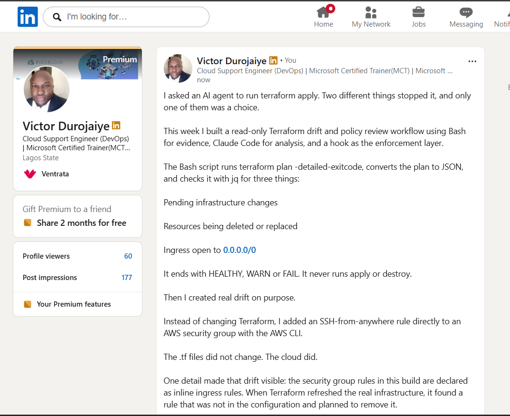

---

# Required Assignment Files

Confirm that the following files are included in your GitHub repository:

- `CLAUDE.md`
- `AI Assignment/tf-drift-check.sh`
- `.claude/skills/tf-drift-review/SKILL.md`
- `.claude/settings.json` containing the safety hook
- `reports/drift-detected-report.txt`
- `reports/resolved-report.txt`
- `drift-review-summary.md`

---

# Submission Instructions

- Complete Tasks 1–8 in sequence.
- Include Screenshots 1–19 exactly as specified.
- Answer every question under Tasks 1–8 in your own words.
- Complete all seven sections of the Terraform Drift Review Summary.
- Include the GitHub repository/folder URL containing the assignment files.
- Include your full name in the required reports and screenshots.
- Include the LinkedIn post URL and a screenshot of the published LinkedIn post.
- Do not expose access keys, passwords, tokens, account IDs, private keys, Terraform secrets, or other sensitive information.
- Review all screenshots carefully and hide or redact sensitive details where necessary.

---

# Completion Checklist

- [x] Confirmed a clean Terraform baseline
- [x] Created the required assignment workspace
- [x] Created or updated `CLAUDE.md`
- [x] Added project context and safety rules
- [x] Created `tf-drift-check.sh`
- [x] Added my full name to the report
- [x] Validated the Bash script
- [x] Made the script executable
- [x] Used `terraform plan -detailed-exitcode`
- [x] Used Terraform plan JSON
- [x] Used `jq` to inspect destructive actions
- [x] Used `jq` to inspect unsafe ingress
- [x] Confirmed the baseline returns `HEALTHY`
- [x] Created `/tf-drift-review`
- [x] Restricted the Skill to appropriate tools
- [x] Confirmed the Skill remains read-only
- [x] Confirmed the Skill never runs `terraform apply`
- [x] Confirmed the Skill never runs `terraform destroy`
- [x] Introduced a controlled detectable difference
- [x] Correctly identified whether it was true drift or a configuration change
- [x] Saved `drift-detected-report.txt`
- [x] Added the `PreToolUse` safety hook
- [x] Verified the hook blocks `terraform apply` when the report is `FAIL`
- [x] Reviewed the Terraform evidence before resolving the change
- [x] Performed any infrastructure-changing action manually
- [x] Ran the drift review again after resolution
- [x] Confirmed the final status is `HEALTHY`
- [x] Saved `resolved-report.txt`
- [x] Completed `drift-review-summary.md`
- [x] Mapped the workflow to `Gather --> Analyze --> Human Act --> Verify`
- [x] Included all 19 numbered screenshots
- [x] Answered all required questions
- [x] Published the required LinkedIn post
- [x] Added the LinkedIn post URL and screenshot
- [x] Included the GitHub repository/folder URL
- [x] Confirmed that no sensitive information is exposed

---

*This submission is part of the DevOps Micro Internship (DMI) Cohort 3 — Agentic AI Track.*
