# Assignment 02 — Provision Linux VMs with Terraform and Run Ansible Ad-Hoc Commands

Part of the DevOps Micro Internship (DMI) with Agentic AI

---

## Purpose

In this assignment, you will use Terraform to provision three or four Ubuntu Linux Virtual Machines on either Microsoft Azure or Amazon Web Services.

You will configure SSH key-based authentication, organize the servers using a custom Ansible inventory, and run Ansible ad-hoc commands across individual hosts and inventory groups.

---

# Task 1 — Create the Multi-Host Lab Structure

## Goal

Create a separate project directory for the multi-host lab and prepare the Terraform, Ansible, and documentation files.

This project will use the Git repository and Ansible controller prepared in Assignment 01.

### Evidence

#### Screenshot 1 — Terminal showing the complete `ansible-adhoc-lab` project structure

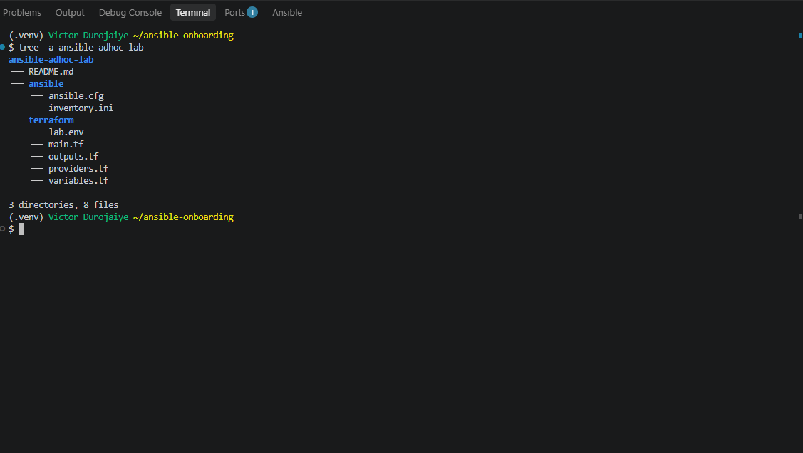

---

#### Screenshot 2 — Terminal showing `git status --short` with the new project files and updated `.gitignore`

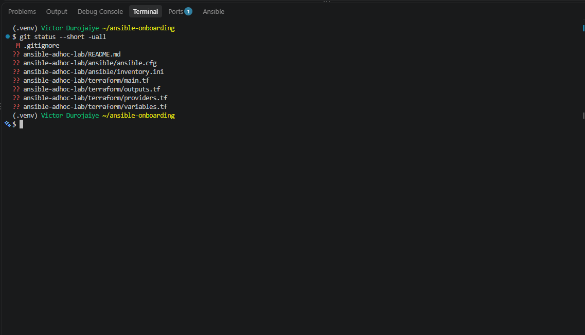

---

### Notes

I created `ansible-adhoc-lab` inside the `ansible-onboarding` repo from Assignment 01, so it uses the same Git repo, pre-commit hooks and WSL controller. It has a `terraform/` folder for the four `.tf` files and an `ansible/` folder for the inventory.

I also added a small `ansible.cfg` inside `ansible/`. Ansible looks for `ansible.cfg` in the directory you run it from, not in parent folders, so without it the Assignment 01 config would have been silently ignored when running commands from `ansible/`.

The `.gitignore` now covers Terraform state, plan files, `.terraform/` and `*.tfvars`. I checked the rules with `git check-ignore -v` before running any Terraform. The session file `lab.env` (AWS profile, region and a live lookup of my public IP) is ignored by the existing `*.env` rule, which is why it does not appear in Screenshot 2. I used `git status --short -uall` so each new file is listed instead of one collapsed folder line.

---

# Task 2 — Create the Terraform Configuration

## Goal

Create the Terraform configuration required to provision three or four Ubuntu Linux VMs on your selected cloud platform.

Complete only one option:

- Option A — Microsoft Azure
- Option B — Amazon Web Services

Do not configure both providers for this assignment.

### Evidence

#### Screenshot 3 — Terraform configuration showing the three or four server roles and the `for_each` or `count` implementation

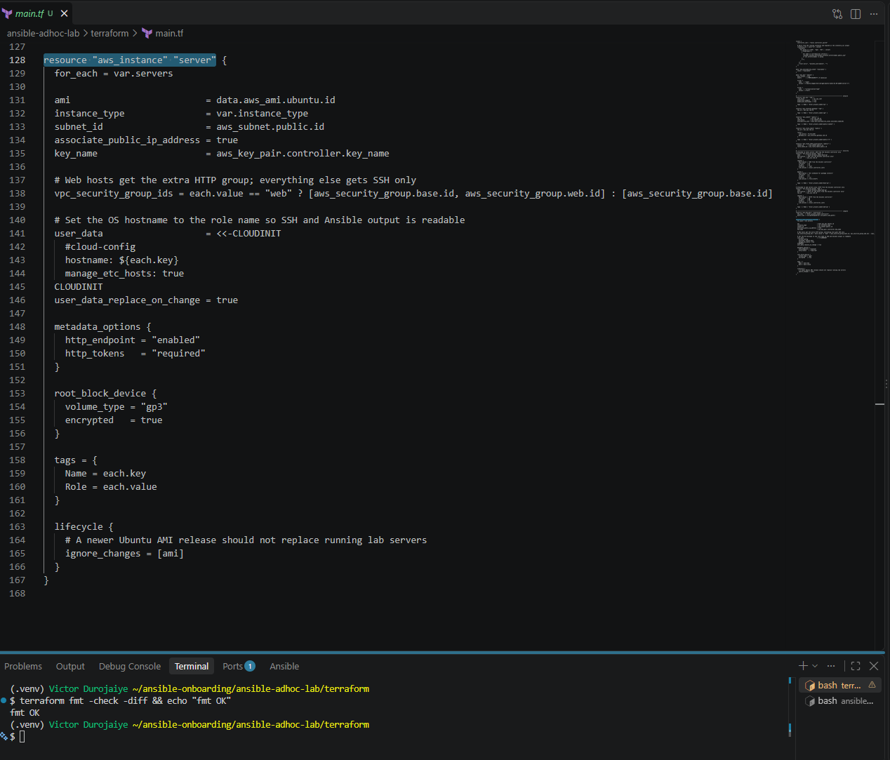

---

#### Screenshot 4 — Terraform configuration showing SSH restricted to the controller IP and HTTP allowed only for web hosts

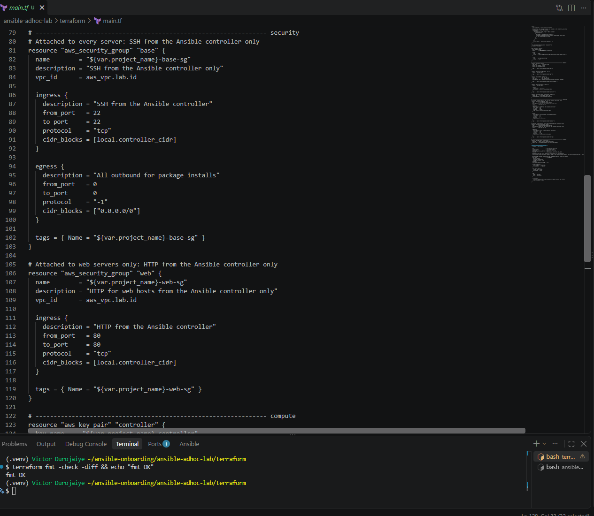

---

#### Screenshot 5 — Terraform output configuration showing how public IP addresses are associated with the server roles

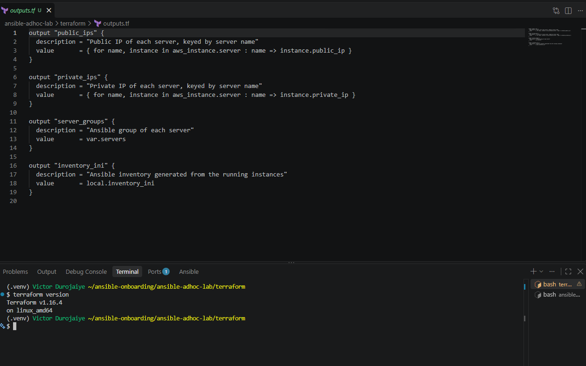

---

### Notes

I used **Option B, AWS**, in eu-north-1, with the **four-VM option**: web1, web2, app1 and db1, all Ubuntu 24.04 on `t3.micro`.

The servers come from one `aws_instance` resource with `for_each` over a `servers` map. Each key is the server name and each value is its Ansible group, and variable validation only allows three or four servers in the web, app or db groups.

There are two security groups. The base group is on every server and allows SSH only from my controller IP as a `/32`. The web group is only attached to servers whose group is `web`, and allows HTTP only from the same `/32`. I chose not to open HTTP to the internet because nothing in this lab needs to be public.

My controller IP is passed in as `TF_VAR_controller_ip` and marked `sensitive`, so it never sits in a committed file and plan and apply print `(sensitive value)` instead of the address. Every server gets a public IP so the `public_ips` output can map all four roles. I also set the hostname to the role name through cloud-init, required IMDSv2, and encrypted the root volumes. An extra `inventory_ini` output builds the Ansible inventory from the real instance IPs.

---

# Task 3 — Provision the Infrastructure with Terraform

## Goal

Initialize and validate the Terraform configuration, review the execution plan, provision the selected three or four VMs, and retrieve their public IP addresses.

### Evidence

#### Screenshot 6 — Final `terraform apply` output showing `Apply complete`

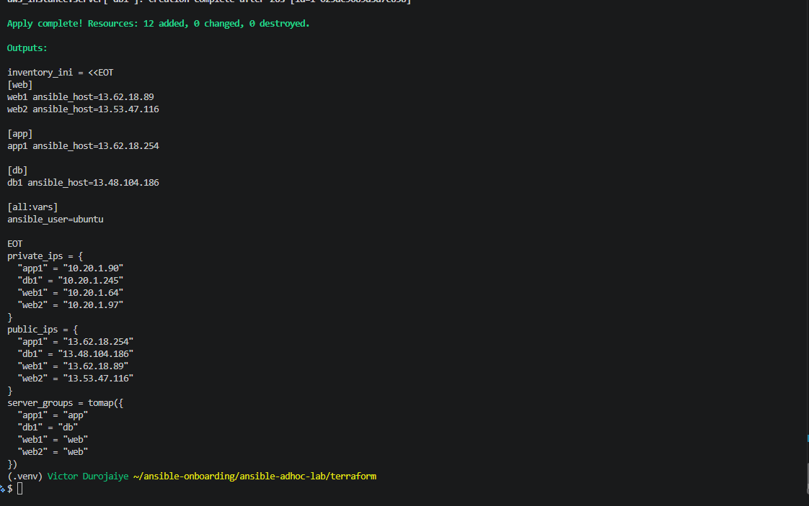

---

#### Screenshot 7 — `terraform output public_ips` showing the role-to-IP mapping for all three or four VMs

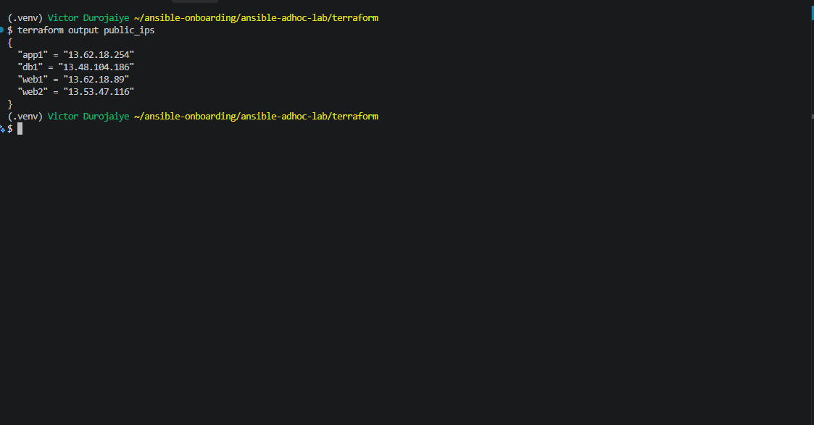

---

#### Screenshot 8 — Azure Portal or AWS Management Console showing all three or four VMs in the `Running` state, with their role-based names visible

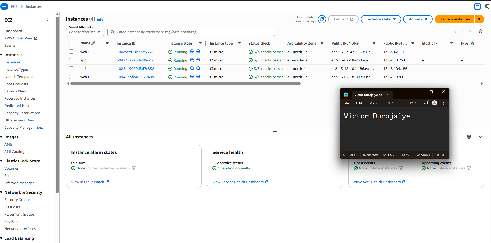

---

### Notes

I ran `terraform init`, `terraform validate`, then `terraform plan -out=tfplan` and applied that saved plan, so what got built is exactly what I reviewed. The plan created 12 resources: VPC, internet gateway, subnet, route table and association, two security groups, a key pair and four instances.

Public IPs used during the lab (all released at teardown):

| Server | Group | Public IP |
|---|---|---|
| web1 | web | 13.62.18.89 |
| web2 | web | 13.53.47.116 |
| app1 | app | 13.62.18.254 |
| db1 | db | 13.48.104.186 |

After the apply I checked the result with the AWS CLI rather than trusting the plan: web1 and web2 had both the base and web security groups, app1 and db1 had the base group only. The provider lock file is committed. The state file stays local and ignored. The account ID is redacted in Screenshot 8.

---

# Task 4 — Verify SSH Key-Based Access

## Goal

Verify that each managed VM can be accessed from the Ansible controller using SSH key-based authentication.

### Evidence

#### Screenshot 9 — Terminal showing successful SSH hostname output from all VMs

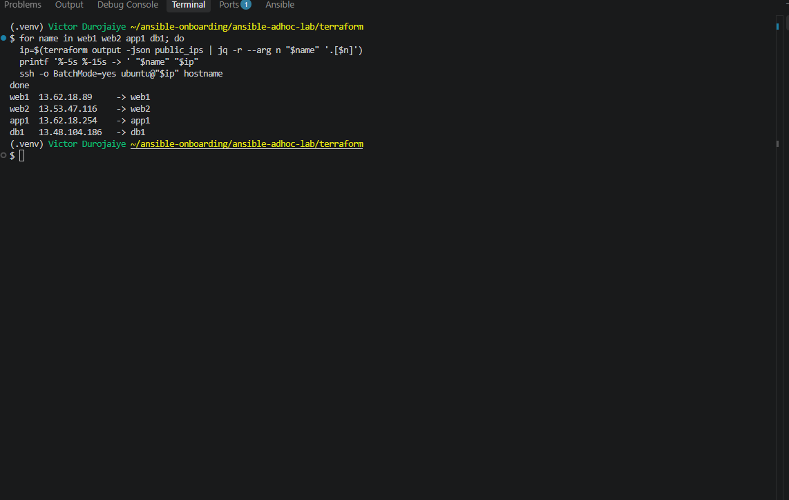

---

### Notes

I reused the ED25519 key from Assignment 01 instead of creating a new one. Terraform uploaded only the public key.

My controller keeps host key checking on, so before trusting any server I compared two fingerprints for each one: the key the server presented over SSH (`ssh-keyscan`), and the key it printed to its own boot console, which I fetched with `aws ec2 get-console-output`. The console output comes through the AWS API, not over SSH, so both cannot be faked on the same path. All four matched, and only then were the keys added to `known_hosts`, hashed.

I also waited for `cloud-init status --wait` to report `done` on every server, so apt would not be locked by first-boot updates. The hostname test used `ssh -o BatchMode=yes`, which fails instead of prompting, so a clean run proves key-only access. Each server answered with its role name.

---

# Task 5 — Create the Custom Ansible Inventory

## Goal

Create an Ansible inventory file that groups the managed VMs by role.

The inventory allows Ansible to run commands against all servers, or only specific groups such as `web`, `app`, or `db`.

### Evidence

#### Screenshot 10 — `inventory.ini` showing the `web`, `app`, and `db` groups

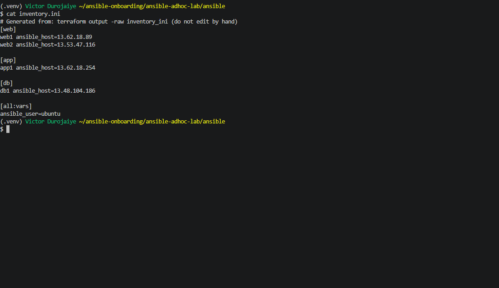

---

#### Screenshot 11 — Output of `ansible-inventory -i inventory.ini --graph`

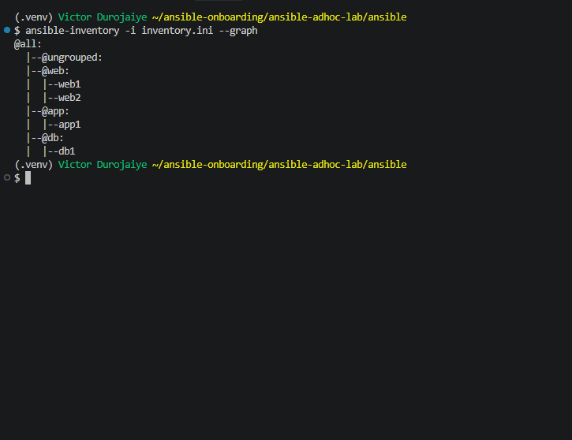

---

### Notes

I generated the inventory from Terraform with `terraform output -raw inventory_ini`, so no IP was typed by hand:

```ini
# Generated from: terraform output -raw inventory_ini (do not edit by hand)
[web]
web1 ansible_host=13.62.18.89
web2 ansible_host=13.53.47.116

[app]
app1 ansible_host=13.62.18.254

[db]
db1 ansible_host=13.48.104.186

[all:vars]
ansible_user=ubuntu
```

Each host uses its role name with `ansible_host` for the IP, which makes every Ansible result line readable. The inventory does not need a key path or a jump host: my SSH config already points at the right key, and every server is reachable directly from my controller IP. `ansible --version` confirmed the lab `ansible.cfg` was loaded.

---

# Task 6 — Run Ansible Ad-Hoc Commands

## Goal

Run Ansible ad-hoc commands from the controller to verify connectivity, check server information, and manage packages and services across inventory groups.

This task proves that the inventory is working and that Ansible can control multiple managed VMs without writing a playbook.

### Evidence

#### Screenshot 12 — Output of `ansible all -i inventory.ini -m ping`

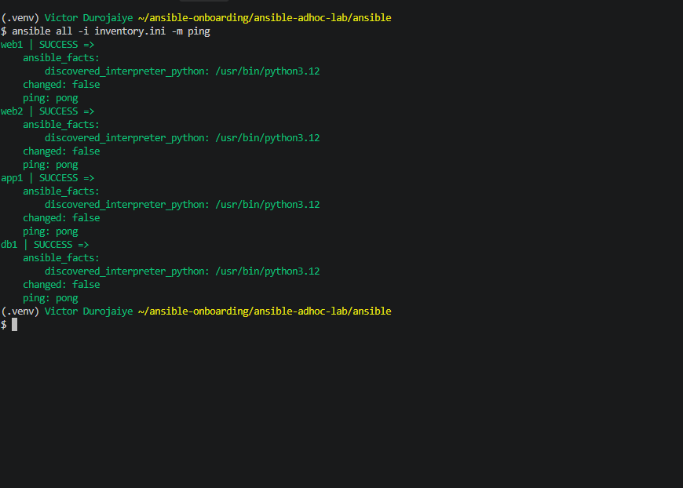

---

#### Screenshot 13 — Output of `ansible all -i inventory.ini -m command -a "uptime"`

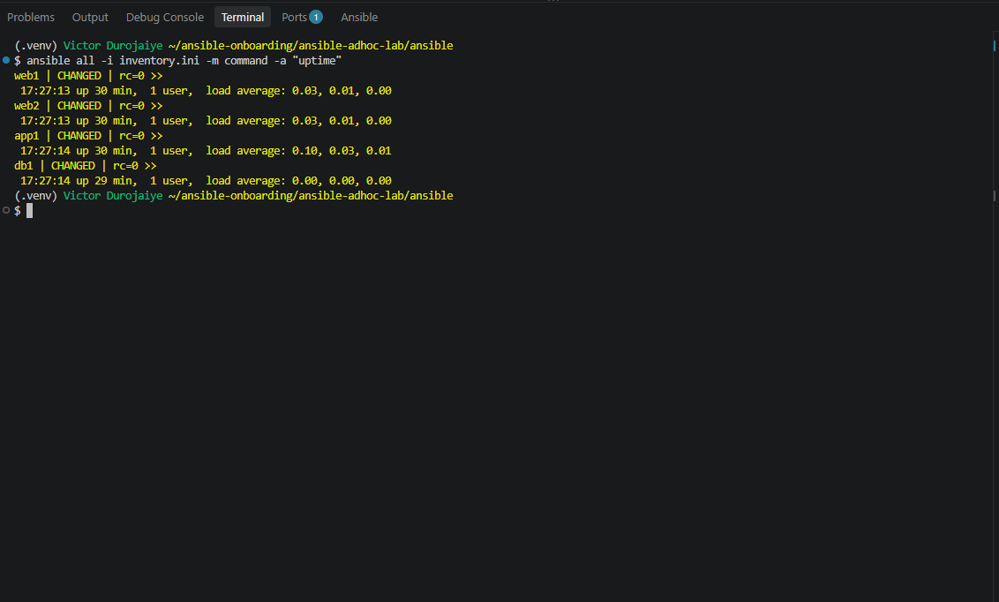

---

#### Screenshot 14 — Output of `ansible web -i inventory.ini -m apt -a "name=nginx state=present update_cache=yes" --become`

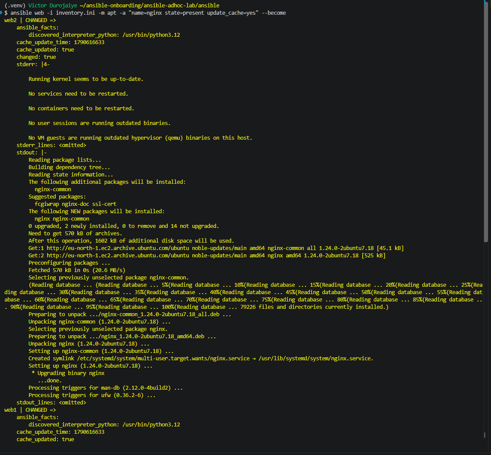

---

#### Screenshot 15 — Output of `ansible web -i inventory.ini -m service -a "name=nginx state=started enabled=yes" --become`

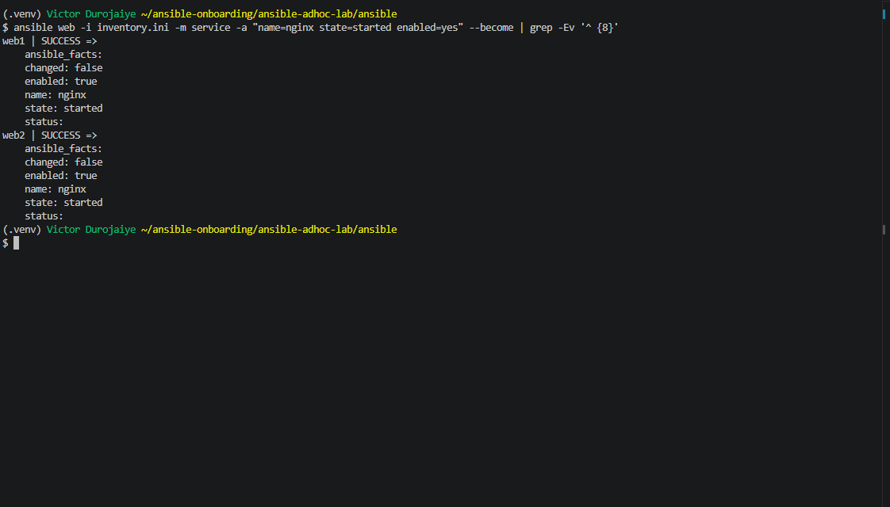

---

#### Screenshot 16 — Output of `ansible all -i inventory.ini -m apt -a "name=htop state=present update_cache=yes" --become`

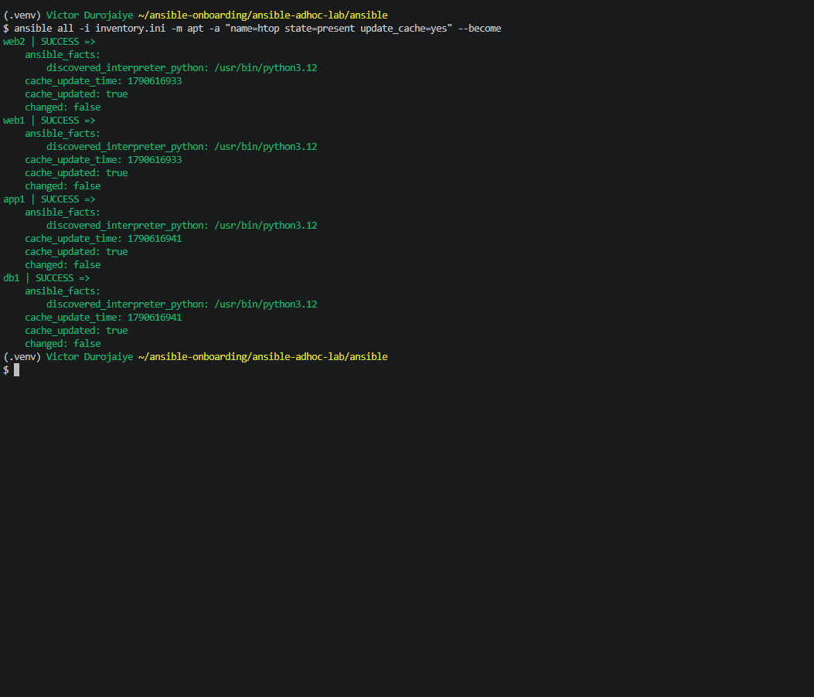

---

#### Screenshot 17 — Output of `ansible web -i inventory.ini -m command -a "systemctl is-active nginx"`

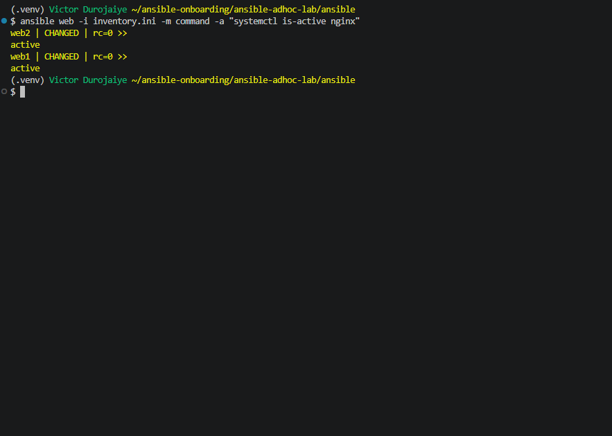

---

### Notes

All four servers answered `ping` with `pong`, and `uptime` returned `rc=0` everywhere. The `command` module always reports `CHANGED` because it cannot tell whether a command changed anything, so `rc=0` is the real success signal.

Nginx was installed on the web group only. The service command then reported no change, because Ubuntu starts and enables Nginx when the package installs, so Ansible checked the state and left it alone. htop was already present on the Ubuntu 24.04 image, so that command made no package change either. That is idempotency in practice: Ansible compares the current state with the requested state and only acts on the difference. `systemctl is-active nginx` returned `active` on web1 and web2.

I also tested the security groups from the controller: `curl` to web1 on port 80 returned `200`, and app1 timed out because it has no web security group.

What I learned: an inventory is only as good as the data behind it, so generating it from Terraform removed a whole class of typing mistakes. Grouping by role meant one flag changed the target from all four servers to just the web tier. Host key checking is worth keeping on if you have a trustworthy second source for the fingerprints.

After capturing the evidence I destroyed all 12 resources with a reviewed destroy plan, confirmed with the AWS CLI that the VPC, security groups, key pair and instances were gone, and removed the four old host keys from `known_hosts`, since those IPs will go to someone else.

---

# LinkedIn Post Required

## Evidence

#### LinkedIn Post URL

Paste your LinkedIn post URL here:

`https://www.linkedin.com/posts/victor-jaiye_devops-ansible-terraform-share-7510417931575484416-Tba8/`

---

#### Screenshot — Published LinkedIn post

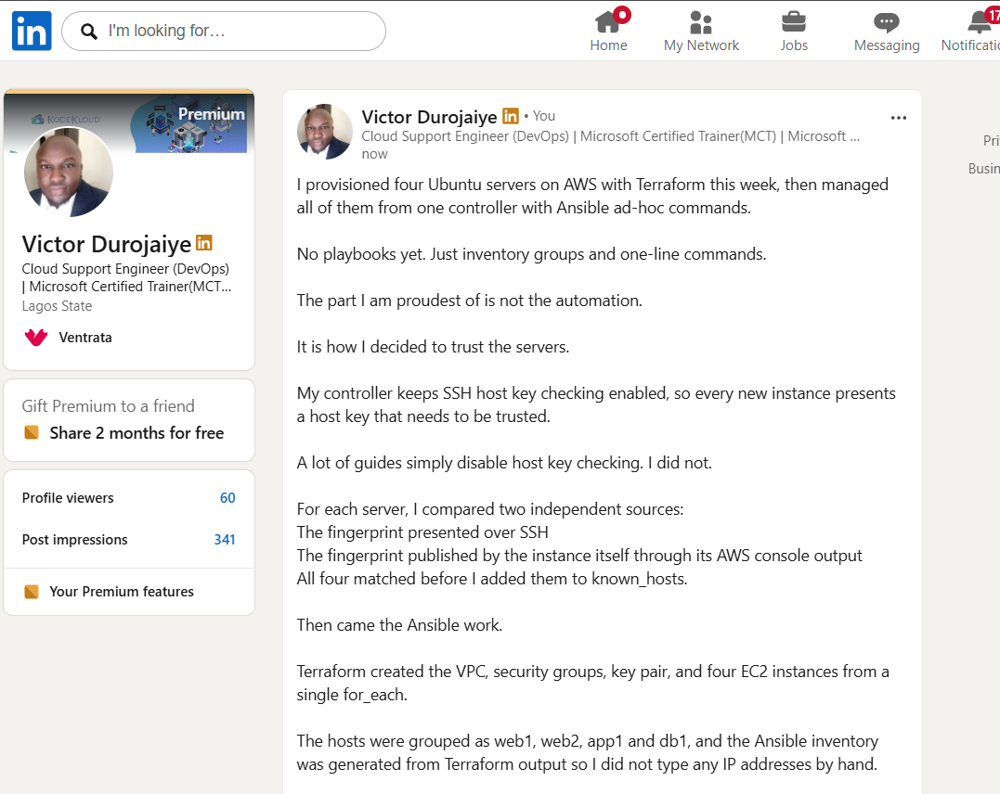

---

# Assignment Questions

Answer the following in your own words:

**1. What is the purpose of an Ansible inventory file?**

It tells Ansible which servers exist, how to reach them, and how they are grouped. In my lab it maps each name like web1 to its IP, sets the SSH user for every host, and puts the servers into web, app and db groups. Without it, Ansible has nothing to target except localhost.

---

**2. What is the difference between the `web`, `app`, and `db` groups in your inventory?**

They separate the servers by role. In this lab all four servers are the same Ubuntu build, so the difference is what each group is for and what it is allowed to do. The web group has web1 and web2, gets the extra security group for HTTP, and is the only group that got Nginx. The app and db groups each have one server with SSH only. Grouping lets me install Nginx on the web tier without touching the others, and later assignments can give each tier its own configuration.

---

**3. What does the Ansible `ping` module verify?**

It is not a network ping. It checks that Ansible can connect over SSH, log in with the key, and run a small Python module on the server, then it returns `pong`. So a success proves the inventory entry, the SSH access and a working Python on the target. It does not test other ports, like HTTP.

---

**4. Why do package installation commands require `--become`?**

Installing packages writes to system locations like `/usr` and the dpkg database, which only root can change. Ansible connects as the normal `ubuntu` user, and `--become` tells it to use sudo for that task. Without it, apt fails with a permission error. Keeping it per command means privilege is only used when a task actually needs it.

---

**5. When would you use an ad-hoc command instead of a playbook?**

For quick one-off jobs: checking uptime or disk space across the fleet, restarting a service during an incident, or installing a single package to test something. Anything I need to repeat, review, keep in Git, or that has several dependent steps belongs in a playbook.

---

**6. What is one challenge you faced while setting up SSH or inventory, and how did you fix it?**

My controller keeps host key checking on, so four brand-new servers would each ask whether to trust their key, and several prompts at once can hang an Ansible run. The easy fix is to switch checking off, but that removes the protection. Instead I fetched each server's fingerprint from its boot console through the AWS API, compared it with the key the server presented over SSH, and only added the key to `known_hosts` when they matched. All four matched and Ansible ran without any prompts.

---

# Required Files

Confirm that the following files are included in your assignment workspace:

- [x] `ansible-adhoc-lab/README.md`
- [x] `ansible-adhoc-lab/terraform/providers.tf`
- [x] `ansible-adhoc-lab/terraform/main.tf`
- [x] `ansible-adhoc-lab/terraform/variables.tf`
- [x] `ansible-adhoc-lab/terraform/outputs.tf`
- [x] `ansible-adhoc-lab/ansible/inventory.ini`
- [x] Updated `.gitignore`

---

# Submission Instructions

- Add all required screenshots from the tasks.
- Full Name must be visible in required screenshots.
- Mention whether you used Azure or AWS.
- Mention whether you used the three-VM option or four-VM option.
- Add the public IP addresses of the VMs, redacted if preferred.
- Add your `inventory.ini` proof.
- Add a short explanation of what you learned.
- Answer all assignment questions clearly in your own words.
- Add your LinkedIn post URL.
- Do not expose SSH private keys, Terraform state files, cloud credentials, passwords, access keys, secret keys, account IDs, or subscription IDs.

---

# Completion Checklist

- [x] Task 1: `ansible-adhoc-lab` project structure created
- [x] Task 1: `.gitignore` updated for Terraform files
- [x] Task 2: Terraform configuration created
- [x] Task 2: Server roles defined for either three or four VMs
- [x] Task 2: `count` or `for_each` used
- [x] Task 2: SSH restricted to the controller public IP
- [x] Task 2: HTTP allowed only for web hosts
- [x] Task 2: Terraform output maps roles to public IPs
- [x] Task 3: Terraform initialized successfully
- [x] Task 3: Terraform configuration validated
- [x] Task 3: Terraform apply completed successfully
- [x] Task 3: All selected VMs are running
- [x] Task 4: SSH key-based access works for every VM
- [x] Task 5: `inventory.ini` contains `web`, `app`, and `db` groups
- [x] Task 5: `ansible-inventory -i inventory.ini --graph` shows the correct groups
- [x] Task 6: `ansible all -i inventory.ini -m ping` returns `SUCCESS`
- [x] Task 6: Ad-hoc commands run successfully
- [x] Task 6: `--become` was used for package and service tasks
- [x] Task 6: Nginx is active on the `web` group
- [x] Screenshots 1–17 are included
- [x] Assignment questions are answered
- [x] LinkedIn post published
- [x] LinkedIn post URL added
- [x] No sensitive information is exposed

---

## About DMI & CloudAdvisory

DevOps Micro Internship (DMI) is a project-based DevOps program run by Pravin Mishra and The CloudAdvisory, focused on real-world execution, systems thinking, and career readiness.

It helps learners build strong DevOps foundations with hands-on experience.

---

## Resources

- DMI Official Website: [https://dmi.pravinmishra.com?utm_source=github&utm_medium=readme](https://dmi.pravinmishra.com?utm_source=github&utm_medium=readme)
- University: [https://university.pravinmishra.com?utm_source=github&utm_medium=readme](https://university.pravinmishra.com?utm_source=github&utm_medium=readme)
- Discord Community: [https://discord.pravinmishra.com?utm_source=github&utm_medium=readme](https://discord.pravinmishra.com?utm_source=github&utm_medium=readme)
- Blog: [https://dmi.pravinmishra.com/blog?utm_source=github&utm_medium=readme](https://dmi.pravinmishra.com/blog?utm_source=github&utm_medium=readme)
- YouTube Playlist: [https://www.youtube.com/playlist?list=PLFeSNDtI4Cho](https://www.youtube.com/playlist?list=PLFeSNDtI4Cho)
- Pravin Mishra LinkedIn: [https://www.linkedin.com/in/pravin-mishra-aws-trainer/](https://www.linkedin.com/in/pravin-mishra-aws-trainer/)
- CloudAdvisory LinkedIn: [https://www.linkedin.com/company/thecloudadvisory/](https://www.linkedin.com/company/thecloudadvisory/)

---

*This submission is part of DevOps Micro Internship (DMI) — Agentic AI Track.*
