# Assignment 03 — Deploy a Static Website to Multiple Servers Using a Multi-Play Ansible Playbook

Part of the DevOps Micro Internship (DMI) with Agentic AI

---

## Student Details

**Full Name:** Victor Durojaiye  
**Cloud Platform Used:** AWS  
**Server 1 URL:** `http://51.20.144.174`  
**Server 2 URL:** `http://16.171.64.68`

---

## Purpose

In this assignment, you will create a multi-play Ansible playbook to install Nginx, deploy a static website to two Ubuntu servers, and verify that the website is accessible from both servers.

You may use either AWS EC2 instances or Azure Virtual Machines as your managed servers.

---

# Task 1 — Create the Project Structure

## Goal

Create the required folders and files for the Ansible project.

## Evidence

### Screenshot 1 — Terminal or VS Code showing the complete `static-web` project structure

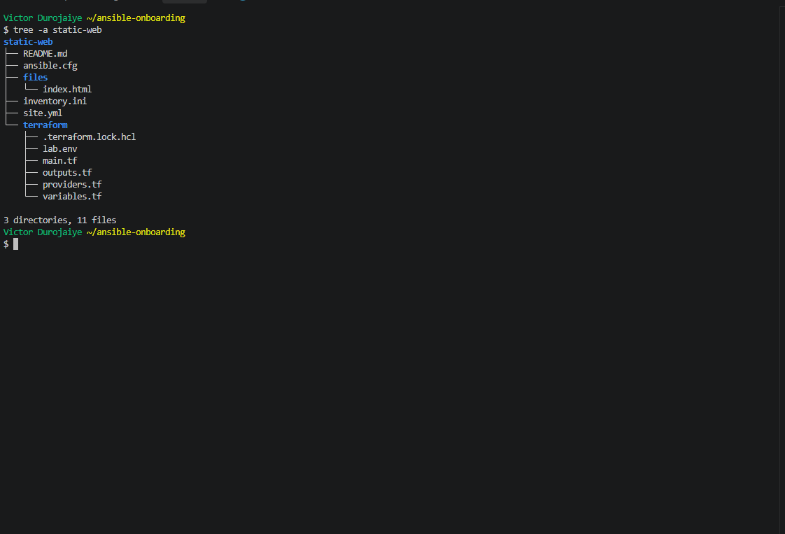

---

# Task 2 — Configure the Ansible Inventory

## Goal

Add both Ubuntu servers to the Ansible inventory.

## Evidence

### Screenshot 2 — Output of `ansible-inventory -i inventory.ini --graph` showing `web1` and `web2`

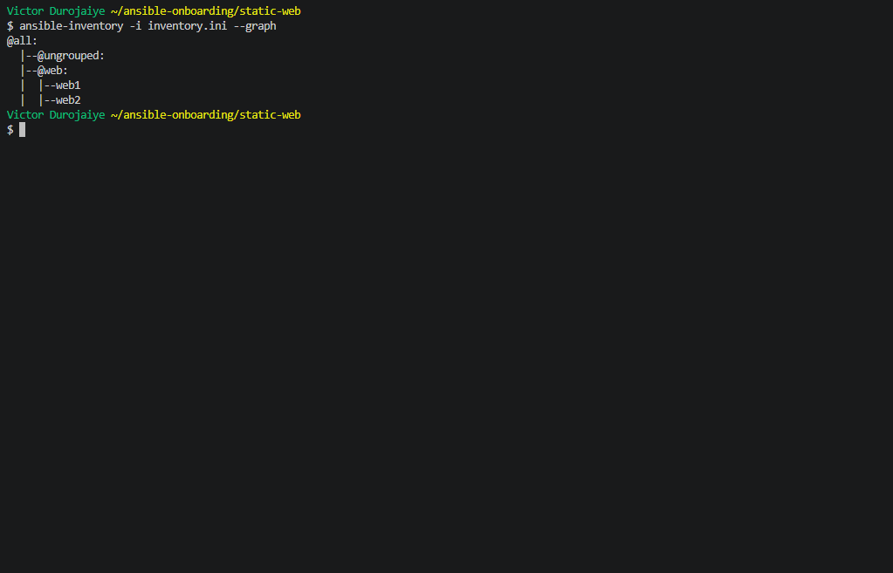

---

## Configuration File

Copy and paste the complete contents of your `inventory.ini` file below:

```ini
# Generated from: terraform output -raw inventory_ini (do not edit by hand)
[web]
web1 ansible_host=51.20.144.174
web2 ansible_host=16.171.64.68

[all:vars]
ansible_user=ubuntu
```

---

# Task 3 — Verify Ansible Connectivity

## Goal

Confirm that the Ansible controller can connect to both servers.

## Evidence

### Screenshot 3 — Ansible ping output showing `SUCCESS` and `pong` for both servers

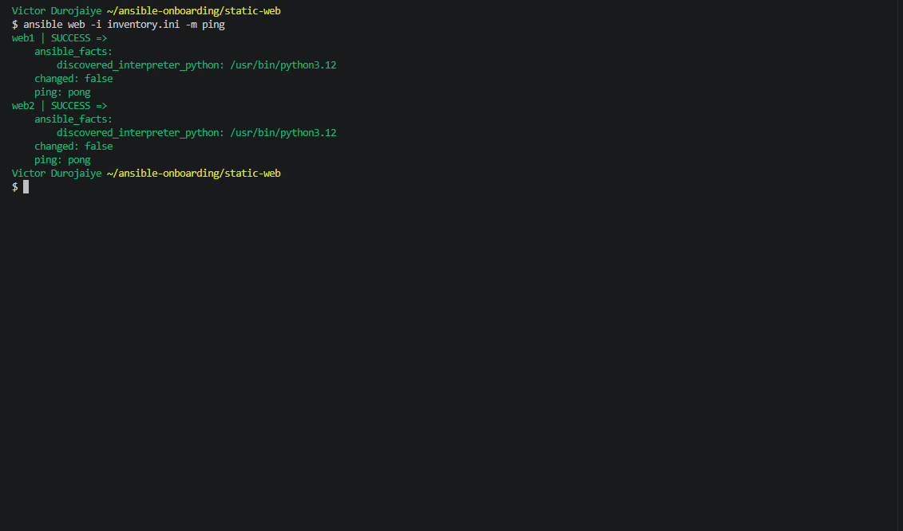

---

# Task 4 — Download and Personalize the Static Website

## Goal

Download `index.html` to the Ansible controller and personalize the website with your full name.

## Evidence

### Screenshot 4 — Edited `files/index.html` showing the footer line with your full name

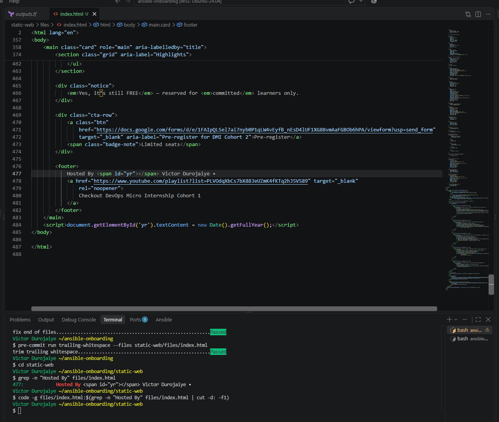

---

# Task 5 — Create the Multi-Play Ansible Playbook

## Goal

Create a single Ansible playbook containing separate plays for installation, deployment, and verification.

## Configuration File

Copy and paste the complete contents of your `site.yml` file below:

```yaml
---
- name: Install and configure Nginx
  hosts: web
  become: true
  tasks:
    - name: Install Nginx and refresh the apt cache only if older than an hour
      ansible.builtin.apt:
        name: nginx
        state: present
        update_cache: true
        cache_valid_time: 3600

    - name: Start and enable Nginx
      ansible.builtin.service:
        name: nginx
        state: started
        enabled: true

- name: Deploy the static website
  hosts: web
  become: true
  tasks:
    - name: Copy index.html to the web root
      ansible.builtin.copy:
        src: files/index.html
        dest: /var/www/html/index.html
        owner: www-data
        group: www-data
        mode: "0644"
      notify: Reload nginx

  handlers:
    - name: Reload nginx
      ansible.builtin.service:
        name: nginx
        state: reloaded

- name: Verify both websites from the controller
  hosts: localhost
  connection: local
  gather_facts: false
  become: false
  vars:
    expected_text: Victor Durojaiye
  tasks:
    - name: Request each web server over HTTP
      ansible.builtin.uri:
        url: "http://{{ hostvars[item].ansible_host }}"
        status_code: 200
        return_content: true
      loop: "{{ groups['web'] }}"
      loop_control:
        label: "{{ item }}"
      register: website_checks

    - name: Confirm HTTP 200 and the personalized footer on each server
      ansible.builtin.assert:
        that:
          - check.status == 200
          - expected_text in check.content
        success_msg: "{{ check.item }} returned HTTP {{ check.status }} with the expected footer"
        fail_msg: "{{ check.item }} failed: HTTP {{ check.status }}, footer found={{ expected_text in check.content }}"
      loop: "{{ website_checks.results }}"
      loop_control:
        loop_var: check
        label: "{{ check.item }}"
```

---

# Task 6 — Validate the Playbook Syntax

## Goal

Check the playbook for YAML or Ansible syntax errors before running it.

## Evidence

### Screenshot 5 — Successful syntax-check output showing `playbook: site.yml`

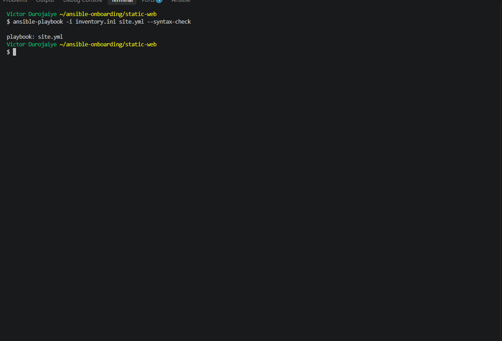

---

# Task 7 — Run the Multi-Play Playbook

## Goal

Install Nginx, deploy the website, and verify both servers in one playbook run.

## Evidence

### Screenshot 6 — Play 3 verification showing HTTP `200` for both servers

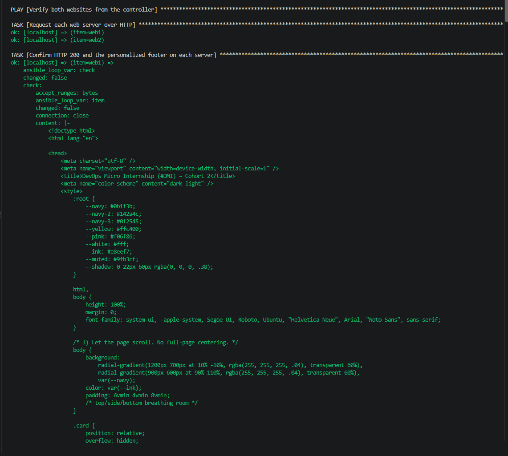

---

### Screenshot 7 — Final play recap showing `unreachable=0` and `failed=0` for `web1`, `web2`, and `localhost`

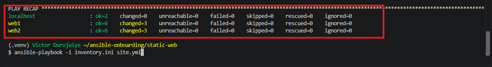

---

# Task 8 — Verify Idempotency

## Goal

Run the playbook again and confirm that it does not make unnecessary changes.

## Evidence

### Screenshot 8 — Second playbook run showing the play recap with `changed=0`, `unreachable=0`, and `failed=0` for both web servers

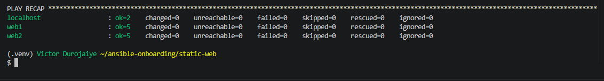

---

# Task 9 — Test Both Websites Manually

## Goal

Confirm that the static website is accessible from both public IP addresses.

## Evidence

### Screenshot 9 — `curl -I` output showing HTTP `200 OK` from both servers

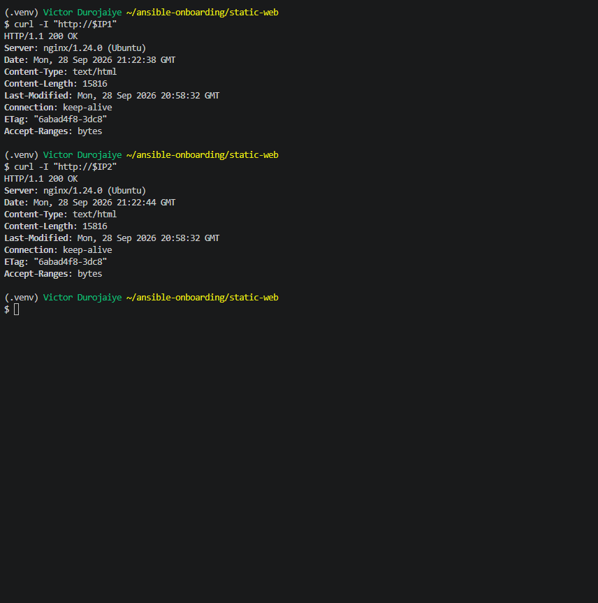

---

### Screenshot 10 — Browser showing the website from Server 1 with the public IP and your full name visible

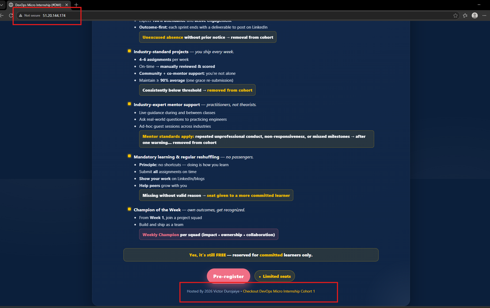

---

### Screenshot 11 — Browser showing the website from Server 2 with the public IP and your full name visible

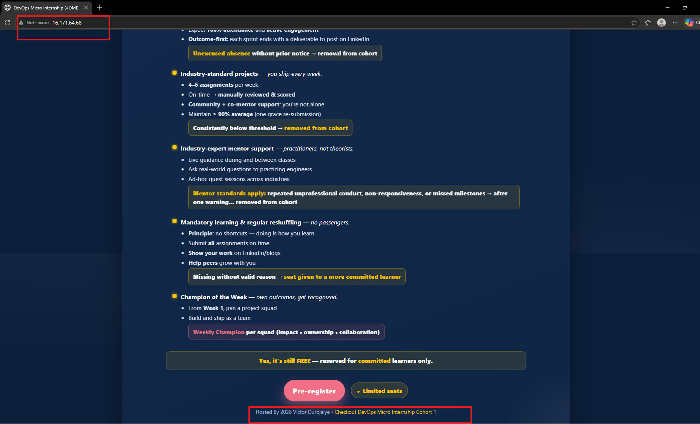

---

## Website URLs

Add both deployed website URLs below:

```text
Server 1: http://51.20.144.174
Server 2: http://16.171.64.68
```

---

# Task 10 — Complete the Project README

## Goal

Document how the project works and record what you learned.

## README Content

Copy and paste the complete contents of your `README.md` file below:

````markdown
# Static Website on Two Servers with a Multi-Play Ansible Playbook

**Owner:** Victor Durojaiye ([GitHub: Kingjaiyee](https://github.com/Kingjaiyee))
**Context:** DevOps Micro Internship (DMI) Cohort 3, Week 9, Assignment 3
**Cloud:** AWS, eu-north-1

## Summary

One Ansible playbook, `site.yml`, installs Nginx on two Ubuntu 24.04 servers, deploys a personalized `index.html` to both, and then checks from the controller that both sites answer with HTTP 200 and show my name. The servers are built with a small Terraform config in `terraform/` and are destroyed after the evidence is captured.

## Project structure

```text
static-web/
├── README.md
├── ansible.cfg          # Loaded because the playbook runs from this folder
├── files/
│   └── index.html       # The website, personalized with my name in the footer
├── inventory.ini        # Generated from terraform output: web1 and web2 in [web]
├── site.yml             # Three plays: install, deploy, verify
└── terraform/           # VPC, security groups, key pair and two EC2 instances
```

## How the playbook works

| Play | Runs on | What it does |
|---|---|---|
| 1. Install and configure Nginx | `web` | Installs Nginx, refreshing the apt cache only if it is older than an hour, then starts and enables the service |
| 2. Deploy the static website | `web` | Copies `files/index.html` to `/var/www/html/index.html` as `www-data`, mode `0644`, and notifies a handler |
| 3. Verify both websites | `localhost` | Requests each server over HTTP with the `uri` module and asserts HTTP 200 plus my name in the page |

The **Reload nginx** handler only runs when the copy task reports a change, so Nginx is not reloaded on runs where the site did not change.

## How to run it

```bash
# Build the servers
cd terraform && source lab.env
terraform init && terraform plan -out=tfplan && terraform apply tfplan

# Trust each host key only after it matches the fingerprint in the instance console output,
# then generate the inventory
cd ..
terraform -chdir=terraform output -raw inventory_ini > inventory.ini

# Check, run, verify
ansible-playbook -i inventory.ini site.yml --syntax-check
ansible-playbook -i inventory.ini site.yml
curl -I http://<web1-ip>
curl -I http://<web2-ip>

# Tear down
cd terraform && terraform plan -destroy -out=destroy.tfplan && terraform apply destroy.tfplan
```

## Results

| Run | web1 | web2 | localhost |
|---|---|---|---|
| First | ok=6 changed=3 | ok=6 changed=3 | ok=2 changed=0 |
| Second | ok=5 changed=0 | ok=5 changed=0 | ok=2 changed=0 |

On the first run the three changes were the Nginx install, the file copy and the handler reload. On the second run nothing changed and the handler did not run, which proves the playbook is idempotent.

## Security choices

- SSH and HTTP are allowed only from my controller public IP (`/32`). The IP is passed as `TF_VAR_controller_ip` and never written to a committed file.
- Host keys were trusted only after matching the fingerprint each server printed to its boot console.
- The SSH key is the controller ED25519 key from Assignment 01. Only the public key was uploaded.
- Terraform state, plans and `lab.env` are gitignored.

## Issues and fixes

- **A standalone apt cache update task reports `changed` on every run**, so a second run could never show `changed=0`. I folded the refresh into the install task with `cache_valid_time: 3600`.
- **Ansible only reads `ansible.cfg` from the current directory**, so this project has its own copy instead of relying on the one at the repo root.
- **My pre-commit hooks would have trimmed whitespace in `index.html` at commit time**, making the repo copy differ from the deployed copy and breaking idempotency on the next run. I ran the hooks on the file before the first deploy.

## What I learned

- Splitting a playbook into install, deploy and verify plays makes each part easy to read, re-run and debug on its own.
- Handlers tie a restart or reload to a real change instead of running it every time.
- Checking the page content, not just the status code, is what proves the right file was deployed.
- Idempotency is something you design for. A task that always reports `changed` hides real changes.
````

---

# LinkedIn Post Required

## Evidence

### LinkedIn Post URL

Paste your LinkedIn post URL here:

`https://www.linkedin.com/feed/update/urn:li:activity:7510453361587171328/`

---

### Screenshot — Published LinkedIn post

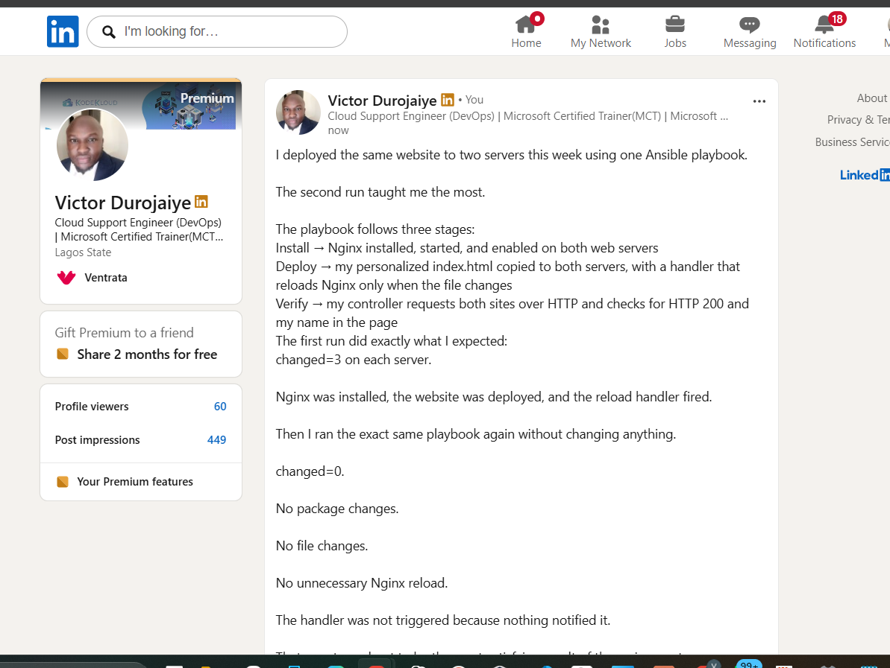

---

# Assignment Questions

Answer the following in your own words:

**1. What issue did you face while completing this assignment, and how did you fix it?**

My playbook could not pass the idempotency check at first. A separate task that only refreshes the apt cache reports `changed` every time it runs, so a second run would always show `changed=1` even when nothing on the servers needed to change. I removed that task and moved the refresh into the Nginx install task with `cache_valid_time: 3600`, so the cache only refreshes when it is more than an hour old. The second run then showed `changed=0` on both servers.

---

**2. What did you learn from this assignment?**

I learned how to split one playbook into plays with a single job each, and how handlers keep a reload tied to a real change. I also learned that a `200` alone is weak proof: Nginx returns `200` for its default page too, so I made the verify play check that my name is in the page. And I saw that idempotency has to be designed in. One task that always reports a change makes the whole playbook look like it is doing work when it is not.

---

**3. Why is it useful to split installation, deployment, and verification into separate plays?**

Each play has one job and can target different hosts. Install and deploy run on the web servers, while verification runs on my controller, which is the same view a real visitor gets. When something fails, the play name tells me straight away whether it was the install, the file deploy or the check. The plays can also be reused or run on their own later, for example running only the deploy play when the site changes.

---

**4. What is one benefit of using the Ansible `copy` module instead of cloning the website directly from Git on every managed server?**

The servers do not need Git, internet access to GitHub, or any repository credentials. The controller holds the one tested copy of `index.html`, and every server gets exactly that file. `copy` also compares checksums first, so it only changes the file when it differs, which keeps the playbook idempotent and means the reload handler only fires when the site really changed.

---

**5. What does idempotency mean in this assignment?**

It means running the playbook again leaves the servers in the same state and only changes what is different. On the first run Ansible installed Nginx, copied the website and reloaded Nginx, so each server showed `changed=3`. On the second run, with nothing edited, every task reported `ok`, the handler did not run, and both servers showed `changed=0`.

---

**6. What does the Ansible `uri` module verify in Play 3?**

It sends an HTTP request from my controller to each server's public IP and checks that the response status is `200`. That proves Nginx is running and the site is reachable through the security group from outside the server. I also set `return_content: true` so the next task could check that each page contains my name, which proves the personalized file was deployed and not the default Nginx page.

---

# Required Files

Confirm that the following files are included in your assignment folder:

- [x] `inventory.ini`
- [x] `site.yml`
- [x] `files/index.html`
- [x] `README.md`

---

# Submission Instructions

- Add all required screenshots in the correct order.
- Full Name must be visible in required screenshots.
- Include both deployed website URLs.
- Paste `inventory.ini`, `site.yml`, and `README.md` as editable text.
- Answer all assignment questions clearly in your own words.
- Add your LinkedIn post URL.
- Do not expose SSH private keys, passwords, cloud account IDs, or other sensitive information.

---

# Completion Checklist

- [x] Task 1: `static-web` folder structure is complete
- [x] Task 2: Both servers are listed under the `[web]` group in `inventory.ini`
- [x] Task 2: Inventory graph shows `web1` and `web2`
- [x] Task 3: Ansible ping returns `SUCCESS` and `pong` for both servers
- [x] Task 4: `files/index.html` contains your full name
- [x] Task 5: `site.yml` contains three separate plays
- [x] Task 5: Play 1 installs, starts, and enables Nginx
- [x] Task 5: Play 2 deploys `index.html` using the `copy` module
- [x] Task 5: Nginx reload handler is included
- [x] Task 5: Play 3 verifies both web servers from the controller
- [x] Task 6: Playbook syntax check passes
- [x] Task 7: First playbook run completes with `unreachable=0` and `failed=0`
- [x] Task 7: URI verification returns HTTP `200` for both servers
- [x] Task 8: Second playbook run demonstrates idempotency
- [x] Task 8: Second run shows `changed=0` for both web servers
- [x] Task 9: Both `curl -I` commands return HTTP `200 OK`
- [x] Task 9: Website loads from Server 1
- [x] Task 9: Website loads from Server 2
- [x] Task 9: Full name is visible on both deployed websites
- [x] Task 10: `README.md` contains all required explanations
- [x] Screenshots 1–11 are included
- [x] `inventory.ini`, `site.yml`, and `README.md` are pasted as editable text
- [x] Both website URLs are included
- [x] Assignment questions are answered
- [x] LinkedIn post published
- [x] LinkedIn post URL added
- [x] No sensitive information is exposed

---

## About DMI & CloudAdvisory

DevOps Micro Internship (DMI) is a project-based DevOps program run by Pravin Mishra and The CloudAdvisory, focused on real-world execution, systems thinking, and career readiness.

It helps learners build strong DevOps foundations with hands-on experience.

---

## Resources

- DMI Official Website: [https://dmi.pravinmishra.com?utm_source=github&utm_medium=readme](https://dmi.pravinmishra.com?utm_source=github&utm_medium=readme)
- University: [https://university.pravinmishra.com?utm_source=github&utm_medium=readme](https://university.pravinmishra.com?utm_source=github&utm_medium=readme)
- Discord Community: [https://discord.pravinmishra.com?utm_source=github&utm_medium=readme](https://discord.pravinmishra.com?utm_source=github&utm_medium=readme)
- Blog: [https://dmi.pravinmishra.com/blog?utm_source=github&utm_medium=readme](https://dmi.pravinmishra.com/blog?utm_source=github&utm_medium=readme)
- YouTube Playlist: [https://www.youtube.com/playlist?list=PLFeSNDtI4Cho](https://www.youtube.com/playlist?list=PLFeSNDtI4Cho)
- Pravin Mishra LinkedIn: [https://www.linkedin.com/in/pravin-mishra-aws-trainer/](https://www.linkedin.com/in/pravin-mishra-aws-trainer/)
- CloudAdvisory LinkedIn: [https://www.linkedin.com/company/thecloudadvisory/](https://www.linkedin.com/company/thecloudadvisory/)

---

*This submission is part of DevOps Micro Internship (DMI) — Agentic AI Track.*
