# Assignment 04 — Deploy Mini Finance on Azure Using Terraform and Ansible

Part of the DevOps Micro Internship (DMI) with Agentic AI

---

## Purpose

In this assignment, you will provision Azure infrastructure using Terraform and deploy the Mini Finance website using an Ansible multi-play playbook.

Terraform will create the Azure Virtual Machine and networking resources. Ansible will install Nginx, clone the Mini Finance repository, deploy the website, and verify the deployment.

---

# Task 1 — Create the Project Structure

## Goal

Create separate directories and files for the Terraform infrastructure and Ansible configuration.

### Evidence

#### Screenshot 1 — Terminal or VS Code showing the complete `mini-finance` project structure

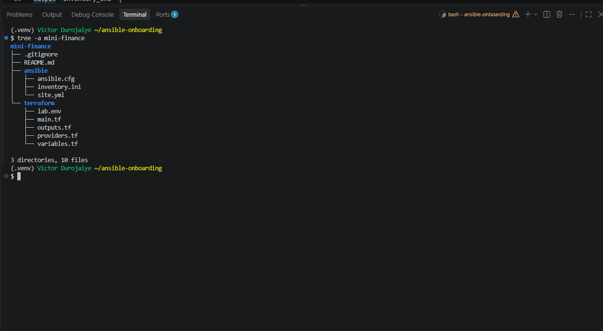

---

### Notes

I created `mini-finance` inside my `ansible-onboarding` repo from Assignment 01, with a `terraform/` folder for the infrastructure and an `ansible/` folder for the inventory and playbook. The project has its own `.gitignore` covering Terraform state, plans, `.terraform/`, `*.tfvars`, keys and `.env` files.

The `ansible/` folder has its own `ansible.cfg`, because Ansible only reads `ansible.cfg` from the directory you run it in. I also added a local `lab.env` file that looks up my subscription ID and public IP each time it is sourced, so neither value is ever written to a committed file. It is ignored by the `*.env` rule.

---

# Task 2 — Create the Azure Infrastructure Using Terraform

## Goal

Use Terraform to provision an Ubuntu Virtual Machine with the required Azure networking and security resources.

### Evidence

#### Screenshot 2 — Terraform code showing the `Allow-SSH` rule for port `22` and the `Allow-HTTP` rule for port `80`

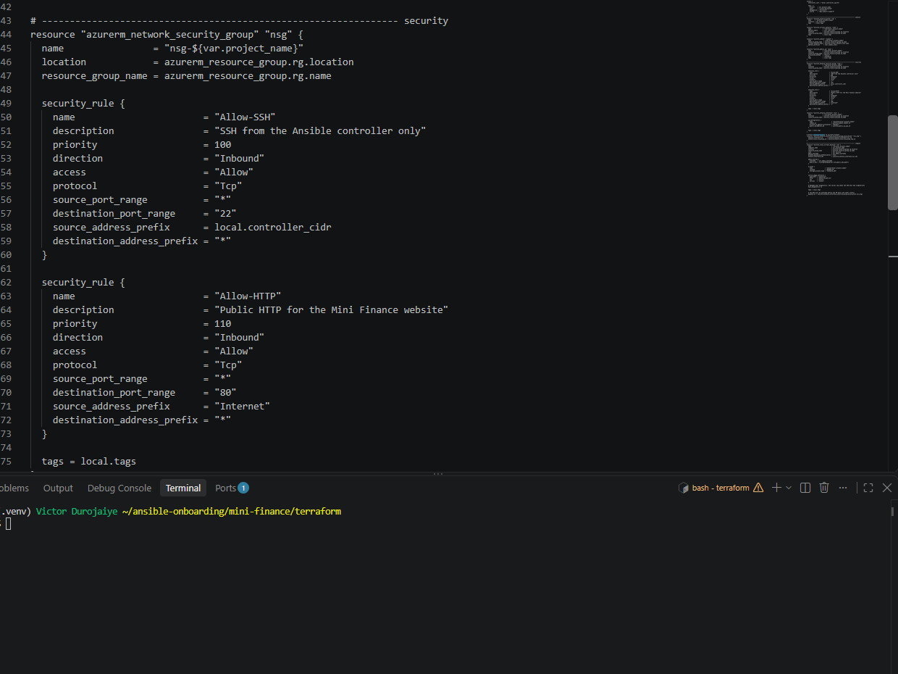

---

#### Screenshot 3 — Terraform code showing the association between `nsg-mini-finance` and `nic-mini-finance`

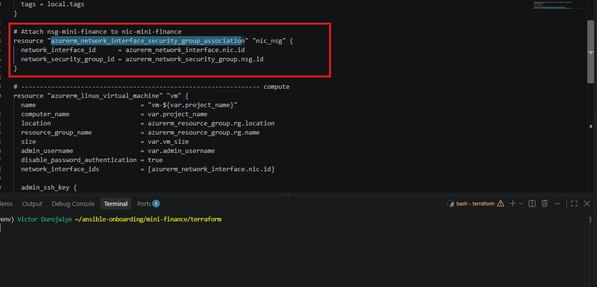

---

### Notes

The Terraform creates a resource group, virtual network and subnet, a static Standard public IP, `nsg-mini-finance`, `nic-mini-finance`, the association between the NSG and the NIC, and `vm-mini-finance` running Ubuntu 24.04 in Sweden Central.

`Allow-SSH` (priority 100) only allows port 22 from my controller public IP as a `/32`. The IP is passed in as `TF_VAR_controller_ip` and marked `sensitive`, so it never appears in plan output. `Allow-HTTP` (priority 110) allows port 80 from `Internet`, because this is a public website.

The VM uses `computer_name = "mini-finance"` so the OS hostname matches the project, disables password login, and only accepts my controller ED25519 public key. I enabled managed boot diagnostics so I could read the SSH host key fingerprints from the VM's own boot log. The VM also depends on the NSG association, so the firewall rules are in place before it boots.

---

# Task 3 — Initialize and Apply the Terraform Configuration

## Goal

Format and validate the Terraform configuration, review the execution plan, and provision the Azure infrastructure.

### Evidence

#### Screenshot 4 — End of the `terraform apply` output showing `Apply complete!` with no errors

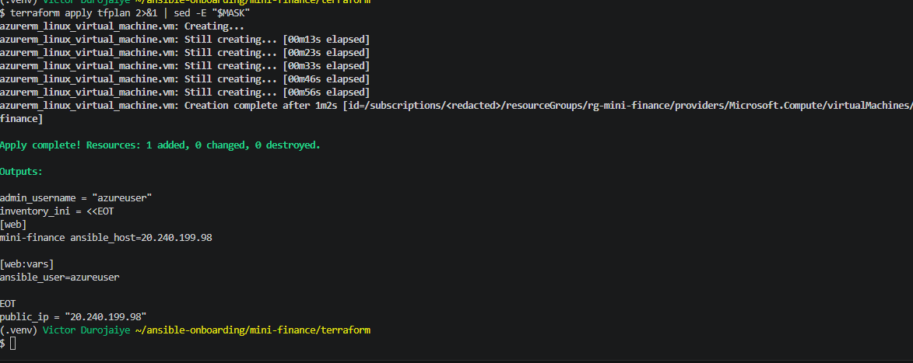

---

#### Screenshot 5 — Output of `terraform output public_ip` showing the VM’s public IP address

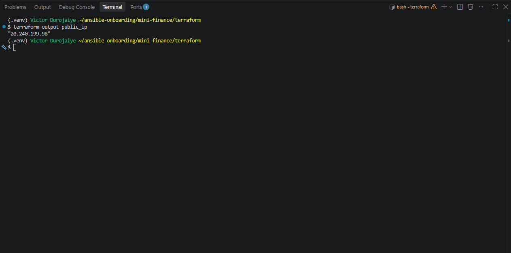

---

### Notes

I ran `terraform fmt`, `terraform init`, `terraform validate`, then `terraform plan -out=tfplan` and applied that saved plan. The plan created 8 resources.

The first apply failed on the VM with `AllocationFailed`. Azure had no free capacity for `Standard_B2ats_v2` in Sweden Central, even though the size was allowed for my subscription. Every other resource had been created. The failed VM was left behind in Azure but was not in Terraform's state, which would have caused a name conflict, so I deleted it with the Azure CLI, confirmed Azure matched the state, switched to `Standard_B1s` and applied again. That second apply added the VM and finished cleanly.

Azure resource IDs contain the subscription ID, so I piped the apply output through `sed` to mask it before taking Screenshot 4.

VM public IP: `20.240.199.98`

---

# Task 4 — Verify Passwordless SSH Access

## Goal

Confirm that the Ansible controller can connect to the Terraform-provisioned Azure VM using SSH key authentication.

### Evidence

#### Screenshot 6 — Passwordless SSH command and the returned `mini-finance` hostname

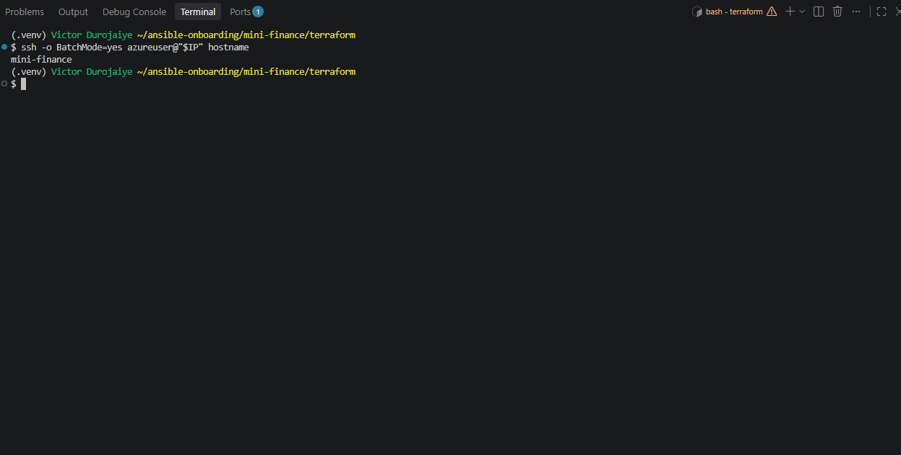

---

### Notes

Before trusting the VM's host key, I compared the key it presented over SSH with a fingerprint from the VM itself. My first check reported a mismatch. The key was fine: Azure returns the boot log as one JSON string, so my parser picked up the RSA fingerprint instead of the ED25519 one. I confirmed the real ED25519 key by running `ssh-keygen -lf` inside the VM through `az vm run-command`, which goes over the Azure API rather than SSH. It matched, and only then was the key added to `known_hosts`.

The test in Screenshot 6 uses `ssh -o BatchMode=yes`, which fails instead of prompting for a password or an unknown key, so the `mini-finance` hostname proves key-only access.

---

# Task 5 — Create the Ansible Inventory and Verify Connectivity

## Goal

Add the Terraform-provisioned Azure VM to the Ansible inventory and confirm that Ansible can connect to it.

### Evidence

#### Screenshot 7 — Ansible ping output showing `SUCCESS` and `pong` from the Azure VM

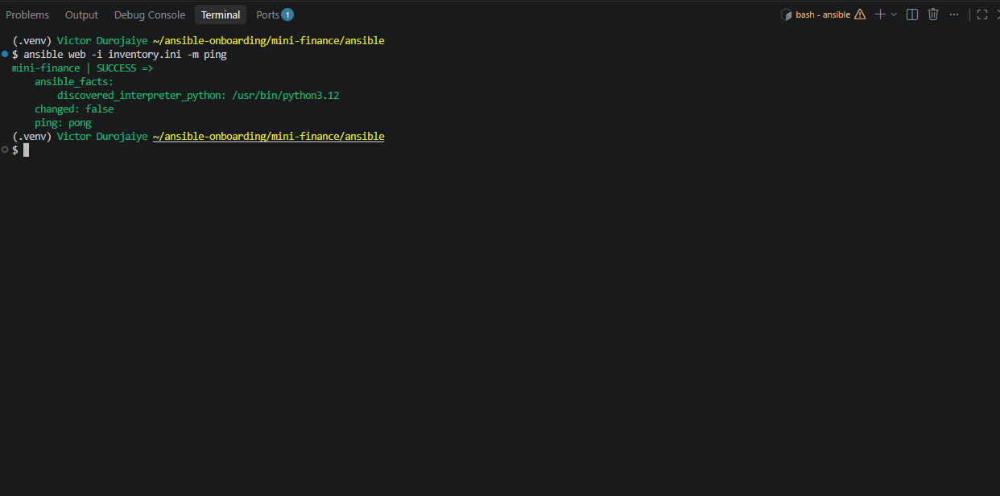

---

### Configuration File

Copy and paste the complete contents of your `ansible/inventory.ini` file below:

```ini
[web]
mini-finance ansible_host=20.240.199.98

[web:vars]
ansible_user=azureuser
```

---

# Task 6 — Create the Multi-Play Ansible Playbook

## Goal

Create one Ansible playbook containing separate plays to install Nginx, deploy the Mini Finance website, and verify the deployment.

### Evidence

#### Screenshot 8 — `site.yml` showing Play 1 and the beginning of Play 2

Screenshot must show:

- Play 1 targeting the `web` group
- Installation of `nginx`, `git`, and `rsync`
- Nginx service configured as started and enabled
- Beginning of Play 2 with the Git repository URL and synchronization task

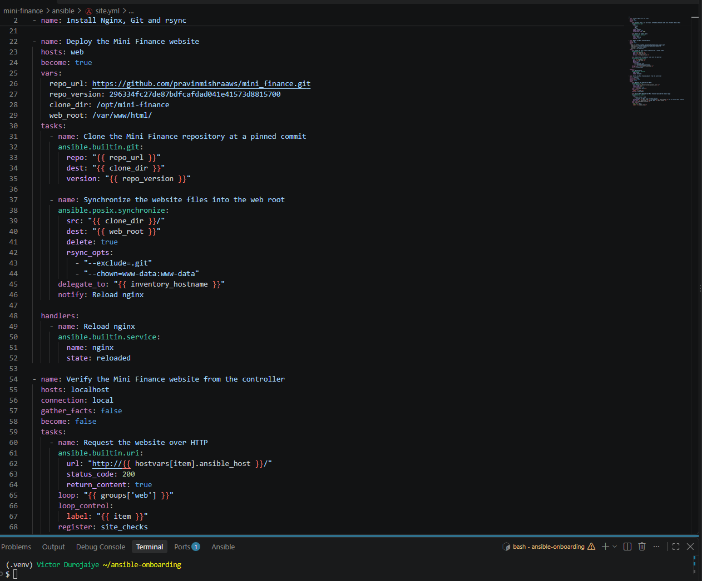

---

#### Screenshot 9 — `site.yml` showing the deployment destination, handler, and Play 3 verification

Screenshot must show:

- Website destination `/var/www/html/`
- Ownership set to `www-data:www-data`
- Nginx reload handler
- Play 3 targeting `localhost`
- The `uri` verification and `assert` condition

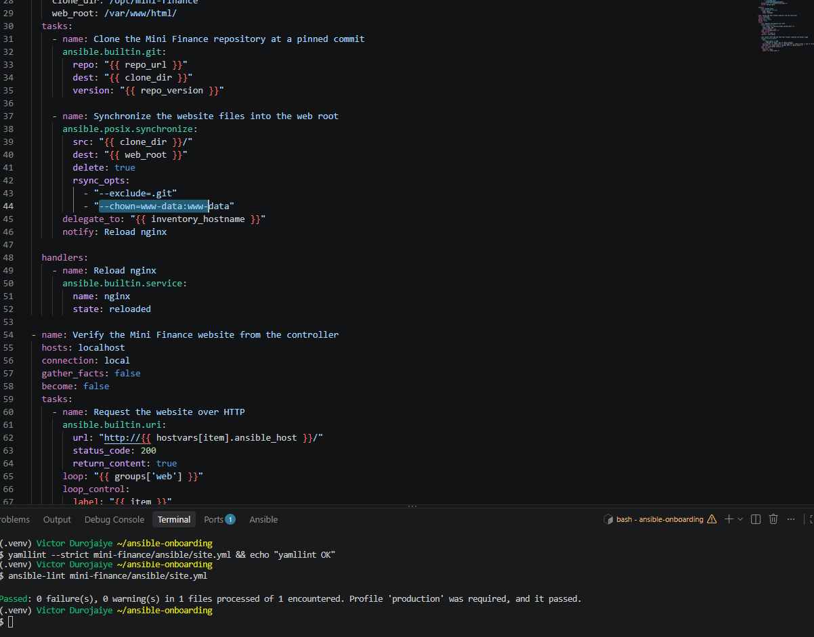

---

### Configuration File

Copy and paste the complete contents of your `ansible/site.yml` file below:

```yaml
---
- name: Install Nginx, Git and rsync
  hosts: web
  become: true
  tasks:
    - name: Install nginx, git and rsync, refreshing the apt cache only if older than an hour
      ansible.builtin.apt:
        name:
          - nginx
          - git
          - rsync
        state: present
        update_cache: true
        cache_valid_time: 3600

    - name: Start and enable Nginx
      ansible.builtin.service:
        name: nginx
        state: started
        enabled: true

- name: Deploy the Mini Finance website
  hosts: web
  become: true
  vars:
    repo_url: https://github.com/pravinmishraaws/mini_finance.git
    repo_version: 296334fc27de87bdfcafdad041e41573d8815700
    clone_dir: /opt/mini-finance
    web_root: /var/www/html/
  tasks:
    - name: Clone the Mini Finance repository at a pinned commit
      ansible.builtin.git:
        repo: "{{ repo_url }}"
        dest: "{{ clone_dir }}"
        version: "{{ repo_version }}"

    - name: Synchronize the website files into the web root
      ansible.posix.synchronize:
        src: "{{ clone_dir }}/"
        dest: "{{ web_root }}"
        delete: true
        rsync_opts:
          - "--exclude=.git"
          - "--chown=www-data:www-data"
      delegate_to: "{{ inventory_hostname }}"
      notify: Reload nginx

  handlers:
    - name: Reload nginx
      ansible.builtin.service:
        name: nginx
        state: reloaded

- name: Verify the Mini Finance website from the controller
  hosts: localhost
  connection: local
  gather_facts: false
  become: false
  tasks:
    - name: Request the website over HTTP
      ansible.builtin.uri:
        url: "http://{{ hostvars[item].ansible_host }}/"
        status_code: 200
        return_content: true
      loop: "{{ groups['web'] }}"
      loop_control:
        label: "{{ item }}"
      register: site_checks

    - name: Assert HTTP 200 and that Mini Finance replaced the default page
      ansible.builtin.assert:
        that:
          - check.status == 200
          - "'Welcome to nginx' not in check.content"
        success_msg: "{{ check.item }} returned HTTP {{ check.status }} and is serving Mini Finance"
        fail_msg: "{{ check.item }} failed: HTTP {{ check.status }}"
      loop: "{{ site_checks.results }}"
      loop_control:
        loop_var: check
        label: "{{ check.item }}"
```

---

# Task 7 — Validate and Run the Ansible Playbook

## Goal

Validate the syntax of the multi-play Ansible playbook and run it to install Nginx, deploy the Mini Finance website, and verify the deployment.

### Evidence

#### Screenshot 10 — Successful playbook syntax check showing `playbook: site.yml`

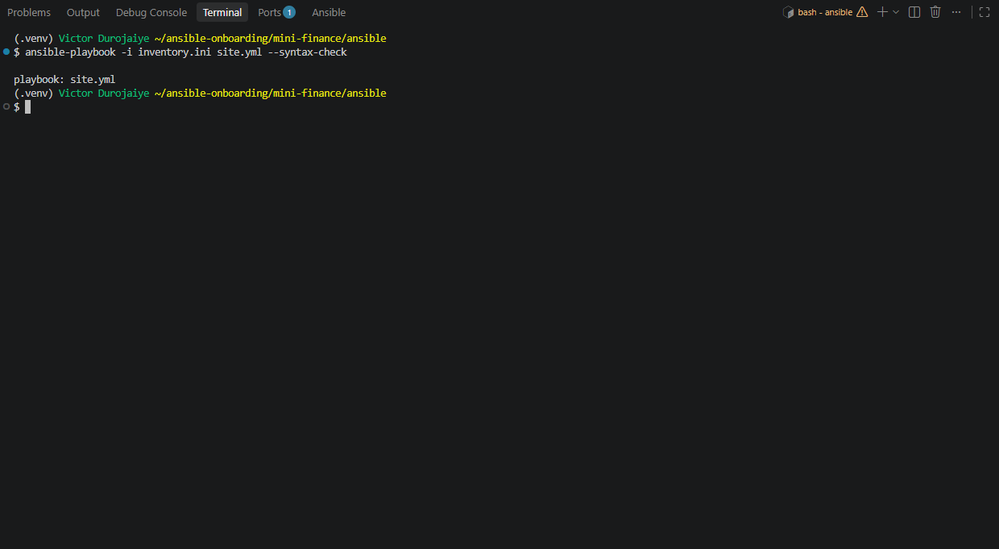

---

#### Screenshot 11 — Play 3 output showing the successful HTTP verification and assertion

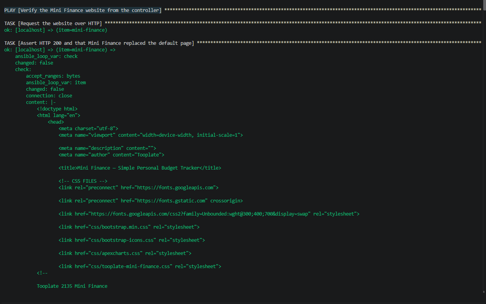

---

#### Screenshot 12 — Final `PLAY RECAP` showing `failed=0` and `unreachable=0`

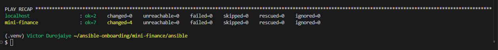

---

### Notes

The syntax check passed and the playbook ran with `failed=0` and `unreachable=0` for both `mini-finance` and `localhost`. Play 2 clones the repo on the VM and then rsyncs it into the web root on the same VM, so the `synchronize` task uses `delegate_to: "{{ inventory_hostname }}"`. Without that, the module would look for the cloned files on my controller. The repo is pinned to a commit, which makes the deployment reproducible and keeps re-runs from changing anything unless I choose a new version.

Before the run, my commit was blocked by ansible-lint with `couldn't resolve module/action 'ansible.posix.synchronize'`. The playbook itself was fine and ansible-lint passed in my venv. The pre-commit hook runs in its own isolated environment that only has `ansible-core` and no collections. I declared the collection, pinned to the version I tested with, in a `requirements.yml` at the repo root. ansible-lint installs it from there, and it also documents the dependency for anyone setting up a new controller.

---

# Task 8 — Test the Mini Finance Website in a Browser

## Goal

Confirm that the Mini Finance website is publicly accessible through the Azure VM’s public IP address.

### Evidence

#### Screenshot 13 — Mini Finance website successfully loading in the browser, with the Azure VM’s public IP address visible in the address bar

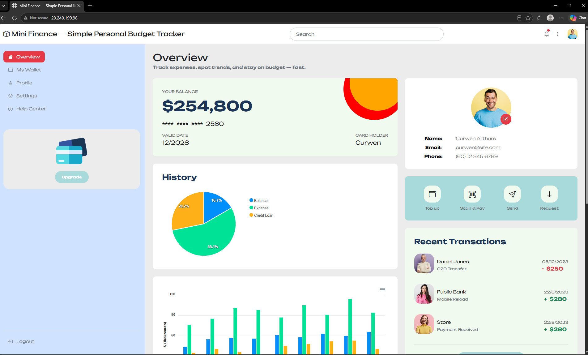

---

### Website URL

Add your deployed website URL below:

```text
http://20.240.199.98
```

---

# Task 9 — Create the Project README

## Goal

Create a `README.md` file to document the Mini Finance infrastructure and deployment project.

### Evidence

#### Screenshot 14 — Completed `README.md` displayed in the VS Code Markdown preview or terminal

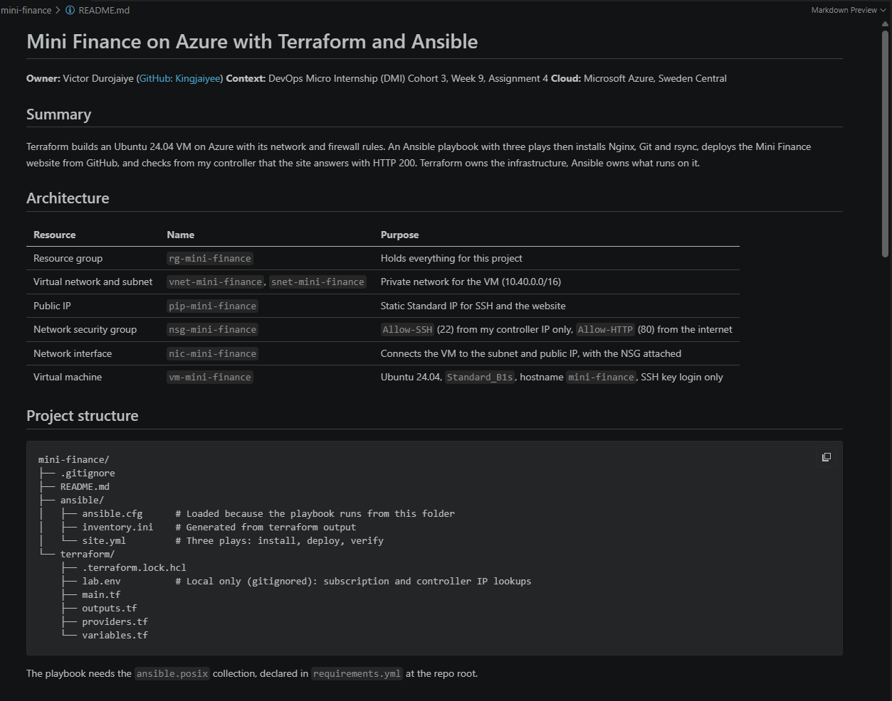
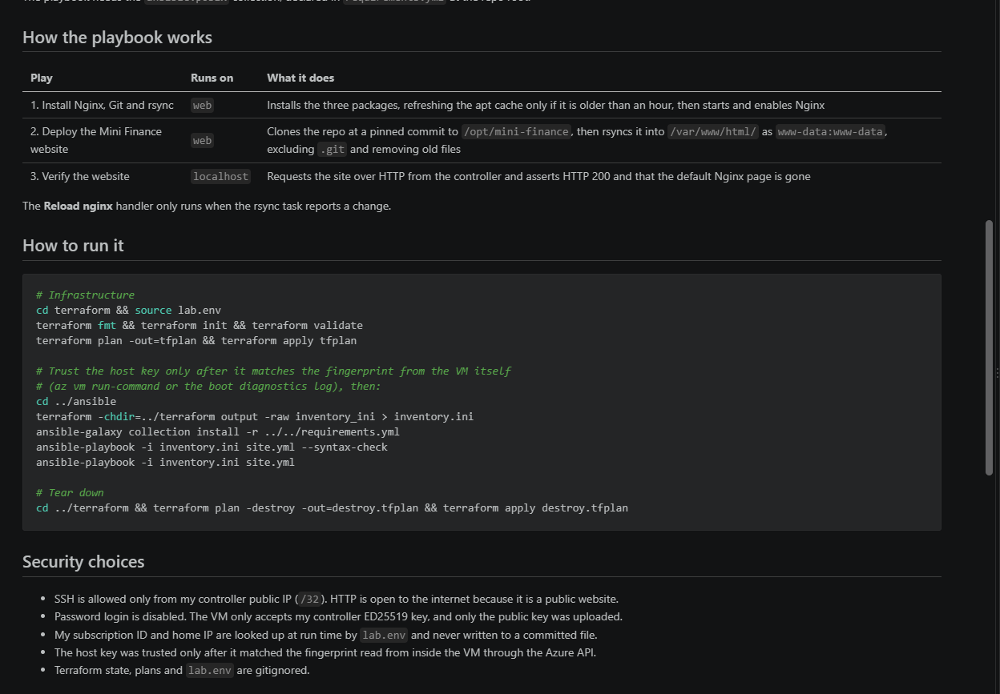
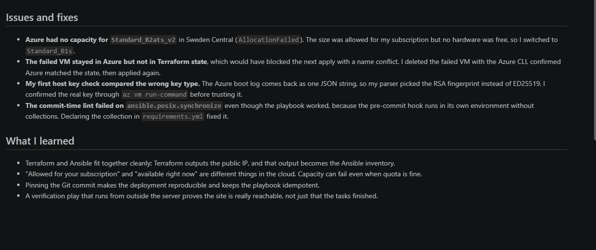

---

### README Content

Copy and paste the complete contents of your `README.md` file below:

````markdown
# Mini Finance on Azure with Terraform and Ansible

**Owner:** Victor Durojaiye ([GitHub: Kingjaiyee](https://github.com/Kingjaiyee))
**Context:** DevOps Micro Internship (DMI) Cohort 3, Week 9, Assignment 4
**Cloud:** Microsoft Azure, Sweden Central

## Summary

Terraform builds an Ubuntu 24.04 VM on Azure with its network and firewall rules. An Ansible playbook with three plays then installs Nginx, Git and rsync, deploys the Mini Finance website from GitHub, and checks from my controller that the site answers with HTTP 200. Terraform owns the infrastructure, Ansible owns what runs on it.

## Architecture

| Resource | Name | Purpose |
|---|---|---|
| Resource group | `rg-mini-finance` | Holds everything for this project |
| Virtual network and subnet | `vnet-mini-finance`, `snet-mini-finance` | Private network for the VM (10.40.0.0/16) |
| Public IP | `pip-mini-finance` | Static Standard IP for SSH and the website |
| Network security group | `nsg-mini-finance` | `Allow-SSH` (22) from my controller IP only, `Allow-HTTP` (80) from the internet |
| Network interface | `nic-mini-finance` | Connects the VM to the subnet and public IP, with the NSG attached |
| Virtual machine | `vm-mini-finance` | Ubuntu 24.04, `Standard_B1s`, hostname `mini-finance`, SSH key login only |

## Project structure

```text
mini-finance/
├── .gitignore
├── README.md
├── ansible/
│   ├── ansible.cfg      # Loaded because the playbook runs from this folder
│   ├── inventory.ini    # Generated from terraform output
│   └── site.yml         # Three plays: install, deploy, verify
└── terraform/
    ├── .terraform.lock.hcl
    ├── lab.env          # Local only (gitignored): subscription and controller IP lookups
    ├── main.tf
    ├── outputs.tf
    ├── providers.tf
    └── variables.tf
```

The playbook needs the `ansible.posix` collection, declared in `requirements.yml` at the repo root.

## How the playbook works

| Play | Runs on | What it does |
|---|---|---|
| 1. Install Nginx, Git and rsync | `web` | Installs the three packages, refreshing the apt cache only if it is older than an hour, then starts and enables Nginx |
| 2. Deploy the Mini Finance website | `web` | Clones the repo at a pinned commit to `/opt/mini-finance`, then rsyncs it into `/var/www/html/` as `www-data:www-data`, excluding `.git` and removing old files |
| 3. Verify the website | `localhost` | Requests the site over HTTP from the controller and asserts HTTP 200 and that the default Nginx page is gone |

The **Reload nginx** handler only runs when the rsync task reports a change.

## How to run it

```bash
# Infrastructure
cd terraform && source lab.env
terraform fmt && terraform init && terraform validate
terraform plan -out=tfplan && terraform apply tfplan

# Trust the host key only after it matches the fingerprint from the VM itself
# (az vm run-command or the boot diagnostics log), then:
cd ../ansible
terraform -chdir=../terraform output -raw inventory_ini > inventory.ini
ansible-galaxy collection install -r ../../requirements.yml
ansible-playbook -i inventory.ini site.yml --syntax-check
ansible-playbook -i inventory.ini site.yml

# Tear down
cd ../terraform && terraform plan -destroy -out=destroy.tfplan && terraform apply destroy.tfplan
```

## Security choices

- SSH is allowed only from my controller public IP (`/32`). HTTP is open to the internet because it is a public website.
- Password login is disabled. The VM only accepts my controller ED25519 key, and only the public key was uploaded.
- My subscription ID and home IP are looked up at run time by `lab.env` and never written to a committed file.
- The host key was trusted only after it matched the fingerprint read from inside the VM through the Azure API.
- Terraform state, plans and `lab.env` are gitignored.

## Issues and fixes

- **Azure had no capacity for `Standard_B2ats_v2`** in Sweden Central (`AllocationFailed`). The size was allowed for my subscription but no hardware was free, so I switched to `Standard_B1s`.
- **The failed VM stayed in Azure but not in Terraform state**, which would have blocked the next apply with a name conflict. I deleted the failed VM with the Azure CLI, confirmed Azure matched the state, then applied again.
- **My first host key check compared the wrong key type.** The Azure boot log comes back as one JSON string, so my parser picked the RSA fingerprint instead of ED25519. I confirmed the real key through `az vm run-command` before trusting it.
- **The commit-time lint failed on `ansible.posix.synchronize`** even though the playbook worked, because the pre-commit hook runs in its own environment without collections. Declaring the collection in `requirements.yml` fixed it.

## What I learned

- Terraform and Ansible fit together cleanly: Terraform outputs the public IP, and that output becomes the Ansible inventory.
- "Allowed for your subscription" and "available right now" are different things in the cloud. Capacity can fail even when quota is fine.
- Pinning the Git commit makes the deployment reproducible and keeps the playbook idempotent.
- A verification play that runs from outside the server proves the site is really reachable, not just that the tasks finished.
````

---

# LinkedIn Post Required

## Evidence

#### Screenshot 15 — Published LinkedIn post showing the text and at least one deployment screenshot

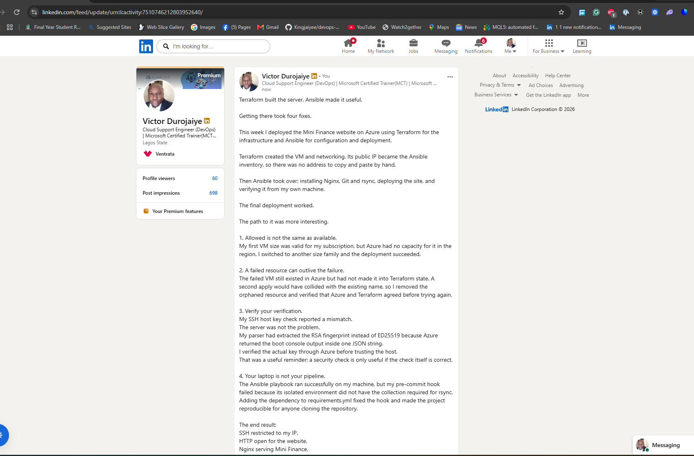

---

#### LinkedIn Post URL

Paste your LinkedIn post URL here:

`https://www.linkedin.com/feed/update/urn:li:activity:7510746212803952640/`

---

### LinkedIn Submission Notes

**One challenge you faced and how you fixed it:**

My first `terraform apply` failed with `AllocationFailed`: Azure had no free capacity for my chosen VM size in Sweden Central, even though my subscription was allowed to use it. The failed VM was left in Azure but was not in Terraform's state, so the next apply would have hit a name conflict. I deleted the failed VM with the Azure CLI, checked that Azure matched Terraform's state, switched to `Standard_B1s`, and the apply succeeded.

---

**One real-world example where you can use this learning:**

In my freelance work with small businesses, a client's marketing or brochure site could be deployed the same way: Terraform builds the server with SSH locked to my IP, and one Ansible playbook installs the web server, deploys the site from the client's Git repo at a known version, and checks it is live. If the server is lost, or the client wants a staging copy, I can rebuild it the same way in minutes instead of setting it up by hand.

---

# Assignment Questions

Answer the following in your own words:

**1. What did you provision using Terraform in this assignment?**

An Azure resource group, a virtual network and subnet, a static Standard public IP, the `nsg-mini-finance` network security group with `Allow-SSH` and `Allow-HTTP` rules, the `nic-mini-finance` network interface, the association between the NSG and the NIC, and the `vm-mini-finance` Ubuntu 24.04 VM with SSH key login only. That is 8 resources in total.

---

**2. What did Ansible configure and deploy in this assignment?**

It installed Nginx, Git and rsync on the VM and made sure Nginx was started and enabled. It cloned the Mini Finance repository at a pinned commit, synced the site files into `/var/www/html/` owned by `www-data:www-data`, and reloaded Nginx through a handler when the files changed. Finally it checked from my controller that the site returned HTTP 200 and was no longer the default Nginx page.

---

**3. Why is SSH access on port `22` restricted to your public IP address?**

SSH gives full control of the server, so it should only be reachable by the people who manage it. Servers with SSH open to the whole internet are scanned and hit with login attempts constantly. Limiting port 22 to my IP as a `/32` means nobody else can even reach the login, on top of the VM only accepting my key.

---

**4. Why is HTTP port `80` open to the internet?**

The Mini Finance website is meant to be public, so anyone should be able to load it in a browser. Port 80 only exposes Nginx serving static files, not a way to log in or change the server.

---

**5. What is the purpose of the Ansible inventory file?**

It tells Ansible which servers to manage, how to reach them and how they are grouped. Mine puts the VM in the `web` group under the name `mini-finance`, with its public IP as `ansible_host` and `azureuser` as the SSH user. I generated it from Terraform's output, so the IP was never typed by hand.

---

**6. Why does the playbook use separate plays for install, deploy, and verify?**

Each play has one job, so when something fails the play name tells me straight away where to look. The verify play also runs on a different host, my controller, which is the same view a real visitor gets. Keeping them separate also means I can re-run just the deploy when the site changes.

---

**7. Why is `rsync` useful when deploying website files?**

It copies a whole folder tree in one step and keeps the structure intact, which matters here because the site loads its CSS, images and scripts from relative paths. It only transfers files that changed, so re-runs are quick and report no change when nothing is different. It can also exclude folders like `.git`, delete old files that are no longer in the repo, and set ownership as it copies.

---

**8. What does the Ansible `uri` module verify in this assignment?**

It sends an HTTP request from my controller to the VM's public IP and checks the response is `200`. That proves Nginx is running and the site is reachable through the Azure NSG from outside the server. I also returned the page content so the next task could assert it was not the default Nginx page, which proves Mini Finance is what is being served.

---

**9. What issue did you face during this assignment, and how did you fix it?**

My commit was blocked by ansible-lint with `couldn't resolve module/action 'ansible.posix.synchronize'`, even though the playbook ran fine and the same lint passed in my venv. The pre-commit hook runs ansible-lint in its own isolated environment that only has `ansible-core` and none of the collections. I added a `requirements.yml` at the repo root that declares `ansible.posix` at the version I tested with. ansible-lint installs it from there, the hook passed, and the dependency is now documented for anyone setting up a new controller.

---

**10. What did you learn from using Terraform and Ansible together?**

They each do one job well. Terraform builds and destroys the infrastructure and knows exactly what exists, while Ansible configures what runs on the server and can be re-run safely. The handoff is simple: Terraform outputs the public IP and that becomes the Ansible inventory. I also learned that the cloud can fail for reasons outside your code, like capacity, and that you need to check Terraform's state and the real cloud still agree before trying again.

---

# Required Files

Confirm that the following files are included in your assignment folder:

- [x] `.gitignore`
- [x] `README.md`
- [x] `terraform/providers.tf`
- [x] `terraform/main.tf`
- [x] `terraform/variables.tf`
- [x] `terraform/outputs.tf`
- [x] `ansible/inventory.ini`
- [x] `ansible/site.yml`

---

# Submission Instructions

- Add all required screenshots in the correct order.
- Full Name must be visible in required screenshots.
- Add the Azure VM public IP address.
- Add the final Mini Finance website URL.
- Paste `inventory.ini`, `site.yml`, and `README.md` as editable text.
- Answer all assignment questions clearly in your own words.
- Add your LinkedIn post URL.
- Do not expose SSH private keys, passwords, Azure credentials, subscription IDs, Terraform state contents, or other sensitive information.

---

# Completion Checklist

- [x] Task 1: `mini-finance` project structure created
- [x] Task 1: `.gitignore` created
- [x] Task 2: Terraform Azure infrastructure code created
- [x] Task 2: `Allow-SSH` rule configured for port `22`
- [x] Task 2: `Allow-HTTP` rule configured for port `80`
- [x] Task 2: NSG associated with the Network Interface
- [x] Task 3: `terraform fmt` completed
- [x] Task 3: `terraform init` completed
- [x] Task 3: `terraform validate` completed successfully
- [x] Task 3: `terraform apply` completed successfully
- [x] Task 3: `terraform output public_ip` displayed the VM public IP
- [x] Task 4: Passwordless SSH works from the Ansible controller
- [x] Task 5: `inventory.ini` created
- [x] Task 5: Ansible ping returns `SUCCESS` and `pong`
- [x] Task 6: `site.yml` contains three separate plays
- [x] Task 6: Play 1 installs Nginx, Git, and rsync
- [x] Task 6: Play 2 clones and deploys the Mini Finance website
- [x] Task 6: Play 3 verifies HTTP status code `200`
- [x] Task 7: Playbook syntax check passes
- [x] Task 7: Ansible playbook completes successfully
- [x] Task 7: Final recap shows `failed=0` and `unreachable=0`
- [x] Task 8: Mini Finance website loads in the browser
- [x] Task 8: Azure VM public IP is visible in the browser screenshot
- [x] Task 9: `README.md` completed
- [x] Screenshots 1–15 are included
- [x] `inventory.ini`, `site.yml`, and `README.md` are pasted as editable text
- [x] Assignment questions are answered
- [x] LinkedIn post published with Anyone visibility
- [x] LinkedIn post URL added
- [x] No sensitive information is exposed

---

## About DMI & CloudAdvisory

DevOps Micro Internship (DMI) is a project-based DevOps program run by Pravin Mishra and The CloudAdvisory, focused on real-world execution, systems thinking, and career readiness.

It helps learners build strong DevOps foundations with hands-on experience.

---

## Resources

- DMI Official Website: [https://dmi.pravinmishra.com?utm_source=github&utm_medium=readme](https://dmi.pravinmishra.com?utm_source=github&utm_medium=readme)
- University: [https://university.pravinmishra.com?utm_source=github&utm_medium=readme](https://university.pravinmishra.com?utm_source=github&utm_medium=readme)
- Discord Community: [https://discord.pravinmishra.com?utm_source=github&utm_medium=readme](https://discord.pravinmishra.com?utm_source=github&utm_medium=readme)
- Blog: [https://dmi.pravinmishra.com/blog?utm_source=github&utm_medium=readme](https://dmi.pravinmishra.com/blog?utm_source=github&utm_medium=readme)
- YouTube Playlist: [https://www.youtube.com/playlist?list=PLFeSNDtI4Cho](https://www.youtube.com/playlist?list=PLFeSNDtI4Cho)
- Pravin Mishra LinkedIn: [https://www.linkedin.com/in/pravin-mishra-aws-trainer/](https://www.linkedin.com/in/pravin-mishra-aws-trainer/)
- CloudAdvisory LinkedIn: [https://www.linkedin.com/company/thecloudadvisory/](https://www.linkedin.com/company/thecloudadvisory/)

---

*This submission is part of DevOps Micro Internship (DMI) — Agentic AI Track.*
