# Assignment — Deploy EpicBook with Terraform and Ansible Roles

Part of the DevOps Micro Internship (DMI) with Agentic AI

---

## Purpose

In this assignment, you will deploy the EpicBook web application using Terraform and Ansible roles.

Terraform provisions the cloud infrastructure, including one Ubuntu VM and one managed MySQL database. Ansible roles configure the VM, install required software, deploy the EpicBook application, configure Nginx, connect the app to the managed MySQL database, and verify the deployment.

---

# Task 1 — Set Up the Project Folder Layout

## Goal

Create the project folder structure for Terraform and Ansible roles.

Terraform will be used to provision the cloud infrastructure. Ansible roles will be used to configure the VM and deploy the EpicBook application.

### Evidence

#### Screenshot 1 — Terminal showing the completed `epicbook-prod` project structure

---

### Notes

Answer the following in your own words:

**1. Which cloud provider did you choose for this assignment?**

AWS, in the eu-north-1 (Stockholm) region. I reused my Week 8 EpicBook Terraform, which already had separate network, EC2 and RDS modules with the database in private subnets. Before reusing it I reviewed the code and changed four things: I removed the `user_data` script that deployed the app (Ansible does that now), moved the database from MySQL 8.0 to 8.4 with RDS Extended Support disabled, switched the password to a write-only argument so it never reaches Terraform state, and gave the non-secret settings defaults so there is no `tfvars` file. All Terraform code is under `terraform/aws/` only.

---

**2. Why is it useful to keep Terraform files and Ansible files in separate folders?**

They do different jobs at different times. Terraform creates and destroys the infrastructure, and Ansible configures what is running on it. Keeping them apart means each tool only sees its own files, each folder can have its own settings (Ansible only reads `ansible.cfg` from the folder you run it in), and it is clear where a change belongs. The only link between them is the Terraform output that generates the Ansible inventory.

---

**3. What is the purpose of the `roles` directory in Ansible?**

It holds reusable roles, where each role is a self-contained unit with one job. A role keeps its tasks, handlers and templates in a standard folder layout, so Ansible finds them automatically. Here I have three roles: `common` for baseline packages, `nginx` for the reverse proxy, and `epicbook` for the application. `site.yml` just lists them in order.

---

# Task 2 — Provision the Infrastructure with Terraform

## Goal

Run Terraform to provision the cloud infrastructure for the EpicBook deployment.

Terraform will create the VM, managed MySQL database, networking, security rules, and required outputs.

### Evidence

#### Screenshot 2 — `terraform apply` completed successfully

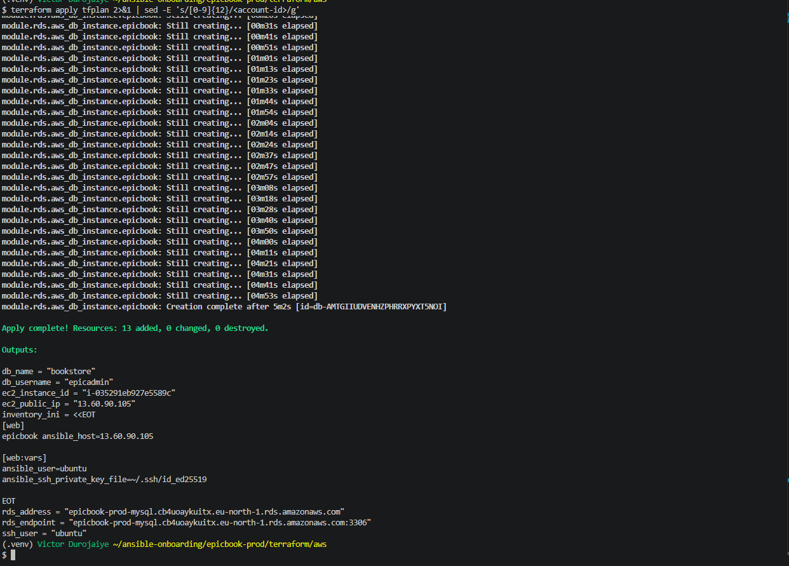

---

#### Screenshot 3 — Output of `terraform output`

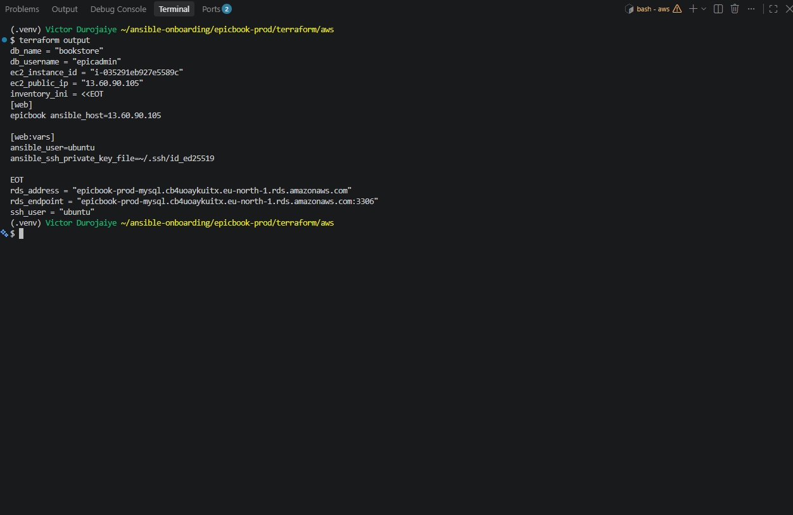

---

#### Screenshot 4 — Azure Portal or AWS Console showing the VM running

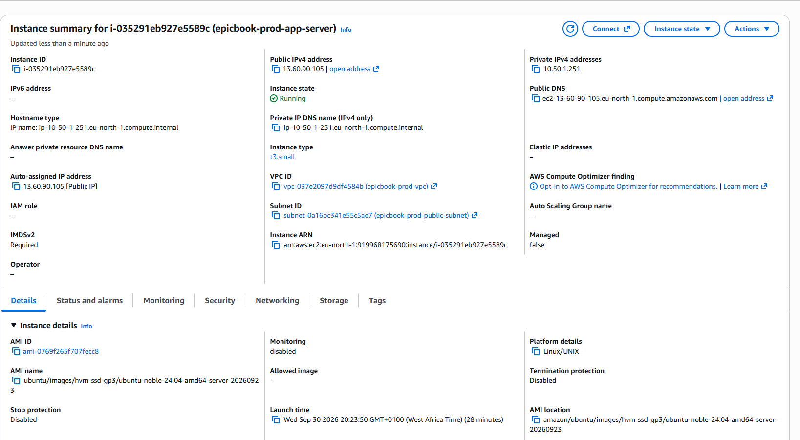

---

#### Screenshot 5 — Azure Portal or AWS Console showing the managed MySQL database created

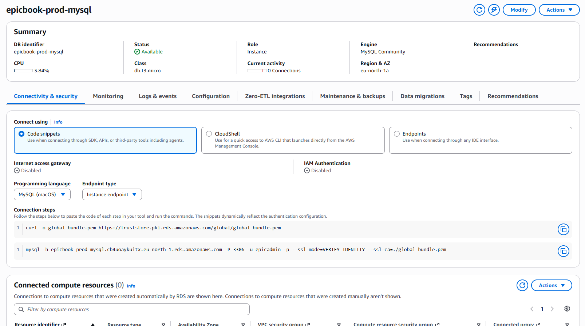

---

### Notes

Answer the following in your own words:

**1. What resources did Terraform create for this assignment?**

13 resources in AWS eu-north-1:

- **Network (9):** a VPC (`10.50.0.0/16`), one public subnet, two private database subnets in two Availability Zones, an internet gateway, a public route table and its association, and two security groups.
- **EC2 (2):** an SSH key pair from my controller's public key, and the `epicbook-prod-app-server` instance (`t3.small`, Ubuntu 24.04, encrypted gp3 disk).
- **RDS (2):** a DB subnet group and the `epicbook-prod-mysql` instance (MySQL 8.4.9, `db.t3.micro`, encrypted, single AZ, not publicly accessible).

The EC2 security group allows SSH on port 22 only from my controller IP as a `/32`, and HTTP on port 80 from anywhere. The RDS security group allows port 3306 only from the EC2 security group, not from any IP range.

VM public IP: `13.60.90.105`. All 13 resources were destroyed after the evidence was captured.

---

**2. Why should you review `terraform plan` before running `terraform apply`?**

The plan shows exactly what Terraform will create, change or destroy before anything happens. I checked that it said `13 to add, 0 to change, 0 to destroy`, that the SSH rule's CIDR showed as a sensitive value, that the engine was 8.4 with Extended Support disabled, and that `publicly_accessible` was `false`. Catching a mistake in the plan costs nothing. Catching it after apply can mean an exposed database or a replaced resource.

---

**3. Why should database passwords not be shown in Terraform output?**

Output is printed in the terminal, saved in CI logs and often captured in screenshots, so a password there is effectively public. It also goes further than output: marking a variable `sensitive` only hides it from the screen, it still gets written to the state file. I used an `ephemeral` variable with the write-only `password_wo` argument, so AWS receives the password but Terraform never stores it. I checked with `terraform state pull | grep -cFf ~/.config/epicbook/db-password`, which returned `0`.

---

# Task 3 — Verify SSH Key-Based Access

## Goal

Verify that the cloud VM can be accessed from the Ansible controller using SSH key-based authentication.

### Evidence

#### Screenshot 6 — Successful SSH hostname check from the Ansible controller

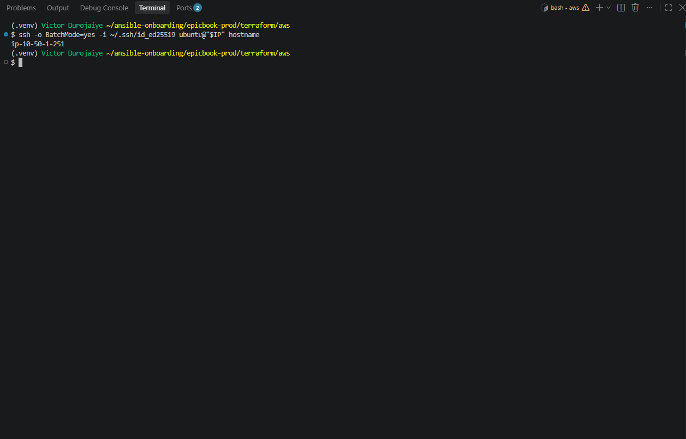

---

### Notes

Answer the following in your own words:

**1. What command did you use to verify SSH access?**

`ssh -o BatchMode=yes -i ~/.ssh/id_ed25519 ubuntu@13.60.90.105 hostname`

Before connecting the first time, I compared the server's ED25519 host key fingerprint with the one the instance printed in its own console output (`aws ec2 get-console-output`). They matched, so I added the key to `known_hosts`.

---

**2. What proves that SSH key-based access worked successfully?**

The command returned the server's hostname (`ip-10-50-1-x`) without asking for a password. `BatchMode=yes` makes SSH fail instead of prompting, so getting a hostname back can only mean the key was accepted.

---

**3. What would you check if SSH returned `Permission denied (publickey)`?**

- That I am using the right user (`ubuntu` for the Ubuntu AMI).
- That the private key I am offering matches the public key Terraform registered with AWS (`-i` path, and `ssh -v` to see which keys are tried).
- That the private key has `600` permissions, or SSH will refuse to use it.
- That the instance was launched with the right key pair name.

`Permission denied` means the network path worked and the server rejected the key, so security groups are not the problem there.

---

# Task 4 — Create the Ansible Inventory and Configuration

## Goal

Create the Ansible inventory file and local Ansible configuration for the EpicBook VM.

The inventory tells Ansible which VM to manage and which SSH user to use.

### Evidence

#### Screenshot 7 — `inventory.ini` showing the VM under the `web` group

---

#### Screenshot 8 — Output of `ansible-inventory -i inventory.ini --graph`

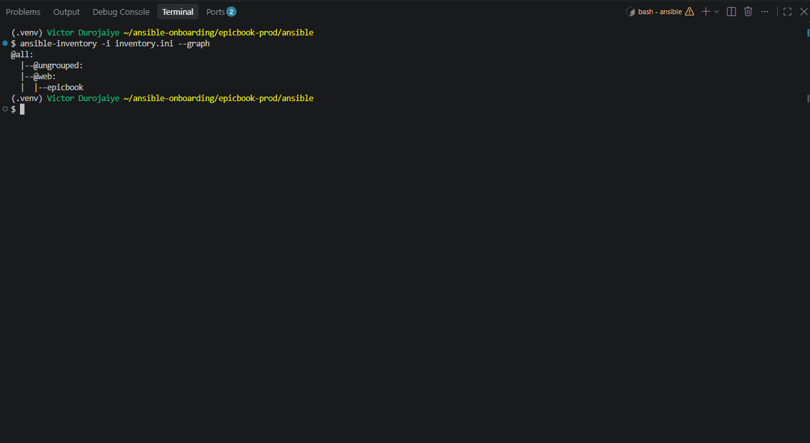

---

#### Screenshot 9 — Output of `ansible web -i inventory.ini -m ping`

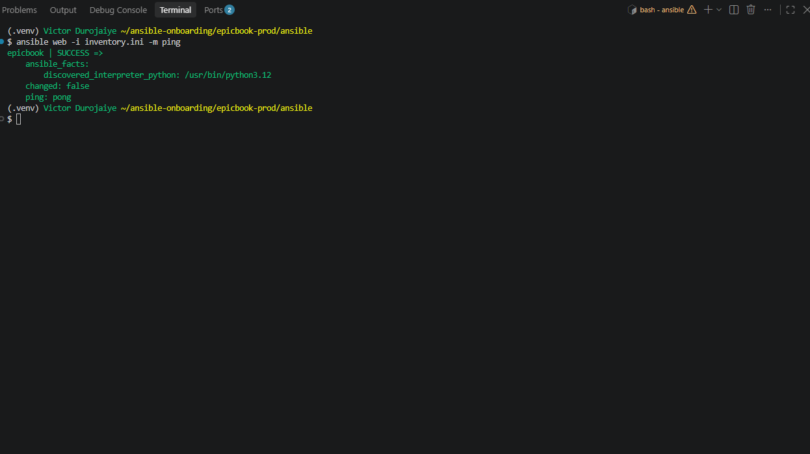

---

### Notes

Answer the following in your own words:

**1. What is the purpose of `inventory.ini`?**

It tells Ansible which servers to manage, how they are grouped, and how to connect to them. Mine has one host, `epicbook`, in the `web` group, plus shared connection settings under `[web:vars]`. I generated it from a Terraform output (`terraform output -raw inventory_ini`), so the IP always matches what Terraform actually created.

---

**2. What does `ansible_host` store?**

The real address Ansible connects to, here the public IP `13.60.90.105`. The inventory name `epicbook` is just a friendly label used in output and in playbooks.

---

**3. What does `ansible_ssh_private_key_file` tell Ansible?**

Which private key to use for SSH. Mine points to `~/.ssh/id_ed25519`, the controller key whose public half Terraform registered with AWS. Setting it explicitly means Ansible does not depend on whatever keys happen to be loaded.

---

**4. Why is `host_key_checking = False` used only for this temporary lab?**

Turning it off means Ansible trusts any server that answers on that IP, so a man-in-the-middle could pose as my server and receive my commands and secrets. It is sometimes accepted in short-lived labs because cloud IPs get reused and host keys change on every rebuild. I chose to keep `host_key_checking = True` anyway: I checked the VM's ED25519 fingerprint against the one in its console output before trusting it, and removed the entry with `ssh-keygen -R` after teardown.

---

# Task 5 — Create the Main Ansible Playbook

## Goal

Create the main Ansible playbook that runs the required roles in the correct order.

The `site.yml` file will call the `common`, `nginx`, and `epicbook` roles.

### Evidence

#### Screenshot 10 — `site.yml` showing the roles in the correct order

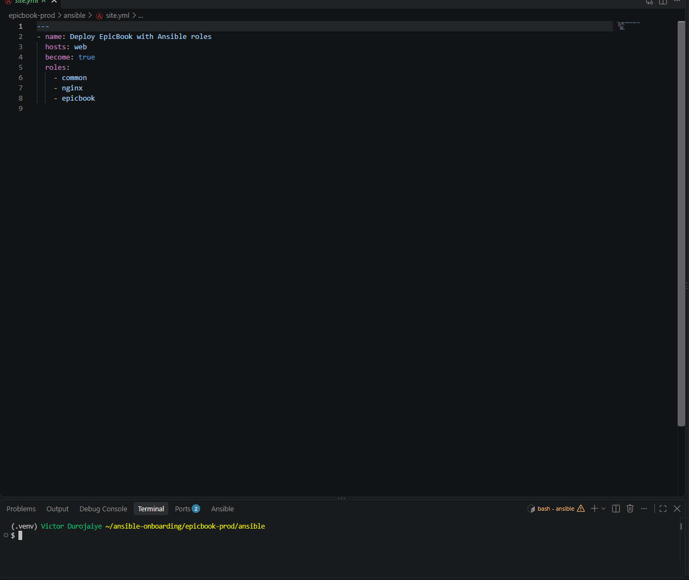

---

#### Screenshot 11 — Output of `ansible-playbook -i inventory.ini site.yml --syntax-check`

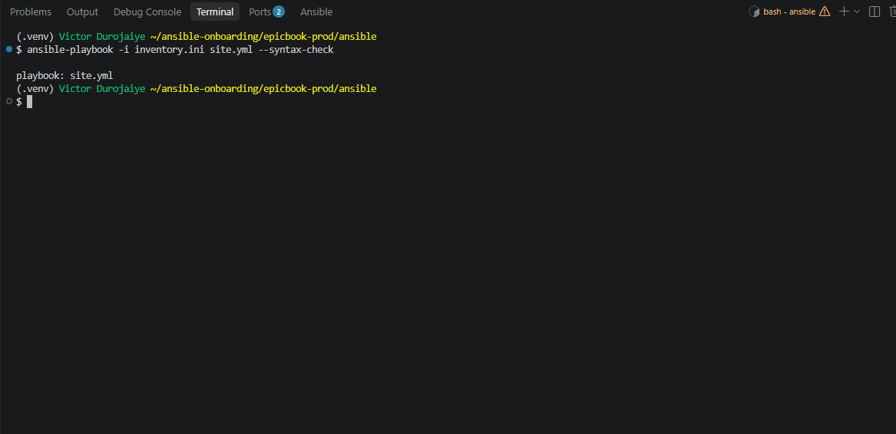

---

### Notes

Answer the following in your own words:

**1. What is the purpose of `site.yml`?**

It is the entry point for the whole deployment. It targets the `web` group, turns on privilege escalation, and applies the three roles in order. All the real work lives in the roles, so `site.yml` reads like a table of contents.

---

**2. Why should the roles run in the order `common`, `nginx`, and `epicbook`?**

Each role depends on the one before it. `common` installs the base tools the later roles need, such as `git` for cloning and `mysql-client` for seeding the database. `nginx` sets up the reverse proxy. `epicbook` deploys and starts the app that Nginx forwards traffic to. Running them in this order means nothing is used before it is installed.

---

**3. What does `become: true` allow Ansible to do?**

It lets Ansible run tasks with elevated privileges through `sudo`, which is needed for installing packages, writing to `/etc/nginx` and managing services. In the `epicbook` role I also used `become_user: ubuntu` for the Git clone, `npm ci` and PM2 tasks, so the app runs as a normal user instead of root. The lint rules require a `become: true` next to each `become_user`, so those tasks set both.

---

# Task 6 — Create the `common` Role

## Goal

Create the `common` role to prepare the Ubuntu VM with the basic packages required for the EpicBook deployment.

This role handles the common server setup before Nginx and the application are configured.

### Evidence

#### Screenshot 12 — `roles/common/tasks/main.yml` showing the common setup tasks

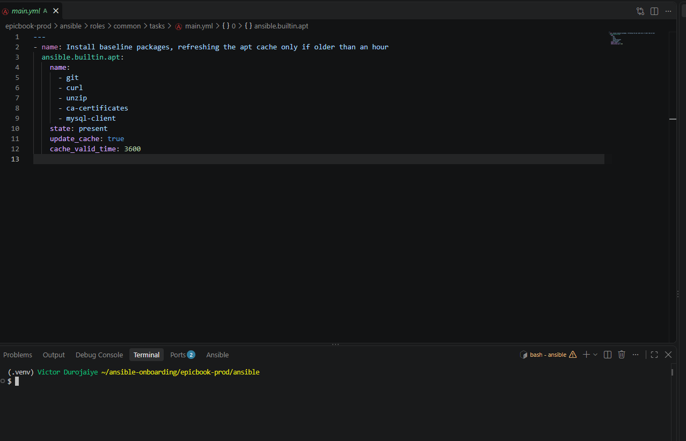

---

### Notes

Answer the following in your own words:

**1. What is the responsibility of the `common` role?**

Baseline server preparation only: refreshing the apt cache and installing `git`, `curl`, `unzip`, `ca-certificates` and `mysql-client`. I used `cache_valid_time: 3600` inside the install task instead of a separate `apt update` task, so the cache only refreshes if it is older than an hour and the role reports no change on a second run.

---

**2. Why should Nginx installation not be placed inside the `common` role?**

`common` should hold what every server needs, and not every server is a web server. A database or worker server would also use `common` but should not get Nginx. Keeping Nginx in its own role means each role has one clear job, and I can reuse or change the web layer without touching the base setup.

---

**3. Why is `mysql-client` useful in this deployment?**

The `epicbook` role uses it to talk to the private RDS database from the VM: first to check whether the `Book` table already exists, then to import the schema and seed SQL files in order. It is also the tool I would use to troubleshoot the database connection by hand, since RDS is only reachable from inside the VPC.

---

# Task 7 — Create the `nginx` Role

## Goal

Create the `nginx` role to install Nginx and configure it as a reverse proxy for the EpicBook application.

Nginx will receive browser traffic on port `80` and forward it to the EpicBook Node.js application running on the VM.

### Evidence

#### Screenshot 13 — `roles/nginx/tasks/main.yml` showing Nginx installation and site configuration tasks

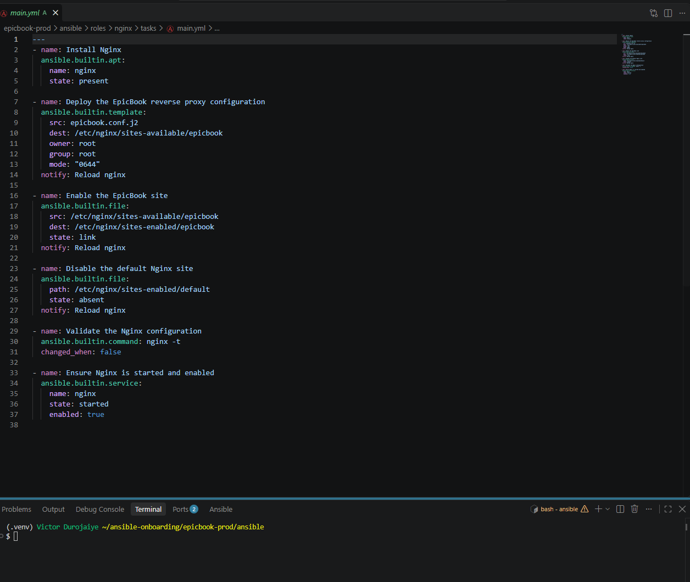

---

#### Screenshot 14 — `roles/nginx/templates/epicbook.conf.j2` showing the reverse proxy configuration

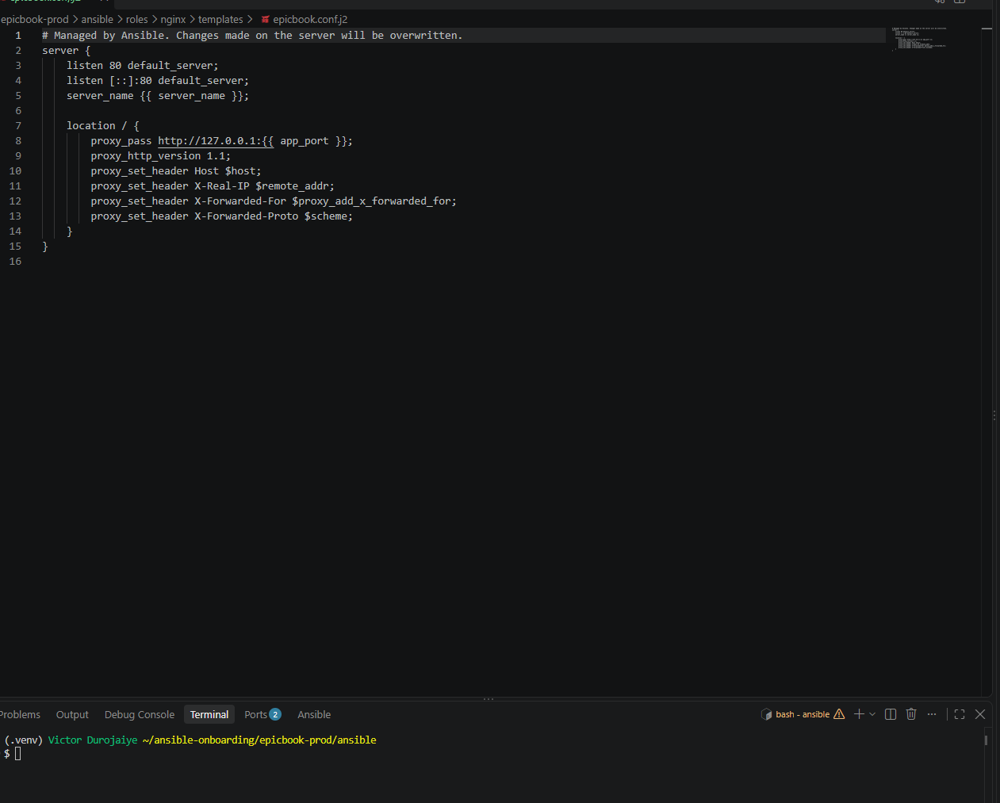

---

### Notes

Answer the following in your own words:

**1. What is the responsibility of the `nginx` role?**

Install Nginx, deploy the EpicBook site config from a template, enable it, disable the default site, test the config with `nginx -t`, and make sure the service is running and enabled at boot. Config changes notify a `Reload nginx` handler, which lives in `roles/nginx/handlers/main.yml`, so Nginx only reloads when something actually changed.

---

**2. Why is Nginx configured as a reverse proxy in this deployment?**

The app listens on `127.0.0.1:8080` and is never exposed directly. Nginx takes public traffic on port 80 and forwards it to the app, passing the real client IP and protocol in headers. This keeps the Node.js process off the public internet, and it gives one place to add HTTPS, caching or rate limiting later without changing the app.

---

**3. Why should the application port come from `group_vars/web.yml` instead of being hard-coded?**

The port is used in two places: the Nginx `proxy_pass` line and the `PORT` value the app starts with. If both read `app_port` from one variable, they cannot drift apart. Changing the port means editing one line, and the next playbook run updates both sides.

---

# Task 8 — Create the `epicbook` Role

## Goal

Create the `epicbook` role to deploy the EpicBook application, connect it to the managed MySQL database, and run the application on port `8080` using PM2.

### Evidence

#### Screenshot 15 — `roles/epicbook/tasks/main.yml` showing application deployment tasks

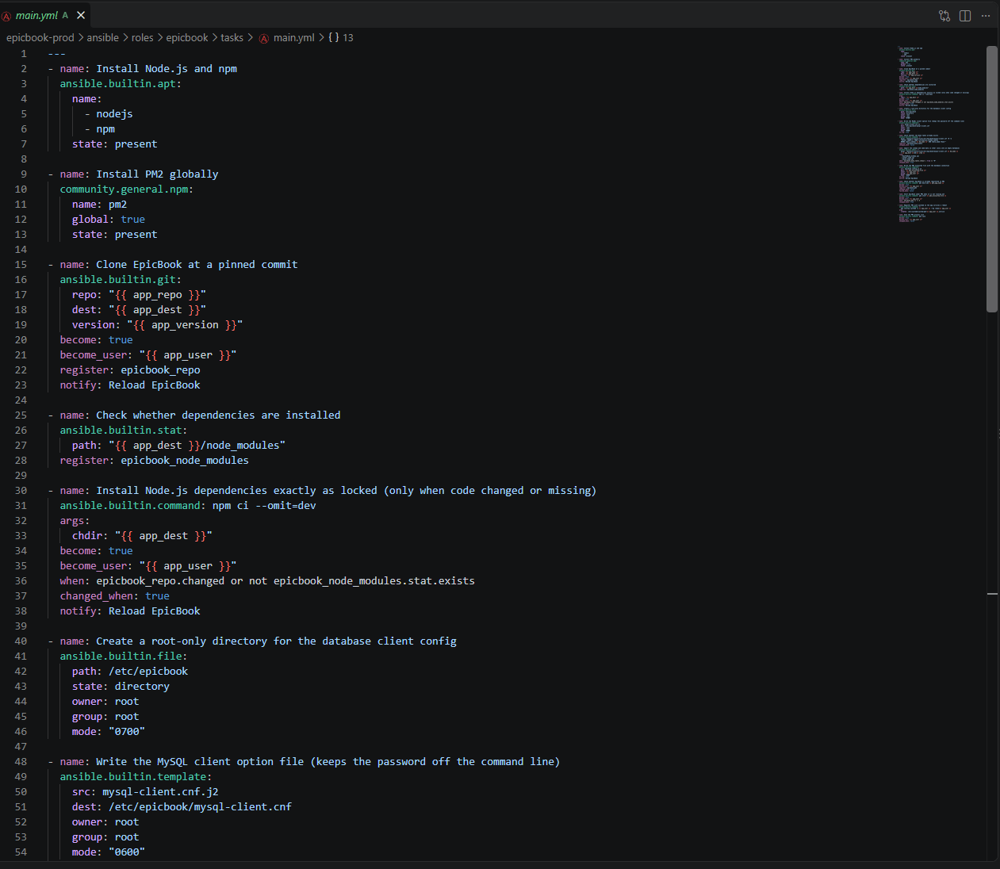

---

#### Screenshot 16 — Task or file showing how the database connection is configured, with secrets hidden

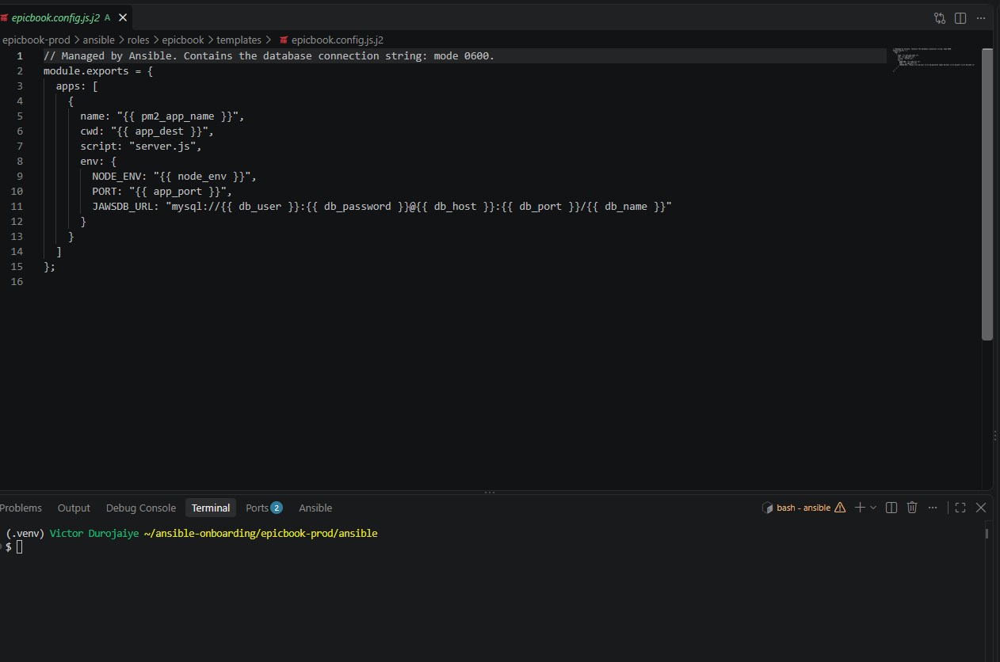

---

#### Screenshot 17 — Task or output showing the EpicBook application managed by PM2

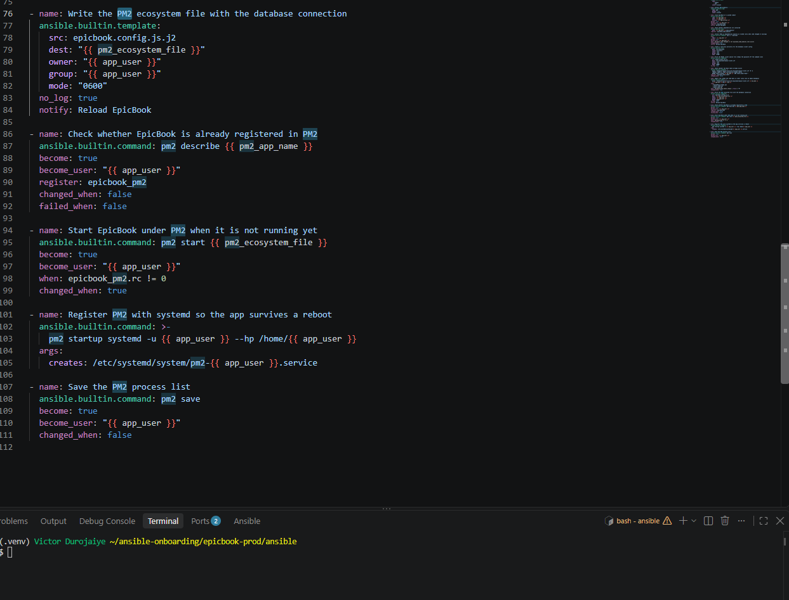

---

### Notes

Answer the following in your own words:

**1. What is the responsibility of the `epicbook` role?**

Everything about the application:

- install Node.js, npm and PM2;
- clone the EpicBook repo at a pinned commit;
- install dependencies with `npm ci --omit=dev`;
- seed the database;
- write the PM2 config;
- start the app, register PM2 with systemd and save the process list.

Before writing it, I read the app's code. It ignores `.env` and in production reads a `JAWSDB_URL` connection string, and it creates its own tables on first start. So the schema and seed files import before the app starts, in a fixed order: schema, then authors, then books. The import only runs when the `Book` table does not exist yet, and `npm ci` only runs when the code changed or `node_modules` is missing.

---

**2. Why is PM2 used for the EpicBook Node.js application?**

A plain `node server.js` stops when the SSH session ends or the process crashes. PM2 keeps the app running in the background, restarts it if it crashes, and with `pm2 startup` and `pm2 save` brings it back after a reboot. It also gives `pm2 status` and logs. I run PM2 as the `ubuntu` user, which is why `pm2 status` without `--become` shows the app.

---

**3. Why should database passwords not be hard-coded in public files?**

Anything committed to a public repo can be read and copied by anyone, and it stays in Git history even after it is deleted from the file. My password is encrypted inline with Ansible Vault in `group_vars/web.yml`. On the server it only lives in two files with `0600` permissions: the PM2 ecosystem file and a root-only MySQL option file. It is never passed on a command line, where any user could see it in the process list. The tasks that write it use `no_log: true`.

---

**4. What does it mean for the application to run on port `8080` while Nginx listens on port `80`?**

They are two separate processes on the same VM. Nginx is the public front door on port 80, which is the port browsers use by default. The Node.js app listens only on `127.0.0.1:8080`, so it cannot be reached from outside. Nginx forwards each request from port 80 to port 8080 and sends the reply back. Port 8080 is not open in the security group at all.

---

# Task 9 — Create Group Variables

## Goal

Create reusable variables for the EpicBook deployment.

The `group_vars/web.yml` file stores values that can be reused across the Ansible roles.

### Evidence

#### Screenshot 18 — `group_vars/web.yml` showing the application, PM2, and database variables, with passwords hidden or masked

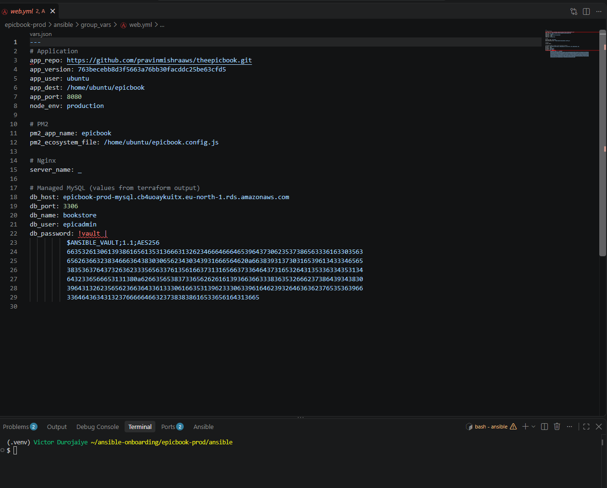

---

### Notes

Answer the following in your own words:

**1. What is the purpose of `group_vars/web.yml`?**

Ansible loads it automatically for every host in the `web` group, so all three roles share one set of values. The roles contain the logic, and this file contains the settings. Deploying to a different server or a new app version means changing variables, not tasks.

---

**2. Which values did you store in `group_vars/web.yml`?**

- **Application:** repo URL, pinned commit, app user (`ubuntu`), install path, port `8080`, `NODE_ENV=production`
- **PM2:** app name (`epicbook`) and ecosystem file path
- **Nginx:** `server_name`
- **Database:** RDS host, port `3306`, database name `bookstore`, username `epicadmin`, and the password as an Ansible Vault encrypted value

---

**3. How did you handle the database password securely?**

I generated a random 32-character password and kept it in `~/.config/epicbook/db-password`, mode `600`, outside the repo. Terraform read it from an environment variable into the write-only `password_wo` argument, so it never reached the state file. For Ansible, I encrypted it inline with `ansible-vault encrypt_string`, which keeps `web.yml` a single file that is safe to commit. The vault password is in `~/.config/ansible/epicbook-vault-pass`, mode `600`, referenced from `ansible.cfg`. I confirmed it decrypts by printing only its length (`msg: 32`), never the value.

---

# Task 10 — Run the Ansible Playbook

## Goal

Run the Ansible playbook to configure the VM and deploy the EpicBook application.

The playbook should run the roles in this order:

1. `common`
2. `nginx`
3. `epicbook`

### Evidence

#### Screenshot 19 — Ansible playbook output showing the roles running

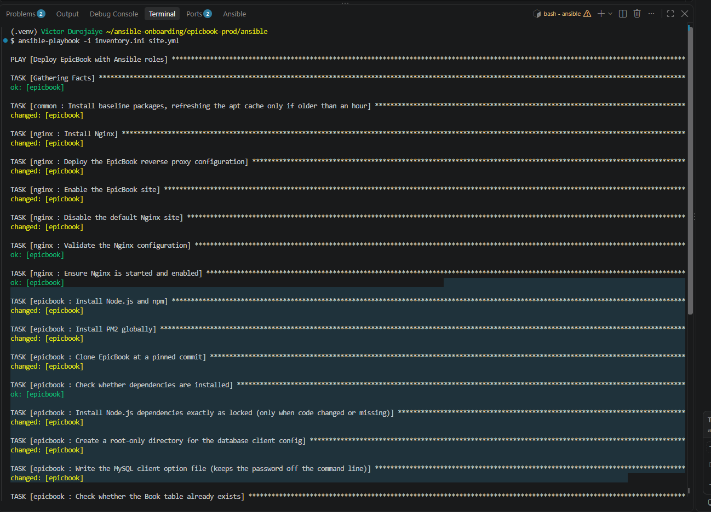

---

#### Screenshot 20 — Final Ansible recap showing `failed=0`

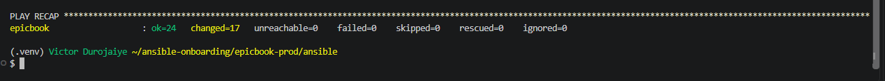

---

#### Screenshot 21 — Output of `ansible web -i inventory.ini -m command -a "systemctl is-active nginx" --become`

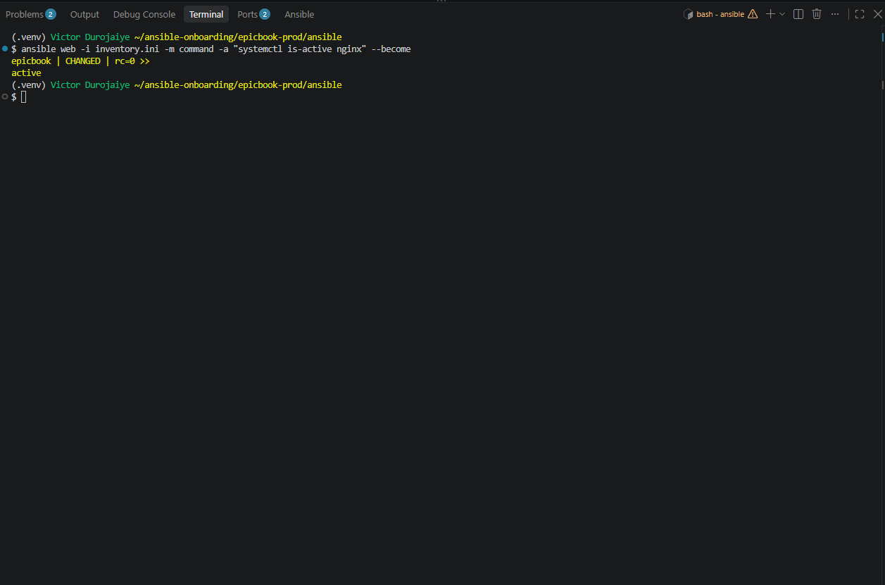

---

#### Screenshot 22 — Output of `ansible web -i inventory.ini -m command -a "pm2 status"`

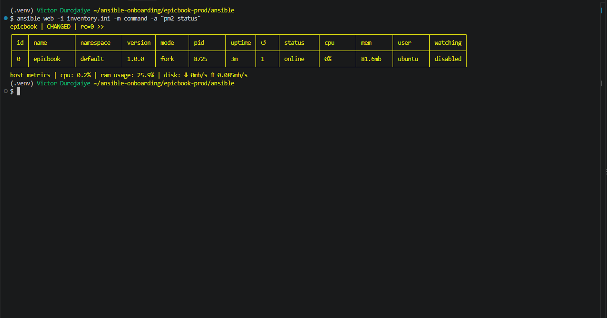

---

#### Screenshot 23 — Output of `ansible web -i inventory.ini -m command -a "curl -I http://localhost:8080"`

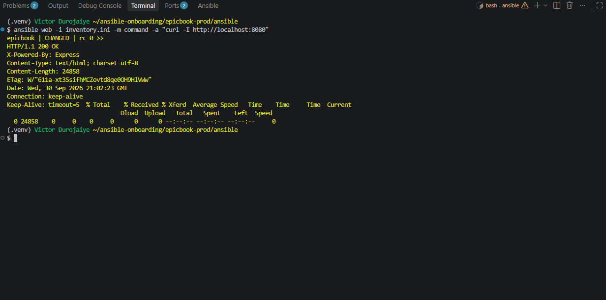

---

### Notes

Answer the following in your own words:

**1. What command did you run to execute the Ansible playbook?**

`ansible-playbook -i inventory.ini site.yml`, run from `epicbook-prod/ansible`. No `--ask-vault-pass` was needed because `ansible.cfg` points to the vault password file.

---

**2. How do you know all roles completed successfully?**

The output shows tasks from all three roles, `common`, then `nginx`, then `epicbook`, and the first run's recap was `ok=24 changed=17 unreachable=0 failed=0`. I then ran the playbook a second time, and it reported `ok=19 changed=0 failed=0 skipped=3`. Nothing was reinstalled, the database was not re-seeded and the app was not restarted. The three skipped tasks were the guarded ones: `npm ci`, the SQL import and `pm2 start`.

---

**3. What proves that Nginx is active?**

`systemctl is-active nginx` returned `active` (Screenshot 21). Screenshot 24 also shows `Server: nginx` answering on the public IP.

---

**4. What proves that PM2 is managing the EpicBook application?**

`pm2 status` lists the `epicbook` process as `online` (Screenshot 22). The command ran without `--become` and still showed the app, because PM2 runs as the same `ubuntu` user Ansible connects with.

---

**5. What proves that the EpicBook application responds on port `8080`?**

`curl -I http://localhost:8080` on the VM returned `HTTP/1.1 200 OK` with `X-Powered-By: Express` (Screenshot 23). That request goes straight to the Node.js app, with Nginx bypassed.

---

# Task 11 — Verify the EpicBook Deployment

## Goal

Verify that the EpicBook application is running, accessible in the browser, and connected to the managed MySQL database.

### Evidence

#### Screenshot 24 — Output of `curl -I http://<public_ip>`

---

#### Screenshot 25 — Output of the cart API test command

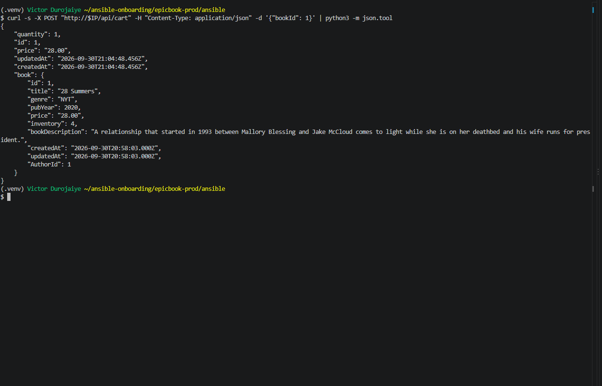

---

#### Screenshot 26 — Output of the `/cart` HTTP status check

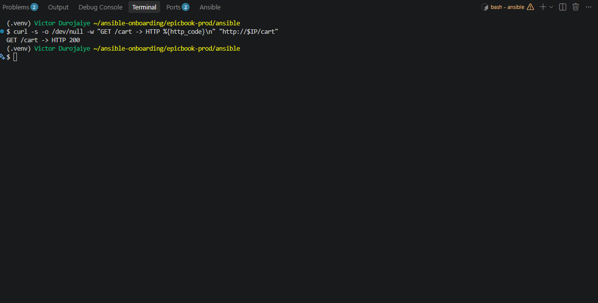

---

#### Screenshot 27 — Browser showing the EpicBook application loaded from `http://<public_ip>`

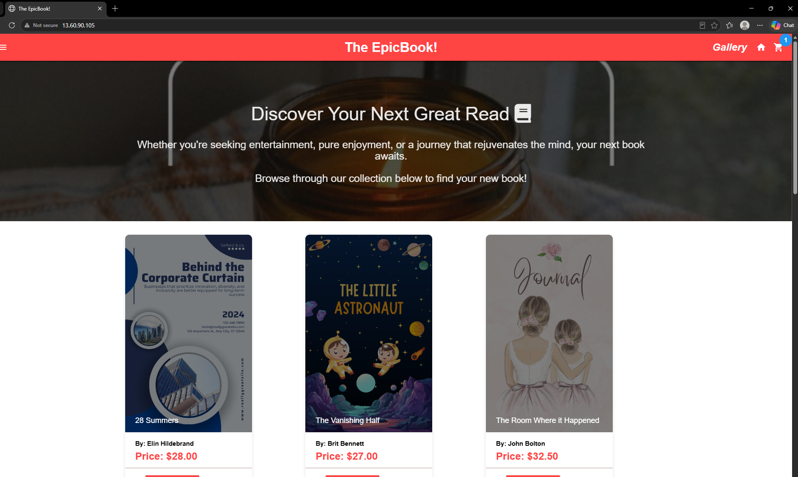

---

### Notes

Answer the following in your own words:

**1. What HTTP response did you receive from the public application URL?**

`HTTP/1.1 200 OK` with `Server: nginx`, from `curl -I http://13.60.90.105`. That proves the full path works from my controller: internet, security group, Nginx, then the app.

Final application URL: `http://13.60.90.105` (torn down after the evidence was captured).

---

**2. What did the cart API test prove?**

`curl -s -X POST http://13.60.90.105/api/cart -H "Content-Type: application/json" -d '{"bookId": 1}'` returned a JSON cart record with a nested `book` object, including its title and price. For that to happen, the app had to read book 1 from RDS and write a new cart row back. So the app is connected to the managed MySQL database, the seed data is there, and both reads and writes work.

---

**3. What did the `/cart` status check return?**

`GET /cart -> HTTP 200`. The cart page rendered successfully through Nginx.

---

**4. What issue did you face during verification, and how did you fix it?**

The verification checks all passed the first time. The issue that mattered came earlier, and it is the reason they passed. When I read the EpicBook code, I found the app creates its own tables on startup, while the schema file uses plain `CREATE TABLE`. If PM2 had started the app before the import, the tables would already exist, the schema import would fail, and the cart test would have had no books to read. I fixed it by ordering the role so the SQL import runs before the app first starts, guarded by a check for the `Book` table so it never runs twice.

---

# LinkedIn Post Required

## Evidence

#### LinkedIn Post URL

Paste your LinkedIn post URL here:

`https://www.linkedin.com/feed/update/urn:li:activity:7511173209086468096/`

---

#### Screenshot — Published LinkedIn post

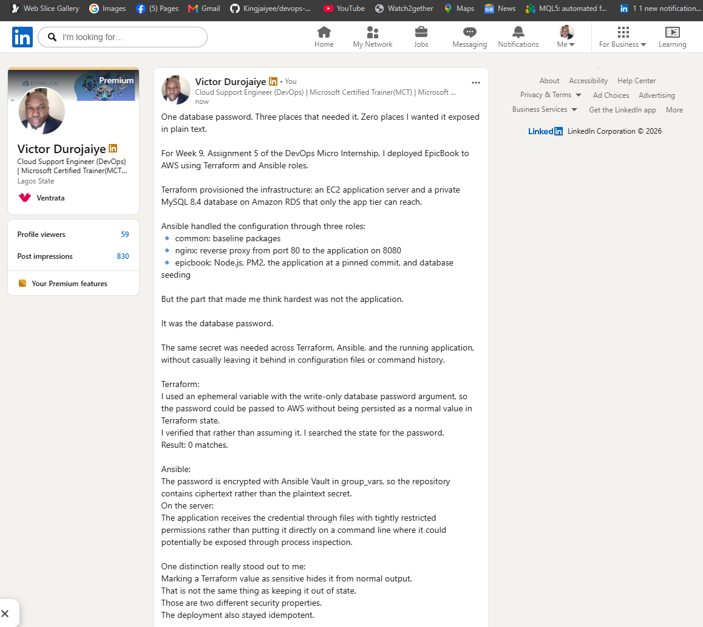

---

# Assignment Questions

Answer the following in your own words:

**1. Why is Terraform used for infrastructure provisioning?**

Terraform describes the infrastructure as code, so the same VPC, VM and database can be created, reviewed, versioned and destroyed the same way every time. The plan shows exactly what will change before it happens, and state lets Terraform know what already exists. For this assignment it built 13 resources in one apply and removed all 13 in one destroy, with nothing left behind.

---

**2. Why are Ansible roles useful for production-style deployments?**

Roles split a deployment into small units with one job each, in a standard layout Ansible understands. That makes them easier to read, test, reuse and change on their own. My `common` role could be reused on any Ubuntu server, and the `nginx` role could front a different app by changing variables. One long playbook with everything in it gets hard to follow very quickly.

---

**3. What is the purpose of `group_vars/web.yml`?**

It holds the settings for every host in the `web` group in one place: the app version and port, PM2 settings, the Nginx server name, and the database connection. Ansible loads it automatically, so the roles stay generic and the values that change between environments live in one file.

---

**4. Why should database passwords not be committed to GitHub?**

Once pushed, a password can be seen by anyone with access to the repo, copied into forks, and found by bots that scan GitHub for secrets. It also stays in Git history even if the file is later changed. The only safe fix after a leak is to change the password everywhere. That is why mine is encrypted with Ansible Vault and was never written to Terraform state.

---

**5. What is the purpose of Nginx in this deployment?**

Nginx is the public entry point. It listens on port 80 and forwards requests to the Node.js app on `127.0.0.1:8080`, so the app itself is never exposed. It is also the natural place to add HTTPS, compression or rate limiting later.

---

**6. Why should the managed MySQL database not be publicly accessible?**

The database holds the application's data, and only the app needs to reach it. A public database can be found by internet-wide scans and attacked with password guessing or known vulnerabilities. Mine sits in private subnets with `publicly_accessible = false`, and its security group allows port 3306 only from the app server's security group. Even with the right password, nobody outside the VPC can connect.

---

**7. Why is PM2 used for the EpicBook Node.js application?**

It keeps the app running in the background after the SSH session ends, restarts it if it crashes, and with `pm2 startup` and `pm2 save` starts it again after a reboot. It also gives an easy way to check status and logs, and to reload the app when the code or config changes.

---

**8. What does idempotency mean in Ansible?**

Running the same playbook again gives the same end state and only changes what is out of place. My first run reported `changed=17`. The second reported `changed=0`, because every task checks the current state first: packages already installed, code already at the pinned commit, tables already seeded, app already running in PM2. Achieving that took deliberate choices, such as `cache_valid_time` instead of a separate `apt update` task, and running `npm ci` only when the code changes.

---

**9. What issue did you face during the deployment, and how did you fix it?**

The first commit was blocked twice by my pre-commit hooks. First, `ansible-lint` flagged five tasks for `partial-become`: they had `become_user: ubuntu` without a `become: true` beside it. The play-level `become` made them work, but the rule wants each task to be correct on its own, so I added `become: true` to each one. Second, `check-yaml` failed on the `!vault` tag in `group_vars/web.yml`, because its strict YAML loader does not know Ansible's custom tags. I added `args: [--unsafe]` to that hook, so it still checks YAML syntax but no longer rejects the encrypted value. After that, all six hooks passed and the commit went through.

---

**10. What security improvement would you make before using this setup in production?**

I would stop using the RDS master account for the app. The app would get its own database user with rights only on the `bookstore` database, and the master password would be stored in AWS Secrets Manager with rotation turned on. I would also add HTTPS on Nginx with a real certificate, force TLS between the app and RDS, and replace direct SSH with AWS Systems Manager Session Manager so port 22 can be closed completely.

---

# Required Files

Confirm that the following files are included in your GitHub repository or assignment folder:

- [x] `README.md`
- [x] Terraform files under either `terraform/azure/` or `terraform/aws/`
- [x] `ansible/ansible.cfg`
- [x] `ansible/inventory.ini`
- [x] `ansible/site.yml`
- [x] `ansible/group_vars/web.yml`
- [x] `ansible/roles/common/tasks/main.yml`
- [x] `ansible/roles/nginx/tasks/main.yml`
- [x] `ansible/roles/nginx/templates/epicbook.conf.j2`
- [x] `ansible/roles/epicbook/tasks/main.yml`

---

# Submission Instructions

- Add all required screenshots in your submission.
- Full Name must be visible in required screenshots.
- Mention the cloud provider used: Azure or AWS.
- Add the VM public IP address.
- Add the final application URL.
- Add Terraform output proof.
- Add Ansible role tree proof.
- Add all required notes and assignment question answers.
- Add your LinkedIn post URL.
- Do not expose SSH private keys, passwords, cloud credentials, database credentials, Terraform state files, subscription IDs, or account IDs.

---

# Completion Checklist

- [x] Task 1: Project folder layout created
- [x] Task 2: Terraform infrastructure provisioned
- [x] Task 3: SSH key-based access verified
- [x] Task 4: Ansible inventory and configuration created
- [x] Task 5: Main Ansible playbook created
- [x] Task 6: `common` role created
- [x] Task 7: `nginx` role created
- [x] Task 8: `epicbook` role created
- [x] Task 9: Group variables created
- [x] Task 10: Ansible playbook run completed
- [x] Task 11: EpicBook deployment verified
- [x] Terraform files created under only one cloud provider folder
- [x] One Ubuntu VM was created
- [x] One managed MySQL database was created
- [x] SSH port `22` is restricted to the controller public IP
- [x] HTTP port `80` is accessible
- [x] MySQL port `3306` is not publicly open
- [x] `ansible web -i inventory.ini -m ping` returns `SUCCESS`
- [x] `site.yml` calls the roles in the correct order
- [x] Database secrets are hidden or handled securely
- [x] Nginx is active
- [x] PM2 shows the EpicBook application running
- [x] EpicBook responds on port `8080`
- [x] Public URL loads in the browser
- [x] Cart API verification works
- [x] Playbook completes with `failed=0`
- [x] Screenshots 1–27 are included
- [x] Assignment questions are answered
- [x] LinkedIn post published
- [x] LinkedIn post URL added
- [x] No sensitive information is exposed

---

## About DMI & CloudAdvisory

DevOps Micro Internship (DMI) is a project-based DevOps program run by Pravin Mishra and The CloudAdvisory, focused on real-world execution, systems thinking, and career readiness.

It helps learners build strong DevOps foundations with hands-on experience.

---

## Resources

- DMI Official Website: [https://dmi.pravinmishra.com?utm_source=github&utm_medium=readme](https://dmi.pravinmishra.com?utm_source=github&utm_medium=readme)
- University: [https://university.pravinmishra.com?utm_source=github&utm_medium=readme](https://university.pravinmishra.com?utm_source=github&utm_medium=readme)
- Discord Community: [https://discord.pravinmishra.com?utm_source=github&utm_medium=readme](https://discord.pravinmishra.com?utm_source=github&utm_medium=readme)
- Blog: [https://dmi.pravinmishra.com/blog?utm_source=github&utm_medium=readme](https://dmi.pravinmishra.com/blog?utm_source=github&utm_medium=readme)
- YouTube Playlist: [https://www.youtube.com/playlist?list=PLFeSNDtI4Cho](https://www.youtube.com/playlist?list=PLFeSNDtI4Cho)
- Pravin Mishra LinkedIn: [https://www.linkedin.com/in/pravin-mishra-aws-trainer/](https://www.linkedin.com/in/pravin-mishra-aws-trainer/)
- CloudAdvisory LinkedIn: [https://www.linkedin.com/company/thecloudadvisory/](https://www.linkedin.com/company/thecloudadvisory/)

---

*This submission is part of DevOps Micro Internship (DMI) — Agentic AI Track.*
