# Assignment 6 — AI-Assisted Ansible Change Risk Review

Part of the DevOps Micro Internship (DMI) with Agentic AI

---

## Purpose

In this assignment, you will build an AI-assisted Ansible risk-review workflow using `ansible-playbook --check --diff`, Bash scripting, and Claude Code.

You will review possible server changes before applying them, classify risky tasks, and keep the final apply decision under human control.

---

# Task 1 — Confirm EpicBook Connectivity and Create the Workspace

## Goal

Confirm that your previous EpicBook Ansible project is working before creating the risk-review automation.

### Evidence

#### Screenshot 1 — Output of `ansible web -i inventory.ini -m ping`

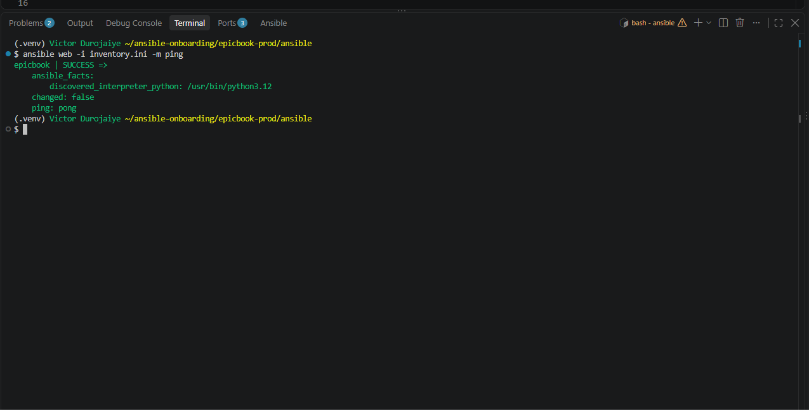

---

#### Screenshot 2 — Output of `ansible-playbook -i inventory.ini site.yml --syntax-check`

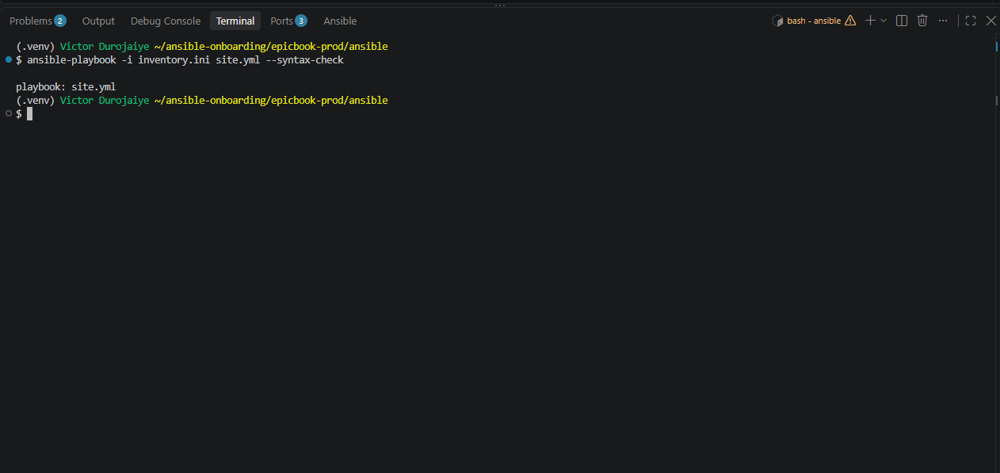

---

#### Screenshot 3 — Output of `pwd` and `find . -maxdepth 4 -type d | sort`

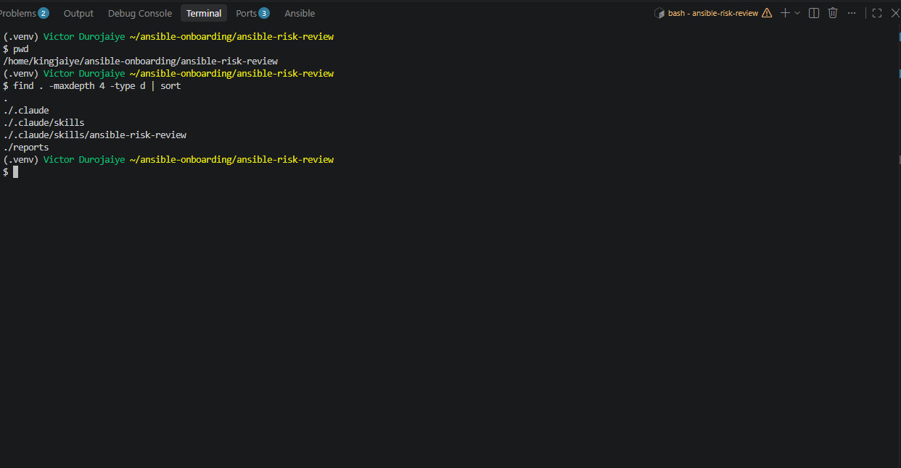

---

### Notes

Answer the following in your own words:

**1. What proves that Ansible can reach your EpicBook VM?**

`ansible web -i inventory.ini -m ping` returned `epicbook | SUCCESS` with `ping: pong`. That means Ansible connected over SSH with my key, logged in as `ubuntu`, and ran a Python module on the VM.

I had torn the EpicBook environment down after Assignment 5, so I rebuilt it with the same Terraform code first. I verified the new server's ED25519 host key against its console output before trusting it, regenerated `inventory.ini` from the Terraform output, and ran the playbook once to deploy and seed the new database.

---

**2. Why should you confirm playbook syntax before building a risk-review script?**

The risk-review script judges a playbook by its dry-run output. If the playbook cannot even be parsed, the dry run fails and the report says nothing useful about risk. Checking syntax first means that any failure later points to a real change or a server problem, not a broken file.

I also ran a full `--check --diff` before starting, and found my Assignment 5 role would crash in check mode. Two read-only `command` tasks (the database table check and `pm2 describe`) are skipped in check mode, so the next tasks had no result to read. I added `check_mode: false` to those two tasks, because they only read, and the dry run then finished with `changed=0 failed=0`.

---

# Task 2 — Create Project Context and Safety Rules in CLAUDE.md

## Goal

Create a `CLAUDE.md` file that tells Claude Code how this project must behave.

### Evidence

#### Screenshot 4 — `CLAUDE.md` open in VS Code or terminal showing the safety rules

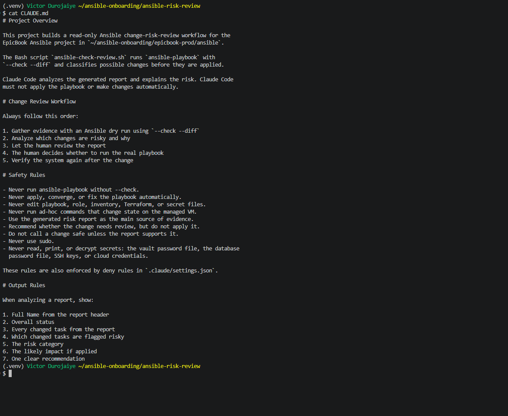

---

### Notes

Answer the following in your own words:

**1. Why should Claude Code have project-specific safety rules?**

Claude Code can run commands on my machine, and from there Ansible can change a real server. Generic behaviour is not enough when one wrong command can delete files or restart services. `CLAUDE.md` tells it what this project is for, the order of the workflow, and what it must never do, such as running the playbook without `--check` or reading my secrets.

I also enforced the rules instead of only writing them down. A project `.claude/settings.json` denies file edits and direct `ansible-playbook`, `ansible`, `ansible-vault`, `terraform`, `sudo`, `ssh`, `rm` and `wsl` commands, and blocks reading `~/.ssh`, `~/.config` and `~/.aws`.

---

**2. Why should the human run the real Ansible playbook manually?**

Applying a change has consequences, and a person has to own that decision. The human knows things the report cannot show: whether it is a good time, whether the file really is disposable, and whether anyone depends on the server right now. Running it manually also means the person reads the evidence first instead of approving a change they never looked at.

---

**3. Which rule prevents Claude Code from applying changes automatically?**

`Never apply, converge, or fix the playbook automatically.`, together with `Never run ansible-playbook without --check.` The deny rule `Bash(ansible-playbook *)` in `.claude/settings.json` backs them up, so Claude Code cannot run the playbook directly even if it tried.

---

# Task 3 — Ask Claude Code to Plan the Risk Review

## Goal

Use Claude Code to produce a read-only plan before writing the Bash script.

### Evidence

#### Screenshot 5 — Claude Code showing the four-category risk-classification plan

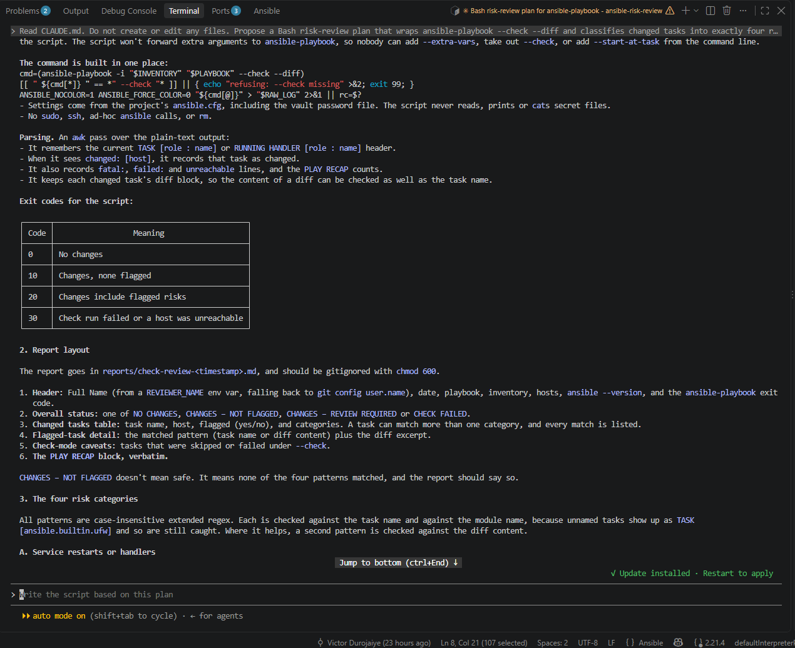

---

### Notes

Answer the following in your own words:

**1. Which part of this task represents the Gather phase?**

Claude Code reading `CLAUDE.md` and the project context first: what the project is, the required workflow, and the safety rules. That is the information it needed before proposing anything.

---

**2. Which part represents the Analyze phase?**

Proposing the plan: deciding how to wrap `ansible-playbook --check --diff`, sorting changed tasks into the four categories (service restarts or handlers, firewall changes, user or sudo changes, package or file removal), and explaining the task-name patterns and real-world impact for each one.

---

**3. How did you verify Claude Code did not create or edit files?**

I created `CLAUDE.md` last, after `.claude/settings.json` and `.gitignore`, so it was the newest file in the workspace when Claude Code started. After the session I ran `find . -newer CLAUDE.md -type f`, which returned nothing (`files newer than CLAUDE.md: 0`). The deny rules on `Edit` and `Write` also meant it could not have edited files without being blocked.

---

# Task 4 — Build the Ansible Risk Review Script

## Goal

Create a Bash script that runs an Ansible dry run and classifies risky changes.

### Evidence

#### Screenshot 6 — Top section of `ansible-check-review.sh` showing `full_name`, `playbook_path`, `inventory_path`, and the `checks` array

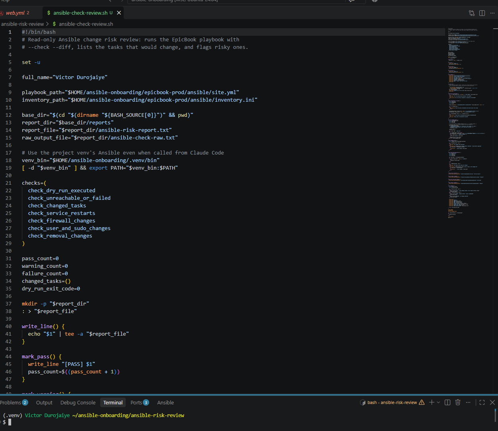

---

#### Screenshot 7 — Middle section showing `extract_changed_tasks` and `check_tasks_matching_pattern`

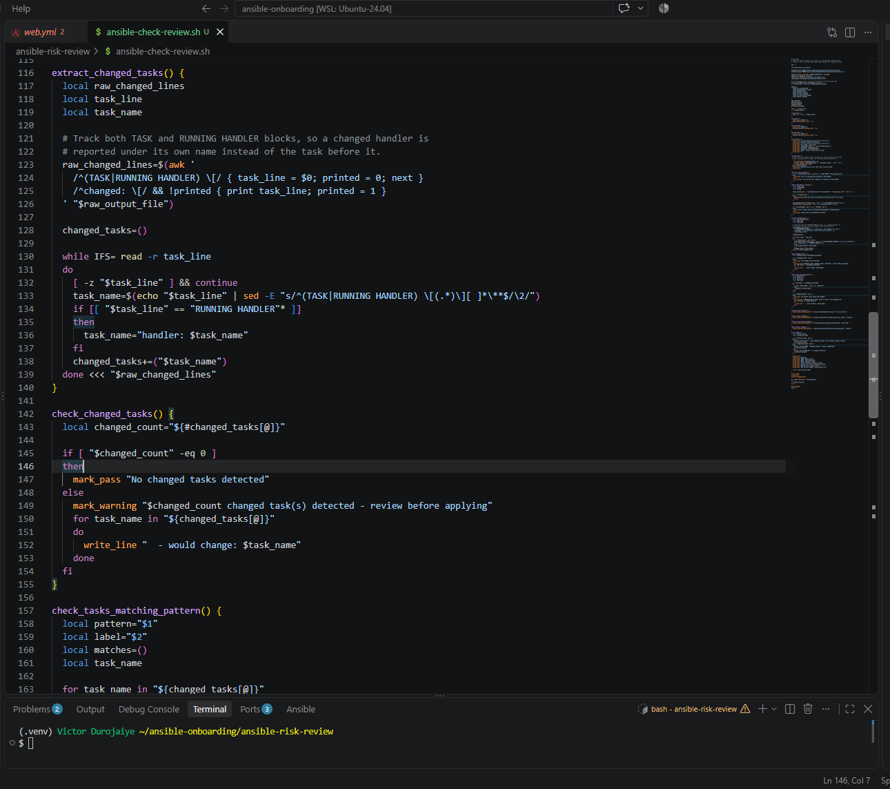

---

#### Screenshot 8 — Bottom section showing the loop, summary, and exit behavior

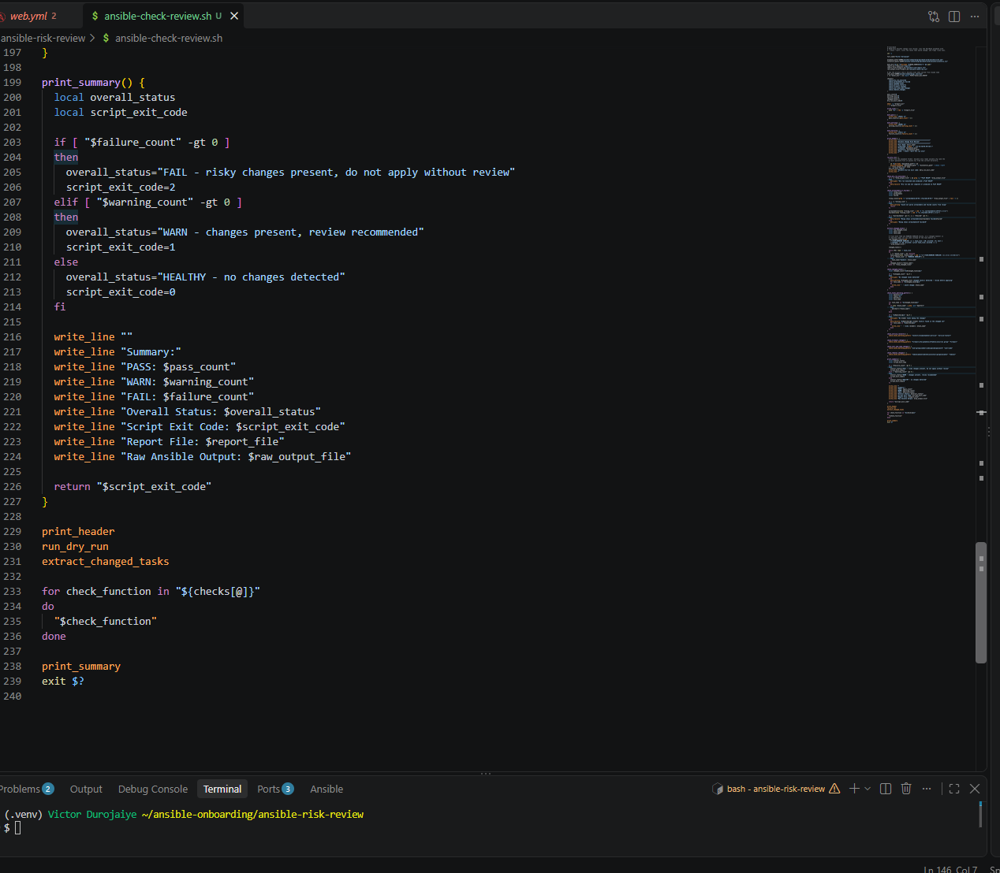

---

#### Screenshot 9 — Output of `bash -n ansible-check-review.sh` and `ls -l ansible-check-review.sh`

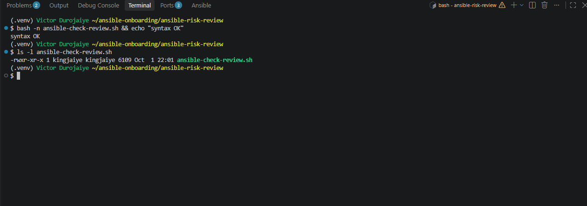

---

### Notes

Answer the following in your own words:

**1. What is stored in the `changed_tasks` array?**

The name of every task, and every handler, that the dry run reports as `changed`, for example `common : Remove temporary EpicBook risk test file`. Each name is stored once, even when a looped task changes several items. The four risk checks all work from this array.

---

**2. Which function finds changed tasks from the Ansible output?**

`extract_changed_tasks`. It uses `awk` to remember the most recent `TASK [...]` or `RUNNING HANDLER [...]` header, and prints it when the next result line starts with `changed: [`. Then `sed` strips the header down to just the task name.

I changed two things from the sample script. It also tracks `RUNNING HANDLER` headers, so a changed handler is reported under its own name instead of the task before it. And the dry run runs from inside the playbook folder, because Ansible only reads `ansible.cfg` (and the vault password file it points to) from the current directory.

---

**3. Why does the script use `--check --diff`?**

`--check` makes Ansible simulate the run and report what it would change, without changing anything. `--diff` shows what each change would look like, such as a file's `state` going from `file` to `absent`. Together they give real evidence from the real server before anything is applied.

---

**4. Why does the script use different exit codes for healthy, warning, and failed results?**

So other tools can act on the result without reading the text. `0` means HEALTHY (nothing would change), `1` means WARN (changes to review) and `2` means FAIL (risky changes, or the dry run itself failed). A CI pipeline could block a deploy on `2`, and the Claude Code skill treats a non-zero code as a result to report, not an error to fix.

---

# Task 5 — Run the Baseline Dry-Run Review

## Goal

Run the script against your current EpicBook playbook and confirm the baseline risk status.

### Evidence

#### Screenshot 10 — Output of `./ansible-check-review.sh`

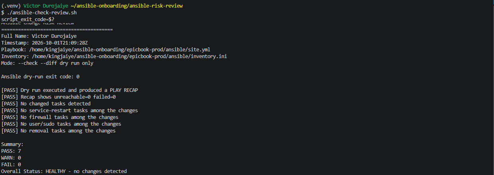

---

#### Screenshot 11 — Output of `echo "Captured Exit Code: $script_exit_code"` and `cat reports/ansible-risk-report.txt`

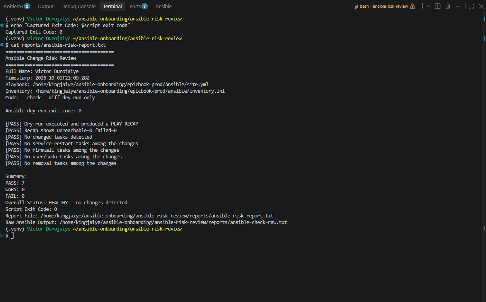

---

### Notes

Answer the following in your own words:

**1. What was the overall status of your baseline run?**

`HEALTHY - no changes detected`, with `PASS: 7`, `WARN: 0` and `FAIL: 0`. The Ansible dry run itself also exited with code 0.

---

**2. Did any tasks report `changed`?**

No. The dry run recap showed `changed=0 unreachable=0 failed=0`. My `common` role refreshes the apt cache inside the install task with `cache_valid_time: 3600` instead of a separate `apt update` task, so it does not report a change on every run. That kept the baseline completely clean.

---

**3. Were any changed tasks flagged as risky?**

No. With no changed tasks, all four risk checks passed: no service restarts, firewall changes, user or sudo changes, or removals.

---

**4. What does the script exit code mean?**

`Captured Exit Code: 0` means HEALTHY: the playbook would change nothing on the current server. A `1` would have meant changes that need review, and a `2` would have meant risky changes or a failed dry run.

---

# Task 6 — Create and Run the Claude Code Skill

## Goal

Turn the Bash script into a reusable Claude Code skill called `/ansible-risk-review`.

### Evidence

#### Screenshot 12 — `SKILL.md` showing the frontmatter, allowed tools, and safety rules

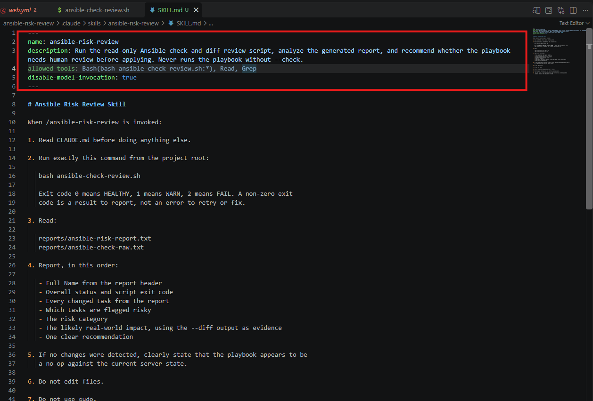

---

#### Screenshot 13 — Claude Code output after running `/ansible-risk-review`

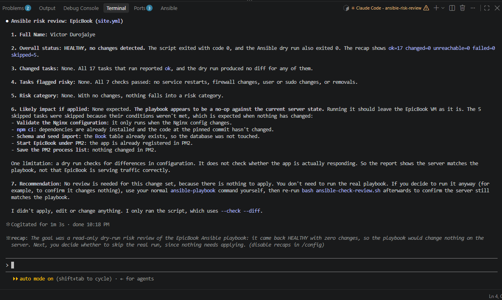

---

### Notes

Answer the following in your own words:

**1. Why does this skill allow `Bash`, `Read`, and `Grep`?**

Those are the only tools the job needs. `Bash` runs the review script, `Read` opens the risk report and the raw Ansible output, and `Grep` searches them. `allowed-tools` pre-approves these so the skill runs without stopping for permission each time. I scoped `Bash` to `Bash(bash ansible-check-review.sh:*)`, so only the review script is pre-approved and any other command would still need my approval.

---

**2. Why does this skill not allow file editing?**

A reviewer should not be able to change what it is reviewing. If the skill could edit files, it could "fix" a risky task or change a report, and the evidence would no longer be trustworthy. `allowed-tools` only pre-approves tools, it does not block the rest, so I also added `Edit` and `Write` to the deny list in `.claude/settings.json`.

---

**3. What part is handled by Bash?**

The deterministic part: running `ansible-playbook --check --diff`, saving the raw output, checking the recap for unreachable or failed hosts, extracting changed tasks, matching them against the four risk patterns, counting PASS, WARN and FAIL, and setting the exit code. It gives the same answer every time for the same output.

---

**4. What part is handled by Claude Code?**

The judgement part: reading the report and the raw diff, explaining what each change would really do, judging the impact, and giving one clear recommendation. It also caught things the script could not. In one run, it noticed an uncommitted change to the role file and asked me to decide whether to keep it. In another, it saw that a FAIL came from a dry run that never started, and said the report had no evidence instead of calling it risky.

---

**5. Why is this better than asking Claude Code if the playbook is safe without giving it evidence?**

Without evidence, Claude Code can only guess from reading the YAML. It cannot know what is already on the server, so it cannot tell which tasks would actually change anything. With the dry-run report and diff, its answer is based on what Ansible itself says would happen on that server, and I can check every claim against the report.

---

# Task 7 — Introduce a Controlled Risky Change and Let the Skill Catch It

## Goal

Add a small controlled risky change in your lab playbook and confirm the script and Claude Code catch it before applying.

### Evidence

#### Screenshot 14 — The added risky task inside the role file

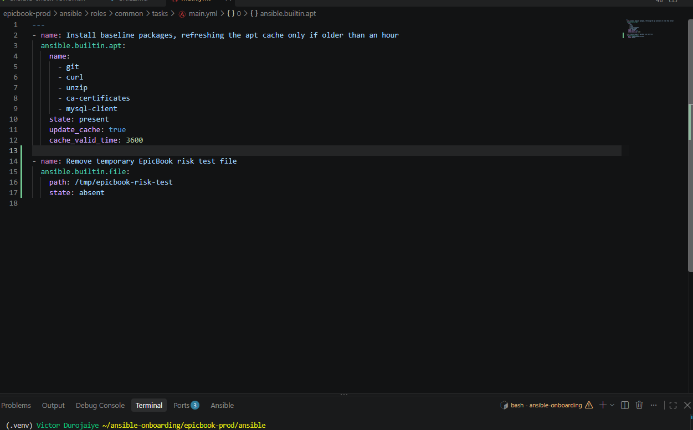

---

#### Screenshot 15 — Output of `./ansible-check-review.sh`

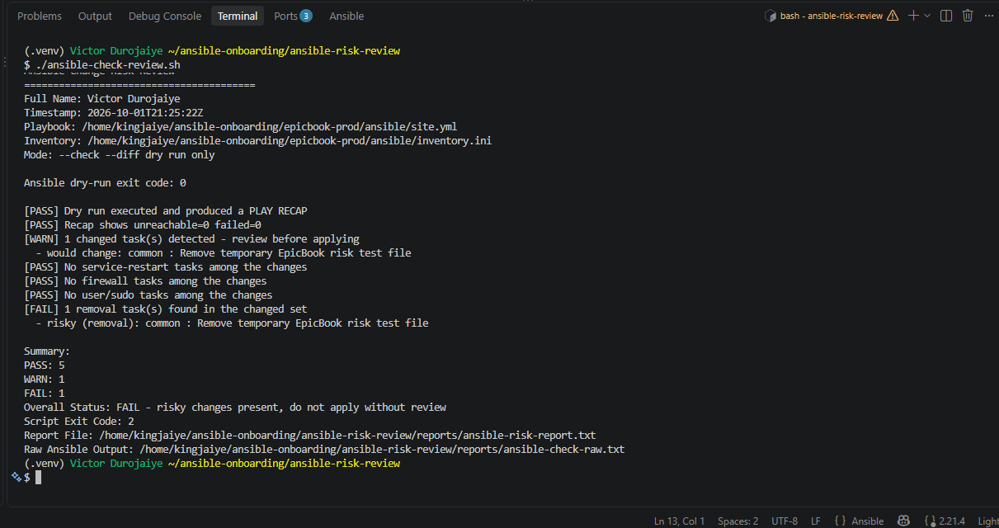

---

#### Screenshot 16 — Claude Code `/ansible-risk-review` output showing the risky finding

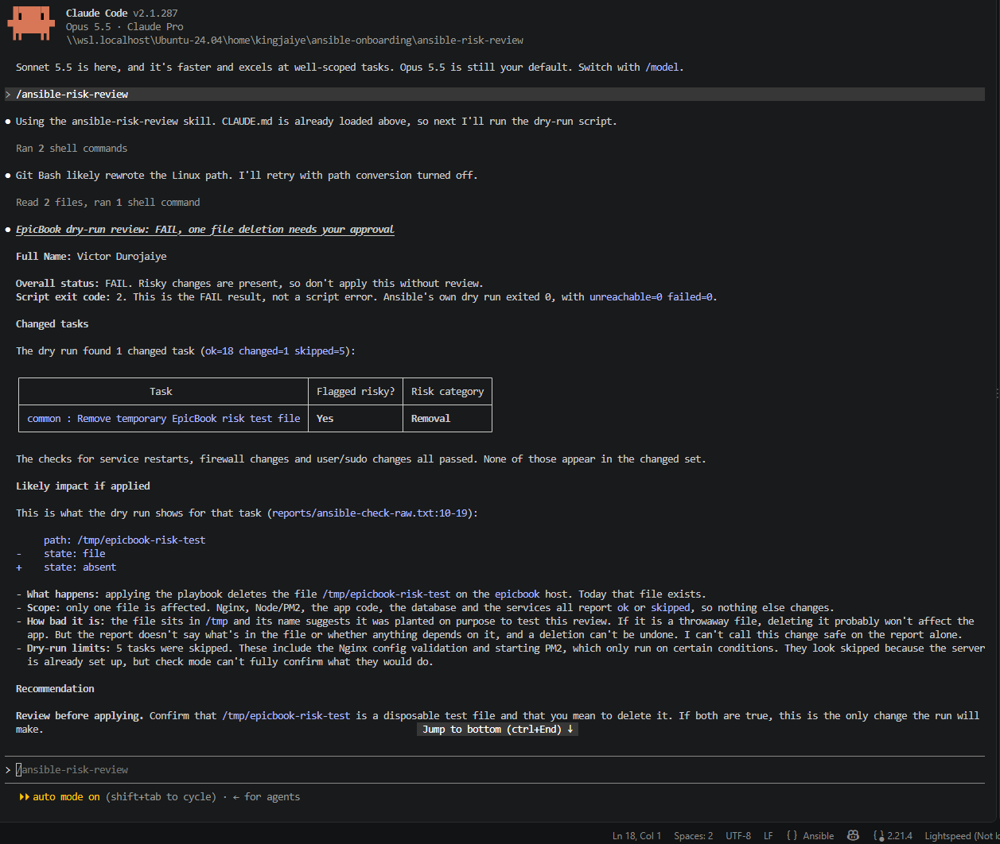

---

#### Screenshot 17 — Output of `cat reports/risky-change-report.txt`

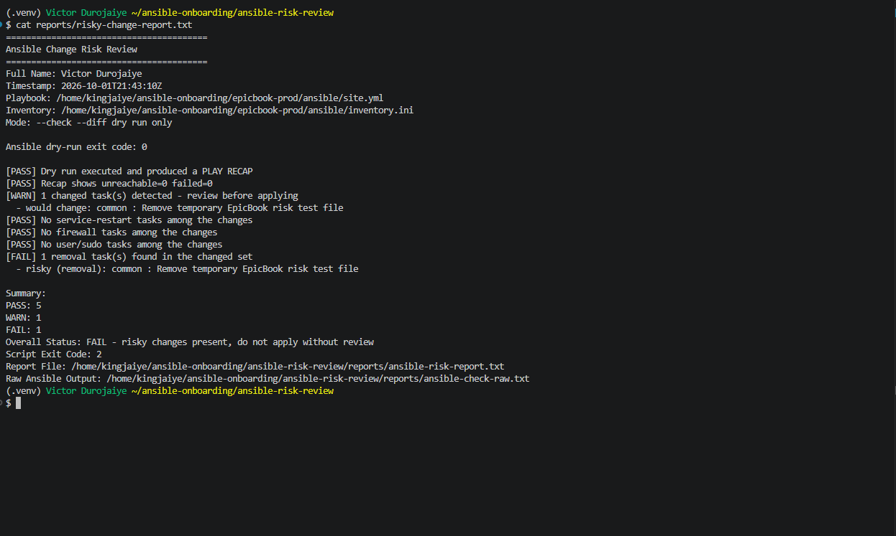

---

### Notes

Answer the following in your own words:

**1. Which risk category did the added task fall into?**

Removal. The report showed `[FAIL] 1 removal task(s) found in the changed set` and `risky (removal): common : Remove temporary EpicBook risk test file`. The overall status was `FAIL - risky changes present, do not apply without review` with exit code `2`.

---

**2. What evidence proves the task would change something?**

The raw dry-run output showed `changed: [epicbook]` under that task, with this diff:

```diff
     path: /tmp/epicbook-risk-test
-    state: file
+    state: absent
```

The file existed on the VM (I had created it with an ad-hoc `touch`), and applying the playbook would delete it. The recap showed `changed=1`, and this was the only changed task.

---

**3. Did Claude Code apply the playbook?**

No. It identified the task, put it in the removal category, quoted the diff, and said it could not call the change safe from the report alone. It recommended that I confirm the file was disposable and then run the playbook myself.

---

**4. Why is it important that Claude Code only analyzed the risk?**

A deletion cannot be undone by running the playbook again. If the agent could apply as well as analyze, one wrong judgement would go straight to the server with nobody checking. Keeping it to analysis means the person who owns the server makes the call, with the evidence in front of them.

I saw why this matters during this assignment. My `claude` command in WSL turned out to be the Windows install of Claude Code, whose Bash tool runs in Git Bash. In this run it hit a path problem and retried the same review script with path conversion turned off, finding its own way around the obstacle. That retry was harmless, but it showed that an agent will work around obstacles, so the limits have to be enforced, not just asked for.

---

**5. Which phase of the Agentic Loop is represented by the Bash report?**

Gather. The Bash script collects the evidence: the dry-run output, the diff, the changed tasks and a first classification. Claude Code then uses that report for the Analyze phase.

---

# Task 8 — Apply as the Human, Verify, and Write the Change Summary

## Goal

Review the risky-change report, apply the playbook manually as the human operator, and verify the result.

### Evidence

#### Screenshot 18 — Output of the real playbook run showing the final recap with `failed=0`

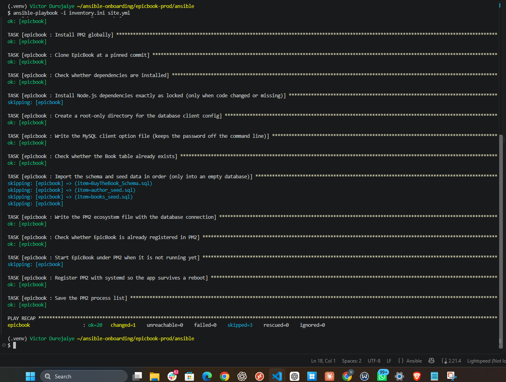

---

#### Screenshot 19 — Output of `ansible web -i inventory.ini -m ping`

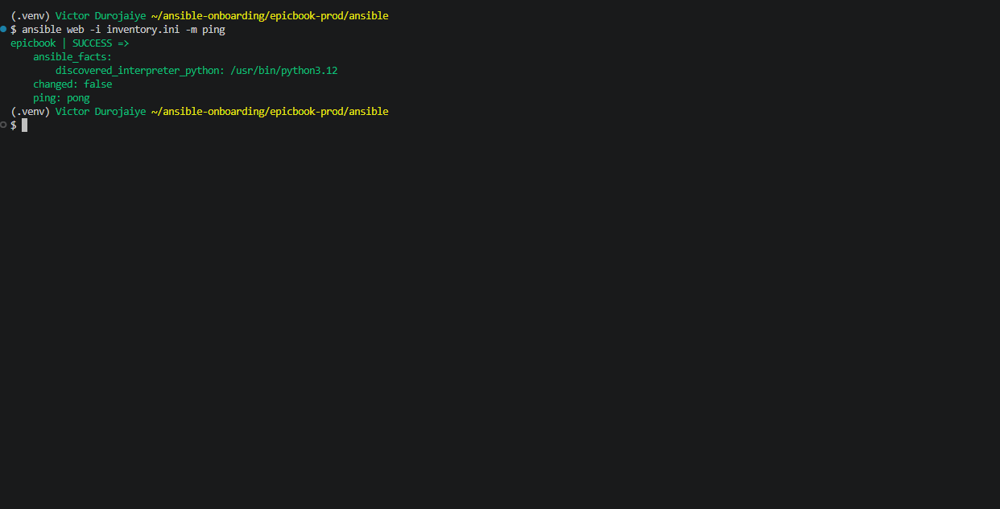

---

#### Screenshot 20 — Second `/ansible-risk-review` output after applying the change

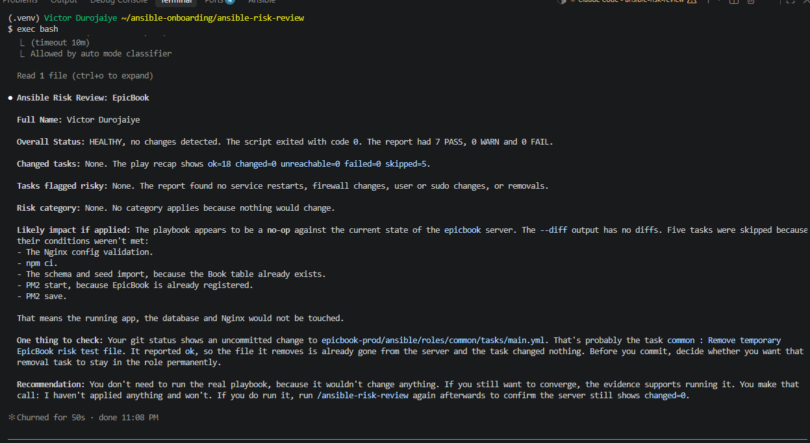

---

#### Screenshot 21 — Output of `ls -lah reports`

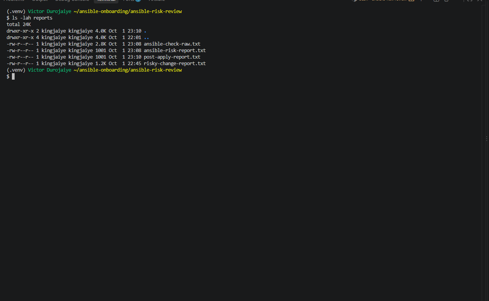

---

#### Screenshot 22 — `change-summary.md` showing all required sections and your Full Name

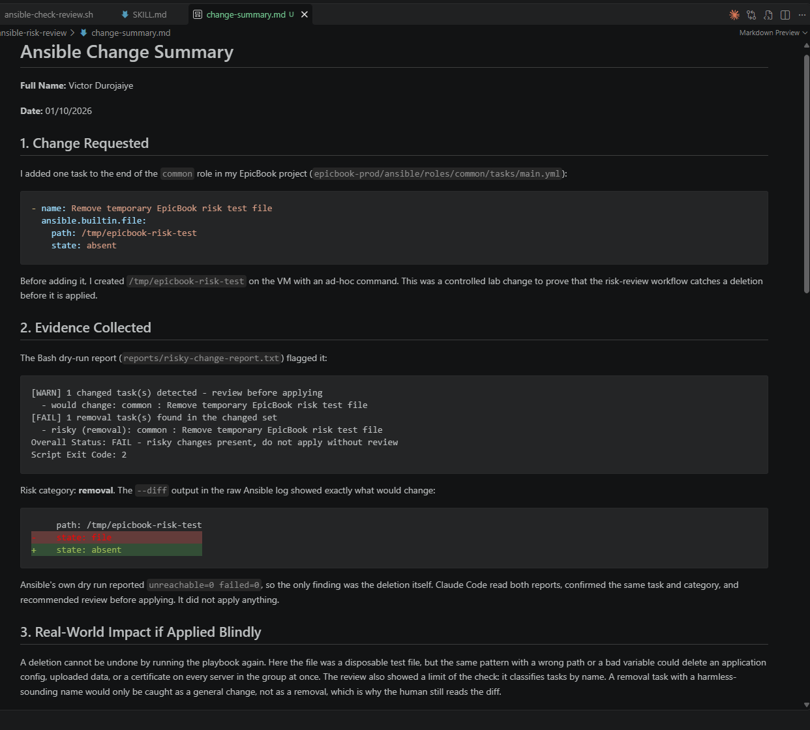
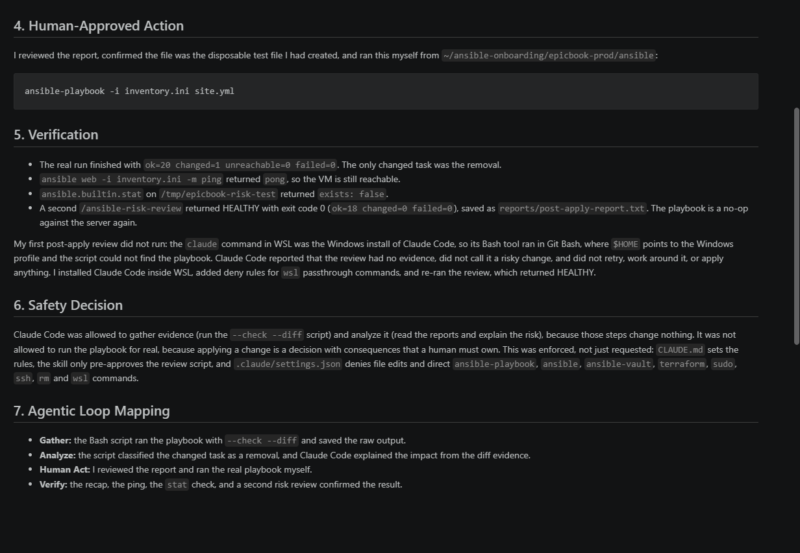


---

### Notes

Answer the following in your own words:

**1. What command did you run to apply the change for real?**

`ansible-playbook -i inventory.ini site.yml`, which I ran myself from `~/ansible-onboarding/epicbook-prod/ansible` after reviewing `reports/risky-change-report.txt`. It finished with `ok=20 changed=1 unreachable=0 failed=0 skipped=3`, and the only changed task was the removal.

---

**2. Who made the final decision to apply the playbook?**

I did, as the human operator. Claude Code only recommended a review. I confirmed that `/tmp/epicbook-risk-test` was the disposable test file I had created, and then decided to apply.

---

**3. What evidence proves the VM is still reachable?**

`ansible web -i inventory.ini -m ping` returned `SUCCESS` with `ping: pong` after the apply. A read-only `ansible.builtin.stat` check on `/tmp/epicbook-risk-test` also returned `exists: false`, which proves the change was applied as intended.

---

**4. Why should the risk review be run again after applying?**

To prove the server now matches the playbook and nothing unexpected is left to change. The second review returned `HEALTHY - no changes detected` with exit code `0` and `ok=18 changed=0 failed=0`. The removal task now reports `ok` because the file is already gone. That result is saved as `reports/post-apply-report.txt`.

My first post-apply review did not run: the Windows install of Claude Code could not find my WSL files, because Git Bash sets `$HOME` to the Windows profile. Claude Code reported that the review had no evidence, did not treat it as a risky change, and did not retry or apply anything. I installed Claude Code inside WSL, added deny rules for `wsl` passthrough commands, and re-ran the review, which came back HEALTHY.

---

**5. What could go wrong if an AI agent applied Ansible changes automatically?**

It could delete files, restart services during business hours, or change users and sudo rights on every server in a group at once, based on a misread report or a wrong guess about what a task does. A removal task with a harmless-sounding name would not even be flagged as a removal by a name-based check. An agent that is trying to finish its job may also work around obstacles, the way the Windows Claude Code found another route into WSL. Keeping apply as a human step, backed by enforced deny rules, stops one bad decision from reaching production.

---

# LinkedIn Post Required

## Evidence

#### LinkedIn Post URL

Paste your LinkedIn post URL here:

`https://www.linkedin.com/feed/update/urn:li:activity:7511552629177503744/`

---

#### Screenshot — Published LinkedIn post

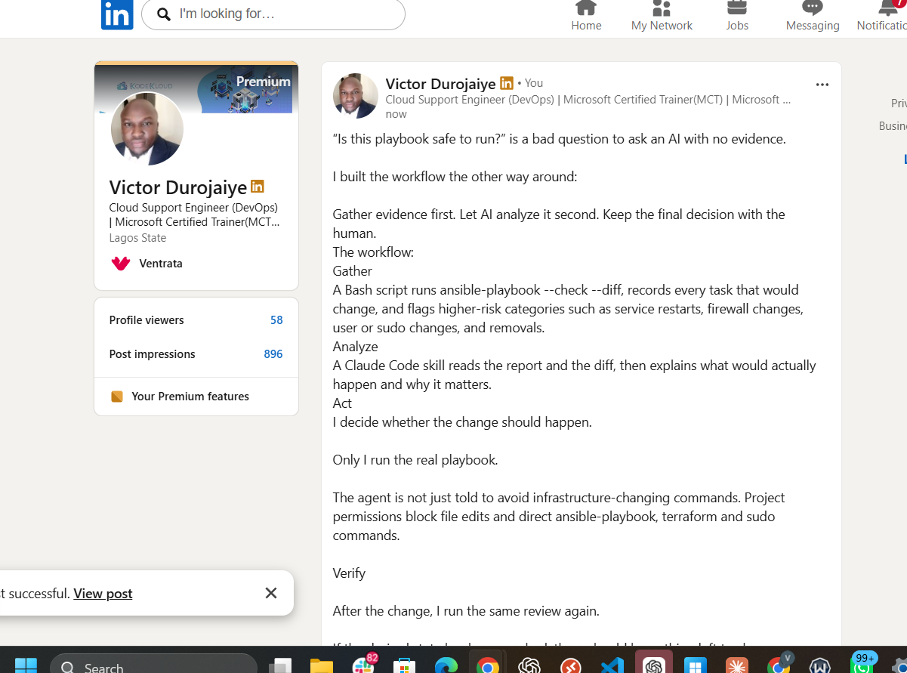

---

# Required Files

Confirm that the following files are included in your GitHub repository or assignment folder:

- [x] `CLAUDE.md`
- [x] `ansible-check-review.sh`
- [x] `.claude/skills/ansible-risk-review/SKILL.md`
- [x] `reports/risky-change-report.txt`
- [x] `reports/post-apply-report.txt`
- [x] `change-summary.md`

Assignment folder: [https://github.com/Kingjaiyee/devops-micro-internship-pravinmishra/tree/main/week-09-ansible/ansible-onboarding/ansible-risk-review](https://github.com/Kingjaiyee/devops-micro-internship-pravinmishra/tree/main/week-09-ansible/ansible-onboarding/ansible-risk-review)

---

# Submission Instructions

- Add all required screenshots in your submission.
- Full Name must be visible in required screenshots and reports.
- All required notes must be answered clearly.
- Do not expose SSH private keys, passwords, cloud credentials, database credentials, or secret environment variables.
- Add your GitHub repository or folder URL inside this document.

---

# Completion Checklist

- [x] Task 1: EpicBook connectivity confirmed and workspace created
- [x] Task 2: `CLAUDE.md` created with safety rules
- [x] Task 3: Claude Code produced a read-only risk-review plan
- [x] Task 4: `ansible-check-review.sh` created and syntax checked
- [x] Task 5: Baseline dry-run review completed
- [x] Task 6: Claude Code `/ansible-risk-review` skill created and tested
- [x] Task 7: Controlled risky change introduced and detected
- [x] Task 8: Human applied the change and verified the result
- [x] Risky-change report saved
- [x] Post-apply report saved
- [x] Change summary completed
- [x] All screenshots added
- [x] All notes answered
- [x] LinkedIn post published
- [x] LinkedIn post URL added
- [x] No sensitive information exposed

---

## About DMI & CloudAdvisory

DevOps Micro Internship (DMI) is a project-based DevOps program run by Pravin Mishra and The CloudAdvisory, focused on real-world execution, systems thinking, and career readiness.

It helps learners build strong DevOps foundations with hands-on experience.

---

## Resources

- DMI Official Website: [https://dmi.pravinmishra.com?utm_source=github&utm_medium=readme](https://dmi.pravinmishra.com?utm_source=github&utm_medium=readme)
- University: [https://university.pravinmishra.com?utm_source=github&utm_medium=readme](https://university.pravinmishra.com?utm_source=github&utm_medium=readme)
- Discord Community: [https://discord.pravinmishra.com?utm_source=github&utm_medium=readme](https://discord.pravinmishra.com?utm_source=github&utm_medium=readme)
- Blog: [https://dmi.pravinmishra.com/blog?utm_source=github&utm_medium=readme](https://dmi.pravinmishra.com/blog?utm_source=github&utm_medium=readme)
- YouTube Playlist: [https://www.youtube.com/playlist?list=PLFeSNDtI4Cho](https://www.youtube.com/playlist?list=PLFeSNDtI4Cho)
- Pravin Mishra LinkedIn: [https://www.linkedin.com/in/pravin-mishra-aws-trainer/](https://www.linkedin.com/in/pravin-mishra-aws-trainer/)
- CloudAdvisory LinkedIn: [https://www.linkedin.com/company/thecloudadvisory/](https://www.linkedin.com/company/thecloudadvisory/)

---

*This submission is part of DevOps Micro Internship (DMI) — Agentic AI Track.*
