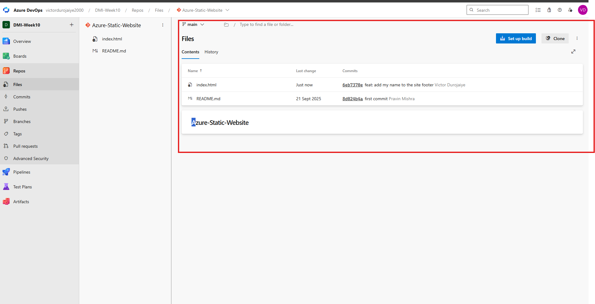
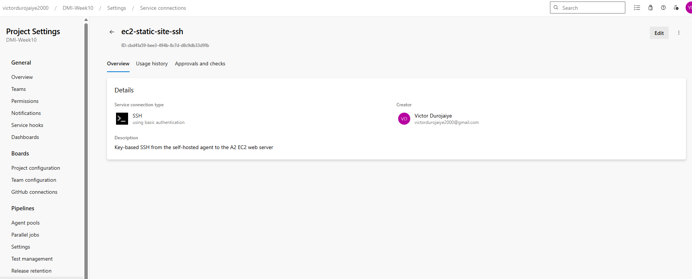
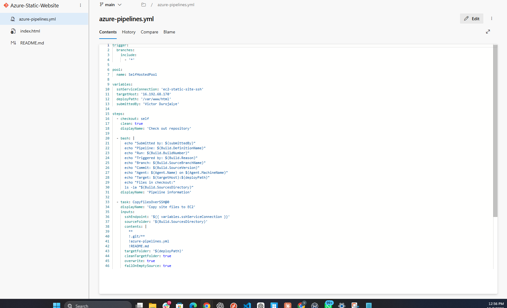
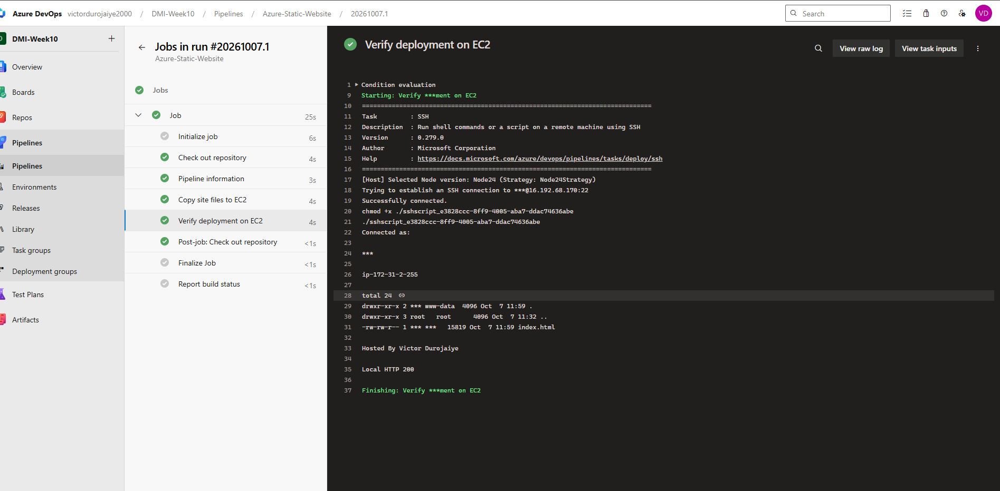
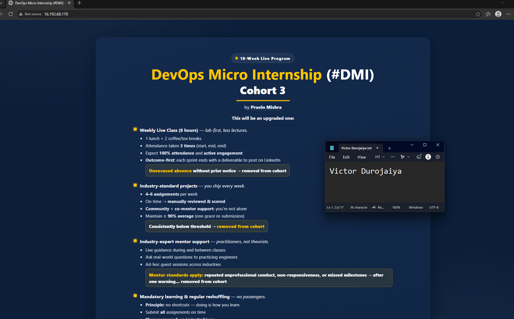
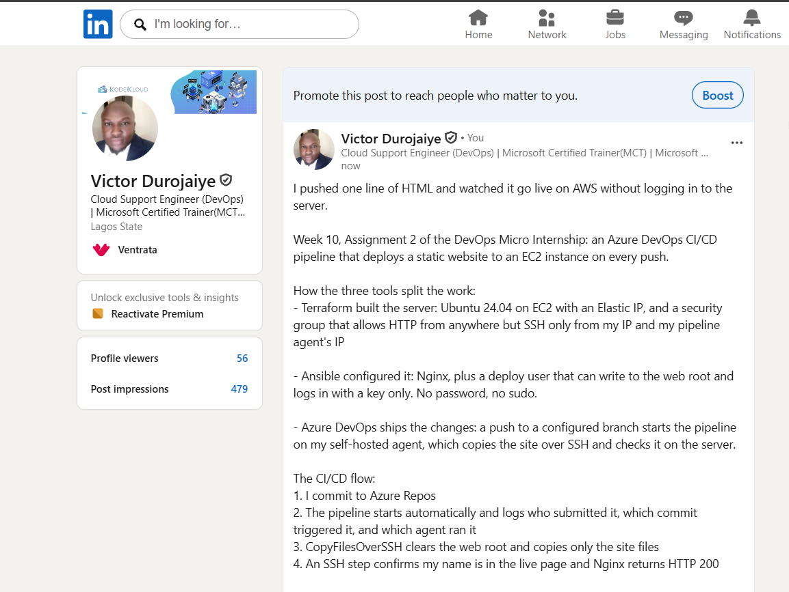

# Assignment 2 — Deploy A Static Website to AWS EC2 Using an Azure DevOps CI/CD Pipeline

Part of the DevOps Micro Internship (DMI) with Agentic AI

---

## Purpose

In this assignment, you will import and personalize the Static Website, provision and configure an AWS EC2 instance using Terraform and Ansible, and create an Azure DevOps CI/CD pipeline that automatically deploys the website to Nginx through an SSH Service Connection.

---

# Task 0 — Verify the Existing Tooling and Self-Hosted Agent

## Goal

Confirm that Terraform, Ansible, AWS CLI, SSH, and the self-hosted Azure Pipelines agent are ready.

No submission screenshot is required for this task.

---

# Task 1 — Import and Personalize the Azure Static Website Repository

## Goal

Import the Azure Static Website into Azure Repos and add your Full Name to the website.

## Evidence

### Screenshot 1 — Azure Static Website in Azure Repos

Add a screenshot of Azure Repos showing:

* Imported Azure Static Website repository
* Project files
* `index.html`

---

# Task 2 — Provision and Configure the Target EC2 Instance

## Goal

Provision the AWS EC2 instance using Terraform and configure Nginx, SSH access, and deployment permissions using Ansible.

No additional submission screenshot is required for this task.

---

# Task 3 — Create the SSH Service Connection

## Goal

Create an Azure DevOps SSH Service Connection that can connect to the target EC2 instance using your selected SSH authentication method.

## Evidence

### Screenshot 2 — SSH Service Connection

Add a screenshot of the saved SSH Service Connection **Overview** page showing:

* Service Connection name
* SSH connection type

> Do not expose a password, SSH private key, passphrase, or another credential.

---

# Task 4 — Create the Azure DevOps YAML Pipeline

## Goal

Create an Azure DevOps YAML pipeline that deploys the Azure Static Website to the target EC2 instance after a commit is pushed.

## Evidence

### Screenshot 3 — Azure Pipelines YAML

Add a screenshot of `azure-pipelines.yml` open in the Azure Repos editor showing:

* Push trigger
* Selected self-hosted agent pool
* Pipeline variables
* Repository checkout step
* Pipeline information step
* `CopyFilesOverSSH@0` task
* `SSH@0` verification task

> Ensure that no password, SSH private key, PAT, or AWS credential is visible.

---

# Task 5 — Create, Authorize, and Run the Pipeline

## Goal

Run the Azure DevOps pipeline and confirm that the website files are transferred and verified successfully.

## Evidence

### Screenshot 4 — Successful Pipeline Run

Add a screenshot of the successful pipeline run and log summary showing:

* Overall pipeline status as **Succeeded**
* Pipeline information step completed
* File-copy step completed
* Remote-verification step completed
* Your Full Name visible in the pipeline output

---

# Task 6 — Verify the Website and Automatic Trigger

## Goal

Confirm that the website is accessible through the EC2 public IP address and that a new pushed commit automatically triggers another deployment.

## Evidence

### Screenshot 5 — Deployed Azure Static Website

Add a browser screenshot showing:

* Deployed Azure Static Website
* EC2 public IP address in the browser address bar
* Your Full Name
* Updated website content after the automatic deployment

## Final Website URL

`http://<target-vm-public-ip>`

Replace the placeholder with your actual website URL:

http://16.192.68.170

---

# Assignment Summary

Write a short summary of the completed CI/CD workflow.

I imported the Azure Static Website into Azure Repos in my DMI-Week10 project and put my name in the site's footer. With Terraform I created an Ubuntu 24.04 t3.micro EC2 instance in eu-north-1, with an Elastic IP so the address stays the same, and a security group that allows HTTP from anywhere but SSH only from my own IP and from my self-hosted agent's IP. I checked the instance's SSH host key against the EC2 console output before connecting.

With Ansible I installed Nginx and created a deploy user that is in the www-data group, owns /var/www/html, and logs in with a dedicated RSA key only, with no password and no sudo. A second playbook run reported changed=0.

In Azure DevOps I created an SSH service connection (ec2-static-site-ssh) that uses the deploy user and its private key, and a YAML pipeline that runs on my self-hosted agent in SelfHostedPool for pushes to any branch. The pipeline checks out the repo, prints the run details and my name, copies only the site files to /var/www/html with CopyFilesOverSSH@0 (it cleans the folder first and leaves out .git, the README and the pipeline file), and then uses SSH@0 to list the web root, confirm my name is in index.html and check that Nginx returns 200.

To test the trigger I changed the heading from Cohort 2 to Cohort 3 and pushed. The pipeline started by itself as Individual CI and the live site showed the change about a minute later. http://16.192.68.170/.git/config returns 404, so the repo history is not exposed. The service connection username is stored as a secret, so Azure DevOps shows it as *** in the pipeline logs.

---

# LinkedIn Requirement

## LinkedIn Post Screenshot

Add a screenshot of your LinkedIn post containing:

* What you automated
* How Terraform, Ansible, and Azure DevOps worked together
* Three to five lines describing the CI/CD workflow
* A screenshot of the successful pipeline or deployed website

## LinkedIn Post URL

https://www.linkedin.com/feed/update/urn:li:activity:7513572821503987712/

> Do not expose AWS credentials, SSH private keys, passwords, PATs, or other sensitive information.

---

# Submission Instructions

* Include the short assignment summary.
* Include Screenshots 1–5.
* Include the final website URL.
* Include the LinkedIn post screenshot and URL.
* Confirm that the EC2 instance is running during grading.
* Do not expose a password, SSH private key, passphrase, PAT, AWS credential, account ID, or another secret.

---

# Completion Checklist

* The correct Azure Static Website repository was imported into Azure Repos
* `index.html` is visible in Azure Repos
* Your Full Name was added to the website
* The target EC2 instance was provisioned using Terraform
* A suitable Ubuntu image and EC2 size were selected
* Nginx was configured using Ansible
* SSH login works using the selected authentication method
* The SSH user can write to `/var/www/html`
* TCP ports 22 and 80 are configured correctly
* The self-hosted Azure Pipelines agent is online
* The SSH Service Connection was created successfully
* The YAML trigger includes all branches
* The YAML uses the correct self-hosted agent pool
* The copy and remote-verification tasks completed successfully
* The pipeline status is **Succeeded**
* A new pushed commit triggered the pipeline automatically
* The Azure Static Website loads through the EC2 public IP address
* Your Full Name is visible on the deployed website
* Screenshots 1–5 are included and readable
* The final website URL is included
* The LinkedIn post screenshot and URL are included
* No sensitive information is exposed

---

*This submission is part of the DevOps Micro Internship (DMI) — Agentic AI Track.*
