# Assignment 5 — AI-Assisted Azure DevOps Dual-Pipeline Failure Triage

Part of the DevOps Micro Internship (DMI) — Agentic AI Track

---

## Student Information

**Full Name:** Victor Durojaiye

**GitHub Repository or Fork URL:** https://github.com/Kingjaiyee/devops-micro-internship-pravinmishra

**Public LinkedIn Post URL:** https://www.linkedin.com/feed/update/urn:li:activity:7513693987145211905/

---

## Purpose

In this assignment, I configured an AI-assisted, read-only failure-triage workflow for the EpicBook Infrastructure and Application Pipelines. The workflow uses Bash to gather Azure DevOps pipeline evidence and Claude Code to analyze the evidence and recommend a recovery action while keeping all changes under human control.

---

# Task 0 — Verify Tools, Authentication, and Pipeline Details

## Goal

Verify the required tools, Azure DevOps authentication, organization and project details, and numeric pipeline IDs.

No screenshot is required for this task.

---

# Task 1 — Capture the Healthy Baseline and Prepare the Supplied Files

## Goal

Confirm that both EpicBook pipelines are healthy and place the supplied assignment files in the correct repository locations.

## Evidence

### Screenshot 1 — Healthy Baseline for Both Pipelines

Terminal output showing the latest completed Infrastructure and Application Pipeline runs with successful results.

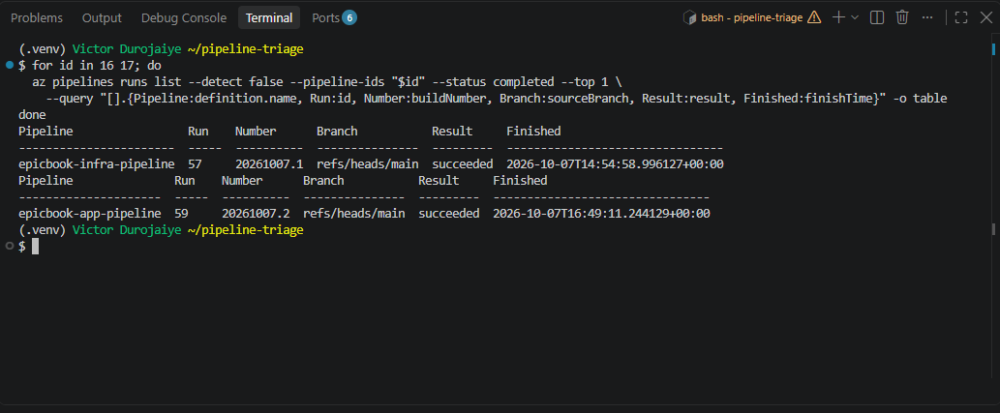

## Notes

### 1. What proves that both pipelines were healthy before the drill?

I queried Azure DevOps for the latest completed run of each pipeline with `az pipelines runs list --status completed --top 1`. The Infrastructure Pipeline (ID 16) showed run 57 and the Application Pipeline (ID 17) showed run 59, both on `refs/heads/main` with result `succeeded`. Run 59 was triggered by my last change to the Application Pipeline, so the baseline also covered the new dependency check in its Validate stage.

### 2. Why is a healthy baseline necessary before introducing a controlled failure?

Without it, I could not tell whether a failure found later was caused by my drill or was already there. Starting from two green pipelines means any new failure can be traced to the one change I made. The baseline also proved that the triage tooling and my login worked before I relied on them during the incident.

---

# Task 2 — Configure and Review the Supplied CLAUDE.md

## Goal

Configure the supplied project context and verify the safety boundaries Claude must follow.

## Evidence

### Screenshot 2 — CLAUDE.md Context and Safety Rules

`CLAUDE.md` open in the editor with the Project Overview, Incident Workflow, Safety Rules, and Output Rules visible.

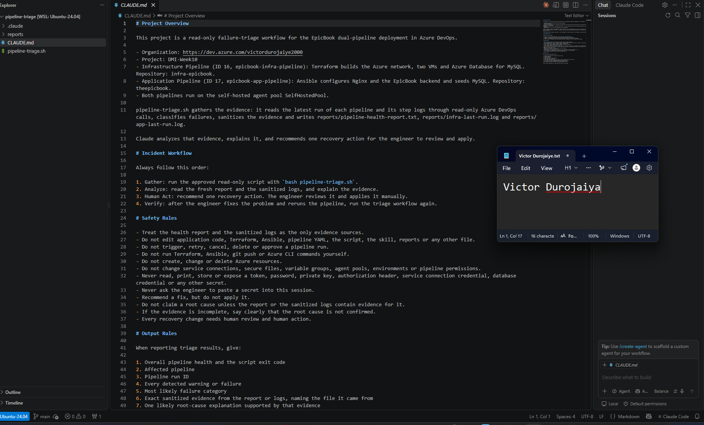

## Notes

### 1. Why does Claude need project-specific operational context?

Claude starts every session knowing nothing about my setup. CLAUDE.md tells it which two pipelines exist, their numeric IDs, what each one does (Terraform for infrastructure, Ansible for the application), which agent pool runs them, and which report and log files hold the evidence. Without that, it could confuse an infrastructure failure with a deployment failure, or look for evidence in the wrong place. Claude Code reads the file at the start of every session, so I do not have to repeat the context each time.

### 2. Which rules keep the human responsible for the recovery action?

The Incident Workflow puts "Human Act" between Analyze and Verify: Claude recommends one action, and I review and apply it. The Safety Rules say "Recommend a fix, but do not apply it" and "Every recovery change needs human review and human action". They also forbid Claude from editing any file, triggering, retrying, cancelling or approving pipeline runs, and running Terraform, Ansible, git push or Azure CLI commands. Together these leave every change, push and rerun to me.

### 3. Which rules protect pipeline credentials and application secrets?

The Safety Rules forbid reading, printing, storing or exposing any token, password, private key, authorization header, service connection credential or database credential, and forbid asking me to paste a secret into the session. They also forbid changing service connections, secure files, variable groups, agent pools, environments or pipeline permissions. I backed these with deny rules in `.claude/settings.json` that block reading `~/.ssh`, `~/.azure`, `~/.config` and `~/.aws`, and block commands that could print environment variables.

---

# Task 3 — Configure and Validate the Supplied Pipeline Triage Script

## Goal

Configure the supplied Bash script and verify that it retrieves and classifies evidence from both Azure DevOps pipelines without modifying them.

## Evidence

### Screenshot 3 — Pipeline Triage Script Configuration

Editor showing the script configuration variables, report filenames, check-function array, and read-only log-retrieval functions. Ensure that no token is visible.

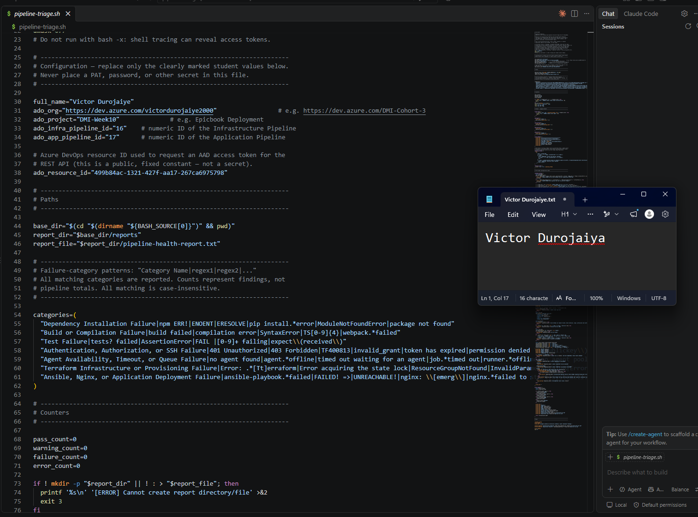

---

### Screenshot 4 — Script Validation

Terminal showing successful Bash syntax validation and executable file permission.

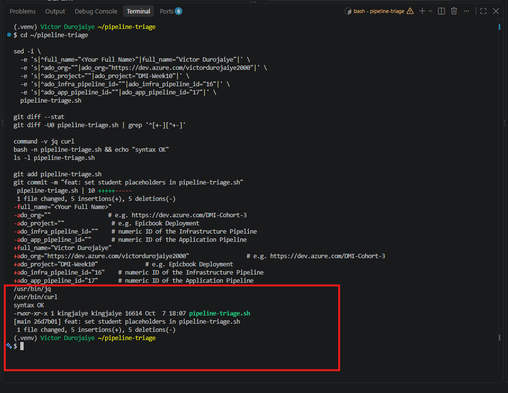

## Notes

### 1. Why are pipeline metadata and step console logs handled separately?

Metadata (run ID, branch, status, result, completion time) is small, always needed, and comes from `az pipelines runs list`. Logs are large, only needed when a run failed, and can contain sensitive values, so they go through sanitizing. Keeping them apart also keeps their failures apart. During my drill, the first triage run read the metadata correctly but could not download the logs, and the report showed both facts: the run failed, and the logs could not be retrieved, so the root cause was not confirmed.

### 2. How does the script obtain the actual console logs?

`fetch_build_logs` requests a Microsoft Entra access token for Azure DevOps with `az account get-access-token`, then calls the Build Logs REST API with plain GET requests: first the list of logs for the build, then each log as text. The token is passed to curl through standard input, so it never appears in the process list, and redirects are not followed. Each response's HTTP code is checked, every log is sanitized, and the logs are staged in a private temporary folder and published to `reports/app-last-run.log` only when every download succeeded.

### 3. How does the check-function array control the classification loop?

Each entry in the `categories` array holds a category name and a set of regular expressions, separated by `|`. `run_category_checks` loops over every entry, splits off the name, and searches the sanitized log for the first line matching that entry's patterns. Each match records a FAIL finding with that category name and the sanitized evidence line. The array alone decides what is checked, so adding a category means adding one entry, not changing the loop.

### 4. What prevents a failed but unmatched run from being reported as healthy?

When Azure DevOps reports a run as `failed`, the script always records a failure. If no category matches, it records "Unclassified Pipeline Failure", and if the logs cannot be downloaded, it records that the run failed and the root cause is not confirmed. Tool and API problems count as errors, and the summary ranks ERROR above FAIL above WARN, so HEALTHY is only possible when every count except PASS is zero. My drill hit this exact path: npm 10 prints `npm error` instead of the `npm ERR!` the dependency pattern looks for, so the script reported Unclassified rather than healthy. Earlier, when the logs API returned HTTP 302, the script reported ERROR with exit code 3, not a healthy result.

### 5. Why are different exit codes useful to another automation tool?

Another tool can react to the number without parsing the report text. Exit 0 means both latest runs succeeded, 1 means a warning such as a running or cancelled run, 2 means a pipeline failed, and 3 means the triage tool itself failed. A scheduler or CI gate could alert on 2, wait and retry on 1, and treat 3 as a problem with the tooling, not with the pipelines.

---

# Task 4 — Run and Understand the Healthy-State Report

## Goal

Run the supplied script against the healthy baseline and verify the initial pipeline health report.

## Evidence

### Screenshot 5 — Healthy Pipeline Report

Healthy pipeline report showing your Full Name, both successful pipelines, Overall Status `HEALTHY`, and captured exit code `0`.

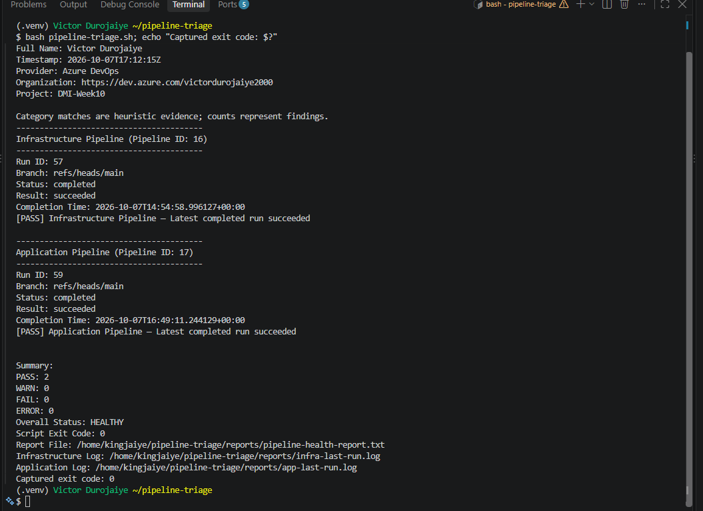

## Notes

### 1. What evidence proves that both pipelines are healthy?

The report shows my name, organization and project, then each pipeline with its latest run: Infrastructure run 57 and Application run 59, both on `refs/heads/main`, `completed`, `succeeded`, each marked `[PASS]`. The summary shows PASS 2, WARN 0, FAIL 0, ERROR 0, `Overall Status: HEALTHY` and `Script Exit Code: 0`, and the exit code I captured with `echo $?` straight after the run was also 0.

### 2. Why must the baseline exit code be verified before the incident drill?

The exit code is what automation would act on, so it has to agree with the report. A baseline of 0 proved the script, the Azure DevOps connection and the report all worked end to end on known-good runs. That way, when the drill later returned exit code 2, I could trust that the change came from my deliberate failure and not from a broken tool.

---

# Task 5 — Configure and Test the Supplied /pipeline-triage Skill

## Goal

Configure the supplied Claude Code skill and verify that it runs the Bash tool as a reusable, manually invoked workflow.

## Evidence

### Screenshot 6 — Pipeline-Triage Skill Definition

`SKILL.md` showing the frontmatter, manual-invocation setting, narrowly scoped tools, safety rules, and required output structure.

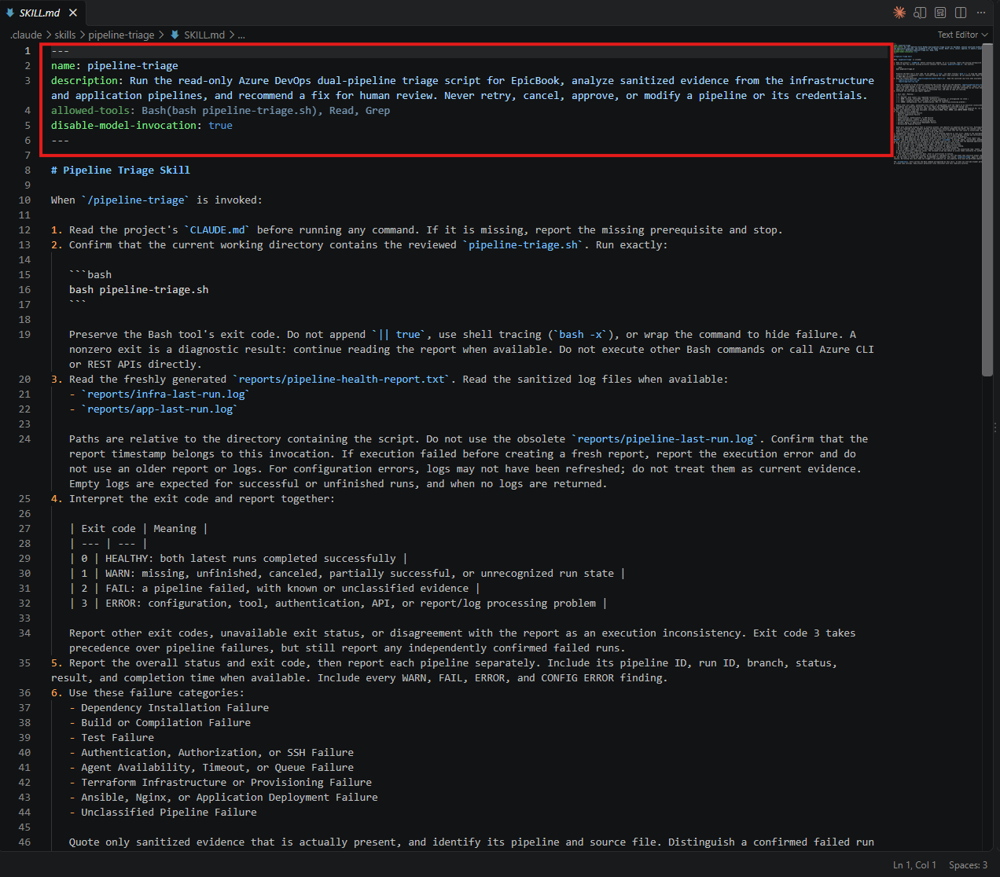

---

### Screenshot 7 — Healthy Skill Result

Healthy `/pipeline-triage` result showing that both pipelines are healthy and no fix is required.

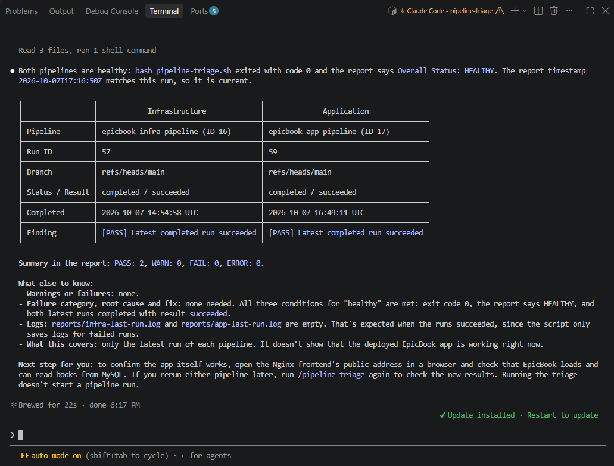

## Notes

### 1. Why is `disable-model-invocation: true` appropriate for this skill?

It means the skill only runs when I type `/pipeline-triage`. Claude cannot decide on its own to start it in the middle of another conversation. Triage contacts live Azure DevOps, uses an access token internally and rewrites the report files, so the engineer should choose when that happens.

### 2. Why should the skill avoid broad Bash approval?

`allowed-tools: Bash(bash pipeline-triage.sh)` pre-approves one exact command and nothing else. A bare `Bash` grant would pre-approve any shell command, including ones that queue or cancel pipelines, push code, delete files or print secrets. Pipeline logs are untrusted text, and a narrow grant means that even if a log line tried to give Claude instructions, nothing else could run without my approval.

### 3. What work is performed by Bash, and what work is performed by Claude?

Bash does the Gather work: it checks the configuration and tools, reads run metadata through the Azure DevOps CLI, downloads the logs through the REST API, sanitizes them, classifies failures, writes the report and returns the exit code. Claude does the Analyze work: it reads CLAUDE.md, runs that one command, reads the fresh report and sanitized logs, checks the report is from this run, explains the evidence, names the most likely category and root cause, and recommends one fix and one verification step for me.

### 4. Why are permission rules required in addition to written safety instructions?

Written instructions are guidance that Claude follows, but they are not enforced, and `allowed-tools` only pre-approves commands without blocking others. Deny rules in `.claude/settings.json` are enforced by Claude Code itself, whatever the conversation says. I denied file edits and writes, Azure CLI, curl, git push and commit, Terraform, Ansible, `rm`, `bash -x`, commands that print environment variables, and reading my SSH, Azure, config and AWS folders. When I asked Claude to run `az pipelines list`, it declined, pointed to the rules, and told me to run the command myself if I wanted it.

---

# Task 6 — Introduce a Safe Failure in the Application Pipeline

## Goal

Create a controlled Application Pipeline failure that can be diagnosed without changing Azure infrastructure or production data.

## Evidence

### Screenshot 8 — Controlled Application Pipeline Failure

Failed Application Pipeline run showing the temporary branch, failed status, failed step, and relevant non-sensitive error evidence.

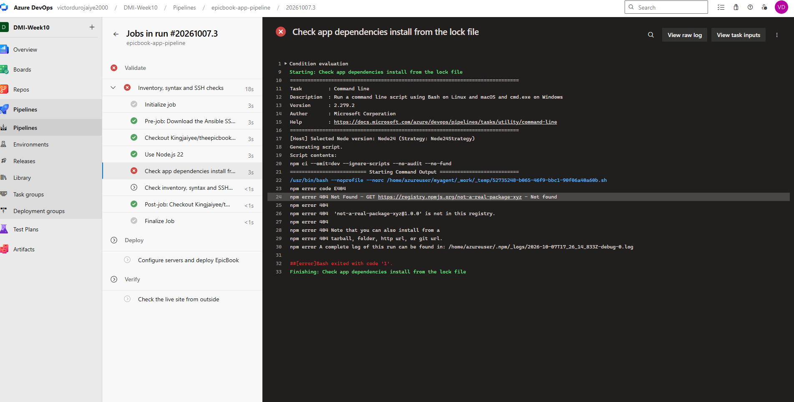

## Notes

### 1. What exact failure did you introduce?

On a temporary branch, `drill/pipeline-failure`, I added one line to the `dependencies` section of `package.json`: `"not-a-real-package-xyz": "1.0.0"`, in commit 8812c01. I queued the Application Pipeline on that branch (run 60). Its Validate stage failed at "Check app dependencies install from the lock file", where `npm ci` returned `npm error code E404` because the package does not exist in the npm registry.

### 2. Which category should detect it?

Dependency Installation Failure. Before the drill, I tested the same change locally and found that npm 10 prints `npm error`, while the script's dependency pattern looks for the older `npm ERR!`. So I expected, and got, the script's fallback, "Unclassified Pipeline Failure", with the real cause visible in the sanitized log.

### 3. Why is the failure safe and easily reversible?

It is a one-line change on a throwaway branch, and it fails on the pipeline agent during Validate, before any SSH connection, Ansible run or server change. It touches no infrastructure, credential, database or deployed file, and one `git revert` undoes it completely. The Infrastructure Pipeline was not involved.

### 4. How did you prevent the deliberate failure from reaching `main` or changing the deployed application?

Before the drill, I changed the Application Pipeline so the Deploy and Verify stages only run for `refs/heads/main`, and added the dependency check to Validate so a broken package fails before any server is touched. The drill commit stayed on `drill/pipeline-failure`, which I never merged. The pipeline's automatic trigger only watches `main`, so I queued the drill run by hand, and in that run Deploy and Verify were skipped.

---

# Task 7 — Diagnose and Save the Incident Evidence

## Goal

Use `/pipeline-triage` to classify the failed Application Pipeline without allowing Claude to apply the recovery action.

## Evidence

### Screenshot 9 — Failed-State Diagnosis and Incident Report

`/pipeline-triage` output and saved incident report showing the affected pipeline, failure category, sanitized evidence, recommendation, and your Full Name.

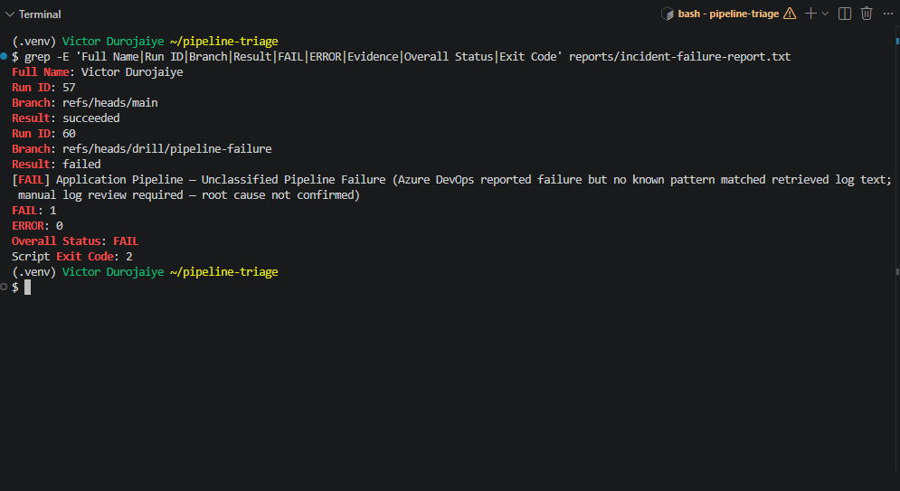

## Notes

### 1. Which failure category was identified?

The script reported "Unclassified Pipeline Failure" for the Application Pipeline, run 60, with exit code 2 and Overall Status FAIL, while the Infrastructure Pipeline stayed PASS. Claude read the sanitized log and named Dependency Installation Failure as the most likely category, while stating clearly that the script's patterns had not detected it.

### 2. What exact evidence supported the diagnosis?

From `reports/app-last-run.log` (build 60, log 8, step "Check app dependencies install from the lock file"): `npm error code E404`, `npm error 404 Not Found - GET https://registry.npmjs.org/not-a-real-package-xyz - Not found`, `'not-a-real-package-xyz@1.0.0' is not in this registry` and `Bash exited with code '1'`. Claude also quoted the checkout of commit 8812c01 ("drill: add a nonexistent npm dependency...") and the next Validate step being skipped because the previous one failed.

### 3. Did Claude apply the fix or rerun the pipeline? Why is that important?

No. Claude ran only `bash pipeline-triage.sh`, read the report and logs, and recommended reverting commit 8812c01 for me to review and apply. That matters because any fix changes code, which can trigger runs and, on `main`, a deployment. A wrong or incomplete fix applied without review could break the live application or hide the real problem, and a human reviewer stays accountable for every change.

### 4. Which part represents Gather, and which part represents Analyze?

Gather was `pipeline-triage.sh`: it read both pipelines' latest runs, downloaded and sanitized run 60's logs, classified the failure and wrote `reports/pipeline-health-report.txt` and `reports/app-last-run.log`. Analyze was Claude: it checked the report was fresh, read the evidence, connected the E404 to the drill commit, named the most likely category and root cause, and gave one recommendation and one verification step. I saved the report myself as `reports/incident-failure-report.txt` before applying any fix.

---

# Task 8 — Apply the Human-Reviewed Fix and Verify Recovery

## Goal

Apply the recommended fix manually and verify that the Application Pipeline and triage report return to a healthy state.

## Evidence

### Screenshot 10 — Corrected Application Pipeline Run

Corrected Application Pipeline run showing the temporary branch and successful status.

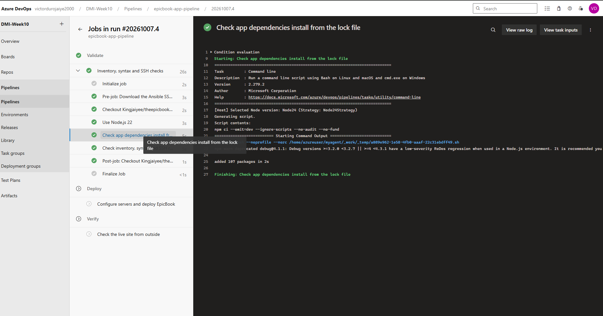

---

### Screenshot 11 — Recovery Triage Result

Recovery `/pipeline-triage` output showing Overall Status `HEALTHY`, exit code `0`, your Full Name, and both saved report filenames.

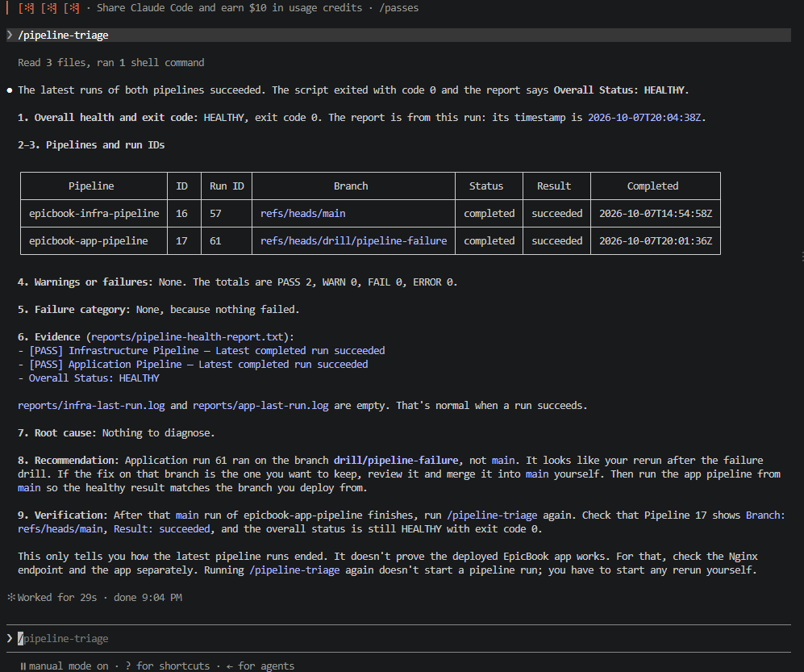

## Notes

### 1. What exact fix did you apply?

On `drill/pipeline-failure`, I reverted commit 8812c01, which removed the `"not-a-real-package-xyz": "1.0.0"` line from `package.json`. I committed it as "fix: remove the drill's nonexistent npm dependency", pushed it, and queued the Application Pipeline on the branch again (run 61).

### 2. Did the fix match Claude’s recommendation? Explain briefly.

Yes. Claude recommended reverting commit 8812c01, and that is what I did. It also mentioned removing the package from `package-lock.json`, but the drill never changed the lock file, so the revert only needed to touch `package.json`. After recovery, Claude suggested merging the branch into main. I did not, because the branch's net change is zero and the deliberate failure must not reach main.

### 3. What evidence proves that the pipeline recovered?

Run 61 on `drill/pipeline-failure` completed with result `succeeded`, and its dependency check passed, with Deploy and Verify skipped as designed. The recovery triage returned exit code 0 with `Overall Status: HEALTHY`, PASS 2, WARN 0, FAIL 0, ERROR 0, showing Infrastructure run 57 and Application run 61 both succeeded. I saved it as `reports/recovery-report.txt`, next to `reports/incident-failure-report.txt`.

### 4. Why is a second triage run required after the pipeline becomes green?

A green run in the portal shows only one pipeline from one view. The second triage uses the same evidence-based method as the incident: it checks both pipelines, returns an exit code automation can trust, and records the recovery in a report I can compare with the incident report. It completes the Verify step of the workflow and confirms the Infrastructure Pipeline was not affected.

### 5. What risk would be created if Claude could automatically edit, push, approve, and rerun the pipeline?

A wrong fix could be pushed and deployed with no review, for example removing the dependency check instead of the bad package. Claude could approve the infrastructure Apply gate and change or destroy servers or the database, or merge the drill branch into main as it suggested. Retry loops could waste agent time and hide the real cause, and secrets could leak into commits or logs. Log text could also act as instructions that lead to harmful commands, and no person would be accountable for the change.

---

# LinkedIn Post — Mandatory

## LinkedIn Post URL

https://www.linkedin.com/feed/update/urn:li:activity:7513693987145211905/

## Evidence

### Screenshot 12 — Published LinkedIn Post

Published LinkedIn post showing its text and at least one image or link.

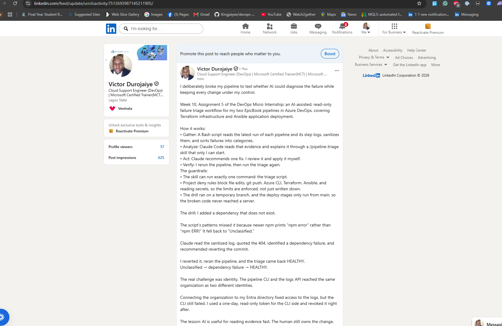

---

# Required Repository Files

Confirm that the following files are available in your repository:

* [ ] `CLAUDE.md`
* [ ] `pipeline-triage.sh`
* [ ] `.claude/skills/pipeline-triage/SKILL.md`
* [ ] `reports/incident-failure-report.txt`
* [ ] `reports/recovery-report.txt`

---

# Submission Instructions

* Complete all tasks in sequence.
* Include all 12 required screenshots.
* Answer every Notes question in your own words.
* Include your GitHub repository or fork URL.
* Include your public LinkedIn post URL.
* Ensure your Full Name appears in the required reports.
* Do not include raw logs containing sensitive information.
* Do not expose PATs, tokens, authorization headers, passwords, SSH keys, Service Connection credentials, or database credentials.

---

# Completion Checklist

* [ ] Both Azure DevOps pipelines were healthy before the drill.
* [ ] The supplied files were copied to the correct repository locations.
* [ ] Only the required student-specific placeholders were updated.
* [ ] `CLAUDE.md` contains the required context and safety rules.
* [ ] `pipeline-triage.sh` passed Bash syntax validation.
* [ ] The script has executable permission.
* [ ] The script uses read-only Azure DevOps operations.
* [ ] The script retrieves pipeline metadata and console logs.
* [ ] No token or password is stored in the script.
* [ ] The healthy baseline reported `HEALTHY` with exit code `0`.
* [ ] `/pipeline-triage` was invoked manually.
* [ ] The skill does not have broad Bash approval.
* [ ] The controlled failure affected only the Application Pipeline.
* [ ] The failure occurred before deployment changes were applied.
* [ ] The deliberate failure was not merged into `main`.
* [ ] The failed-state report was saved before applying the fix.
* [ ] Claude diagnosed the failure but did not apply the fix.
* [ ] The fix was reviewed and applied manually.
* [ ] The corrected Application Pipeline completed successfully.
* [ ] The recovery triage reported `HEALTHY` with exit code `0`.
* [ ] `incident-failure-report.txt` exists.
* [ ] `recovery-report.txt` exists.
* [ ] All Notes questions have been answered.
* [ ] All 12 screenshots have been added.
* [ ] The GitHub repository or fork URL has been included.
* [ ] The LinkedIn post is public.
* [ ] The LinkedIn post URL has been included.
* [ ] No sensitive information is exposed.

---

# Final Submission

**Full Name:** Victor Durojaiye

**GitHub Repository or Fork URL:** https://github.com/Kingjaiyee/devops-micro-internship-pravinmishra

**LinkedIn Post URL:** https://www.linkedin.com/feed/update/urn:li:activity:7513693987145211905/

---

*This submission is part of the DevOps Micro Internship (DMI) — Agentic AI Track.*
