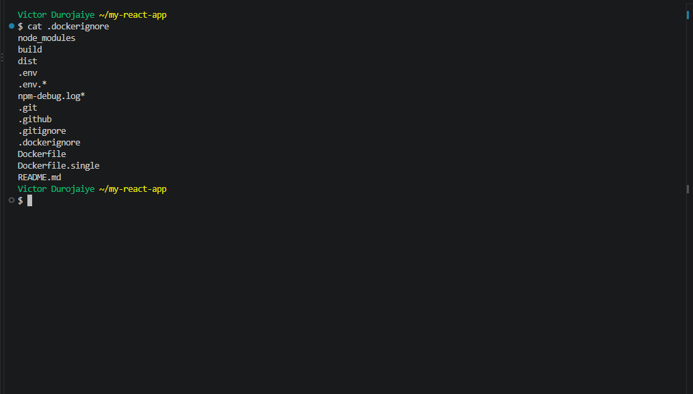
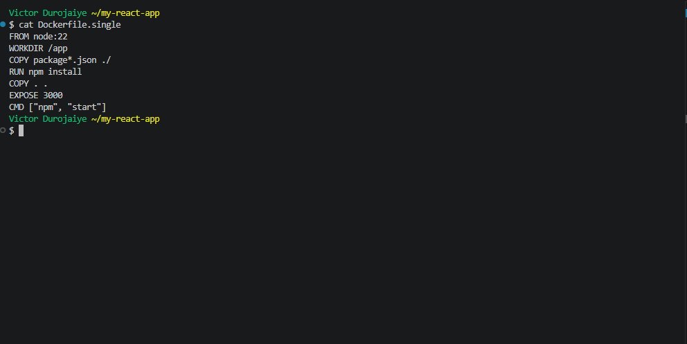
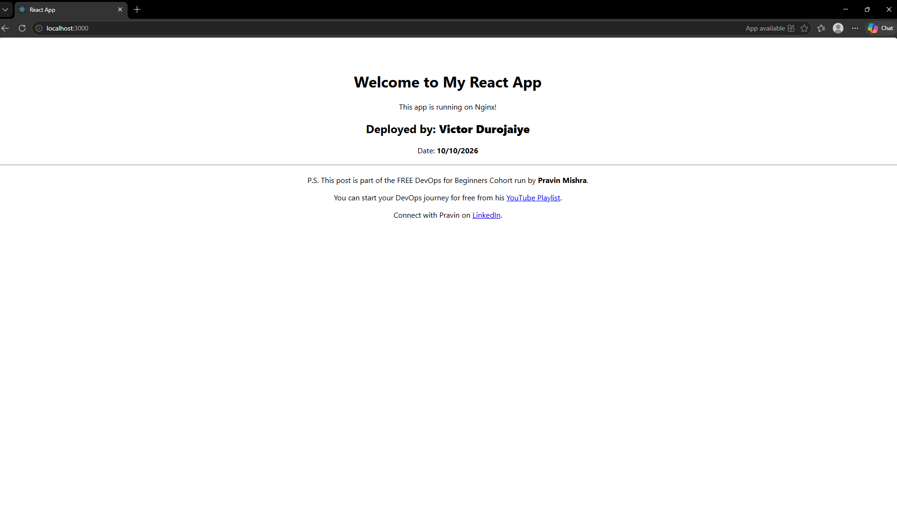
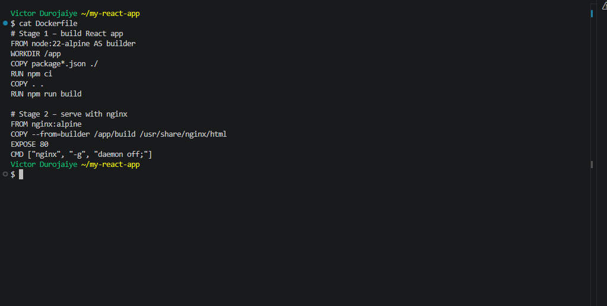
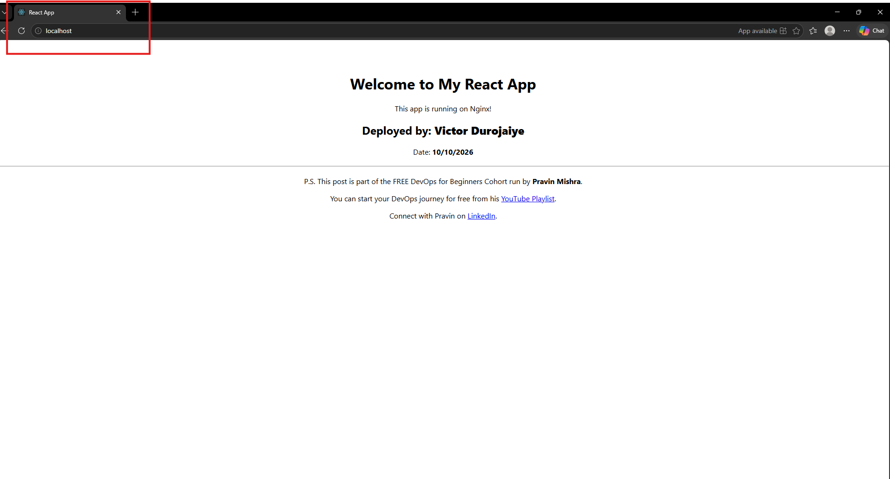
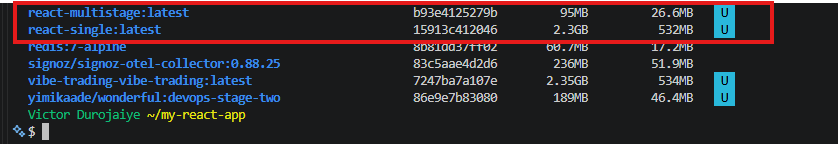
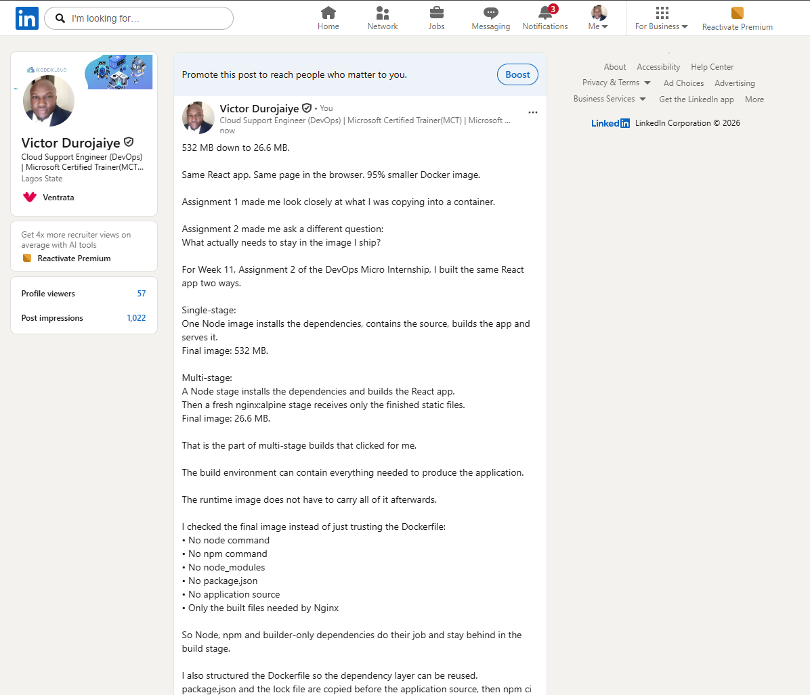

# Assignment 2 — Multi-Stage Docker Build for a React Application

Part of the DevOps Micro Internship (DMI) with Agentic AI

---

## Purpose

In this assignment, you will build both a single-stage and an optimized multi-stage Docker image for a React application, compare the resulting image sizes, and deploy the optimized version using a production-ready Nginx runtime container.

Complete this assignment locally on your own computer where Docker is installed and running.

---

# Task 1 — Prepare the Project

## Goal

Prepare the React application for Docker image creation.

### Evidence

#### Screenshot 1 — Contents of the `.dockerignore` File

Add a screenshot of the terminal showing:

```bash
cat .dockerignore
```

The file must exclude `node_modules`, `build`, and `.env`.



---

# Task 2 — Create a Single-Stage Docker Image

## Goal

Create a baseline single-stage Docker image and run the application on port 3000.

### Evidence

#### Screenshot 2 — Contents of `Dockerfile.single`

Add a screenshot showing the completed `Dockerfile.single`.



---

#### Screenshot 3 — Single-Stage Application in Browser

Add a screenshot of the browser showing the application at:

```text
http://localhost:3000
```

Ensure that your full name is visible in the application.



---

# Task 3 — Create a Multi-Stage Docker Build

## Goal

Create an optimized multi-stage Docker image with separate builder and Nginx runtime stages, then run the application on port 80.

### Evidence

#### Screenshot 4 — Contents of the Multi-Stage Dockerfile

Add a screenshot showing the completed multi-stage `Dockerfile`.



---

#### Screenshot 5 — Multi-Stage Application in Browser

Add a screenshot of the browser showing the application at:

```text
http://localhost
```

Ensure that your full name is visible in the application.



---

# Task 4 — Compare Docker Image Sizes

## Goal

Compare the single-stage and multi-stage image sizes and calculate the percentage reduction.

### Evidence

#### Screenshot 6 — Docker Image Size Comparison

Add a screenshot of the terminal showing:

```bash
docker images
```

The output must include both:

```text
react-single:latest
react-multistage:latest
```



---

### Percentage Reduction Calculation

Record the image sizes and calculate the reduction using the same unit for both images.

```text
Single-stage image size: 532 MB

Multi-stage image size: 26.6 MB

Percentage reduction =
((Single-stage image size − Multi-stage image size)
÷ Single-stage image size) × 100

Percentage reduction: ((532 − 26.6) ÷ 532) × 100 = (505.4 ÷ 532) × 100 = 95.0%
```

---

# Task 5 — Analyze the Optimization Results

## Goal

Evaluate the advantages of using multi-stage Docker builds.

### Notes

Write a short analysis of 5–8 lines covering:

- The single-stage and multi-stage image sizes
- The percentage reduction in image size
- Security benefits of the smaller runtime image
- How a smaller runtime image reduces the attack surface
- How smaller images improve image pull and deployment speed
- One Docker build-caching optimization you used

The single-stage image (react-single:latest) is 532 MB and the multi-stage image (react-multistage:latest) is 26.6 MB, both measured by CONTENT SIZE.

That is a 95.0% reduction, so the single-stage image is 20 times larger.

The runtime image only holds Nginx on Alpine and the built static files. Node.js, npm, the source code and node_modules stay behind in the builder stage.

Fewer packages means a smaller attack surface: vulnerabilities in the build dependencies never reach the running container, and there is no Node runtime or npm in it to abuse.

A 26.6 MB image is much less data to push and pull, so new servers, scaling and rollbacks start faster, and the registry stores less.

For build caching I copied package*.json and ran npm ci before COPY . ., so a code-only change reuses the cached dependency layer, and the .dockerignore keeps node_modules, build and .git out of the build context.

---

# Task 6 — Explore Additional Production Optimizations (Optional)

## Goal

Explore one or more additional production optimization techniques.

### Optional Work

You may choose to:

- Configure an Nginx health check
- Configure cache headers for static assets
- Experiment with a lighter runtime image
- Compare the resulting image size with your original multi-stage image

Screenshots are optional.

- Moved the builder stage from node:18-alpine (end of life) to node:22-alpine. git diff shows a one-line change. The baseline uses node:22 instead of node:20 (end of life) for the same reason.
- Built react-multistage:v2 from a separate Dockerfile.optimized, so the main Dockerfile stays as submitted.
- Health check: busybox wget against 127.0.0.1, already in nginx:alpine, so no extra package. The container reports healthy.
- Cache headers in a custom nginx.conf: hashed files under /static/ get "public, max-age=31536000, immutable", index.html gets "no-cache" so new releases show up. Added an SPA fallback, so client routes like /about return 200.
- Size: react-multistage:v2 is 26.6 MB, the same as react-multistage:latest, so the health check and config added no measurable size.
- The rebuild reused the cached npm ci layer; only the source copy and npm run build ran again.

---

# LinkedIn Requirement

## Goal

Create a LinkedIn post describing what you built, what a multi-stage Docker build is, the image-size reduction achieved, and key learnings from the assignment.

### Evidence

#### LinkedIn Post URL

Paste your LinkedIn post URL here:

`https://www.linkedin.com/posts/victor-jaiye_devopsmicrointernship-docker-react-share-7514664865915977728-YuPK/`

---

#### LinkedIn Post Screenshot



---

# Submission Instructions

- Complete all required tasks in sequence.
- Include Screenshots 1–6 exactly as specified.
- Include the percentage-reduction calculation and Task 5 analysis.
- Include the LinkedIn post URL and screenshot.
- Ensure that your full name is visible in all required screenshots.
- Do not expose passwords, keys, tokens, account IDs, or other sensitive information.

---

# Completion Checklist

- [x] Assignment completed locally
- [x] `.dockerignore` created and verified (Screenshot 1)
- [x] `Dockerfile.single` created (Screenshot 2)
- [x] Single-stage container verified in the browser (Screenshot 3)
- [x] Multi-stage `Dockerfile` created (Screenshot 4)
- [x] Multi-stage container verified in the browser (Screenshot 5)
- [x] Both Docker image sizes captured (Screenshot 6)
- [x] Percentage reduction calculated
- [x] Optimization analysis completed
- [x] LinkedIn post URL and screenshot included
- [x] Full name visible in all required screenshots
- [x] No sensitive information exposed

---

## About DMI & CloudAdvisory

DevOps Micro Internship (DMI) is a project-based DevOps program run by Pravin Mishra (The CloudAdvisory), focused on real-world execution, systems thinking, and career readiness.

It helps learners build strong DevOps foundations through hands-on experience.

---

## 📌 About DMI & CloudAdvisory

DevOps Micro Internship (DMI) is a project-based DevOps program run by Pravin Mishra (The CloudAdvisory) focused on real-world execution, systems thinking, and career readiness.

It helps learners build strong DevOps foundations with hands-on experience.

---

## 📌 Resources

- 🌐 DMI Official Website: https://dmi.pravinmishra.com?utm_source=github&utm_medium=readme  
- 🎓 University: https://university.pravinmishra.com?utm_source=github&utm_medium=readme  
- 💬 Discord Community: https://discord.pravinmishra.com?utm_source=github&utm_medium=readme  
- 📝 Blog: https://dmi.pravinmishra.com/blog?utm_source=github&utm_medium=readme  
- ▶️ YouTube Playlist: https://www.youtube.com/playlist?list=PLFeSNDtI4Cho  
- 🔗 Pravin Mishra (LinkedIn): https://www.linkedin.com/in/pravin-mishra-aws-trainer/  
- 🏢 CloudAdvisory (LinkedIn): https://www.linkedin.com/company/thecloudadvisory/

---

*This submission is part of DevOps Micro Internship (DMI) — Agentic AI Track.*
